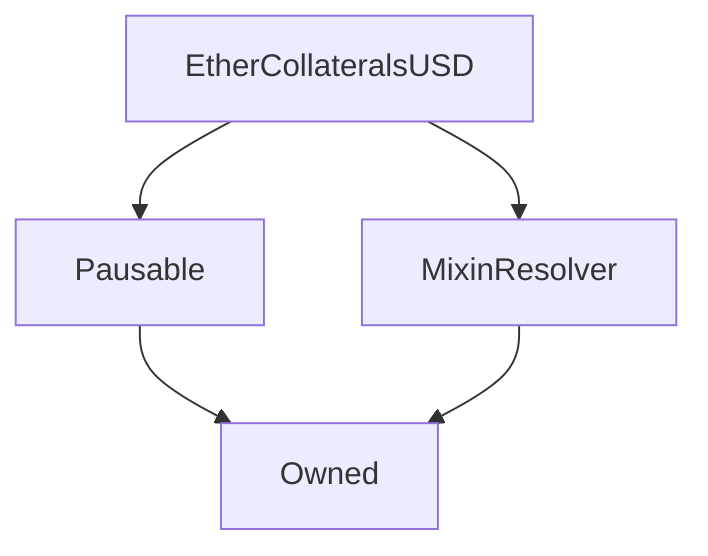

# EtherCollateralsUSD

## Description

**Source:** [contracts/EtherCollateralsUSD.sol](https://github.com/Synthetixio/synthetix/tree/v2.34.1-ovm/contracts/EtherCollateralsUSD.sol)

## Architecture

### Libraries

- [SafeMath](/contracts/source/libraries/SafeMath) for `uint256`
- [SafeDecimalMath](/contracts/source/libraries/SafeDecimalMath) for `uint256`

### Inheritance Graph

## Structs

### `SynthLoanStruct`

[Source](https://github.com/Synthetixio/synthetix/tree/v2.34.1-ovm/contracts/EtherCollateralsUSD.sol#L87)

| Field                 | Type              | Description |
| --------------------- | ----------------- | ----------- |
| `account`             | `address payable` | TBA         |
| `collateralAmount`    | `uint256`         | TBA         |
| `loanAmount`          | `uint256`         | TBA         |
| `mintingFee`          | `uint256`         | TBA         |
| `timeCreated`         | `uint256`         | TBA         |
| `loanID`              | `uint256`         | TBA         |
| `timeClosed`          | `uint256`         | TBA         |
| `loanInterestRate`    | `uint256`         | TBA         |
| `accruedInterest`     | `uint256`         | TBA         |
| `lastInterestAccrued` | `uint40`          | TBA         |

## Constants

### `COLLATERAL`

[Source](https://github.com/Synthetixio/synthetix/tree/v2.34.1-ovm/contracts/EtherCollateralsUSD.sol#L40)

**Type:** `bytes32`

## Variables

### `accountLoanLimit`

[Source](https://github.com/Synthetixio/synthetix/tree/v2.34.1-ovm/contracts/EtherCollateralsUSD.sol#L61)

**Type:** `uint256`

### `accountOpenLoanCounter`

[Source](https://github.com/Synthetixio/synthetix/tree/v2.34.1-ovm/contracts/EtherCollateralsUSD.sol#L114)

**Type:** `mapping(address => uint256)`

### `accountsSynthLoans`

[Source](https://github.com/Synthetixio/synthetix/tree/v2.34.1-ovm/contracts/EtherCollateralsUSD.sol#L111)

**Type:** `mapping(address => struct EtherCollateralsUSD.SynthLoanStruct[])`

### `collateralizationRatio`

[Source](https://github.com/Synthetixio/synthetix/tree/v2.34.1-ovm/contracts/EtherCollateralsUSD.sol#L45)

**Type:** `uint256`

### `interestPerSecond`

[Source](https://github.com/Synthetixio/synthetix/tree/v2.34.1-ovm/contracts/EtherCollateralsUSD.sol#L49)

**Type:** `uint256`

### `interestRate`

[Source](https://github.com/Synthetixio/synthetix/tree/v2.34.1-ovm/contracts/EtherCollateralsUSD.sol#L48)

**Type:** `uint256`

### `issueFeeRate`

[Source](https://github.com/Synthetixio/synthetix/tree/v2.34.1-ovm/contracts/EtherCollateralsUSD.sol#L52)

**Type:** `uint256`

### `issueLimit`

[Source](https://github.com/Synthetixio/synthetix/tree/v2.34.1-ovm/contracts/EtherCollateralsUSD.sol#L55)

**Type:** `uint256`

### `liquidationDeadline`

[Source](https://github.com/Synthetixio/synthetix/tree/v2.34.1-ovm/contracts/EtherCollateralsUSD.sol#L67)

**Type:** `uint256`

### `liquidationPenalty`

[Source](https://github.com/Synthetixio/synthetix/tree/v2.34.1-ovm/contracts/EtherCollateralsUSD.sol#L73)

**Type:** `uint256`

### `liquidationRatio`

[Source](https://github.com/Synthetixio/synthetix/tree/v2.34.1-ovm/contracts/EtherCollateralsUSD.sol#L70)

**Type:** `uint256`

### `loanLiquidationOpen`

[Source](https://github.com/Synthetixio/synthetix/tree/v2.34.1-ovm/contracts/EtherCollateralsUSD.sol#L64)

**Type:** `bool`

### `minLoanCollateralSize`

[Source](https://github.com/Synthetixio/synthetix/tree/v2.34.1-ovm/contracts/EtherCollateralsUSD.sol#L58)

**Type:** `uint256`

### `totalIssuedSynths`

[Source](https://github.com/Synthetixio/synthetix/tree/v2.34.1-ovm/contracts/EtherCollateralsUSD.sol#L78)

**Type:** `uint256`

### `totalLoansCreated`

[Source](https://github.com/Synthetixio/synthetix/tree/v2.34.1-ovm/contracts/EtherCollateralsUSD.sol#L81)

**Type:** `uint256`

### `totalOpenLoanCount`

[Source](https://github.com/Synthetixio/synthetix/tree/v2.34.1-ovm/contracts/EtherCollateralsUSD.sol#L84)

**Type:** `uint256`

## Constructor

### `constructor`

[Source](https://github.com/Synthetixio/synthetix/tree/v2.34.1-ovm/contracts/EtherCollateralsUSD.sol#L126)

??? example "Details"

    **Signature**

    `(address _owner, address _resolver)`

    **Visibility**

    `public`

    **State Mutability**

    `nonpayable`

## Views

### `accruedInterestOnLoan`

[Source](https://github.com/Synthetixio/synthetix/tree/v2.34.1-ovm/contracts/EtherCollateralsUSD.sol#L251)

??? example "Details"

    **Signature**

    `accruedInterestOnLoan(uint256 _loanAmount, uint256 _seconds) returns (uint256)`

    **Visibility**

    `public`

    **State Mutability**

    `view`

### `calculateAmountToLiquidate`

[Source](https://github.com/Synthetixio/synthetix/tree/v2.34.1-ovm/contracts/EtherCollateralsUSD.sol#L283)

??? example "Details"

    **Signature**

    `calculateAmountToLiquidate(uint256 debtBalance, uint256 collateral) returns (uint256)`

    **Visibility**

    `public`

    **State Mutability**

    `view`

### `collateralAmountForLoan`

[Source](https://github.com/Synthetixio/synthetix/tree/v2.34.1-ovm/contracts/EtherCollateralsUSD.sol#L233)

??? example "Details"

    **Signature**

    `collateralAmountForLoan(uint256 loanAmount) returns (uint256)`

    **Visibility**

    `external`

    **State Mutability**

    `view`

### `currentInterestOnLoan`

[Source](https://github.com/Synthetixio/synthetix/tree/v2.34.1-ovm/contracts/EtherCollateralsUSD.sol#L241)

??? example "Details"

    **Signature**

    `currentInterestOnLoan(address _account, uint256 _loanID) returns (uint256)`

    **Visibility**

    `external`

    **State Mutability**

    `view`

### `getContractInfo`

[Source](https://github.com/Synthetixio/synthetix/tree/v2.34.1-ovm/contracts/EtherCollateralsUSD.sol#L187)

??? example "Details"

    **Signature**

    `getContractInfo() returns (uint256, uint256, uint256, uint256, uint256, uint256, uint256, uint256, uint256, uint256, uint256, uint256, bool)`

    **Visibility**

    `external`

    **State Mutability**

    `view`

### `getLoan`

[Source](https://github.com/Synthetixio/synthetix/tree/v2.34.1-ovm/contracts/EtherCollateralsUSD.sol#L316)

??? example "Details"

    **Signature**

    `getLoan(address _account, uint256 _loanID) returns (address, uint256, uint256, uint256, uint256, uint256, uint256, uint256)`

    **Visibility**

    `external`

    **State Mutability**

    `view`

### `getLoanCollateralRatio`

[Source](https://github.com/Synthetixio/synthetix/tree/v2.34.1-ovm/contracts/EtherCollateralsUSD.sol#L343)

??? example "Details"

    **Signature**

    `getLoanCollateralRatio(address _account, uint256 _loanID) returns (uint256)`

    **Visibility**

    `external`

    **State Mutability**

    `view`

### `getMintingFee`

[Source](https://github.com/Synthetixio/synthetix/tree/v2.34.1-ovm/contracts/EtherCollateralsUSD.sol#L270)

??? example "Details"

    **Signature**

    `getMintingFee(address _account, uint256 _loanID) returns (uint256)`

    **Visibility**

    `external`

    **State Mutability**

    `view`

### `issuanceRatio`

[Source](https://github.com/Synthetixio/synthetix/tree/v2.34.1-ovm/contracts/EtherCollateralsUSD.sol#L223)

??? example "Details"

    **Signature**

    `issuanceRatio() returns (uint256)`

    **Visibility**

    `public`

    **State Mutability**

    `view`

### `loanAmountFromCollateral`

[Source](https://github.com/Synthetixio/synthetix/tree/v2.34.1-ovm/contracts/EtherCollateralsUSD.sol#L228)

??? example "Details"

    **Signature**

    `loanAmountFromCollateral(uint256 collateralAmount) returns (uint256)`

    **Visibility**

    `public`

    **State Mutability**

    `view`

### `openLoanIDsByAccount`

[Source](https://github.com/Synthetixio/synthetix/tree/v2.34.1-ovm/contracts/EtherCollateralsUSD.sol#L293)

??? example "Details"

    **Signature**

    `openLoanIDsByAccount(address _account) returns (uint256[])`

    **Visibility**

    `external`

    **State Mutability**

    `view`

### `timeSinceInterestAccrualOnLoan`

[Source](https://github.com/Synthetixio/synthetix/tree/v2.34.1-ovm/contracts/EtherCollateralsUSD.sol#L369)

??? example "Details"

    **Signature**

    `timeSinceInterestAccrualOnLoan(address _account, uint256 _loanID) returns (uint256)`

    **Visibility**

    `external`

    **State Mutability**

    `view`

### `totalFeesOnLoan`

[Source](https://github.com/Synthetixio/synthetix/tree/v2.34.1-ovm/contracts/EtherCollateralsUSD.sol#L257)

??? example "Details"

    **Signature**

    `totalFeesOnLoan(address _account, uint256 _loanID) returns (uint256, uint256)`

    **Visibility**

    `external`

    **State Mutability**

    `view`

## Restricted Functions

### `setAccountLoanLimit`

[Source](https://github.com/Synthetixio/synthetix/tree/v2.34.1-ovm/contracts/EtherCollateralsUSD.sol#L167)

??? example "Details"

    **Signature**

    `setAccountLoanLimit(uint256 _loanLimit)`

    **Visibility**

    `external`

    **State Mutability**

    `nonpayable`

    **Requires**

    * [require(..., Owner cannot set higher than ACCOUNT_LOAN_LIMIT_CAP)](https://github.com/Synthetixio/synthetix/tree/v2.34.1-ovm/contracts/EtherCollateralsUSD.sol#L168)

    **Modifiers**

    * [onlyOwner](#onlyowner)

    **Emits**

    * [AccountLoanLimitUpdated](#accountloanlimitupdated)

### `setCollateralizationRatio`

[Source](https://github.com/Synthetixio/synthetix/tree/v2.34.1-ovm/contracts/EtherCollateralsUSD.sol#L137)

??? example "Details"

    **Signature**

    `setCollateralizationRatio(uint256 ratio)`

    **Visibility**

    `external`

    **State Mutability**

    `nonpayable`

    **Requires**

    * [require(..., Too high)](https://github.com/Synthetixio/synthetix/tree/v2.34.1-ovm/contracts/EtherCollateralsUSD.sol#L138)

    * [require(..., Too low)](https://github.com/Synthetixio/synthetix/tree/v2.34.1-ovm/contracts/EtherCollateralsUSD.sol#L139)

    **Modifiers**

    * [onlyOwner](#onlyowner)

    **Emits**

    * [CollateralizationRatioUpdated](#collateralizationratioupdated)

### `setInterestRate`

[Source](https://github.com/Synthetixio/synthetix/tree/v2.34.1-ovm/contracts/EtherCollateralsUSD.sol#L144)

??? example "Details"

    **Signature**

    `setInterestRate(uint256 _interestRate)`

    **Visibility**

    `external`

    **State Mutability**

    `nonpayable`

    **Requires**

    * [require(..., Interest rate cannot be less that the SECONDS_IN_A_YEAR)](https://github.com/Synthetixio/synthetix/tree/v2.34.1-ovm/contracts/EtherCollateralsUSD.sol#L145)

    * [require(..., Interest cannot be more than 100% APR)](https://github.com/Synthetixio/synthetix/tree/v2.34.1-ovm/contracts/EtherCollateralsUSD.sol#L146)

    **Modifiers**

    * [onlyOwner](#onlyowner)

    **Emits**

    * [InterestRateUpdated](#interestrateupdated)

### `setIssueFeeRate`

[Source](https://github.com/Synthetixio/synthetix/tree/v2.34.1-ovm/contracts/EtherCollateralsUSD.sol#L152)

??? example "Details"

    **Signature**

    `setIssueFeeRate(uint256 _issueFeeRate)`

    **Visibility**

    `external`

    **State Mutability**

    `nonpayable`

    **Modifiers**

    * [onlyOwner](#onlyowner)

    **Emits**

    * [IssueFeeRateUpdated](#issuefeerateupdated)

### `setIssueLimit`

[Source](https://github.com/Synthetixio/synthetix/tree/v2.34.1-ovm/contracts/EtherCollateralsUSD.sol#L157)

??? example "Details"

    **Signature**

    `setIssueLimit(uint256 _issueLimit)`

    **Visibility**

    `external`

    **State Mutability**

    `nonpayable`

    **Modifiers**

    * [onlyOwner](#onlyowner)

    **Emits**

    * [IssueLimitUpdated](#issuelimitupdated)

### `setLiquidationRatio`

[Source](https://github.com/Synthetixio/synthetix/tree/v2.34.1-ovm/contracts/EtherCollateralsUSD.sol#L179)

??? example "Details"

    **Signature**

    `setLiquidationRatio(uint256 _liquidationRatio)`

    **Visibility**

    `external`

    **State Mutability**

    `nonpayable`

    **Requires**

    * [require(..., Ratio less than 100%)](https://github.com/Synthetixio/synthetix/tree/v2.34.1-ovm/contracts/EtherCollateralsUSD.sol#L180)

    **Modifiers**

    * [onlyOwner](#onlyowner)

    **Emits**

    * [LiquidationRatioUpdated](#liquidationratioupdated)

### `setLoanLiquidationOpen`

[Source](https://github.com/Synthetixio/synthetix/tree/v2.34.1-ovm/contracts/EtherCollateralsUSD.sol#L173)

??? example "Details"

    **Signature**

    `setLoanLiquidationOpen(bool _loanLiquidationOpen)`

    **Visibility**

    `external`

    **State Mutability**

    `nonpayable`

    **Requires**

    * [require(..., Before liquidation deadline)](https://github.com/Synthetixio/synthetix/tree/v2.34.1-ovm/contracts/EtherCollateralsUSD.sol#L174)

    **Modifiers**

    * [onlyOwner](#onlyowner)

    **Emits**

    * [LoanLiquidationOpenUpdated](#loanliquidationopenupdated)

### `setMinLoanCollateralSize`

[Source](https://github.com/Synthetixio/synthetix/tree/v2.34.1-ovm/contracts/EtherCollateralsUSD.sol#L162)

??? example "Details"

    **Signature**

    `setMinLoanCollateralSize(uint256 _minLoanCollateralSize)`

    **Visibility**

    `external`

    **State Mutability**

    `nonpayable`

    **Modifiers**

    * [onlyOwner](#onlyowner)

    **Emits**

    * [MinLoanCollateralSizeUpdated](#minloancollateralsizeupdated)

## Internal Functions

### `_checkLoanIsOpen`

[Source](https://github.com/Synthetixio/synthetix/tree/v2.34.1-ovm/contracts/EtherCollateralsUSD.sol#L823)

??? example "Details"

    **Signature**

    `_checkLoanIsOpen(struct EtherCollateralsUSD.SynthLoanStruct _synthLoan)`

    **Visibility**

    `internal`

    **State Mutability**

    `pure`

    **Requires**

    * [require(..., Loan does not exist)](https://github.com/Synthetixio/synthetix/tree/v2.34.1-ovm/contracts/EtherCollateralsUSD.sol#L824)

    * [require(..., Loan already closed)](https://github.com/Synthetixio/synthetix/tree/v2.34.1-ovm/contracts/EtherCollateralsUSD.sol#L825)

### `_loanCollateralRatio`

[Source](https://github.com/Synthetixio/synthetix/tree/v2.34.1-ovm/contracts/EtherCollateralsUSD.sol#L350)

??? example "Details"

    **Signature**

    `_loanCollateralRatio(struct EtherCollateralsUSD.SynthLoanStruct _loan) returns (uint256, uint256, uint256)`

    **Visibility**

    `internal`

    **State Mutability**

    `view`

### `_processInterestAndLoanPayment`

[Source](https://github.com/Synthetixio/synthetix/tree/v2.34.1-ovm/contracts/EtherCollateralsUSD.sol#L650)

??? example "Details"

    **Signature**

    `_processInterestAndLoanPayment(uint256 interestPaid, uint256 loanAmountPaid)`

    **Visibility**

    `internal`

    **State Mutability**

    `nonpayable`

### `_splitInterestLoanPayment`

[Source](https://github.com/Synthetixio/synthetix/tree/v2.34.1-ovm/contracts/EtherCollateralsUSD.sol#L617)

??? example "Details"

    **Signature**

    `_splitInterestLoanPayment(uint256 _paymentAmount, uint256 _accruedInterest, uint256 _loanAmount) returns (uint256, uint256, uint256, uint256)`

    **Visibility**

    `internal`

    **State Mutability**

    `pure`

### `exchangeRates`

[Source](https://github.com/Synthetixio/synthetix/tree/v2.34.1-ovm/contracts/EtherCollateralsUSD.sol#L838)

??? example "Details"

    **Signature**

    `exchangeRates() returns (contract IExchangeRates)`

    **Visibility**

    `internal`

    **State Mutability**

    `view`

### `feePool`

[Source](https://github.com/Synthetixio/synthetix/tree/v2.34.1-ovm/contracts/EtherCollateralsUSD.sol#L842)

??? example "Details"

    **Signature**

    `feePool() returns (contract IFeePool)`

    **Visibility**

    `internal`

    **State Mutability**

    `view`

### `synthsUSD`

[Source](https://github.com/Synthetixio/synthetix/tree/v2.34.1-ovm/contracts/EtherCollateralsUSD.sol#L834)

??? example "Details"

    **Signature**

    `synthsUSD() returns (contract ISynth)`

    **Visibility**

    `internal`

    **State Mutability**

    `view`

### `systemStatus`

[Source](https://github.com/Synthetixio/synthetix/tree/v2.34.1-ovm/contracts/EtherCollateralsUSD.sol#L830)

??? example "Details"

    **Signature**

    `systemStatus() returns (contract ISystemStatus)`

    **Visibility**

    `internal`

    **State Mutability**

    `view`

## External Functions

### `closeLoan`

[Source](https://github.com/Synthetixio/synthetix/tree/v2.34.1-ovm/contracts/EtherCollateralsUSD.sol#L449)

??? example "Details"

    **Signature**

    `closeLoan(uint256 loanID)`

    **Visibility**

    `external`

    **State Mutability**

    `nonpayable`

    **Modifiers**

    * [nonReentrant](#nonreentrant)

    * [ETHRateNotInvalid](#ethratenotinvalid)

### `depositCollateral`

[Source](https://github.com/Synthetixio/synthetix/tree/v2.34.1-ovm/contracts/EtherCollateralsUSD.sol#L454)

??? example "Details"

    **Signature**

    `depositCollateral(address account, uint256 loanID)`

    **Visibility**

    `external`

    **State Mutability**

    `payable`

    **Requires**

    * [require(..., Deposit amount must be greater than 0)](https://github.com/Synthetixio/synthetix/tree/v2.34.1-ovm/contracts/EtherCollateralsUSD.sol#L455)

    * [require(..., Loans are now being liquidated)](https://github.com/Synthetixio/synthetix/tree/v2.34.1-ovm/contracts/EtherCollateralsUSD.sol#L460)

    **Modifiers**

    * [notPaused](#notpaused)

    **Emits**

    * [CollateralDeposited](#collateraldeposited)

### `liquidateLoan`

[Source](https://github.com/Synthetixio/synthetix/tree/v2.34.1-ovm/contracts/EtherCollateralsUSD.sol#L550)

??? example "Details"

    **Signature**

    `liquidateLoan(address _loanCreatorsAddress, uint256 _loanID, uint256 _debtToCover)`

    **Visibility**

    `external`

    **State Mutability**

    `nonpayable`

    **Requires**

    * [require(..., Not enough sUSD balance)](https://github.com/Synthetixio/synthetix/tree/v2.34.1-ovm/contracts/EtherCollateralsUSD.sol#L558)

    * [require(..., Collateral ratio above liquidation ratio)](https://github.com/Synthetixio/synthetix/tree/v2.34.1-ovm/contracts/EtherCollateralsUSD.sol#L567)

    **Modifiers**

    * [nonReentrant](#nonreentrant)

    * [ETHRateNotInvalid](#ethratenotinvalid)

    **Emits**

    * [LoanPartiallyLiquidated](#loanpartiallyliquidated)

### `liquidateUnclosedLoan`

[Source](https://github.com/Synthetixio/synthetix/tree/v2.34.1-ovm/contracts/EtherCollateralsUSD.sol#L664)

??? example "Details"

    **Signature**

    `liquidateUnclosedLoan(address _loanCreatorsAddress, uint256 _loanID)`

    **Visibility**

    `external`

    **State Mutability**

    `nonpayable`

    **Requires**

    * [require(..., Liquidation is not open)](https://github.com/Synthetixio/synthetix/tree/v2.34.1-ovm/contracts/EtherCollateralsUSD.sol#L665)

    **Modifiers**

    * [nonReentrant](#nonreentrant)

    * [ETHRateNotInvalid](#ethratenotinvalid)

    **Emits**

    * [LoanLiquidated](#loanliquidated)

### `openLoan`

[Source](https://github.com/Synthetixio/synthetix/tree/v2.34.1-ovm/contracts/EtherCollateralsUSD.sol#L378)

??? example "Details"

    **Signature**

    `openLoan(uint256 _loanAmount) returns (uint256)`

    **Visibility**

    `external`

    **State Mutability**

    `payable`

    **Requires**

    * [require(..., Not enough ETH to create this loan. Please see the minLoanCollateralSize)](https://github.com/Synthetixio/synthetix/tree/v2.34.1-ovm/contracts/EtherCollateralsUSD.sol#L389)

    * [require(..., Loans are now being liquidated)](https://github.com/Synthetixio/synthetix/tree/v2.34.1-ovm/contracts/EtherCollateralsUSD.sol#L395)

    * [require(..., Each account is limited to 50 loans)](https://github.com/Synthetixio/synthetix/tree/v2.34.1-ovm/contracts/EtherCollateralsUSD.sol#L398)

    * [require(..., Loan amount exceeds max borrowing power)](https://github.com/Synthetixio/synthetix/tree/v2.34.1-ovm/contracts/EtherCollateralsUSD.sol#L405)

    * [require(..., Loan Amount exceeds the supply cap.)](https://github.com/Synthetixio/synthetix/tree/v2.34.1-ovm/contracts/EtherCollateralsUSD.sol#L411)

    **Modifiers**

    * [notPaused](#notpaused)

    * [nonReentrant](#nonreentrant)

    * [ETHRateNotInvalid](#ethratenotinvalid)

    **Emits**

    * [LoanCreated](#loancreated)

### `repayLoan`

[Source](https://github.com/Synthetixio/synthetix/tree/v2.34.1-ovm/contracts/EtherCollateralsUSD.sol#L507)

??? example "Details"

    **Signature**

    `repayLoan(address _loanCreatorsAddress, uint256 _loanID, uint256 _repayAmount)`

    **Visibility**

    `external`

    **State Mutability**

    `nonpayable`

    **Requires**

    * [require(..., Not enough sUSD balance)](https://github.com/Synthetixio/synthetix/tree/v2.34.1-ovm/contracts/EtherCollateralsUSD.sol#L515)

    **Modifiers**

    * [ETHRateNotInvalid](#ethratenotinvalid)

    **Emits**

    * [LoanRepaid](#loanrepaid)

### `withdrawCollateral`

[Source](https://github.com/Synthetixio/synthetix/tree/v2.34.1-ovm/contracts/EtherCollateralsUSD.sol#L477)

??? example "Details"

    **Signature**

    `withdrawCollateral(uint256 loanID, uint256 withdrawAmount)`

    **Visibility**

    `external`

    **State Mutability**

    `nonpayable`

    **Requires**

    * [require(..., Amount to withdraw must be greater than 0)](https://github.com/Synthetixio/synthetix/tree/v2.34.1-ovm/contracts/EtherCollateralsUSD.sol#L478)

    * [require(..., Loans are now being liquidated)](https://github.com/Synthetixio/synthetix/tree/v2.34.1-ovm/contracts/EtherCollateralsUSD.sol#L483)

    * [require(..., Collateral ratio below liquidation after withdraw)](https://github.com/Synthetixio/synthetix/tree/v2.34.1-ovm/contracts/EtherCollateralsUSD.sol#L498)

    **Modifiers**

    * [notPaused](#notpaused)

    * [nonReentrant](#nonreentrant)

    * [ETHRateNotInvalid](#ethratenotinvalid)

    **Emits**

    * [CollateralWithdrawn](#collateralwithdrawn)

## Modifiers

### `ETHRateNotInvalid`

[Source](https://github.com/Synthetixio/synthetix/tree/v2.34.1-ovm/contracts/EtherCollateralsUSD.sol#L848)

## Events

### `AccountLoanLimitUpdated`

[Source](https://github.com/Synthetixio/synthetix/tree/v2.34.1-ovm/contracts/EtherCollateralsUSD.sol#L861)

**Signature**: `AccountLoanLimitUpdated(uint256 loanLimit)`

### `CollateralDeposited`

[Source](https://github.com/Synthetixio/synthetix/tree/v2.34.1-ovm/contracts/EtherCollateralsUSD.sol#L873)

**Signature**: `CollateralDeposited(address account, uint256 loanID, uint256 collateralAmount, uint256 collateralAfter)`

### `CollateralWithdrawn`

[Source](https://github.com/Synthetixio/synthetix/tree/v2.34.1-ovm/contracts/EtherCollateralsUSD.sol#L874)

**Signature**: `CollateralWithdrawn(address account, uint256 loanID, uint256 amountWithdrawn, uint256 collateralAfter)`

### `CollateralizationRatioUpdated`

[Source](https://github.com/Synthetixio/synthetix/tree/v2.34.1-ovm/contracts/EtherCollateralsUSD.sol#L855)

**Signature**: `CollateralizationRatioUpdated(uint256 ratio)`

### `InterestRateUpdated`

[Source](https://github.com/Synthetixio/synthetix/tree/v2.34.1-ovm/contracts/EtherCollateralsUSD.sol#L857)

**Signature**: `InterestRateUpdated(uint256 interestRate)`

### `IssueFeeRateUpdated`

[Source](https://github.com/Synthetixio/synthetix/tree/v2.34.1-ovm/contracts/EtherCollateralsUSD.sol#L858)

**Signature**: `IssueFeeRateUpdated(uint256 issueFeeRate)`

### `IssueLimitUpdated`

[Source](https://github.com/Synthetixio/synthetix/tree/v2.34.1-ovm/contracts/EtherCollateralsUSD.sol#L859)

**Signature**: `IssueLimitUpdated(uint256 issueLimit)`

### `LiquidationRatioUpdated`

[Source](https://github.com/Synthetixio/synthetix/tree/v2.34.1-ovm/contracts/EtherCollateralsUSD.sol#L856)

**Signature**: `LiquidationRatioUpdated(uint256 ratio)`

### `LoanClosed`

[Source](https://github.com/Synthetixio/synthetix/tree/v2.34.1-ovm/contracts/EtherCollateralsUSD.sol#L864)

**Signature**: `LoanClosed(address account, uint256 loanID, uint256 feesPaid)`

### `LoanCreated`

[Source](https://github.com/Synthetixio/synthetix/tree/v2.34.1-ovm/contracts/EtherCollateralsUSD.sol#L863)

**Signature**: `LoanCreated(address account, uint256 loanID, uint256 amount)`

### `LoanLiquidated`

[Source](https://github.com/Synthetixio/synthetix/tree/v2.34.1-ovm/contracts/EtherCollateralsUSD.sol#L865)

**Signature**: `LoanLiquidated(address account, uint256 loanID, address liquidator)`

### `LoanLiquidationOpenUpdated`

[Source](https://github.com/Synthetixio/synthetix/tree/v2.34.1-ovm/contracts/EtherCollateralsUSD.sol#L862)

**Signature**: `LoanLiquidationOpenUpdated(bool loanLiquidationOpen)`

### `LoanPartiallyLiquidated`

[Source](https://github.com/Synthetixio/synthetix/tree/v2.34.1-ovm/contracts/EtherCollateralsUSD.sol#L866)

**Signature**: `LoanPartiallyLiquidated(address account, uint256 loanID, address liquidator, uint256 liquidatedAmount, uint256 liquidatedCollateral)`

### `LoanRepaid`

[Source](https://github.com/Synthetixio/synthetix/tree/v2.34.1-ovm/contracts/EtherCollateralsUSD.sol#L875)

**Signature**: `LoanRepaid(address account, uint256 loanID, uint256 repaidAmount, uint256 newLoanAmount)`

### `MinLoanCollateralSizeUpdated`

[Source](https://github.com/Synthetixio/synthetix/tree/v2.34.1-ovm/contracts/EtherCollateralsUSD.sol#L860)

**Signature**: `MinLoanCollateralSizeUpdated(uint256 minLoanCollateralSize)`
