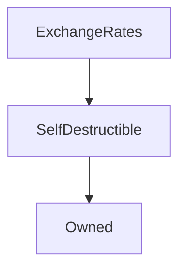

# ExchangeRates

## Description

This contract stores the latest Synth exchange rates. These rates are set by an oracle, which updates this contract every three minutes with any prices that have moved sufficiently. Once set, these prices are available for any contract in the Synthetix system to query.
Prices which have not been updated recently enough are considered stale; Synthetix functionality using stale prices does not operate. All rates are denominated in terms of sUSD, so the price of sUSD is always \$1.00, and is never stale.

The ExchangeRates contract is also responsible for computing the prices of various derived synths.
In particular, the behaviour of [inverse synths](#rateorinverted) is defined here. These are derivative synths whose price varies inversely with the price of an underlying asset.

This contract interacts with the oracle's frontrunning protection, which is partially described in [SIP-6](https://sips.synthetix.io/sips/sip-6) and [SIP-7](https://sips.synthetix.io/sips/sip-7).

This does not turn off any functionality in the exchange rate contract, but is used by [`Synthetix`](Synthetix.md) to disable [currency exchanges](Synthetix.md#_internalexchange) while prices are being updated to protect against oracle front running. The lock is released when [rate updates have completed](#internalupdaterates).

**Source:** [contracts/ExchangeRates.sol](https://github.com/Synthetixio/synthetix/tree/v2.22.4/contracts/ExchangeRates.sol)

## Architecture

### Libraries

- [SafeMath](/contracts/source/libraries/SafeMath) for `uint`
- [SafeDecimalMath](/contracts/source/libraries/SafeDecimalMath) for `uint`

### Inheritance Graph

### Related Contracts

<centered-image>
    
</centered-image>

??? example "Details"

    - [`oracle`](#oracle): This address is not actually a contract, but it is the source of prices for this contract.
    - [`Aggregators`](#aggregators): These are a collection of decentralized pricing networks that collect and aggregate results from a network of oracles.
    - [`PurgeableSynth`](PurgeableSynth.md): exchange rates are used to determine if the total token value is below the purge threshold.
    - [`Synthetix`](Synthetix.md): the value of tokens is used to in order to facilitate exchange between them, and to ensure exchanges cannot occur while price updates and being made or if a particular exchange rate is stale.

## Structs

### `InversePricing`

[Source](https://github.com/Synthetixio/synthetix/tree/v2.22.4/contracts/ExchangeRates.sol#L45)

Holds necessary information for computing the price of [inverse Synths](/tokens.md#inverse-synths).

| Field        | Type      | Description                                                                                               |
| ------------ | --------- | --------------------------------------------------------------------------------------------------------- |
| `entryPoint` | `uint256` | The underlying asset's price at the time the inverse index was set up. Must be strictly greater than $0$. |
| `upperLimit` | `uint256` | The upper limit of the _inverse_ price. Must lie strictly between entryPoint and twice entryPoint.        |
| `lowerLimit` | `uint256` | The lower limit of the _inverse_ price. Must lie strictly between $0$ and entryPoint.                     |
| `frozen`     | `bool`    | True if an inverse Synth has breached one of its limits.                                                  |

### `RateAndUpdatedTime`

[Source](https://github.com/Synthetixio/synthetix/tree/v2.22.4/contracts/ExchangeRates.sol#L21)

| Field  | Type      | Description                                                        |
| ------ | --------- | ------------------------------------------------------------------ |
| `rate` | `uint216` | The rate of the currency (with `18` decimals)                      |
| `time` | `uint40`  | The timestamp (in secs) of the block when the `rate` was persisted |

## Variables

### `aggregatorKeys`

[Source](https://github.com/Synthetixio/synthetix/tree/v2.22.4/contracts/ExchangeRates.sol#L36)

A list of the keys of currencies with a decentralized aggregated pricing network.

**Type:** `bytes32[]`

### `aggregators`

[Source](https://github.com/Synthetixio/synthetix/tree/v2.22.4/contracts/ExchangeRates.sol#L33)

For each currency with a decentralized aggregated pricing network, return the Aggregation contract address.

**Type:** `mapping(bytes32 => contract AggregatorInterface)`

### `currentRoundForRate`

[Source](https://github.com/Synthetixio/synthetix/tree/v2.22.4/contracts/ExchangeRates.sol#L54)

**Type:** `mapping(bytes32 => uint256)`

### `inversePricing`

[Source](https://github.com/Synthetixio/synthetix/tree/v2.22.4/contracts/ExchangeRates.sol#L51)

For each currency with an inverse index, keep the necessary [`InversePricing`](#inversepricing) information to maintain the index.

**Type:** `mapping(bytes32 => struct ExchangeRates.InversePricing)`

### `invertedKeys`

[Source](https://github.com/Synthetixio/synthetix/tree/v2.22.4/contracts/ExchangeRates.sol#L52)

A list of the keys of currencies with an inverted index.

**Type:** `bytes32[]`

### `oracle`

[Source](https://github.com/Synthetixio/synthetix/tree/v2.22.4/contracts/ExchangeRates.sol#L30)

The address which is permitted to push rate updates to the contract.

**Type:** `address`

### `rateStalePeriod`

[Source](https://github.com/Synthetixio/synthetix/tree/v2.22.4/contracts/ExchangeRates.sol#L42)

The duration after which a rate will be considered out of date. Synth exchange and other price-sensitive transactions in the [`Synthetix`](Synthetix.md) contract will not operate if a relevant rate is stale.
Initialised to $3$ hours.

**Type:** `uint256`

## Constructor

### `constructor`

[Source](https://github.com/Synthetixio/synthetix/tree/v2.22.4/contracts/ExchangeRates.sol#L59)

Initialises the oracle address and initial currency prices, along with the inherited [`SelfDestructible`](SelfDestructible.md) instance.

??? example "Details"

    **Signature**

    `(address _owner, address _oracle, bytes32[] _currencyKeys, uint256[] _newRates)`

    **Visibility**

    `public`

    **State Mutability**

    `nonpayable`

    **Requires**

    * [require(..., Currency key length and rate length must match.)](https://github.com/Synthetixio/synthetix/tree/v2.22.4/contracts/ExchangeRates.sol#L65)

## Views

### `anyRateIsStale`

[Source](https://github.com/Synthetixio/synthetix/tree/v2.22.4/contracts/ExchangeRates.sol#L372)

Loop over the given array of currencies and return true if any of them [is stale](#rateisstale). `sUSD`'s rate is never stale. Rates for nonexistent currencies are always stale.

??? example "Details"

    **Signature**

    `anyRateIsStale(bytes32[] currencyKeys)`

    **Visibility**

    `external`

    **State Mutability**

    `view`

### `effectiveValue`

[Source](https://github.com/Synthetixio/synthetix/tree/v2.22.4/contracts/ExchangeRates.sol#L298)

Given a quantity of a source currency, returns a quantity of a destination currency that is of equivalent value at current exchange rates, if those rates are fresh.

The effective value is computed as a simple ratio of the prices of the currencies concerned. That is, to convert a quantity $Q_A$ of currency $A$ to currency $B$ at prices $\pi_A$ and $\pi_B$, the quantity $Q_B$ received is:

$$
Q_B = Q_A \frac{\pi_A}{\pi_B}
$$

This computation is simple because all fractional quantities in the Synthetix system except for the [debt ledger](SynthetixState.md#debtledger) are [18 decimal fixed point numbers](../libraries/SafeDecimalMath.md).

??? example "Details"

    **Signature**

    `effectiveValue(bytes32 sourceCurrencyKey, uint256 sourceAmount, bytes32 destinationCurrencyKey)`

    **Visibility**

    `public`

    **State Mutability**

    `view`

    **Modifiers**

    * [rateNotStale](#ratenotstale)

    * [rateNotStale](#ratenotstale)

### `effectiveValueAtRound`

[Source](https://github.com/Synthetixio/synthetix/tree/v2.22.4/contracts/ExchangeRates.sol#L250)

??? example "Details"

    **Signature**

    `effectiveValueAtRound(bytes32 sourceCurrencyKey, uint256 sourceAmount, bytes32 destinationCurrencyKey, uint256 roundIdForSrc, uint256 roundIdForDest)`

    **Visibility**

    `external`

    **State Mutability**

    `view`

    **Modifiers**

    * [rateNotStale](#ratenotstale)

    * [rateNotStale](#ratenotstale)

### `getCurrentRoundId`

[Source](https://github.com/Synthetixio/synthetix/tree/v2.22.4/contracts/ExchangeRates.sol#L241)

??? example "Details"

    **Signature**

    `getCurrentRoundId(bytes32 currencyKey)`

    **Visibility**

    `external`

    **State Mutability**

    `view`

### `getLastRoundIdBeforeElapsedSecs`

[Source](https://github.com/Synthetixio/synthetix/tree/v2.22.4/contracts/ExchangeRates.sol#L222)

??? example "Details"

    **Signature**

    `getLastRoundIdBeforeElapsedSecs(bytes32 currencyKey, uint256 startingRoundId, uint256 startingTimestamp, uint256 timediff)`

    **Visibility**

    `external`

    **State Mutability**

    `view`

### `lastRateUpdateTimes`

[Source](https://github.com/Synthetixio/synthetix/tree/v2.22.4/contracts/ExchangeRates.sol#L275)

Retrieves the timestamp the given rate was last updated. Accessed by the same keys as [`rates`](#rates) is.

??? example "Details"

    **Signature**

    `lastRateUpdateTimes(bytes32 currencyKey)`

    **Visibility**

    `public`

    **State Mutability**

    `view`

### `lastRateUpdateTimesForCurrencies`

[Source](https://github.com/Synthetixio/synthetix/tree/v2.22.4/contracts/ExchangeRates.sol#L282)

Maps [`lastRateUpdateTimes`](#lastrateupdatetimes) over an array of keys.

??? example "Details"

    **Signature**

    `lastRateUpdateTimesForCurrencies(bytes32[] currencyKeys)`

    **Visibility**

    `public`

    **State Mutability**

    `view`

### `rateAndTimestampAtRound`

[Source](https://github.com/Synthetixio/synthetix/tree/v2.22.4/contracts/ExchangeRates.sol#L266)

??? example "Details"

    **Signature**

    `rateAndTimestampAtRound(bytes32 currencyKey, uint256 roundId)`

    **Visibility**

    `external`

    **State Mutability**

    `view`

### `rateForCurrency`

[Source](https://github.com/Synthetixio/synthetix/tree/v2.22.4/contracts/ExchangeRates.sol#L316)

Returns the last recorded rate for the given currency. This is just an alias to the public mapping `rates`, so it could probably be eliminated.

??? example "Details"

    **Signature**

    `rateForCurrency(bytes32 currencyKey)`

    **Visibility**

    `external`

    **State Mutability**

    `view`

### `rateIsFrozen`

[Source](https://github.com/Synthetixio/synthetix/tree/v2.22.4/contracts/ExchangeRates.sol#L365)

Returns true if the inverse price for the given currency is frozen. This is simply an alias to [`inversePricing[currencyKey].frozen`](#inversepricing). Currencies without an inverse price will naturally return false.

??? example "Details"

    **Signature**

    `rateIsFrozen(bytes32 currencyKey)`

    **Visibility**

    `external`

    **State Mutability**

    `view`

### `rateIsStale`

[Source](https://github.com/Synthetixio/synthetix/tree/v2.22.4/contracts/ExchangeRates.sol#L355)

The rate for a given currency is stale if its last update occurred more than [`rateStalePeriod`](#ratestaleperiod) seconds ago.

`sUSD` is a special case; since its rate is fixed at $1.0$, it is never stale. The rates of nonexistent currencies are always stale.

??? example "Details"

    **Signature**

    `rateIsStale(bytes32 currencyKey)`

    **Visibility**

    `public`

    **State Mutability**

    `view`

### `ratesAndStaleForCurrencies`

[Source](https://github.com/Synthetixio/synthetix/tree/v2.22.4/contracts/ExchangeRates.sol#L336)

??? example "Details"

    **Signature**

    `ratesAndStaleForCurrencies(bytes32[] currencyKeys)`

    **Visibility**

    `external`

    **State Mutability**

    `view`

### `ratesForCurrencies`

[Source](https://github.com/Synthetixio/synthetix/tree/v2.22.4/contracts/ExchangeRates.sol#L323)

Maps [`rateForCurrency`](#rateforcurrency) over an array of keys.

??? example "Details"

    **Signature**

    `ratesForCurrencies(bytes32[] currencyKeys)`

    **Visibility**

    `external`

    **State Mutability**

    `view`

## Restricted Functions

### `addAggregator`

[Source](https://github.com/Synthetixio/synthetix/tree/v2.22.4/contracts/ExchangeRates.sol#L194)

??? example "Details"

    **Signature**

    `addAggregator(bytes32 currencyKey, address aggregatorAddress)`

    **Visibility**

    `external`

    **State Mutability**

    `nonpayable`

    **Requires**

    * [require(..., Given Aggregator is invalid)](https://github.com/Synthetixio/synthetix/tree/v2.22.4/contracts/ExchangeRates.sol#L198)

    **Modifiers**

    * [onlyOwner](#onlyowner)

    **Emits**

    * [AggregatorAdded](#aggregatoradded)

### `deleteRate`

[Source](https://github.com/Synthetixio/synthetix/tree/v2.22.4/contracts/ExchangeRates.sol#L109)

Deletes a currency's price and its update time from the ExchangeRates contract.

??? example "Details"

    **Signature**

    `deleteRate(bytes32 currencyKey)`

    **Visibility**

    `external`

    **State Mutability**

    `nonpayable`

    **Requires**

    * [require(..., Rate is zero)](https://github.com/Synthetixio/synthetix/tree/v2.22.4/contracts/ExchangeRates.sol#L110)

    **Modifiers**

    * [onlyOracle](#onlyoracle)

    **Emits**

    * [RateDeleted](#ratedeleted)

### `removeAggregator`

[Source](https://github.com/Synthetixio/synthetix/tree/v2.22.4/contracts/ExchangeRates.sol#L210)

??? example "Details"

    **Signature**

    `removeAggregator(bytes32 currencyKey)`

    **Visibility**

    `external`

    **State Mutability**

    `nonpayable`

    **Requires**

    * [require(..., No aggregator exists for key)](https://github.com/Synthetixio/synthetix/tree/v2.22.4/contracts/ExchangeRates.sol#L212)

    **Modifiers**

    * [onlyOwner](#onlyowner)

### `removeInversePricing`

[Source](https://github.com/Synthetixio/synthetix/tree/v2.22.4/contracts/ExchangeRates.sol#L174)

Allows the owner to remove an inverse index for a particular currency.

??? example "Details"

    **Signature**

    `removeInversePricing(bytes32 currencyKey)`

    **Visibility**

    `external`

    **State Mutability**

    `nonpayable`

    **Requires**

    * [require(..., No inverted price exists)](https://github.com/Synthetixio/synthetix/tree/v2.22.4/contracts/ExchangeRates.sol#L175)

    **Modifiers**

    * [onlyOwner](#onlyowner)

### `setInversePricing`

[Source](https://github.com/Synthetixio/synthetix/tree/v2.22.4/contracts/ExchangeRates.sol#L135)

Allows the owner to set up an inverse index for a particular currency. See [`rateOrInverted`](#rateorinverted) for computation details. New inverse indexes begin unfrozen.

??? example "Details"

    **Signature**

    `setInversePricing(bytes32 currencyKey, uint256 entryPoint, uint256 upperLimit, uint256 lowerLimit, bool freeze, bool freezeAtUpperLimit)`

    **Visibility**

    `external`

    **State Mutability**

    `nonpayable`

    **Requires**

    * [require(..., lowerLimit must be above 0)](https://github.com/Synthetixio/synthetix/tree/v2.22.4/contracts/ExchangeRates.sol#L144)

    * [require(..., upperLimit must be above the entryPoint)](https://github.com/Synthetixio/synthetix/tree/v2.22.4/contracts/ExchangeRates.sol#L145)

    * [require(..., upperLimit must be less than double entryPoint)](https://github.com/Synthetixio/synthetix/tree/v2.22.4/contracts/ExchangeRates.sol#L146)

    * [require(..., lowerLimit must be below the entryPoint)](https://github.com/Synthetixio/synthetix/tree/v2.22.4/contracts/ExchangeRates.sol#L147)

    **Modifiers**

    * [onlyOwner](#onlyowner)

    **Emits**

    * [InversePriceConfigured](#inversepriceconfigured)

### `setOracle`

[Source](https://github.com/Synthetixio/synthetix/tree/v2.22.4/contracts/ExchangeRates.sol#L77)

Allows the owner to set the address which is permitted to send prices to this contract.

??? example "Details"

    **Signature**

    `setOracle(address _oracle)`

    **Visibility**

    `external`

    **State Mutability**

    `nonpayable`

    **Modifiers**

    * [onlyOwner](#onlyowner)

    **Emits**

    * [OracleUpdated](#oracleupdated)

### `setRateStalePeriod`

[Source](https://github.com/Synthetixio/synthetix/tree/v2.22.4/contracts/ExchangeRates.sol#L82)

Allows the owner to set the time after which rates will be considered stale.

??? example "Details"

    **Signature**

    `setRateStalePeriod(uint256 _time)`

    **Visibility**

    `external`

    **State Mutability**

    `nonpayable`

    **Modifiers**

    * [onlyOwner](#onlyowner)

    **Emits**

    * [RateStalePeriodUpdated](#ratestaleperiodupdated)

### `updateRates`

[Source](https://github.com/Synthetixio/synthetix/tree/v2.22.4/contracts/ExchangeRates.sol#L97)

Allows the oracle to update exchange rates in the contract. Otherwise this is just an alias to [`internalUpdateRates`](#internalupdaterates).

??? example "Details"

    **Signature**

    `updateRates(bytes32[] currencyKeys, uint256[] newRates, uint256 timeSent)`

    **Visibility**

    `external`

    **State Mutability**

    `nonpayable`

    **Modifiers**

    * [onlyOracle](#onlyoracle)

## Internal Functions

### `_setRate`

[Source](https://github.com/Synthetixio/synthetix/tree/v2.22.4/contracts/ExchangeRates.sol#L389)

Updates the rate and timestamp for the individual rate using an internal struct.

??? example "Details"

    **Signature**

    `_setRate(bytes32 currencyKey, uint256 rate, uint256 time)`

    **Visibility**

    `internal`

    **State Mutability**

    `nonpayable`

### `getRate`

[Source](https://github.com/Synthetixio/synthetix/tree/v2.22.4/contracts/ExchangeRates.sol#L555)

??? example "Details"

    **Signature**

    `getRate(bytes32 currencyKey)`

    **Visibility**

    `internal`

    **State Mutability**

    `view`

### `getRateAndTimestampAtRound`

[Source](https://github.com/Synthetixio/synthetix/tree/v2.22.4/contracts/ExchangeRates.sol#L545)

??? example "Details"

    **Signature**

    `getRateAndTimestampAtRound(bytes32 currencyKey, uint256 roundId)`

    **Visibility**

    `internal`

    **State Mutability**

    `view`

### `getRateAndUpdatedTime`

[Source](https://github.com/Synthetixio/synthetix/tree/v2.22.4/contracts/ExchangeRates.sol#L508)

Helper function gets a `RateAndUpdatedTime` struct for the given currency key.

??? example "Details"

    **Signature**

    `getRateAndUpdatedTime(bytes32 currencyKey)`

    **Visibility**

    `internal`

    **State Mutability**

    `view`

### `internalUpdateRates`

[Source](https://github.com/Synthetixio/synthetix/tree/v2.22.4/contracts/ExchangeRates.sol#L411)

Record the set of provided rates and the timestamp, handling any inverse indexes with [`rateOrInverted`](#rateorinverted). At this stage inverse indexes which escaped their bounds are frozen. Any rate with a more recent update time is skipped.

Finally, the [price update lock](#priceupdatelock) is reset, reenabling Synth exchange functionality.

The `timeSent` argument is useful for maintaining the exact age of the data points even as transactions can take a variable amount of time to confirm. Without this, earlier updates could possibly overwrite later ones.

Returns true if no exception was thrown.

??? example "Details"

    **Signature**

    `internalUpdateRates(bytes32[] currencyKeys, uint256[] newRates, uint256 timeSent)`

    **Visibility**

    `internal`

    **State Mutability**

    `nonpayable`

    **Requires**

    * [require(..., Currency key array length must match rates array length.)](https://github.com/Synthetixio/synthetix/tree/v2.22.4/contracts/ExchangeRates.sol#L416)

    * [require(..., Time is too far into the future)](https://github.com/Synthetixio/synthetix/tree/v2.22.4/contracts/ExchangeRates.sol#L417)

    **Emits**

    * [RatesUpdated](#ratesupdated)

### `rateOrInverted`

[Source](https://github.com/Synthetixio/synthetix/tree/v2.22.4/contracts/ExchangeRates.sol#L470)

Returns the current price for a specified currency key.

If a currency is not an inverted index, then just return the rate that was passed in.
If the currency is an inverted index, return the inverted rate. If the inverted price reaches one of its limits, freeze its rate at the limit it breached. Future calls to a frozen inverted index will return the last recorded rate. That is, frozen rates can no longer be updated.

An inverted rate moves exactly inverse to the underlying price; if the underlying price moves up a dollar, the inverted price moves down a dollar.
The price $\bar{p}$ of an [inverse index](#inversepricing) $c$ with base price $p$, entry point $e$, and lower and upper limits $l$ and $u$ respectively, is computed as:

$$
\bar{p} = \text{clamp(}2e - p, \ l, \ u\text{)}
$$

With $0 \lt l \lt e \lt u \lt 2e$ enforced by [`setInversePricing`](#setinversepricing).[^1]

[^1]: The [clamp function](https://en.cppreference.com/w/cpp/algorithm/clamp) can be defined thus: `clamp(v, l, u) = min(max(v, l), u)`.

So if $p$ moves from $e$ to $e + \delta$, then $\bar{p}$ moves to $e - \delta$, if it would not be frozen.
$\bar{p}$ is frozen whenever $\bar{p} \in \{l,u\}$; that is, when $2e - l \le p$ or $p \le 2e - u$. This implies that $p$ can never exceed twice its entry point without $\bar{p}$ being frozen, but in principle it could reach almost to zero.

??? example "Details"

    **Signature**

    `rateOrInverted(bytes32 currencyKey, uint256 rate)`

    **Visibility**

    `internal`

    **State Mutability**

    `nonpayable`

### `removeFromArray`

[Source](https://github.com/Synthetixio/synthetix/tree/v2.22.4/contracts/ExchangeRates.sol#L526)

Helper function that removes an `entry` from an existing array in storage. Returns `true` if found and removed, `false` otherwise.

??? example "Details"

    **Signature**

    `removeFromArray(bytes32 entry, bytes32[] array)`

    **Visibility**

    `internal`

    **State Mutability**

    `nonpayable`

## Modifiers

### `onlyOracle`

[Source](https://github.com/Synthetixio/synthetix/tree/v2.22.4/contracts/ExchangeRates.sol#L566)

Reverts the transaction if `msg.sender` is not the [`oracle`](#oracle).

### `rateNotStale`

[Source](https://github.com/Synthetixio/synthetix/tree/v2.22.4/contracts/ExchangeRates.sol#L561)

Reverts the transaction if the given currency's rate is stale.

**Signature**: `rateNotStale(bytes32 currencyKey)`

## Events

### `AggregatorAdded`

[Source](https://github.com/Synthetixio/synthetix/tree/v2.22.4/contracts/ExchangeRates.sol#L579)

Records that an Aggregator pricing network was added

**Signature**: `AggregatorAdded(bytes32 currencyKey, address aggregator)`

### `AggregatorRemoved`

[Source](https://github.com/Synthetixio/synthetix/tree/v2.22.4/contracts/ExchangeRates.sol#L580)

Records that an Aggregator pricing network was removed

**Signature**: `AggregatorRemoved(bytes32 currencyKey, address aggregator)`

### `InversePriceConfigured`

[Source](https://github.com/Synthetixio/synthetix/tree/v2.22.4/contracts/ExchangeRates.sol#L577)

Records that an inverse price index was set up or deleted. As there is no distinct event for deletion, this is signaled by providing zero values to all arguments barring `currencyKey`.

**Signature**: `InversePriceConfigured(bytes32 currencyKey, uint256 entryPoint, uint256 upperLimit, uint256 lowerLimit)`

### `InversePriceFrozen`

[Source](https://github.com/Synthetixio/synthetix/tree/v2.22.4/contracts/ExchangeRates.sol#L578)

Records that an inverse price breached a limit and was frozen.

**Signature**: `InversePriceFrozen(bytes32 currencyKey)`

### `OracleUpdated`

[Source](https://github.com/Synthetixio/synthetix/tree/v2.22.4/contracts/ExchangeRates.sol#L573)

Records that the anointed oracle was updated.

**Signature**: `OracleUpdated(address newOracle)`

### `RateDeleted`

[Source](https://github.com/Synthetixio/synthetix/tree/v2.22.4/contracts/ExchangeRates.sol#L576)

**Signature**: `RateDeleted(bytes32 currencyKey)`

### `RateStalePeriodUpdated`

[Source](https://github.com/Synthetixio/synthetix/tree/v2.22.4/contracts/ExchangeRates.sol#L574)

Records that the stale period was altered.

**Signature**: `RateStalePeriodUpdated(uint256 rateStalePeriod)`

### `RatesUpdated`

[Source](https://github.com/Synthetixio/synthetix/tree/v2.22.4/contracts/ExchangeRates.sol#L575)

Records that a set of currency prices were updated.

**Signature**: `RatesUpdated(bytes32[] currencyKeys, uint256[] newRates)`
