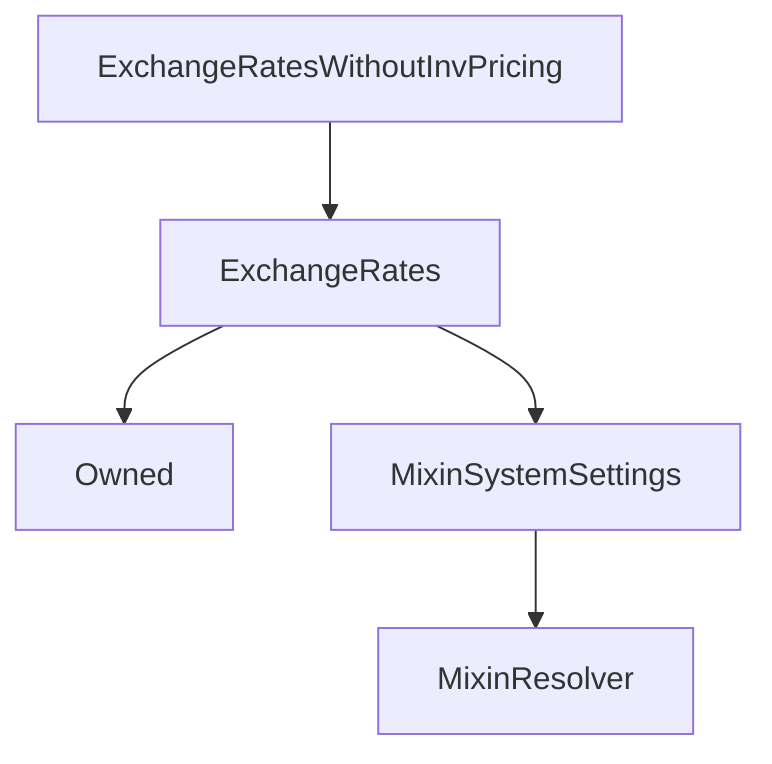

# ExchangeRatesWithoutInvPricing

## Description

**Source:** [contracts/ExchangeRatesWithoutInvPricing.sol](https://github.com/Synthetixio/synthetix/tree/v2.35.6/contracts/ExchangeRatesWithoutInvPricing.sol)

## Architecture

### Inheritance Graph

## Constructor

### `constructor`

[Source](https://github.com/Synthetixio/synthetix/tree/v2.35.6/contracts/ExchangeRatesWithoutInvPricing.sol#L9)

??? example "Details"

    **Signature**

    `(address _owner, address _oracle, address _resolver, bytes32[] _currencyKeys, uint256[] _newRates)`

    **Visibility**

    `public`

    **State Mutability**

    `nonpayable`

## Views

### `canFreezeRate`

[Source](https://github.com/Synthetixio/synthetix/tree/v2.35.6/contracts/ExchangeRatesWithoutInvPricing.sol#L36)

??? example "Details"

    **Signature**

    `canFreezeRate(bytes32 ) returns (bool)`

    **Visibility**

    `external`

    **State Mutability**

    `view`

### `rateIsFrozen`

[Source](https://github.com/Synthetixio/synthetix/tree/v2.35.6/contracts/ExchangeRatesWithoutInvPricing.sol#L40)

??? example "Details"

    **Signature**

    `rateIsFrozen(bytes32 ) returns (bool)`

    **Visibility**

    `external`

    **State Mutability**

    `view`

## Restricted Functions

### `removeInversePricing`

[Source](https://github.com/Synthetixio/synthetix/tree/v2.35.6/contracts/ExchangeRatesWithoutInvPricing.sol#L28)

??? example "Details"

    **Signature**

    `removeInversePricing(bytes32 )`

    **Visibility**

    `external`

    **State Mutability**

    `nonpayable`

    **Modifiers**

    * [onlyOwner](#onlyowner)

### `setInversePricing`

[Source](https://github.com/Synthetixio/synthetix/tree/v2.35.6/contracts/ExchangeRatesWithoutInvPricing.sol#L17)

??? example "Details"

    **Signature**

    `setInversePricing(bytes32 , uint256 , uint256 , uint256 , bool , bool )`

    **Visibility**

    `external`

    **State Mutability**

    `nonpayable`

    **Modifiers**

    * [onlyOwner](#onlyowner)

## Internal Functions

### `_notImplemented`

[Source](https://github.com/Synthetixio/synthetix/tree/v2.35.6/contracts/ExchangeRatesWithoutInvPricing.sol#L48)

??? example "Details"

    **Signature**

    `_notImplemented()`

    **Visibility**

    `internal`

    **State Mutability**

    `pure`

### `_rateIsFrozen`

[Source](https://github.com/Synthetixio/synthetix/tree/v2.35.6/contracts/ExchangeRatesWithoutInvPricing.sol#L44)

??? example "Details"

    **Signature**

    `_rateIsFrozen(bytes32 ) returns (bool)`

    **Visibility**

    `internal`

    **State Mutability**

    `view`

## External Functions

### `freezeRate`

[Source](https://github.com/Synthetixio/synthetix/tree/v2.35.6/contracts/ExchangeRatesWithoutInvPricing.sol#L32)

??? example "Details"

    **Signature**

    `freezeRate(bytes32 )`

    **Visibility**

    `external`

    **State Mutability**

    `nonpayable`
