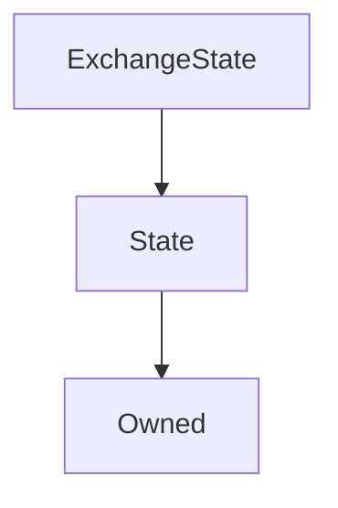

# ExchangeState

## Description

!!! Info "Documentation Pending"

    This contract documentation is missing some descriptions.

**Source:** [contracts/ExchangeState.sol](https://github.com/Synthetixio/synthetix/tree/v2.30.2-ovm/contracts/ExchangeState.sol)

## Architecture

### Inheritance Graph

## Variables

### `exchanges`

[Source](https://github.com/Synthetixio/synthetix/tree/v2.30.2-ovm/contracts/ExchangeState.sol#L11)

**Type:** `mapping(address => mapping(bytes32 => struct IExchangeState.ExchangeEntry[]))`

### `maxEntriesInQueue`

[Source](https://github.com/Synthetixio/synthetix/tree/v2.30.2-ovm/contracts/ExchangeState.sol#L13)

**Type:** `uint256`

## Constructor

### `constructor`

[Source](https://github.com/Synthetixio/synthetix/tree/v2.30.2-ovm/contracts/ExchangeState.sol#L15)

??? example "Details"

    **Signature**

    `(address _owner, address _associatedContract)`

    **Visibility**

    `public`

    **State Mutability**

    `nonpayable`

## Views

### `getEntryAt`

[Source](https://github.com/Synthetixio/synthetix/tree/v2.30.2-ovm/contracts/ExchangeState.sol#L62)

??? example "Details"

    **Signature**

    `getEntryAt(address account, bytes32 currencyKey, uint256 index) returns (bytes32, uint256, bytes32, uint256, uint256, uint256, uint256, uint256)`

    **Visibility**

    `external`

    **State Mutability**

    `view`

### `getLengthOfEntries`

[Source](https://github.com/Synthetixio/synthetix/tree/v2.30.2-ovm/contracts/ExchangeState.sol#L58)

??? example "Details"

    **Signature**

    `getLengthOfEntries(address account, bytes32 currencyKey) returns (uint256)`

    **Visibility**

    `external`

    **State Mutability**

    `view`

### `getMaxTimestamp`

[Source](https://github.com/Synthetixio/synthetix/tree/v2.30.2-ovm/contracts/ExchangeState.sol#L93)

??? example "Details"

    **Signature**

    `getMaxTimestamp(address account, bytes32 currencyKey) returns (uint256)`

    **Visibility**

    `external`

    **State Mutability**

    `view`

## Restricted Functions

### `appendExchangeEntry`

[Source](https://github.com/Synthetixio/synthetix/tree/v2.30.2-ovm/contracts/ExchangeState.sol#L25)

??? example "Details"

    **Signature**

    `appendExchangeEntry(address account, bytes32 src, uint256 amount, bytes32 dest, uint256 amountReceived, uint256 exchangeFeeRate, uint256 timestamp, uint256 roundIdForSrc, uint256 roundIdForDest)`

    **Visibility**

    `external`

    **State Mutability**

    `nonpayable`

    **Requires**

    * [require(..., Max queue length reached)](https://github.com/Synthetixio/synthetix/tree/v2.30.2-ovm/contracts/ExchangeState.sol#L36)

    **Modifiers**

    * [onlyAssociatedContract](#onlyassociatedcontract)

### `removeEntries`

[Source](https://github.com/Synthetixio/synthetix/tree/v2.30.2-ovm/contracts/ExchangeState.sol#L52)

??? example "Details"

    **Signature**

    `removeEntries(address account, bytes32 currencyKey)`

    **Visibility**

    `external`

    **State Mutability**

    `nonpayable`

    **Modifiers**

    * [onlyAssociatedContract](#onlyassociatedcontract)

### `setMaxEntriesInQueue`

[Source](https://github.com/Synthetixio/synthetix/tree/v2.30.2-ovm/contracts/ExchangeState.sol#L19)

??? example "Details"

    **Signature**

    `setMaxEntriesInQueue(uint256 _maxEntriesInQueue)`

    **Visibility**

    `external`

    **State Mutability**

    `nonpayable`

    **Modifiers**

    * [onlyOwner](#onlyowner)
