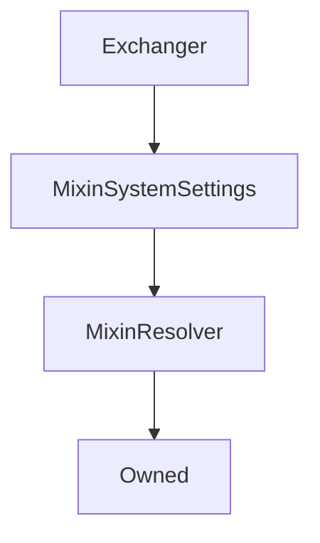

# Exchanger

## Description

Performs all the heavy lifting internally of `exchange` and `settle` functionality.

**Source:** [contracts/Exchanger.sol](https://github.com/Synthetixio/synthetix/tree/v2.29.0-alpha/contracts/Exchanger.sol)

## Architecture

### Libraries

- [SafeMath](/contracts/source/libraries/SafeMath) for `uint`
- [SafeDecimalMath](/contracts/source/libraries/SafeDecimalMath) for `uint`

### Inheritance Graph

### Related Contracts

<centered-image>
    
</centered-image>

## Structs

### `ExchangeEntrySettlement`

[Source](https://github.com/Synthetixio/synthetix/tree/v2.29.0-alpha/contracts/Exchanger.sol#L65)

| Field                    | Type      | Description |
| ------------------------ | --------- | ----------- |
| `src`                    | `bytes32` | TBA         |
| `amount`                 | `uint256` | TBA         |
| `dest`                   | `bytes32` | TBA         |
| `reclaim`                | `uint256` | TBA         |
| `rebate`                 | `uint256` | TBA         |
| `srcRoundIdAtPeriodEnd`  | `uint256` | TBA         |
| `destRoundIdAtPeriodEnd` | `uint256` | TBA         |
| `timestamp`              | `uint256` | TBA         |

## Constants

### `CIRCUIT_BREAKER_SUSPENSION_REASON`

[Source](https://github.com/Synthetixio/synthetix/tree/v2.29.0-alpha/contracts/Exchanger.sol#L79)

**Type:** `uint256`

## Variables

### `lastExchangeRate`

[Source](https://github.com/Synthetixio/synthetix/tree/v2.29.0-alpha/contracts/Exchanger.sol#L81)

**Type:** `mapping(bytes32 => uint256)`

## Constructor

### `constructor`

[Source](https://github.com/Synthetixio/synthetix/tree/v2.29.0-alpha/contracts/Exchanger.sol#L105)

??? example "Details"

    **Signature**

    `(address _owner, address _resolver)`

    **Visibility**

    `public`

    **State Mutability**

    `nonpayable`

## Views

### `calculateAmountAfterSettlement`

[Source](https://github.com/Synthetixio/synthetix/tree/v2.29.0-alpha/contracts/Exchanger.sol#L281)

??? example "Details"

    **Signature**

    `calculateAmountAfterSettlement(address from, bytes32 currencyKey, uint256 amount, uint256 refunded) returns (uint256)`

    **Visibility**

    `public`

    **State Mutability**

    `view`

### `feeRateForExchange`

[Source](https://github.com/Synthetixio/synthetix/tree/v2.29.0-alpha/contracts/Exchanger.sol#L669)

Determine the effective fee rate for the exchange, taking into considering swing trading.

??? example "Details"

    **Signature**

    `feeRateForExchange(bytes32 sourceCurrencyKey, bytes32 destinationCurrencyKey) returns (uint256)`

    **Visibility**

    `external`

    **State Mutability**

    `view`

### `getAmountsForExchange`

[Source](https://github.com/Synthetixio/synthetix/tree/v2.29.0-alpha/contracts/Exchanger.sol#L684)

??? example "Details"

    **Signature**

    `getAmountsForExchange(uint256 sourceAmount, bytes32 sourceCurrencyKey, bytes32 destinationCurrencyKey) returns (uint256, uint256, uint256)`

    **Visibility**

    `external`

    **State Mutability**

    `view`

### `hasWaitingPeriodOrSettlementOwing`

[Source](https://github.com/Synthetixio/synthetix/tree/v2.29.0-alpha/contracts/Exchanger.sol#L269)

??? example "Details"

    **Signature**

    `hasWaitingPeriodOrSettlementOwing(address account, bytes32 currencyKey) returns (bool)`

    **Visibility**

    `external`

    **State Mutability**

    `view`

### `isSynthRateInvalid`

[Source](https://github.com/Synthetixio/synthetix/tree/v2.29.0-alpha/contracts/Exchanger.sol#L303)

??? example "Details"

    **Signature**

    `isSynthRateInvalid(bytes32 currencyKey) returns (bool)`

    **Visibility**

    `external`

    **State Mutability**

    `view`

### `maxSecsLeftInWaitingPeriod`

[Source](https://github.com/Synthetixio/synthetix/tree/v2.29.0-alpha/contracts/Exchanger.sol#L146)

Returns the maximum number of seconds remaining in the waiting period for all exchanges into the given synth (`currencyKey`) by the account.

This number must be `0` in order for [`settle()`](#settle) to succeed.

??? example "Details"

    **Signature**

    `maxSecsLeftInWaitingPeriod(address account, bytes32 currencyKey) returns (uint256)`

    **Visibility**

    `public`

    **State Mutability**

    `view`

### `priceDeviationThresholdFactor`

[Source](https://github.com/Synthetixio/synthetix/tree/v2.29.0-alpha/contracts/Exchanger.sol#L158)

**Type:** `uint256`

??? example "Details"

    **Signature**

    `priceDeviationThresholdFactor() returns (uint256)`

    **Visibility**

    `external`

    **State Mutability**

    `view`

### `settlementOwing`

[Source](https://github.com/Synthetixio/synthetix/tree/v2.29.0-alpha/contracts/Exchanger.sol#L162)

Returns the total amount to be reclaimed or rebated for the given account and synth (`currencyKey`). Note: this function can be called at any time, even while the waiting period has not expired.

??? example "Details"

    **Signature**

    `settlementOwing(address account, bytes32 currencyKey) returns (uint256, uint256, uint256)`

    **Visibility**

    `public`

    **State Mutability**

    `view`

### `tradingRewardsEnabled`

[Source](https://github.com/Synthetixio/synthetix/tree/v2.29.0-alpha/contracts/Exchanger.sol#L154)

??? example "Details"

    **Signature**

    `tradingRewardsEnabled() returns (bool)`

    **Visibility**

    `external`

    **State Mutability**

    `view`

### `waitingPeriodSecs`

[Source](https://github.com/Synthetixio/synthetix/tree/v2.29.0-alpha/contracts/Exchanger.sol#L150)

**Type:** `uint256`

??? example "Details"

    **Signature**

    `waitingPeriodSecs() returns (uint256)`

    **Visibility**

    `external`

    **State Mutability**

    `view`

## Restricted Functions

### `exchange`

[Source](https://github.com/Synthetixio/synthetix/tree/v2.29.0-alpha/contracts/Exchanger.sol#L308)

??? example "Details"

    **Signature**

    `exchange(address from, bytes32 sourceCurrencyKey, uint256 sourceAmount, bytes32 destinationCurrencyKey, address destinationAddress) returns (uint256)`

    **Visibility**

    `external`

    **State Mutability**

    `nonpayable`

    **Modifiers**

    * [onlySynthetixorSynth](#onlysynthetixorsynth)

### `exchangeOnBehalf`

[Source](https://github.com/Synthetixio/synthetix/tree/v2.29.0-alpha/contracts/Exchanger.sol#L321)

??? example "Details"

    **Signature**

    `exchangeOnBehalf(address exchangeForAddress, address from, bytes32 sourceCurrencyKey, uint256 sourceAmount, bytes32 destinationCurrencyKey) returns (uint256)`

    **Visibility**

    `external`

    **State Mutability**

    `nonpayable`

    **Requires**

    * [require(..., Not approved to act on behalf)](https://github.com/Synthetixio/synthetix/tree/v2.29.0-alpha/contracts/Exchanger.sol#L328)

    **Modifiers**

    * [onlySynthetixorSynth](#onlysynthetixorsynth)

### `exchangeOnBehalfWithTracking`

[Source](https://github.com/Synthetixio/synthetix/tree/v2.29.0-alpha/contracts/Exchanger.sol#L359)

??? example "Details"

    **Signature**

    `exchangeOnBehalfWithTracking(address exchangeForAddress, address from, bytes32 sourceCurrencyKey, uint256 sourceAmount, bytes32 destinationCurrencyKey, address originator, bytes32 trackingCode) returns (uint256)`

    **Visibility**

    `external`

    **State Mutability**

    `nonpayable`

    **Requires**

    * [require(..., Not approved to act on behalf)](https://github.com/Synthetixio/synthetix/tree/v2.29.0-alpha/contracts/Exchanger.sol#L368)

    **Modifiers**

    * [onlySynthetixorSynth](#onlysynthetixorsynth)

### `exchangeWithTracking`

[Source](https://github.com/Synthetixio/synthetix/tree/v2.29.0-alpha/contracts/Exchanger.sol#L342)

??? example "Details"

    **Signature**

    `exchangeWithTracking(address from, bytes32 sourceCurrencyKey, uint256 sourceAmount, bytes32 destinationCurrencyKey, address destinationAddress, address originator, bytes32 trackingCode) returns (uint256)`

    **Visibility**

    `external`

    **State Mutability**

    `nonpayable`

    **Modifiers**

    * [onlySynthetixorSynth](#onlysynthetixorsynth)

### `setLastExchangeRateForSynth`

[Source](https://github.com/Synthetixio/synthetix/tree/v2.29.0-alpha/contracts/Exchanger.sol#L523)

??? example "Details"

    **Signature**

    `setLastExchangeRateForSynth(bytes32 currencyKey, uint256 rate)`

    **Visibility**

    `external`

    **State Mutability**

    `nonpayable`

    **Requires**

    * [require(..., Rate must be above 0)](https://github.com/Synthetixio/synthetix/tree/v2.29.0-alpha/contracts/Exchanger.sol#L524)

    **Modifiers**

    * [onlyExchangeRates](#onlyexchangerates)

## Internal Functions

### `_emitTrackingEvent`

[Source](https://github.com/Synthetixio/synthetix/tree/v2.29.0-alpha/contracts/Exchanger.sol#L384)

??? example "Details"

    **Signature**

    `_emitTrackingEvent(bytes32 trackingCode, bytes32 toCurrencyKey, uint256 toAmount)`

    **Visibility**

    `internal`

    **State Mutability**

    `nonpayable`

### `_ensureCanExchange`

[Source](https://github.com/Synthetixio/synthetix/tree/v2.29.0-alpha/contracts/Exchanger.sol#L530)

??? example "Details"

    **Signature**

    `_ensureCanExchange(bytes32 sourceCurrencyKey, uint256 sourceAmount, bytes32 destinationCurrencyKey)`

    **Visibility**

    `internal`

    **State Mutability**

    `view`

    **Requires**

    * [require(..., Can't be same synth)](https://github.com/Synthetixio/synthetix/tree/v2.29.0-alpha/contracts/Exchanger.sol#L535)

    * [require(..., Zero amount)](https://github.com/Synthetixio/synthetix/tree/v2.29.0-alpha/contracts/Exchanger.sol#L536)

    * [require(..., Src/dest rate invalid or not found)](https://github.com/Synthetixio/synthetix/tree/v2.29.0-alpha/contracts/Exchanger.sol#L541)

### `_exchange`

[Source](https://github.com/Synthetixio/synthetix/tree/v2.29.0-alpha/contracts/Exchanger.sol#L398)

??? example "Details"

    **Signature**

    `_exchange(address from, bytes32 sourceCurrencyKey, uint256 sourceAmount, bytes32 destinationCurrencyKey, address destinationAddress) returns (uint256, uint256)`

    **Visibility**

    `internal`

    **State Mutability**

    `nonpayable`

### `_feeRateForExchange`

[Source](https://github.com/Synthetixio/synthetix/tree/v2.29.0-alpha/contracts/Exchanger.sol#L677)

??? example "Details"

    **Signature**

    `_feeRateForExchange(bytes32 , bytes32 destinationCurrencyKey) returns (uint256)`

    **Visibility**

    `internal`

    **State Mutability**

    `view`

### `_getAmountReceivedForExchange`

[Source](https://github.com/Synthetixio/synthetix/tree/v2.29.0-alpha/contracts/Exchanger.sol#L730)

??? example "Details"

    **Signature**

    `_getAmountReceivedForExchange(uint256 destinationAmount, uint256 exchangeFeeRate) returns (uint256)`

    **Visibility**

    `internal`

    **State Mutability**

    `pure`

### `_getAmountsForExchangeMinusFees`

[Source](https://github.com/Synthetixio/synthetix/tree/v2.29.0-alpha/contracts/Exchanger.sol#L704)

??? example "Details"

    **Signature**

    `_getAmountsForExchangeMinusFees(uint256 sourceAmount, bytes32 sourceCurrencyKey, bytes32 destinationCurrencyKey) returns (uint256, uint256, uint256, uint256, uint256)`

    **Visibility**

    `internal`

    **State Mutability**

    `view`

### `_getExchangeEntry`

[Source](https://github.com/Synthetixio/synthetix/tree/v2.29.0-alpha/contracts/Exchanger.sol#L240)

??? example "Details"

    **Signature**

    `_getExchangeEntry(address account, bytes32 currencyKey, uint256 index) returns (struct IExchangeState.ExchangeEntry)`

    **Visibility**

    `internal`

    **State Mutability**

    `view`

### `_internalSettle`

[Source](https://github.com/Synthetixio/synthetix/tree/v2.29.0-alpha/contracts/Exchanger.sol#L584)

??? example "Details"

    **Signature**

    `_internalSettle(address from, bytes32 currencyKey, bool updateCache) returns (uint256, uint256, uint256)`

    **Visibility**

    `internal`

    **State Mutability**

    `nonpayable`

    **Requires**

    * [require(..., Cannot settle during waiting period)](https://github.com/Synthetixio/synthetix/tree/v2.29.0-alpha/contracts/Exchanger.sol#L596)

### `_isDeviationAboveThreshold`

[Source](https://github.com/Synthetixio/synthetix/tree/v2.29.0-alpha/contracts/Exchanger.sol#L569)

??? example "Details"

    **Signature**

    `_isDeviationAboveThreshold(uint256 base, uint256 comparison) returns (bool)`

    **Visibility**

    `internal`

    **State Mutability**

    `view`

### `_isSynthRateInvalid`

[Source](https://github.com/Synthetixio/synthetix/tree/v2.29.0-alpha/contracts/Exchanger.sol#L544)

??? example "Details"

    **Signature**

    `_isSynthRateInvalid(bytes32 currencyKey, uint256 currentRate) returns (bool)`

    **Visibility**

    `internal`

    **State Mutability**

    `view`

### `_processTradingRewards`

[Source](https://github.com/Synthetixio/synthetix/tree/v2.29.0-alpha/contracts/Exchanger.sol#L392)

??? example "Details"

    **Signature**

    `_processTradingRewards(uint256 fee, address originator)`

    **Visibility**

    `internal`

    **State Mutability**

    `nonpayable`

### `_settlementOwing`

[Source](https://github.com/Synthetixio/synthetix/tree/v2.29.0-alpha/contracts/Exchanger.sol#L175)

??? example "Details"

    **Signature**

    `_settlementOwing(address account, bytes32 currencyKey) returns (uint256, uint256, uint256, struct Exchanger.ExchangeEntrySettlement[])`

    **Visibility**

    `internal`

    **State Mutability**

    `view`

### `appendExchange`

[Source](https://github.com/Synthetixio/synthetix/tree/v2.29.0-alpha/contracts/Exchanger.sol#L738)

??? example "Details"

    **Signature**

    `appendExchange(address account, bytes32 src, uint256 amount, bytes32 dest, uint256 amountReceived, uint256 exchangeFeeRate)`

    **Visibility**

    `internal`

    **State Mutability**

    `nonpayable`

    **Emits**

    * [ExchangeEntryAppended](#exchangeentryappended)

### `delegateApprovals`

[Source](https://github.com/Synthetixio/synthetix/tree/v2.29.0-alpha/contracts/Exchanger.sol#L138)

??? example "Details"

    **Signature**

    `delegateApprovals() returns (contract IDelegateApprovals)`

    **Visibility**

    `internal`

    **State Mutability**

    `view`

### `exchangeRates`

[Source](https://github.com/Synthetixio/synthetix/tree/v2.29.0-alpha/contracts/Exchanger.sol#L122)

??? example "Details"

    **Signature**

    `exchangeRates() returns (contract IExchangeRates)`

    **Visibility**

    `internal`

    **State Mutability**

    `view`

### `exchangeState`

[Source](https://github.com/Synthetixio/synthetix/tree/v2.29.0-alpha/contracts/Exchanger.sol#L118)

??? example "Details"

    **Signature**

    `exchangeState() returns (contract IExchangeState)`

    **Visibility**

    `internal`

    **State Mutability**

    `view`

### `feePool`

[Source](https://github.com/Synthetixio/synthetix/tree/v2.29.0-alpha/contracts/Exchanger.sol#L130)

??? example "Details"

    **Signature**

    `feePool() returns (contract IFeePool)`

    **Visibility**

    `internal`

    **State Mutability**

    `view`

### `getRoundIdsAtPeriodEnd`

[Source](https://github.com/Synthetixio/synthetix/tree/v2.29.0-alpha/contracts/Exchanger.sol#L773)

??? example "Details"

    **Signature**

    `getRoundIdsAtPeriodEnd(struct IExchangeState.ExchangeEntry exchangeEntry) returns (uint256, uint256)`

    **Visibility**

    `internal`

    **State Mutability**

    `view`

### `issuer`

[Source](https://github.com/Synthetixio/synthetix/tree/v2.29.0-alpha/contracts/Exchanger.sol#L142)

??? example "Details"

    **Signature**

    `issuer() returns (contract IIssuer)`

    **Visibility**

    `internal`

    **State Mutability**

    `view`

### `reclaim`

[Source](https://github.com/Synthetixio/synthetix/tree/v2.29.0-alpha/contracts/Exchanger.sol#L640)

??? example "Details"

    **Signature**

    `reclaim(address from, bytes32 currencyKey, uint256 amount)`

    **Visibility**

    `internal`

    **State Mutability**

    `nonpayable`

### `refund`

[Source](https://github.com/Synthetixio/synthetix/tree/v2.29.0-alpha/contracts/Exchanger.sol#L650)

??? example "Details"

    **Signature**

    `refund(address from, bytes32 currencyKey, uint256 amount)`

    **Visibility**

    `internal`

    **State Mutability**

    `nonpayable`

### `secsLeftInWaitingPeriodForExchange`

[Source](https://github.com/Synthetixio/synthetix/tree/v2.29.0-alpha/contracts/Exchanger.sol#L660)

??? example "Details"

    **Signature**

    `secsLeftInWaitingPeriodForExchange(uint256 timestamp) returns (uint256)`

    **Visibility**

    `internal`

    **State Mutability**

    `view`

### `synthetix`

[Source](https://github.com/Synthetixio/synthetix/tree/v2.29.0-alpha/contracts/Exchanger.sol#L126)

??? example "Details"

    **Signature**

    `synthetix() returns (contract ISynthetix)`

    **Visibility**

    `internal`

    **State Mutability**

    `view`

### `systemStatus`

[Source](https://github.com/Synthetixio/synthetix/tree/v2.29.0-alpha/contracts/Exchanger.sol#L114)

??? example "Details"

    **Signature**

    `systemStatus() returns (contract ISystemStatus)`

    **Visibility**

    `internal`

    **State Mutability**

    `view`

### `tradingRewards`

[Source](https://github.com/Synthetixio/synthetix/tree/v2.29.0-alpha/contracts/Exchanger.sol#L134)

??? example "Details"

    **Signature**

    `tradingRewards() returns (contract ITradingRewards)`

    **Visibility**

    `internal`

    **State Mutability**

    `view`

## External Functions

### `settle`

[Source](https://github.com/Synthetixio/synthetix/tree/v2.29.0-alpha/contracts/Exchanger.sol#L503)

Settle processes all exchanges into the given synth, calculating any `reclaimed` or `refunded` amounts via [`settlementOwing`](#settlementowing) and burning any reclaim and issuing any refund. This function may be called by anyone - the `msg.sender` is irrelevant.

??? example "Details"

    **Signature**

    `settle(address from, bytes32 currencyKey) returns (uint256, uint256, uint256)`

    **Visibility**

    `external`

    **State Mutability**

    `nonpayable`

### `suspendSynthWithInvalidRate`

[Source](https://github.com/Synthetixio/synthetix/tree/v2.29.0-alpha/contracts/Exchanger.sol#L515)

??? example "Details"

    **Signature**

    `suspendSynthWithInvalidRate(bytes32 currencyKey)`

    **Visibility**

    `external`

    **State Mutability**

    `nonpayable`

    **Requires**

    * [require(..., No such synth)](https://github.com/Synthetixio/synthetix/tree/v2.29.0-alpha/contracts/Exchanger.sol#L517)

    * [require(..., Synth price is valid)](https://github.com/Synthetixio/synthetix/tree/v2.29.0-alpha/contracts/Exchanger.sol#L518)

## Modifiers

### `onlyExchangeRates`

[Source](https://github.com/Synthetixio/synthetix/tree/v2.29.0-alpha/contracts/Exchanger.sol#L806)

### `onlySynthetixorSynth`

[Source](https://github.com/Synthetixio/synthetix/tree/v2.29.0-alpha/contracts/Exchanger.sol#L797)

## Events

### `ExchangeEntryAppended`

[Source](https://github.com/Synthetixio/synthetix/tree/v2.29.0-alpha/contracts/Exchanger.sol#L813)

**Signature**: `ExchangeEntryAppended(address account, bytes32 src, uint256 amount, bytes32 dest, uint256 amountReceived, uint256 exchangeFeeRate, uint256 roundIdForSrc, uint256 roundIdForDest)`

### `ExchangeEntrySettled`

[Source](https://github.com/Synthetixio/synthetix/tree/v2.29.0-alpha/contracts/Exchanger.sol#L824)

**Signature**: `ExchangeEntrySettled(address from, bytes32 src, uint256 amount, bytes32 dest, uint256 reclaim, uint256 rebate, uint256 srcRoundIdAtPeriodEnd, uint256 destRoundIdAtPeriodEnd, uint256 exchangeTimestamp)`
