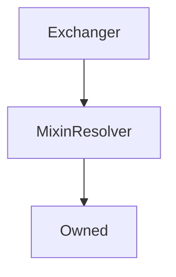

# Exchanger

## Description

Performs all the heavy lifting internally of `exchange` and `settle` functionality.

**Source:** [contracts/Exchanger.sol](https://github.com/Synthetixio/synthetix/tree/v2.26.1/contracts/Exchanger.sol)

## Architecture

### Libraries

- [SafeMath](/contracts/source/libraries/SafeMath) for `uint`
- [SafeDecimalMath](/contracts/source/libraries/SafeDecimalMath) for `uint`

### Inheritance Graph

### Related Contracts

<centered-image>
    
</centered-image>

## Structs

### `ExchangeEntrySettlement`

[Source](https://github.com/Synthetixio/synthetix/tree/v2.26.1/contracts/Exchanger.sol#L52)

| Field                    | Type      | Description |
| ------------------------ | --------- | ----------- |
| `src`                    | `bytes32` | TBA         |
| `amount`                 | `uint256` | TBA         |
| `dest`                   | `bytes32` | TBA         |
| `reclaim`                | `uint256` | TBA         |
| `rebate`                 | `uint256` | TBA         |
| `srcRoundIdAtPeriodEnd`  | `uint256` | TBA         |
| `destRoundIdAtPeriodEnd` | `uint256` | TBA         |
| `timestamp`              | `uint256` | TBA         |

## Variables

### `waitingPeriodSecs`

[Source](https://github.com/Synthetixio/synthetix/tree/v2.26.1/contracts/Exchanger.sol#L65)

**Type:** `uint256`

## Constructor

### `constructor`

[Source](https://github.com/Synthetixio/synthetix/tree/v2.26.1/contracts/Exchanger.sol#L87)

??? example "Details"

    **Signature**

    `(address _owner, address _resolver)`

    **Visibility**

    `public`

    **State Mutability**

    `nonpayable`

## Views

### `calculateAmountAfterSettlement`

[Source](https://github.com/Synthetixio/synthetix/tree/v2.26.1/contracts/Exchanger.sol#L244)

??? example "Details"

    **Signature**

    `calculateAmountAfterSettlement(address from, bytes32 currencyKey, uint256 amount, uint256 refunded) returns (uint256)`

    **Visibility**

    `public`

    **State Mutability**

    `view`

### `feeRateForExchange`

[Source](https://github.com/Synthetixio/synthetix/tree/v2.26.1/contracts/Exchanger.sol#L467)

Determine the effective fee rate for the exchange, taking into considering swing trading.

??? example "Details"

    **Signature**

    `feeRateForExchange(bytes32 sourceCurrencyKey, bytes32 destinationCurrencyKey) returns (uint256)`

    **Visibility**

    `external`

    **State Mutability**

    `view`

### `getAmountsForExchange`

[Source](https://github.com/Synthetixio/synthetix/tree/v2.26.1/contracts/Exchanger.sol#L482)

??? example "Details"

    **Signature**

    `getAmountsForExchange(uint256 sourceAmount, bytes32 sourceCurrencyKey, bytes32 destinationCurrencyKey) returns (uint256, uint256, uint256)`

    **Visibility**

    `external`

    **State Mutability**

    `view`

### `hasWaitingPeriodOrSettlementOwing`

[Source](https://github.com/Synthetixio/synthetix/tree/v2.26.1/contracts/Exchanger.sol#L228)

??? example "Details"

    **Signature**

    `hasWaitingPeriodOrSettlementOwing(address account, bytes32 currencyKey) returns (bool)`

    **Visibility**

    `external`

    **State Mutability**

    `view`

### `maxSecsLeftInWaitingPeriod`

[Source](https://github.com/Synthetixio/synthetix/tree/v2.26.1/contracts/Exchanger.sol#L121)

Returns the maximum number of seconds remaining in the waiting period for all exchanges into the given synth (`currencyKey`) by the account.

This number must be `0` in order for [`settle()`](#settle) to succeed.

??? example "Details"

    **Signature**

    `maxSecsLeftInWaitingPeriod(address account, bytes32 currencyKey) returns (uint256)`

    **Visibility**

    `public`

    **State Mutability**

    `view`

### `settlementOwing`

[Source](https://github.com/Synthetixio/synthetix/tree/v2.26.1/contracts/Exchanger.sol#L125)

Returns the total amount to be reclaimed or rebated for the given account and synth (`currencyKey`). Note: this function can be called at any time, even while the waiting period has not expired.

??? example "Details"

    **Signature**

    `settlementOwing(address account, bytes32 currencyKey) returns (uint256, uint256, uint256)`

    **Visibility**

    `public`

    **State Mutability**

    `view`

## Restricted Functions

### `exchange`

[Source](https://github.com/Synthetixio/synthetix/tree/v2.26.1/contracts/Exchanger.sol#L267)

??? example "Details"

    **Signature**

    `exchange(address from, bytes32 sourceCurrencyKey, uint256 sourceAmount, bytes32 destinationCurrencyKey, address destinationAddress) returns (uint256)`

    **Visibility**

    `external`

    **State Mutability**

    `nonpayable`

    **Modifiers**

    * [onlySynthetixorSynth](#onlysynthetixorsynth)

### `exchangeOnBehalf`

[Source](https://github.com/Synthetixio/synthetix/tree/v2.26.1/contracts/Exchanger.sol#L277)

??? example "Details"

    **Signature**

    `exchangeOnBehalf(address exchangeForAddress, address from, bytes32 sourceCurrencyKey, uint256 sourceAmount, bytes32 destinationCurrencyKey) returns (uint256)`

    **Visibility**

    `external`

    **State Mutability**

    `nonpayable`

    **Requires**

    * [require(..., Not approved to act on behalf)](https://github.com/Synthetixio/synthetix/tree/v2.26.1/contracts/Exchanger.sol#L284)

    **Modifiers**

    * [onlySynthetixorSynth](#onlysynthetixorsynth)

### `setWaitingPeriodSecs`

[Source](https://github.com/Synthetixio/synthetix/tree/v2.26.1/contracts/Exchanger.sol#L240)

??? example "Details"

    **Signature**

    `setWaitingPeriodSecs(uint256 _waitingPeriodSecs)`

    **Visibility**

    `external`

    **State Mutability**

    `nonpayable`

    **Modifiers**

    * [onlyOwner](#onlyowner)

## Internal Functions

### `_exchange`

[Source](https://github.com/Synthetixio/synthetix/tree/v2.26.1/contracts/Exchanger.sol#L294)

??? example "Details"

    **Signature**

    `_exchange(address from, bytes32 sourceCurrencyKey, uint256 sourceAmount, bytes32 destinationCurrencyKey, address destinationAddress) returns (uint256)`

    **Visibility**

    `internal`

    **State Mutability**

    `nonpayable`

    **Requires**

    * [require(..., Can't be same synth)](https://github.com/Synthetixio/synthetix/tree/v2.26.1/contracts/Exchanger.sol#L301)

    * [require(..., Zero amount)](https://github.com/Synthetixio/synthetix/tree/v2.26.1/contracts/Exchanger.sol#L302)

    * [require(..., Src/dest rate stale or not found)](https://github.com/Synthetixio/synthetix/tree/v2.26.1/contracts/Exchanger.sol#L307)

### `_feeRateForExchange`

[Source](https://github.com/Synthetixio/synthetix/tree/v2.26.1/contracts/Exchanger.sol#L475)

??? example "Details"

    **Signature**

    `_feeRateForExchange(bytes32 , bytes32 destinationCurrencyKey) returns (uint256)`

    **Visibility**

    `internal`

    **State Mutability**

    `view`

### `_getAmountReceivedForExchange`

[Source](https://github.com/Synthetixio/synthetix/tree/v2.26.1/contracts/Exchanger.sol#L521)

??? example "Details"

    **Signature**

    `_getAmountReceivedForExchange(uint256 destinationAmount, uint256 exchangeFeeRate) returns (uint256)`

    **Visibility**

    `internal`

    **State Mutability**

    `pure`

### `_getAmountsForExchangeMinusFees`

[Source](https://github.com/Synthetixio/synthetix/tree/v2.26.1/contracts/Exchanger.sol#L502)

??? example "Details"

    **Signature**

    `_getAmountsForExchangeMinusFees(uint256 sourceAmount, bytes32 sourceCurrencyKey, bytes32 destinationCurrencyKey) returns (uint256, uint256, uint256)`

    **Visibility**

    `internal`

    **State Mutability**

    `view`

### `_getExchangeEntry`

[Source](https://github.com/Synthetixio/synthetix/tree/v2.26.1/contracts/Exchanger.sol#L199)

??? example "Details"

    **Signature**

    `_getExchangeEntry(address account, bytes32 currencyKey, uint256 index) returns (struct IExchangeState.ExchangeEntry)`

    **Visibility**

    `internal`

    **State Mutability**

    `view`

### `_internalSettle`

[Source](https://github.com/Synthetixio/synthetix/tree/v2.26.1/contracts/Exchanger.sol#L393)

??? example "Details"

    **Signature**

    `_internalSettle(address from, bytes32 currencyKey) returns (uint256, uint256, uint256)`

    **Visibility**

    `internal`

    **State Mutability**

    `nonpayable`

    **Requires**

    * [require(..., Cannot settle during waiting period)](https://github.com/Synthetixio/synthetix/tree/v2.26.1/contracts/Exchanger.sol#L401)

### `_settlementOwing`

[Source](https://github.com/Synthetixio/synthetix/tree/v2.26.1/contracts/Exchanger.sol#L138)

??? example "Details"

    **Signature**

    `_settlementOwing(address account, bytes32 currencyKey) returns (uint256, uint256, uint256, struct Exchanger.ExchangeEntrySettlement[])`

    **Visibility**

    `internal`

    **State Mutability**

    `view`

### `appendExchange`

[Source](https://github.com/Synthetixio/synthetix/tree/v2.26.1/contracts/Exchanger.sol#L529)

??? example "Details"

    **Signature**

    `appendExchange(address account, bytes32 src, uint256 amount, bytes32 dest, uint256 amountReceived, uint256 exchangeFeeRate)`

    **Visibility**

    `internal`

    **State Mutability**

    `nonpayable`

    **Emits**

    * [ExchangeEntryAppended](#exchangeentryappended)

### `delegateApprovals`

[Source](https://github.com/Synthetixio/synthetix/tree/v2.26.1/contracts/Exchanger.sol#L113)

??? example "Details"

    **Signature**

    `delegateApprovals() returns (contract IDelegateApprovals)`

    **Visibility**

    `internal`

    **State Mutability**

    `view`

### `exchangeRates`

[Source](https://github.com/Synthetixio/synthetix/tree/v2.26.1/contracts/Exchanger.sol#L101)

??? example "Details"

    **Signature**

    `exchangeRates() returns (contract IExchangeRates)`

    **Visibility**

    `internal`

    **State Mutability**

    `view`

### `exchangeState`

[Source](https://github.com/Synthetixio/synthetix/tree/v2.26.1/contracts/Exchanger.sol#L97)

??? example "Details"

    **Signature**

    `exchangeState() returns (contract IExchangeState)`

    **Visibility**

    `internal`

    **State Mutability**

    `view`

### `feePool`

[Source](https://github.com/Synthetixio/synthetix/tree/v2.26.1/contracts/Exchanger.sol#L109)

??? example "Details"

    **Signature**

    `feePool() returns (contract IFeePool)`

    **Visibility**

    `internal`

    **State Mutability**

    `view`

### `getRoundIdsAtPeriodEnd`

[Source](https://github.com/Synthetixio/synthetix/tree/v2.26.1/contracts/Exchanger.sol#L564)

??? example "Details"

    **Signature**

    `getRoundIdsAtPeriodEnd(address account, bytes32 currencyKey, uint256 index) returns (uint256, uint256)`

    **Visibility**

    `internal`

    **State Mutability**

    `view`

### `issuer`

[Source](https://github.com/Synthetixio/synthetix/tree/v2.26.1/contracts/Exchanger.sol#L117)

??? example "Details"

    **Signature**

    `issuer() returns (contract IIssuer)`

    **Visibility**

    `internal`

    **State Mutability**

    `view`

### `reclaim`

[Source](https://github.com/Synthetixio/synthetix/tree/v2.26.1/contracts/Exchanger.sol#L439)

??? example "Details"

    **Signature**

    `reclaim(address from, bytes32 currencyKey, uint256 amount)`

    **Visibility**

    `internal`

    **State Mutability**

    `nonpayable`

### `refund`

[Source](https://github.com/Synthetixio/synthetix/tree/v2.26.1/contracts/Exchanger.sol#L449)

??? example "Details"

    **Signature**

    `refund(address from, bytes32 currencyKey, uint256 amount)`

    **Visibility**

    `internal`

    **State Mutability**

    `nonpayable`

### `remitFee`

[Source](https://github.com/Synthetixio/synthetix/tree/v2.26.1/contracts/Exchanger.sol#L385)

??? example "Details"

    **Signature**

    `remitFee(uint256 fee, bytes32 currencyKey)`

    **Visibility**

    `internal`

    **State Mutability**

    `nonpayable`

### `secsLeftInWaitingPeriodForExchange`

[Source](https://github.com/Synthetixio/synthetix/tree/v2.26.1/contracts/Exchanger.sol#L459)

??? example "Details"

    **Signature**

    `secsLeftInWaitingPeriodForExchange(uint256 timestamp) returns (uint256)`

    **Visibility**

    `internal`

    **State Mutability**

    `view`

### `synthetix`

[Source](https://github.com/Synthetixio/synthetix/tree/v2.26.1/contracts/Exchanger.sol#L105)

??? example "Details"

    **Signature**

    `synthetix() returns (contract ISynthetix)`

    **Visibility**

    `internal`

    **State Mutability**

    `view`

### `systemStatus`

[Source](https://github.com/Synthetixio/synthetix/tree/v2.26.1/contracts/Exchanger.sol#L93)

??? example "Details"

    **Signature**

    `systemStatus() returns (contract ISystemStatus)`

    **Visibility**

    `internal`

    **State Mutability**

    `view`

## External Functions

### `settle`

[Source](https://github.com/Synthetixio/synthetix/tree/v2.26.1/contracts/Exchanger.sol#L372)

Settle processes all exchanges into the given synth, calculating any `reclaimed` or `refunded` amounts via [`settlementOwing`](#settlementowing) and burning any reclaim and issuing any refund. This function may be called by anyone - the `msg.sender` is irrelevant.

??? example "Details"

    **Signature**

    `settle(address from, bytes32 currencyKey) returns (uint256, uint256, uint256)`

    **Visibility**

    `external`

    **State Mutability**

    `nonpayable`

    **Modifiers**

    * [synthActive](#synthactive)

## Modifiers

### `onlySynthetixorSynth`

[Source](https://github.com/Synthetixio/synthetix/tree/v2.26.1/contracts/Exchanger.sol#L579)

### `synthActive`

[Source](https://github.com/Synthetixio/synthetix/tree/v2.26.1/contracts/Exchanger.sol#L588)

**Signature**: `synthActive(bytes32 currencyKey)`

## Events

### `ExchangeEntryAppended`

[Source](https://github.com/Synthetixio/synthetix/tree/v2.26.1/contracts/Exchanger.sol#L597)

**Signature**: `ExchangeEntryAppended(address account, bytes32 src, uint256 amount, bytes32 dest, uint256 amountReceived, uint256 exchangeFeeRate, uint256 roundIdForSrc, uint256 roundIdForDest)`

### `ExchangeEntrySettled`

[Source](https://github.com/Synthetixio/synthetix/tree/v2.26.1/contracts/Exchanger.sol#L608)

**Signature**: `ExchangeEntrySettled(address from, bytes32 src, uint256 amount, bytes32 dest, uint256 reclaim, uint256 rebate, uint256 srcRoundIdAtPeriodEnd, uint256 destRoundIdAtPeriodEnd, uint256 exchangeTimestamp)`
