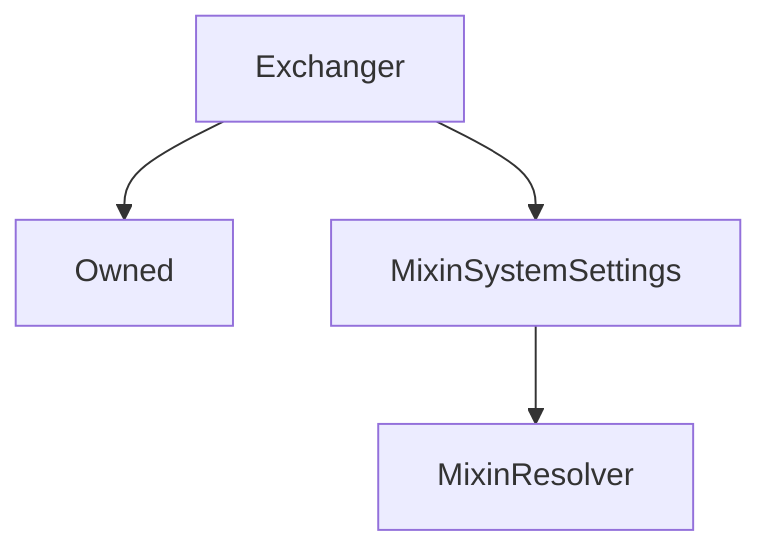

# Exchanger

## Description

Performs all the heavy lifting internally of `exchange` and `settle` functionality.

**Source:** [contracts/Exchanger.sol](https://github.com/Synthetixio/synthetix/tree/v2.35.1-alpha/contracts/Exchanger.sol)

## Architecture

### Libraries

- [SafeMath](/contracts/source/libraries/SafeMath) for `uint`
- [SafeDecimalMath](/contracts/source/libraries/SafeDecimalMath) for `uint`

### Inheritance Graph

### Related Contracts

<centered-image>
    
</centered-image>

## Structs

### `ExchangeEntrySettlement`

[Source](https://github.com/Synthetixio/synthetix/tree/v2.35.1-alpha/contracts/Exchanger.sol#L73)

| Field                    | Type      | Description |
| ------------------------ | --------- | ----------- |
| `src`                    | `bytes32` | TBA         |
| `amount`                 | `uint256` | TBA         |
| `dest`                   | `bytes32` | TBA         |
| `reclaim`                | `uint256` | TBA         |
| `rebate`                 | `uint256` | TBA         |
| `srcRoundIdAtPeriodEnd`  | `uint256` | TBA         |
| `destRoundIdAtPeriodEnd` | `uint256` | TBA         |
| `timestamp`              | `uint256` | TBA         |

## Constants

### `CIRCUIT_BREAKER_SUSPENSION_REASON`

[Source](https://github.com/Synthetixio/synthetix/tree/v2.35.1-alpha/contracts/Exchanger.sol#L87)

**Type:** `uint256`

## Variables

### `lastExchangeRate`

[Source](https://github.com/Synthetixio/synthetix/tree/v2.35.1-alpha/contracts/Exchanger.sol#L89)

**Type:** `mapping(bytes32 => uint256)`

## Constructor

### `constructor`

[Source](https://github.com/Synthetixio/synthetix/tree/v2.35.1-alpha/contracts/Exchanger.sol#L103)

??? example "Details"

    **Signature**

    `(address _owner, address _resolver)`

    **Visibility**

    `public`

    **State Mutability**

    `nonpayable`

## Views

### `calculateAmountAfterSettlement`

[Source](https://github.com/Synthetixio/synthetix/tree/v2.35.1-alpha/contracts/Exchanger.sol#L293)

??? example "Details"

    **Signature**

    `calculateAmountAfterSettlement(address from, bytes32 currencyKey, uint256 amount, uint256 refunded) returns (uint256)`

    **Visibility**

    `public`

    **State Mutability**

    `view`

### `feeRateForExchange`

[Source](https://github.com/Synthetixio/synthetix/tree/v2.35.1-alpha/contracts/Exchanger.sol#L801)

Determine the effective fee rate for the exchange, taking into considering swing trading.

??? example "Details"

    **Signature**

    `feeRateForExchange(bytes32 sourceCurrencyKey, bytes32 destinationCurrencyKey) returns (uint256)`

    **Visibility**

    `external`

    **State Mutability**

    `view`

### `getAmountsForExchange`

[Source](https://github.com/Synthetixio/synthetix/tree/v2.35.1-alpha/contracts/Exchanger.sol#L833)

??? example "Details"

    **Signature**

    `getAmountsForExchange(uint256 sourceAmount, bytes32 sourceCurrencyKey, bytes32 destinationCurrencyKey) returns (uint256, uint256, uint256)`

    **Visibility**

    `external`

    **State Mutability**

    `view`

### `hasWaitingPeriodOrSettlementOwing`

[Source](https://github.com/Synthetixio/synthetix/tree/v2.35.1-alpha/contracts/Exchanger.sol#L281)

??? example "Details"

    **Signature**

    `hasWaitingPeriodOrSettlementOwing(address account, bytes32 currencyKey) returns (bool)`

    **Visibility**

    `external`

    **State Mutability**

    `view`

### `isSynthRateInvalid`

[Source](https://github.com/Synthetixio/synthetix/tree/v2.35.1-alpha/contracts/Exchanger.sol#L315)

??? example "Details"

    **Signature**

    `isSynthRateInvalid(bytes32 currencyKey) returns (bool)`

    **Visibility**

    `external`

    **State Mutability**

    `view`

### `maxSecsLeftInWaitingPeriod`

[Source](https://github.com/Synthetixio/synthetix/tree/v2.35.1-alpha/contracts/Exchanger.sol#L158)

Returns the maximum number of seconds remaining in the waiting period for all exchanges into the given synth (`currencyKey`) by the account.

This number must be `0` in order for [`settle()`](#settle) to succeed.

??? example "Details"

    **Signature**

    `maxSecsLeftInWaitingPeriod(address account, bytes32 currencyKey) returns (uint256)`

    **Visibility**

    `public`

    **State Mutability**

    `view`

### `priceDeviationThresholdFactor`

[Source](https://github.com/Synthetixio/synthetix/tree/v2.35.1-alpha/contracts/Exchanger.sol#L170)

**Type:** `uint256`

??? example "Details"

    **Signature**

    `priceDeviationThresholdFactor() returns (uint256)`

    **Visibility**

    `external`

    **State Mutability**

    `view`

### `resolverAddressesRequired`

[Source](https://github.com/Synthetixio/synthetix/tree/v2.35.1-alpha/contracts/Exchanger.sol#L107)

??? example "Details"

    **Signature**

    `resolverAddressesRequired() returns (bytes32[])`

    **Visibility**

    `public`

    **State Mutability**

    `view`

### `settlementOwing`

[Source](https://github.com/Synthetixio/synthetix/tree/v2.35.1-alpha/contracts/Exchanger.sol#L174)

Returns the total amount to be reclaimed or rebated for the given account and synth (`currencyKey`). Note: this function can be called at any time, even while the waiting period has not expired.

??? example "Details"

    **Signature**

    `settlementOwing(address account, bytes32 currencyKey) returns (uint256, uint256, uint256)`

    **Visibility**

    `public`

    **State Mutability**

    `view`

### `tradingRewardsEnabled`

[Source](https://github.com/Synthetixio/synthetix/tree/v2.35.1-alpha/contracts/Exchanger.sol#L166)

??? example "Details"

    **Signature**

    `tradingRewardsEnabled() returns (bool)`

    **Visibility**

    `external`

    **State Mutability**

    `view`

### `waitingPeriodSecs`

[Source](https://github.com/Synthetixio/synthetix/tree/v2.35.1-alpha/contracts/Exchanger.sol#L162)

**Type:** `uint256`

??? example "Details"

    **Signature**

    `waitingPeriodSecs() returns (uint256)`

    **Visibility**

    `external`

    **State Mutability**

    `view`

## Restricted Functions

### `exchange`

[Source](https://github.com/Synthetixio/synthetix/tree/v2.35.1-alpha/contracts/Exchanger.sol#L320)

??? example "Details"

    **Signature**

    `exchange(address from, bytes32 sourceCurrencyKey, uint256 sourceAmount, bytes32 destinationCurrencyKey, address destinationAddress) returns (uint256)`

    **Visibility**

    `external`

    **State Mutability**

    `nonpayable`

    **Modifiers**

    * [onlySynthetixorSynth](#onlysynthetixorsynth)

### `exchangeOnBehalf`

[Source](https://github.com/Synthetixio/synthetix/tree/v2.35.1-alpha/contracts/Exchanger.sol#L340)

??? example "Details"

    **Signature**

    `exchangeOnBehalf(address exchangeForAddress, address from, bytes32 sourceCurrencyKey, uint256 sourceAmount, bytes32 destinationCurrencyKey) returns (uint256)`

    **Visibility**

    `external`

    **State Mutability**

    `nonpayable`

    **Requires**

    * [require(..., Not approved to act on behalf)](https://github.com/Synthetixio/synthetix/tree/v2.35.1-alpha/contracts/Exchanger.sol#L347)

    **Modifiers**

    * [onlySynthetixorSynth](#onlysynthetixorsynth)

### `exchangeOnBehalfWithTracking`

[Source](https://github.com/Synthetixio/synthetix/tree/v2.35.1-alpha/contracts/Exchanger.sol#L386)

??? example "Details"

    **Signature**

    `exchangeOnBehalfWithTracking(address exchangeForAddress, address from, bytes32 sourceCurrencyKey, uint256 sourceAmount, bytes32 destinationCurrencyKey, address originator, bytes32 trackingCode) returns (uint256)`

    **Visibility**

    `external`

    **State Mutability**

    `nonpayable`

    **Requires**

    * [require(..., Not approved to act on behalf)](https://github.com/Synthetixio/synthetix/tree/v2.35.1-alpha/contracts/Exchanger.sol#L395)

    **Modifiers**

    * [onlySynthetixorSynth](#onlysynthetixorsynth)

### `exchangeWithTracking`

[Source](https://github.com/Synthetixio/synthetix/tree/v2.35.1-alpha/contracts/Exchanger.sol#L362)

??? example "Details"

    **Signature**

    `exchangeWithTracking(address from, bytes32 sourceCurrencyKey, uint256 sourceAmount, bytes32 destinationCurrencyKey, address destinationAddress, address originator, bytes32 trackingCode) returns (uint256)`

    **Visibility**

    `external`

    **State Mutability**

    `nonpayable`

    **Modifiers**

    * [onlySynthetixorSynth](#onlysynthetixorsynth)

### `exchangeWithVirtual`

[Source](https://github.com/Synthetixio/synthetix/tree/v2.35.1-alpha/contracts/Exchanger.sol#L412)

??? example "Details"

    **Signature**

    `exchangeWithVirtual(address from, bytes32 sourceCurrencyKey, uint256 sourceAmount, bytes32 destinationCurrencyKey, address destinationAddress, bytes32 trackingCode) returns (uint256, contract IVirtualSynth)`

    **Visibility**

    `external`

    **State Mutability**

    `nonpayable`

    **Modifiers**

    * [onlySynthetixorSynth](#onlysynthetixorsynth)

### `setLastExchangeRateForSynth`

[Source](https://github.com/Synthetixio/synthetix/tree/v2.35.1-alpha/contracts/Exchanger.sol#L655)

??? example "Details"

    **Signature**

    `setLastExchangeRateForSynth(bytes32 currencyKey, uint256 rate)`

    **Visibility**

    `external`

    **State Mutability**

    `nonpayable`

    **Requires**

    * [require(..., Rate must be above 0)](https://github.com/Synthetixio/synthetix/tree/v2.35.1-alpha/contracts/Exchanger.sol#L656)

    **Modifiers**

    * [onlyExchangeRates](#onlyexchangerates)

## Internal Functions

### `_convert`

[Source](https://github.com/Synthetixio/synthetix/tree/v2.35.1-alpha/contracts/Exchanger.sol#L601)

??? example "Details"

    **Signature**

    `_convert(bytes32 sourceCurrencyKey, address from, uint256 sourceAmountAfterSettlement, bytes32 destinationCurrencyKey, uint256 amountReceived, address recipient, bool virtualSynth) returns (contract IVirtualSynth)`

    **Visibility**

    `internal`

    **State Mutability**

    `nonpayable`

### `_createVirtualSynth`

[Source](https://github.com/Synthetixio/synthetix/tree/v2.35.1-alpha/contracts/Exchanger.sol#L625)

??? example "Details"

    **Signature**

    `_createVirtualSynth(contract IERC20 , address , uint256 , bytes32 ) returns (contract IVirtualSynth)`

    **Visibility**

    `internal`

    **State Mutability**

    `nonpayable`

### `_emitTrackingEvent`

[Source](https://github.com/Synthetixio/synthetix/tree/v2.35.1-alpha/contracts/Exchanger.sol#L437)

??? example "Details"

    **Signature**

    `_emitTrackingEvent(bytes32 trackingCode, bytes32 toCurrencyKey, uint256 toAmount)`

    **Visibility**

    `internal`

    **State Mutability**

    `nonpayable`

### `_ensureCanExchange`

[Source](https://github.com/Synthetixio/synthetix/tree/v2.35.1-alpha/contracts/Exchanger.sol#L662)

??? example "Details"

    **Signature**

    `_ensureCanExchange(bytes32 sourceCurrencyKey, uint256 sourceAmount, bytes32 destinationCurrencyKey)`

    **Visibility**

    `internal`

    **State Mutability**

    `view`

    **Requires**

    * [require(..., Can't be same synth)](https://github.com/Synthetixio/synthetix/tree/v2.35.1-alpha/contracts/Exchanger.sol#L667)

    * [require(..., Zero amount)](https://github.com/Synthetixio/synthetix/tree/v2.35.1-alpha/contracts/Exchanger.sol#L668)

    * [require(..., Src/dest rate invalid or not found)](https://github.com/Synthetixio/synthetix/tree/v2.35.1-alpha/contracts/Exchanger.sol#L673)

### `_exchange`

[Source](https://github.com/Synthetixio/synthetix/tree/v2.35.1-alpha/contracts/Exchanger.sol#L498)

??? example "Details"

    **Signature**

    `_exchange(address from, bytes32 sourceCurrencyKey, uint256 sourceAmount, bytes32 destinationCurrencyKey, address destinationAddress, bool virtualSynth) returns (uint256, uint256, contract IVirtualSynth)`

    **Visibility**

    `internal`

    **State Mutability**

    `nonpayable`

### `_feeRateForExchange`

[Source](https://github.com/Synthetixio/synthetix/tree/v2.35.1-alpha/contracts/Exchanger.sol#L809)

??? example "Details"

    **Signature**

    `_feeRateForExchange(bytes32 sourceCurrencyKey, bytes32 destinationCurrencyKey) returns (uint256)`

    **Visibility**

    `internal`

    **State Mutability**

    `view`

### `_getAmountReceivedForExchange`

[Source](https://github.com/Synthetixio/synthetix/tree/v2.35.1-alpha/contracts/Exchanger.sol#L879)

??? example "Details"

    **Signature**

    `_getAmountReceivedForExchange(uint256 destinationAmount, uint256 exchangeFeeRate) returns (uint256)`

    **Visibility**

    `internal`

    **State Mutability**

    `pure`

### `_getAmountsForExchangeMinusFees`

[Source](https://github.com/Synthetixio/synthetix/tree/v2.35.1-alpha/contracts/Exchanger.sol#L853)

??? example "Details"

    **Signature**

    `_getAmountsForExchangeMinusFees(uint256 sourceAmount, bytes32 sourceCurrencyKey, bytes32 destinationCurrencyKey) returns (uint256, uint256, uint256, uint256, uint256)`

    **Visibility**

    `internal`

    **State Mutability**

    `view`

### `_getExchangeEntry`

[Source](https://github.com/Synthetixio/synthetix/tree/v2.35.1-alpha/contracts/Exchanger.sol#L252)

??? example "Details"

    **Signature**

    `_getExchangeEntry(address account, bytes32 currencyKey, uint256 index) returns (struct IExchangeState.ExchangeEntry)`

    **Visibility**

    `internal`

    **State Mutability**

    `view`

### `_internalSettle`

[Source](https://github.com/Synthetixio/synthetix/tree/v2.35.1-alpha/contracts/Exchanger.sol#L716)

??? example "Details"

    **Signature**

    `_internalSettle(address from, bytes32 currencyKey, bool updateCache) returns (uint256, uint256, uint256)`

    **Visibility**

    `internal`

    **State Mutability**

    `nonpayable`

    **Requires**

    * [require(..., Cannot settle during waiting period)](https://github.com/Synthetixio/synthetix/tree/v2.35.1-alpha/contracts/Exchanger.sol#L728)

### `_isDeviationAboveThreshold`

[Source](https://github.com/Synthetixio/synthetix/tree/v2.35.1-alpha/contracts/Exchanger.sol#L701)

??? example "Details"

    **Signature**

    `_isDeviationAboveThreshold(uint256 base, uint256 comparison) returns (bool)`

    **Visibility**

    `internal`

    **State Mutability**

    `view`

### `_isSynthRateInvalid`

[Source](https://github.com/Synthetixio/synthetix/tree/v2.35.1-alpha/contracts/Exchanger.sol#L676)

??? example "Details"

    **Signature**

    `_isSynthRateInvalid(bytes32 currencyKey, uint256 currentRate) returns (bool)`

    **Visibility**

    `internal`

    **State Mutability**

    `view`

### `_processTradingRewards`

[Source](https://github.com/Synthetixio/synthetix/tree/v2.35.1-alpha/contracts/Exchanger.sol#L445)

??? example "Details"

    **Signature**

    `_processTradingRewards(uint256 fee, address originator)`

    **Visibility**

    `internal`

    **State Mutability**

    `nonpayable`

### `_settleAndCalcSourceAmountRemaining`

[Source](https://github.com/Synthetixio/synthetix/tree/v2.35.1-alpha/contracts/Exchanger.sol#L482)

??? example "Details"

    **Signature**

    `_settleAndCalcSourceAmountRemaining(uint256 sourceAmount, address from, bytes32 sourceCurrencyKey) returns (uint256)`

    **Visibility**

    `internal`

    **State Mutability**

    `nonpayable`

### `_settlementOwing`

[Source](https://github.com/Synthetixio/synthetix/tree/v2.35.1-alpha/contracts/Exchanger.sol#L187)

??? example "Details"

    **Signature**

    `_settlementOwing(address account, bytes32 currencyKey) returns (uint256, uint256, uint256, struct Exchanger.ExchangeEntrySettlement[])`

    **Visibility**

    `internal`

    **State Mutability**

    `view`

### `_suspendIfRateInvalid`

[Source](https://github.com/Synthetixio/synthetix/tree/v2.35.1-alpha/contracts/Exchanger.sol#L451)

??? example "Details"

    **Signature**

    `_suspendIfRateInvalid(bytes32 currencyKey, uint256 rate) returns (bool)`

    **Visibility**

    `internal`

    **State Mutability**

    `nonpayable`

### `_updateSNXIssuedDebtOnExchange`

[Source](https://github.com/Synthetixio/synthetix/tree/v2.35.1-alpha/contracts/Exchanger.sol#L460)

??? example "Details"

    **Signature**

    `_updateSNXIssuedDebtOnExchange(bytes32[2] currencyKeys, uint256[2] currencyRates)`

    **Visibility**

    `internal`

    **State Mutability**

    `nonpayable`

### `appendExchange`

[Source](https://github.com/Synthetixio/synthetix/tree/v2.35.1-alpha/contracts/Exchanger.sol#L887)

??? example "Details"

    **Signature**

    `appendExchange(address account, bytes32 src, uint256 amount, bytes32 dest, uint256 amountReceived, uint256 exchangeFeeRate)`

    **Visibility**

    `internal`

    **State Mutability**

    `nonpayable`

    **Emits**

    * [ExchangeEntryAppended](#exchangeentryappended)

### `debtCache`

[Source](https://github.com/Synthetixio/synthetix/tree/v2.35.1-alpha/contracts/Exchanger.sol#L154)

??? example "Details"

    **Signature**

    `debtCache() returns (contract IExchangerInternalDebtCache)`

    **Visibility**

    `internal`

    **State Mutability**

    `view`

### `delegateApprovals`

[Source](https://github.com/Synthetixio/synthetix/tree/v2.35.1-alpha/contracts/Exchanger.sol#L146)

??? example "Details"

    **Signature**

    `delegateApprovals() returns (contract IDelegateApprovals)`

    **Visibility**

    `internal`

    **State Mutability**

    `view`

### `exchangeRates`

[Source](https://github.com/Synthetixio/synthetix/tree/v2.35.1-alpha/contracts/Exchanger.sol#L130)

??? example "Details"

    **Signature**

    `exchangeRates() returns (contract IExchangeRates)`

    **Visibility**

    `internal`

    **State Mutability**

    `view`

### `exchangeState`

[Source](https://github.com/Synthetixio/synthetix/tree/v2.35.1-alpha/contracts/Exchanger.sol#L126)

??? example "Details"

    **Signature**

    `exchangeState() returns (contract IExchangeState)`

    **Visibility**

    `internal`

    **State Mutability**

    `view`

### `feePool`

[Source](https://github.com/Synthetixio/synthetix/tree/v2.35.1-alpha/contracts/Exchanger.sol#L138)

??? example "Details"

    **Signature**

    `feePool() returns (contract IFeePool)`

    **Visibility**

    `internal`

    **State Mutability**

    `view`

### `getRoundIdsAtPeriodEnd`

[Source](https://github.com/Synthetixio/synthetix/tree/v2.35.1-alpha/contracts/Exchanger.sol#L922)

??? example "Details"

    **Signature**

    `getRoundIdsAtPeriodEnd(struct IExchangeState.ExchangeEntry exchangeEntry) returns (uint256, uint256)`

    **Visibility**

    `internal`

    **State Mutability**

    `view`

### `issuer`

[Source](https://github.com/Synthetixio/synthetix/tree/v2.35.1-alpha/contracts/Exchanger.sol#L150)

??? example "Details"

    **Signature**

    `issuer() returns (contract IIssuer)`

    **Visibility**

    `internal`

    **State Mutability**

    `view`

### `reclaim`

[Source](https://github.com/Synthetixio/synthetix/tree/v2.35.1-alpha/contracts/Exchanger.sol#L772)

??? example "Details"

    **Signature**

    `reclaim(address from, bytes32 currencyKey, uint256 amount)`

    **Visibility**

    `internal`

    **State Mutability**

    `nonpayable`

### `refund`

[Source](https://github.com/Synthetixio/synthetix/tree/v2.35.1-alpha/contracts/Exchanger.sol#L782)

??? example "Details"

    **Signature**

    `refund(address from, bytes32 currencyKey, uint256 amount)`

    **Visibility**

    `internal`

    **State Mutability**

    `nonpayable`

### `secsLeftInWaitingPeriodForExchange`

[Source](https://github.com/Synthetixio/synthetix/tree/v2.35.1-alpha/contracts/Exchanger.sol#L792)

??? example "Details"

    **Signature**

    `secsLeftInWaitingPeriodForExchange(uint256 timestamp) returns (uint256)`

    **Visibility**

    `internal`

    **State Mutability**

    `view`

### `synthetix`

[Source](https://github.com/Synthetixio/synthetix/tree/v2.35.1-alpha/contracts/Exchanger.sol#L134)

??? example "Details"

    **Signature**

    `synthetix() returns (contract ISynthetix)`

    **Visibility**

    `internal`

    **State Mutability**

    `view`

### `systemStatus`

[Source](https://github.com/Synthetixio/synthetix/tree/v2.35.1-alpha/contracts/Exchanger.sol#L122)

??? example "Details"

    **Signature**

    `systemStatus() returns (contract ISystemStatus)`

    **Visibility**

    `internal`

    **State Mutability**

    `view`

### `tradingRewards`

[Source](https://github.com/Synthetixio/synthetix/tree/v2.35.1-alpha/contracts/Exchanger.sol#L142)

??? example "Details"

    **Signature**

    `tradingRewards() returns (contract ITradingRewards)`

    **Visibility**

    `internal`

    **State Mutability**

    `view`

## External Functions

### `settle`

[Source](https://github.com/Synthetixio/synthetix/tree/v2.35.1-alpha/contracts/Exchanger.sol#L635)

Settle processes all exchanges into the given synth, calculating any `reclaimed` or `refunded` amounts via [`settlementOwing`](#settlementowing) and burning any reclaim and issuing any refund. This function may be called by anyone - the `msg.sender` is irrelevant.

??? example "Details"

    **Signature**

    `settle(address from, bytes32 currencyKey) returns (uint256, uint256, uint256)`

    **Visibility**

    `external`

    **State Mutability**

    `nonpayable`

### `suspendSynthWithInvalidRate`

[Source](https://github.com/Synthetixio/synthetix/tree/v2.35.1-alpha/contracts/Exchanger.sol#L647)

??? example "Details"

    **Signature**

    `suspendSynthWithInvalidRate(bytes32 currencyKey)`

    **Visibility**

    `external`

    **State Mutability**

    `nonpayable`

    **Requires**

    * [require(..., No such synth)](https://github.com/Synthetixio/synthetix/tree/v2.35.1-alpha/contracts/Exchanger.sol#L649)

    * [require(..., Synth price is valid)](https://github.com/Synthetixio/synthetix/tree/v2.35.1-alpha/contracts/Exchanger.sol#L650)

## Modifiers

### `onlyExchangeRates`

[Source](https://github.com/Synthetixio/synthetix/tree/v2.35.1-alpha/contracts/Exchanger.sol#L955)

### `onlySynthetixorSynth`

[Source](https://github.com/Synthetixio/synthetix/tree/v2.35.1-alpha/contracts/Exchanger.sol#L946)

## Events

### `ExchangeEntryAppended`

[Source](https://github.com/Synthetixio/synthetix/tree/v2.35.1-alpha/contracts/Exchanger.sol#L962)

**Signature**: `ExchangeEntryAppended(address account, bytes32 src, uint256 amount, bytes32 dest, uint256 amountReceived, uint256 exchangeFeeRate, uint256 roundIdForSrc, uint256 roundIdForDest)`

### `ExchangeEntrySettled`

[Source](https://github.com/Synthetixio/synthetix/tree/v2.35.1-alpha/contracts/Exchanger.sol#L973)

**Signature**: `ExchangeEntrySettled(address from, bytes32 src, uint256 amount, bytes32 dest, uint256 reclaim, uint256 rebate, uint256 srcRoundIdAtPeriodEnd, uint256 destRoundIdAtPeriodEnd, uint256 exchangeTimestamp)`
