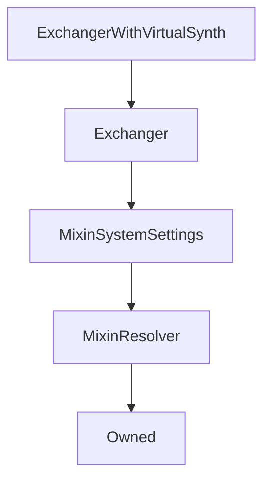

# ExchangerWithVirtualSynth

## Description

**Source:** [contracts/ExchangerWithVirtualSynth.sol](https://github.com/Synthetixio/synthetix/tree/v2.31.1/contracts/ExchangerWithVirtualSynth.sol)

## Architecture

### Inheritance Graph

## Constructor

### `constructor`

[Source](https://github.com/Synthetixio/synthetix/tree/v2.31.1/contracts/ExchangerWithVirtualSynth.sol#L13)

??? example "Details"

    **Signature**

    `(address _owner, address _resolver)`

    **Visibility**

    `public`

    **State Mutability**

    `nonpayable`

## Internal Functions

### `_createVirtualSynth`

[Source](https://github.com/Synthetixio/synthetix/tree/v2.31.1/contracts/ExchangerWithVirtualSynth.sol#L15)

??? example "Details"

    **Signature**

    `_createVirtualSynth(contract ISynth synth, address recipient, uint256 amount) returns (contract IVirtualSynth)`

    **Visibility**

    `internal`

    **State Mutability**

    `nonpayable`

    **Emits**

    * [VirtualSynthCreated](#virtualsynthcreated)

## Events

### `VirtualSynthCreated`

[Source](https://github.com/Synthetixio/synthetix/tree/v2.31.1/contracts/ExchangerWithVirtualSynth.sol#L24)

**Signature**: `VirtualSynthCreated(address vSynth, address synth, bytes32 currencyKey, uint256 amount)`
