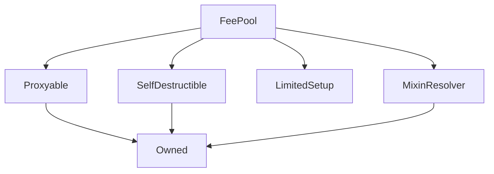

# FeePool

## Description

FeePools primary purpose is the distribution of synthetix.exchange fees in sUSD and SNX staking rewards to SNX minters aka stakers via the `claimFees()` function.

[closeCurrentFeePeriod](#closecurrentfeeperiod) is an external public function anyone can call to close the current feeperiod after the `feePeriodDuration has passed. There is no incentive behind this function call as it is incentive enough that SNX Stakers want to be able to claim their fees and rewards. There is also a [Fee Period Closing service](https://etherscan.io/address/0xfee056f4d9d63a63d6cf16707d49ffae7ff3ff01) that synthetix contributors opperate that will automatically call [closeCurrentFeePeriod](#closecurrentfeeperiod) when the fee period duration has passed.

The FeePool currently maintains 2 [feeperiod](##feeperiod) structs where the current open period for accumulating fees and rewards is `recentFeePeriods[0]` and the previos period which has been cloased and now available for SNX Stakers to claim their fees and rewards being `recentFeePeriods[1]`

Since [SIP 56: Differential Fees](https://sips.synthetix.io/sips/sip-56) it now supports the API for storing and reading the Synth Exchange Fee Rates per synth which are defined via SCCP's. The current eschange fee rates implemented in [sccp-24](https://sips.synthetix.io/sccp/sccp-24)

**Source:** [contracts/FeePool.sol](https://github.com/Synthetixio/synthetix/tree/v2.25.0-beta/contracts/FeePool.sol)

## Architecture

### Libraries

- [SafeMath](/contracts/source/libraries/SafeMath) for `uint`
- [SafeDecimalMath](/contracts/source/libraries/SafeDecimalMath) for `uint`

### Inheritance Graph

### Related Contracts

<centered-image>
    
</centered-image>

??? example "Details"

    - [`Proxy`](Proxy.md): The fee pool, being [`Proxyable`](Proxyable.md), sits behind a `CALL`-style proxy for upgradeability.
    - [`Synthetix`](Synthetix.md): The fee pool needs the Synthetix address for a onlySynthetix modifer for storing a minters issue and burn events to track their debt % of the system.
    - [`SynthetixState`](SynthetixState.md): The fee pool retrieves the global issuance ratio, and queries the debt ledger directly from the Synthetix state contract.
    - [`Synth`](Synth.md): The fee pool, retrieving their addresses from the Synthetix contract, directly burns and issues sUSD when transferring fees. Fees are denominated and paid out in sUSD. Synths themselves do not know the fee pool address directly, but ask the fee pool's proxy for its target.
    - [`FeePoolState`](FeePoolState.md): The fee pool state contract holds the details of each user's most recent issuance events: when they issued and burnt synths, and their value.
    - [`FeePoolEternalStorage`](FeePoolEternalStorage): A storage contact that holds the last fee withdrawal time for each account.
    - [`DelegateApprovals`](DelegateApprovals): A storage contract containing addresses to which the right to withdraw fees has been delegated by another account, for example to allow hot wallets to withdraw fees.
    - [`RewardEscrow`](RewardEscrow.md): The contract into which inflationary SNX rewards are paid by the fee pool so that they can be escrowed for a year after being claimed.
    - [`RewardsDistribution`](RewardsDistribution.md): This contract, in the guise of the [`rewardsAuthority`](#rewardsauthority), distributes allocations from the inflationary supply to various recipients.
    - [`Depot`](Depot.md): Allows users to exchange between Synths, SNX, and Ether. The Depot uses the fee pool to know what transfer fees were being incurred on its transfers, although the transfer fee has been nil since before [SIP-19](https://sips.synthetix.io/sips/sip-19).

## Structs

### `FeePeriod`

[Source](https://github.com/Synthetixio/synthetix/tree/v2.25.0-beta/contracts/FeePool.sol#L44)

A record for a fee period, when it was opened, and the fees and rewards accrued within it. This information is maintained for the last several fee periods in [`recentFeePeriods`](#recentfeeperiods).

| Field                 | Type      | Description                                                                                                                                                                                                                                                                                                                       |
| --------------------- | --------- | --------------------------------------------------------------------------------------------------------------------------------------------------------------------------------------------------------------------------------------------------------------------------------------------------------------------------------- |
| `feePeriodId`         | `uint64`  | A serial id for fee periods which is incremented for each new fee period.                                                                                                                                                                                                                                                         |
| `startingDebtIndex`   | `uint64`  | The length of [`SynthetixState.debtLedger`](SynthetixState.md#debtledger) at the time this fee period began.                                                                                                                                                                                                                      |
| `startTime`           | `uint64`  | The current timestamp when this fee period began.                                                                                                                                                                                                                                                                                 |
| `feesToDistribute`    | `uint256` | The total of fees to be distributed in this period, in sUSD. This increases when fees are collected in the current period or when unclaimed fees roll over from the oldest period to the second oldest. See [`feePaid`](#feepaid) and [`closeCurrentPeriod`](#closecurrentperiod).                                                |
| `feesClaimed`         | `uint256` | The number of fees that have already been claimed during this period.                                                                                                                                                                                                                                                             |
| `rewardsToDistribute` | `uint256` | The total of inflationary rewards to be distributed in this period, in SNX. This increases when new rewards are minted by [`Synthetix.mint`](Synthetix.md#mint)/[`rewardsMinted`](#rewardsminted), or when unclaimed rewards roll over from the oldest period to the second oldest ([`closeCurrentPeriod`](#closecurrentperiod)). |
| `rewardsClaimed`      | `uint256` | The quantity of inflationary rewards that have already been claimed during this period.                                                                                                                                                                                                                                           |

## Constants

### `FEE_ADDRESS`

[Source](https://github.com/Synthetixio/synthetix/tree/v2.25.0-beta/contracts/FeePool.sol#L38)

The address where fees are pooled as sUSD.

**Value:** [`0xfeEFEEfeefEeFeefEEFEEfEeFeefEEFeeFEEFEeF`](https://etherscan.io/address/0xfeEFEEfeefEeFeefEEFEEfEeFeefEEFeeFEEFEeF)

**Type:** `address`

### `FEE_PERIOD_LENGTH`

[Source](https://github.com/Synthetixio/synthetix/tree/v2.25.0-beta/contracts/FeePool.sol#L59)

This is the number of weekly fee periods that are tracked by the smart contracts, hence the length of the [`recentFeePeriods`](#recentfeeperiods) array.

This was reduced from 6 to 3 as part of [SIP-4](https://sips.synthetix.io/sips/sip-4) and now 2 periods 0 and 1, but note the inconsistency with the corresponding constant in [`FeePoolState`](FeePoolState.md#fee_period_length), which cannot be altered.

**Value:** `2`

**Type:** `uint8`

### `MAX_EXCHANGE_FEE_RATE`

[Source](https://github.com/Synthetixio/synthetix/tree/v2.25.0-beta/contracts/FeePool.sol#L35)

[`exchangeFeeRate`](#exchangefeerate) cannot exceed this. Initialised to 10%.

**Value:** 0.1

**Type:** `uint256`

### `MAX_FEE_PERIOD_DURATION`

[Source](https://github.com/Synthetixio/synthetix/tree/v2.25.0-beta/contracts/FeePool.sol#L71)

The maximum value of [`feePeriodDuration`](#feeperiodduration).

**Value:** `60 days`

**Type:** `uint256`

### `MIN_FEE_PERIOD_DURATION`

[Source](https://github.com/Synthetixio/synthetix/tree/v2.25.0-beta/contracts/FeePool.sol#L70)

The minimum value of [`feePeriodDuration`](#feeperiodduration).

**Value:** `1 days`

**Type:** `uint256`

## Variables

### `feePeriodDuration`

[Source](https://github.com/Synthetixio/synthetix/tree/v2.25.0-beta/contracts/FeePool.sol#L68)

This is the minimum duration of a single fee period in seconds. In practice they may be slightly longer if [`closeCurrentFeePeriod`](#closecurrentfeeperiod) is not called immediately at the earliest valid moment.

Its value is one week, but it may be between [`MIN_FEE_PERIOD_DURATION`](#min_fee_period_duration) and [`MAX_FEE_PERIOD_DURATION`](#max_fee_period_duration) (1 to 60 days).

**Type:** `uint256`

### `targetThreshold`

[Source](https://github.com/Synthetixio/synthetix/tree/v2.25.0-beta/contracts/FeePool.sol#L74)

**Type:** `uint256`

## Constructor

### `constructor`

[Source](https://github.com/Synthetixio/synthetix/tree/v2.25.0-beta/contracts/FeePool.sol#L107)

??? example "Details"

    **Signature**

    `(address payable _proxy, address _owner, address _resolver)`

    **Visibility**

    `public`

    **State Mutability**

    `nonpayable`

## Views

### `effectiveDebtRatioForPeriod`

[Source](https://github.com/Synthetixio/synthetix/tree/v2.25.0-beta/contracts/FeePool.sol#L719)

Given an account and an index into [`recentFeePeriods`](#recentfeeperiods), this function computes the percentage of total debt ownership of the account at the end of that period.

This uses [`_effectiveDebtRatioForPeriod`](#_effectiveDebtRatioForPeriod), where the start index and ownership percentage are computed with [`FeePoolState.applicableIssuanceData`](FeePoolState.md#applicableissuancedata), and the end index is one before the beginnging of the next period. Hence this function disallows querying the debt for the current period.

In principle a future version could support the current fee period by using the last debt ledger entry as the end index.

??? example "Details"

    **Signature**

    `effectiveDebtRatioForPeriod(address account, uint256 period) returns (uint256)`

    **Visibility**

    `external`

    **State Mutability**

    `view`

    **Requires**

    * [require(..., Current period is not closed yet)](https://github.com/Synthetixio/synthetix/tree/v2.25.0-beta/contracts/FeePool.sol#L720)

    * [require(..., Exceeds the FEE_PERIOD_LENGTH)](https://github.com/Synthetixio/synthetix/tree/v2.25.0-beta/contracts/FeePool.sol#L721)

### `feesAvailable`

[Source](https://github.com/Synthetixio/synthetix/tree/v2.25.0-beta/contracts/FeePool.sol#L565)

Return the total of fees and rewards available to be withdrawn by this account. The result is reported as a `[fees, rewards]` pair denominated in the requested Synth flavour and SNX, respectively.

This is the total of fees accrued in completed periods, so is simply the the sum over an account's [`feesByPeriod`](#feesbyperiod) not including the current period.

??? example "Details"

    **Signature**

    `feesAvailable(address account) returns (uint256, uint256)`

    **Visibility**

    `public`

    **State Mutability**

    `view`

### `feesByPeriod`

[Source](https://github.com/Synthetixio/synthetix/tree/v2.25.0-beta/contracts/FeePool.sol#L614)

Returns an array of [`FEE_PERIOD_LENGTH`](#fee_period_length) `[fees, rewards]` pairs owed to an account for each [recent fee period](#recentfeeperiods) (including the current one). Fees are denominated in sUSD and rewards in SNX.

To compute this, for each period from oldest to newest, find the [latest issuance event this account performed before the close of this period](FeePoolState.md#applicableissuancedata), and use it to derive the owed [fees and rewards](#_feesandrewardsfromperiod) for that period.

Note that a single issuance event can result in fees accruing for several fee periods, if the issuer does not claim their fees in one or more periods.

Periods where the user has already withdrawn since that period closed are skipped, producing `[0,0]` entries.

??? example "Details"

    **Signature**

    `feesByPeriod(address account) returns (uint256[2][2])`

    **Visibility**

    `public`

    **State Mutability**

    `view`

### `getExchangeFeeRateForSynth`

[Source](https://github.com/Synthetixio/synthetix/tree/v2.25.0-beta/contracts/FeePool.sol#L403)

??? example "Details"

    **Signature**

    `getExchangeFeeRateForSynth(bytes32 synthKey) returns (uint256)`

    **Visibility**

    `external`

    **State Mutability**

    `view`

### `getLastFeeWithdrawal`

[Source](https://github.com/Synthetixio/synthetix/tree/v2.25.0-beta/contracts/FeePool.sol#L741)

Returns from [`FeePoolEternalStorage`](FeePoolEternalStorage.md) the id of the fee period during which the given address last withdrew fees.

??? example "Details"

    **Signature**

    `getLastFeeWithdrawal(address _claimingAddress) returns (uint256)`

    **Visibility**

    `public`

    **State Mutability**

    `view`

### `getPenaltyThresholdRatio`

[Source](https://github.com/Synthetixio/synthetix/tree/v2.25.0-beta/contracts/FeePool.sol#L748)

Returns the collateralisation level a user can reach before they cannot claim fees. This is simply [`SynthetixState.issuanceRatio *`](SynthetixState.md#issuanceratio) [`(1 + TARGET_THRESHOLD)`](#target_threshold). The result is returned as a [18-decimal fixed point number](../libraries/SafeDecimalMath.md).

??? example "Details"

    **Signature**

    `getPenaltyThresholdRatio() returns (uint256)`

    **Visibility**

    `public`

    **State Mutability**

    `view`

### `isFeesClaimable`

[Source](https://github.com/Synthetixio/synthetix/tree/v2.25.0-beta/contracts/FeePool.sol#L606)

??? example "Details"

    **Signature**

    `isFeesClaimable(address account) returns (bool)`

    **Visibility**

    `external`

    **State Mutability**

    `view`

### `recentFeePeriods`

[Source](https://github.com/Synthetixio/synthetix/tree/v2.25.0-beta/contracts/FeePool.sol#L170)

Stores [fee period information](#feeperiod) for the last three weeks, from newest to olders.

`recentFeePeriods[0]` is always the current fee period, which is modified by ongoing issuance and fee activity. Fees cannot be claimed from the current period, only from the closed period at index `1` which is all the fees and rewards accrued in the previous fee period (week).

**Type:** `FeePeriod[FEE_PERIOD_LENGTH] public`

??? example "Details"

    **Signature**

    `recentFeePeriods(uint256 index) returns (uint64, uint64, uint64, uint256, uint256, uint256, uint256)`

    **Visibility**

    `external`

    **State Mutability**

    `view`

### `totalFeesAvailable`

[Source](https://github.com/Synthetixio/synthetix/tree/v2.25.0-beta/contracts/FeePool.sol#L534)

Computes the total fees available to be withdrawn, valued in terms of `currencyKey`. This simply sums the unclaimed fees over [`recentFeePeriods`](#recentfeeperiods) except those from the current period, because they cannot yet be claimed.

??? example "Details"

    **Signature**

    `totalFeesAvailable() returns (uint256)`

    **Visibility**

    `external`

    **State Mutability**

    `view`

### `totalRewardsAvailable`

[Source](https://github.com/Synthetixio/synthetix/tree/v2.25.0-beta/contracts/FeePool.sol#L549)

Computes the total SNX rewards available to be withdrawn. This simply sums the unclaimed rewards over [`recentFeePeriods`](#recentfeeperiods) except those from the current period, because they cannot yet be claimed.

??? example "Details"

    **Signature**

    `totalRewardsAvailable() returns (uint256)`

    **Visibility**

    `external`

    **State Mutability**

    `view`

## Restricted Functions

### `appendAccountIssuanceRecord`

[Source](https://github.com/Synthetixio/synthetix/tree/v2.25.0-beta/contracts/FeePool.sol#L209)

Records that an account issued or burnt synths in the fee pool state.

This function merely emits an event and passes through to [`FeePoolState.appendAccountIssuanceRecord`](FeePoolState.md#appendAccountIssuanceRecord) and is itself only invoked by [`Synthetix._appendAccountIssuanceRecord`](Synthetix.md#_appendaccountissuancerecord).

The `debtRatio` argument is a [27-decimal fixed point number](../libraries/SafeDecimalMath.md).

??? example "Details"

    **Signature**

    `appendAccountIssuanceRecord(address account, uint256 debtRatio, uint256 debtEntryIndex)`

    **Visibility**

    `external`

    **State Mutability**

    `nonpayable`

    **Modifiers**

    * [onlyIssuer](#onlyissuer)

### `appendVestingEntry`

[Source](https://github.com/Synthetixio/synthetix/tree/v2.25.0-beta/contracts/FeePool.sol#L414)

Allows the contract owner to escrow SNX rewards for particular accounts. The rewards are escrowed for one year.

The SNX is deposited into the [`RewardEscrow`](RewardEscrow.md) contract from the sender using the ERC20 transferFrom function. The tokens are then escrowed on behalf of the targeted account with [`RewardEscrow.appendVestingEntry`](RewardEscrow.md#appendvestingentry).

??? example "Details"

    **Signature**

    `appendVestingEntry(address account, uint256 quantity)`

    **Visibility**

    `public`

    **State Mutability**

    `nonpayable`

    **Modifiers**

    * [optionalProxy_onlyOwner](#optionalproxy_onlyowner)

### `importFeePeriod`

[Source](https://github.com/Synthetixio/synthetix/tree/v2.25.0-beta/contracts/FeePool.sol#L367)

During the setup period, allowed the contract owner to set a particular fee period entry in [`recentFeePeriods`](#recentfeeperiods) in order to migrate from a previous contract version.

??? example "Details"

    **Signature**

    `importFeePeriod(uint256 feePeriodIndex, uint256 feePeriodId, uint256 startingDebtIndex, uint256 startTime, uint256 feesToDistribute, uint256 feesClaimed, uint256 rewardsToDistribute, uint256 rewardsClaimed)`

    **Visibility**

    `public`

    **State Mutability**

    `nonpayable`

    **Requires**

    * [require(..., Cannot import bad data)](https://github.com/Synthetixio/synthetix/tree/v2.25.0-beta/contracts/FeePool.sol#L377)

    **Modifiers**

    * [optionalProxy_onlyOwner](#optionalproxy_onlyowner)

    * [onlyDuringSetup](#onlyduringsetup)

### `recordFeePaid`

[Source](https://github.com/Synthetixio/synthetix/tree/v2.25.0-beta/contracts/FeePool.sol#L245)

Allows the [`Synthetix._internalExchange`](Synthetix.md#_internalexchange) function to record that a fee was paid whenever an exchange between Synth flavours occurs.

Adds the value in sUSD to the current fee period's pool of fees to be distributed.

??? example "Details"

    **Signature**

    `recordFeePaid(uint256 amount)`

    **Visibility**

    `external`

    **State Mutability**

    `nonpayable`

    **Modifiers**

    * [onlyExchangerOrSynth](#onlyexchangerorsynth)

### `setExchangeFeeRateForSynths`

[Source](https://github.com/Synthetixio/synthetix/tree/v2.25.0-beta/contracts/FeePool.sol#L390)

??? example "Details"

    **Signature**

    `setExchangeFeeRateForSynths(bytes32[] synthKeys, uint256[] exchangeFeeRates)`

    **Visibility**

    `external`

    **State Mutability**

    `nonpayable`

    **Requires**

    * [require(..., Array lengths dont match)](https://github.com/Synthetixio/synthetix/tree/v2.25.0-beta/contracts/FeePool.sol#L392)

    **Modifiers**

    * [optionalProxy_onlyOwner](#optionalproxy_onlyowner)

### `setFeePeriodDuration`

[Source](https://github.com/Synthetixio/synthetix/tree/v2.25.0-beta/contracts/FeePool.sol#L227)

Allows the contract owner to set the [fee period duration](#feeperiodduration).

??? example "Details"

    **Signature**

    `setFeePeriodDuration(uint256 _feePeriodDuration)`

    **Visibility**

    `external`

    **State Mutability**

    `nonpayable`

    **Requires**

    * [require(..., value < MIN_FEE_PERIOD_DURATION)](https://github.com/Synthetixio/synthetix/tree/v2.25.0-beta/contracts/FeePool.sol#L228)

    * [require(..., value > MAX_FEE_PERIOD_DURATION)](https://github.com/Synthetixio/synthetix/tree/v2.25.0-beta/contracts/FeePool.sol#L229)

    **Modifiers**

    * [optionalProxy_onlyOwner](#optionalproxy_onlyowner)

### `setTargetThreshold`

[Source](https://github.com/Synthetixio/synthetix/tree/v2.25.0-beta/contracts/FeePool.sol#L236)

Allows the contract owner to set the [collateralisation ratio target threshold](#target_threshold).

The function requires its input as an integral percentage point value, rather than as a fractional number. So in order to set [`TARGET_THRESHOLD`](#target_threshold) to 0.05, provide the argument `5`. There is no way of setting a threshold between whole number percentages.

??? example "Details"

    **Signature**

    `setTargetThreshold(uint256 _percent)`

    **Visibility**

    `external`

    **State Mutability**

    `nonpayable`

    **Requires**

    * [require(..., Threshold too high)](https://github.com/Synthetixio/synthetix/tree/v2.25.0-beta/contracts/FeePool.sol#L237)

    **Modifiers**

    * [optionalProxy_onlyOwner](#optionalproxy_onlyowner)

## Internal Functions

### `_claimFees`

[Source](https://github.com/Synthetixio/synthetix/tree/v2.25.0-beta/contracts/FeePool.sol#L318)

Claims fees and rewards owed to the specified address.

The account's collateralisation ratio must be less than the [issuance ratio](SynthetixState.md#issuanceratio), plus the [target threshold](#target_threshold), as specified by the [`feesClaimable`](#feesclaimable) function. The quantity of fees and rewards owed is computed by [`feesAvailable`](#feesavailable).

Upon invocation, this function updates the account's [last fee withdrawal time](#_setlastfeewithdrawal), and removes the claimed [fees](#_recordFeePayment) and [rewards](#_recordRewardPayment) from the pool.
Fees are paid into the claiming address [in the specified currency](#_payFees), while the rewards are [escrowed](#_payRewards) on behalf of the claiming address in the [`RewardEscrow`](#rewardescrow) contract for one year.

The return value is always true if the transaction was not reverted.

??? example "Details"

    **Signature**

    `_claimFees(address claimingAddress) returns (bool)`

    **Visibility**

    `internal`

    **State Mutability**

    `nonpayable`

    **Requires**

    * [require(..., C-Ratio below penalty threshold)](https://github.com/Synthetixio/synthetix/tree/v2.25.0-beta/contracts/FeePool.sol#L328)

    * [require(..., A synth or SNX rate is stale)](https://github.com/Synthetixio/synthetix/tree/v2.25.0-beta/contracts/FeePool.sol#L330)

    * [require(..., No fees or rewards available for period, or fees already claimed)](https://github.com/Synthetixio/synthetix/tree/v2.25.0-beta/contracts/FeePool.sol#L335)

### `_effectiveDebtRatioForPeriod`

[Source](https://github.com/Synthetixio/synthetix/tree/v2.25.0-beta/contracts/FeePool.sol#L703)

Given entry and exit indices into the debt ledger, and a percentage of total debt ownership at the entry index, this function computes the adjusted ownership percentage at the exit index. This percentage changes due to fluctuations in Synth prices and total supply.

If $\Delta_i$ is the value of the $i^{th}$ entry in the [debt ledger](SynthetixState.md#debtledger) and $\omega$ is the provided debt ownership percentage, then the result of this function is:

$$
\omega \frac{\Delta_\text{exit}}{\Delta_\text{entry}}
$$

See [`Synthetix._addToDebtRegister`](Synthetix.md#_addToDebtRegister) for details of the debt ownership percentage adjustment.

??? example "Details"

    **Signature**

    `_effectiveDebtRatioForPeriod(uint256 closingDebtIndex, uint256 ownershipPercentage, uint256 debtEntryIndex) returns (uint256)`

    **Visibility**

    `internal`

    **State Mutability**

    `view`

### `_feesAndRewardsFromPeriod`

[Source](https://github.com/Synthetixio/synthetix/tree/v2.25.0-beta/contracts/FeePool.sol#L676)

Computes the fees (in sUSD) and rewards (in SNX) owed at the end of a recent fee period given an entry index and the percentage of total system debt owned.

- `period` is an index into the [`recentFeePeriods`](#recentfeeperiods) array, thus 0 corresponds with the current period.
- `debtEntryIndex` should be an index into the debt ledger which was added before the close of the specified fee period.
- `ownershipPercentage` should be the percentage of the account's debt ownership at that `debtEntryIndex`. This is a [27-decimal fixed point number](../libraries/SafeDecimalMath.md).

??? example "Details"

    **Signature**

    `_feesAndRewardsFromPeriod(uint256 period, uint256 ownershipPercentage, uint256 debtEntryIndex) returns (uint256, uint256)`

    **Visibility**

    `internal`

    **State Mutability**

    `view`

### `_isFeesClaimableAndAnyRatesStale`

[Source](https://github.com/Synthetixio/synthetix/tree/v2.25.0-beta/contracts/FeePool.sol#L583)

??? example "Details"

    **Signature**

    `_isFeesClaimableAndAnyRatesStale(address account) returns (bool, bool)`

    **Visibility**

    `internal`

    **State Mutability**

    `view`

### `_payFees`

[Source](https://github.com/Synthetixio/synthetix/tree/v2.25.0-beta/contracts/FeePool.sol#L505)

Pays a quantity of fees in sUSD to a claiming address.

The quantity is burnt from the fee pool, and and then issued into the destination address.

??? example "Details"

    **Signature**

    `_payFees(address account, uint256 sUSDAmount)`

    **Visibility**

    `internal`

    **State Mutability**

    `nonpayable`

    **Modifiers**

    * [notFeeAddress](#notfeeaddress)

### `_payRewards`

[Source](https://github.com/Synthetixio/synthetix/tree/v2.25.0-beta/contracts/FeePool.sol#L525)

Pays a quantity of rewards to a specified address, escrowing it for one year with [`RewardEscrow.appendVestingEntry`](RewardEscrow.md#appendvestingentry).

??? example "Details"

    **Signature**

    `_payRewards(address account, uint256 snxAmount)`

    **Visibility**

    `internal`

    **State Mutability**

    `nonpayable`

    **Modifiers**

    * [notFeeAddress](#notfeeaddress)

### `_recentFeePeriodsStorage`

[Source](https://github.com/Synthetixio/synthetix/tree/v2.25.0-beta/contracts/FeePool.sol#L195)

??? example "Details"

    **Signature**

    `_recentFeePeriodsStorage(uint256 index) returns (struct FeePool.FeePeriod)`

    **Visibility**

    `internal`

    **State Mutability**

    `view`

### `_recordFeePayment`

[Source](https://github.com/Synthetixio/synthetix/tree/v2.25.0-beta/contracts/FeePool.sol#L426)

Claims a quantity of fees from the [recent fee periods](#recentfeeperiods).

Fees are deducted from each [period's unclaimed fees](#feeperiod) in turn from the oldest to the most recent closed period as each is exhausted until either the entire quantity has been met, or the current fee period is reached.

As fees are not paid out from the current period, if there is any quantity left to be paid after all closed periods have been exhausted, it is simply ignored. Hence any losses due to rounding errors come out of the claim of the last person to claim. The function returns the quantity of fees actually claimed, which may be less than `sUSDAmount` in this case.

This is only called in `_claimFees`.

In pseudo-code:

    remaining = sUSDAmount # The quantity to pay out.
    paid = 0 # The quantity actually paid.

    # Pay out fees from recent periods, from oldest to newest as they are exhausted.
    # Don't traverse the current fee period.
    for each closed period in reversed(recentFeePeriods):
        unclaimedFees = period.feesToDistribute - period.feesClaimed
        # Skip to the next period if this one is exhausted.
        if unclaimedFees == 0:
            continue

        # Don't pay out too much.
        payable = min(unclaimedFees, remaining)

        paid += payable
        period.feesClaimed += payable
        remaining -= payable

    return paid

??? example "Details"

    **Signature**

    `_recordFeePayment(uint256 sUSDAmount) returns (uint256)`

    **Visibility**

    `internal`

    **State Mutability**

    `nonpayable`

### `_recordRewardPayment`

[Source](https://github.com/Synthetixio/synthetix/tree/v2.25.0-beta/contracts/FeePool.sol#L464)

Claims a quantity of SNX rewards from the [recent fee periods](#recentfeeperiods). This is only called in `_claimFees`.

Its logic is identical to [`_recordFeePayment`](#_recordfeepayment), except that the relevant quantities are in `SNX`, and are claimed from [`rewardsClaimed`](#feeperiod).

??? example "Details"

    **Signature**

    `_recordRewardPayment(uint256 snxAmount) returns (uint256)`

    **Visibility**

    `internal`

    **State Mutability**

    `nonpayable`

### `_setLastFeeWithdrawal`

[Source](https://github.com/Synthetixio/synthetix/tree/v2.25.0-beta/contracts/FeePool.sol#L759)

Stores into [FeePoolEternalStorage](FeePoolEternalStorage.md) the id of the fee period during which this address last withdrew fees.

??? example "Details"

    **Signature**

    `_setLastFeeWithdrawal(address _claimingAddress, uint256 _feePeriodID)`

    **Visibility**

    `internal`

    **State Mutability**

    `nonpayable`

### `delegateApprovals`

[Source](https://github.com/Synthetixio/synthetix/tree/v2.25.0-beta/contracts/FeePool.sol#L161)

??? example "Details"

    **Signature**

    `delegateApprovals() returns (contract IDelegateApprovals)`

    **Visibility**

    `internal`

    **State Mutability**

    `view`

### `emitExchangeFeeUpdated`

[Source](https://github.com/Synthetixio/synthetix/tree/v2.25.0-beta/contracts/FeePool.sol#L821)

??? example "Details"

    **Signature**

    `emitExchangeFeeUpdated(bytes32 synthKey, uint256 newExchangeFeeRate)`

    **Visibility**

    `internal`

    **State Mutability**

    `nonpayable`

### `emitFeePeriodClosed`

[Source](https://github.com/Synthetixio/synthetix/tree/v2.25.0-beta/contracts/FeePool.sol#L835)

??? example "Details"

    **Signature**

    `emitFeePeriodClosed(uint256 feePeriodId)`

    **Visibility**

    `internal`

    **State Mutability**

    `nonpayable`

### `emitFeePeriodDurationUpdated`

[Source](https://github.com/Synthetixio/synthetix/tree/v2.25.0-beta/contracts/FeePool.sol#L828)

??? example "Details"

    **Signature**

    `emitFeePeriodDurationUpdated(uint256 newFeePeriodDuration)`

    **Visibility**

    `internal`

    **State Mutability**

    `nonpayable`

### `emitFeesClaimed`

[Source](https://github.com/Synthetixio/synthetix/tree/v2.25.0-beta/contracts/FeePool.sol#L842)

??? example "Details"

    **Signature**

    `emitFeesClaimed(address account, uint256 sUSDAmount, uint256 snxRewards)`

    **Visibility**

    `internal`

    **State Mutability**

    `nonpayable`

### `emitIssuanceDebtRatioEntry`

[Source](https://github.com/Synthetixio/synthetix/tree/v2.25.0-beta/contracts/FeePool.sol#L802)

??? example "Details"

    **Signature**

    `emitIssuanceDebtRatioEntry(address account, uint256 debtRatio, uint256 debtEntryIndex, uint256 feePeriodStartingDebtIndex)`

    **Visibility**

    `internal`

    **State Mutability**

    `nonpayable`

### `exchanger`

[Source](https://github.com/Synthetixio/synthetix/tree/v2.25.0-beta/contracts/FeePool.sol#L145)

??? example "Details"

    **Signature**

    `exchanger() returns (contract IExchanger)`

    **Visibility**

    `internal`

    **State Mutability**

    `view`

### `feePoolEternalStorage`

[Source](https://github.com/Synthetixio/synthetix/tree/v2.25.0-beta/contracts/FeePool.sol#L138)

The [`FeePoolEternalStorage`](FeePoolEternalStorage.md) key-value store that holds account last withdrawal times.

**Type:** `FeePoolEternalStorage public`

??? example "Details"

    **Signature**

    `feePoolEternalStorage() returns (contract FeePoolEternalStorage)`

    **Visibility**

    `internal`

    **State Mutability**

    `view`

### `feePoolState`

[Source](https://github.com/Synthetixio/synthetix/tree/v2.25.0-beta/contracts/FeePool.sol#L134)

The [`FeePoolState`](FeePoolState.md) contract associated with this fee pool, which holds historical issuance data for the last several periods.

**Type:** `FeePoolState public`

??? example "Details"

    **Signature**

    `feePoolState() returns (contract FeePoolState)`

    **Visibility**

    `internal`

    **State Mutability**

    `view`

### `issuer`

[Source](https://github.com/Synthetixio/synthetix/tree/v2.25.0-beta/contracts/FeePool.sol#L149)

??? example "Details"

    **Signature**

    `issuer() returns (contract IIssuer)`

    **Visibility**

    `internal`

    **State Mutability**

    `view`

### `rewardEscrow`

[Source](https://github.com/Synthetixio/synthetix/tree/v2.25.0-beta/contracts/FeePool.sol#L157)

The [`RewardEscrow`](RewardEscrow.md) instance which holds inflationary rewards.

**Type:** `RewardEscrow public`

??? example "Details"

    **Signature**

    `rewardEscrow() returns (contract IRewardEscrow)`

    **Visibility**

    `internal`

    **State Mutability**

    `view`

### `rewardsDistribution`

[Source](https://github.com/Synthetixio/synthetix/tree/v2.25.0-beta/contracts/FeePool.sol#L165)

??? example "Details"

    **Signature**

    `rewardsDistribution() returns (contract IRewardsDistribution)`

    **Visibility**

    `internal`

    **State Mutability**

    `view`

### `synthetix`

[Source](https://github.com/Synthetixio/synthetix/tree/v2.25.0-beta/contracts/FeePool.sol#L130)

The main [`Synthetix`](Synthetix.md) contract.

**Type:** `Synthetix public`

??? example "Details"

    **Signature**

    `synthetix() returns (contract ISynthetix)`

    **Visibility**

    `internal`

    **State Mutability**

    `view`

### `synthetixState`

[Source](https://github.com/Synthetixio/synthetix/tree/v2.25.0-beta/contracts/FeePool.sol#L153)

The associated [`SynthetixState`](SynthetixState.md) contract.

**Type:** `SynthetixState public`

??? example "Details"

    **Signature**

    `synthetixState() returns (contract ISynthetixState)`

    **Visibility**

    `internal`

    **State Mutability**

    `view`

### `systemStatus`

[Source](https://github.com/Synthetixio/synthetix/tree/v2.25.0-beta/contracts/FeePool.sol#L126)

??? example "Details"

    **Signature**

    `systemStatus() returns (contract ISystemStatus)`

    **Visibility**

    `internal`

    **State Mutability**

    `view`

## External Functions

### `claimFees`

[Source](https://github.com/Synthetixio/synthetix/tree/v2.25.0-beta/contracts/FeePool.sol#L302)

The message sender claims their fees in `sUSD`.

This is equivalent to [`_claimFees(messageSender)`](#_claimfees).

??? example "Details"

    **Signature**

    `claimFees() returns (bool)`

    **Visibility**

    `external`

    **State Mutability**

    `nonpayable`

    **Modifiers**

    * [issuanceActive](#issuanceactive)

    * [optionalProxy](#optionalproxy)

### `claimOnBehalf`

[Source](https://github.com/Synthetixio/synthetix/tree/v2.25.0-beta/contracts/FeePool.sol#L312)

The message sender claims fees in `sUSD` for a specified address; the funds are remitted to that address, and not to the sender.

This function first checks with the [`DelegateApprovals`](DelegateApprovals.md) contract that the sender is approved to claim fees on behalf of the specified address, but is otherwise equivalent to [`_claimFees(claimingForAddress)`](#_claimfees).

??? example "Details"

    **Signature**

    `claimOnBehalf(address claimingForAddress) returns (bool)`

    **Visibility**

    `external`

    **State Mutability**

    `nonpayable`

    **Requires**

    * [require(..., Not approved to claim on behalf)](https://github.com/Synthetixio/synthetix/tree/v2.25.0-beta/contracts/FeePool.sol#L313)

    **Modifiers**

    * [issuanceActive](#issuanceactive)

    * [optionalProxy](#optionalproxy)

### `closeCurrentFeePeriod`

[Source](https://github.com/Synthetixio/synthetix/tree/v2.25.0-beta/contracts/FeePool.sol#L263)

If the current fee period has been open for longer than [`feePeriodDuration`](#feeperiodduration), then anyone may call this function to close it and open a new one.

The new fee period is added to the beginning of the [`recentFeePeriods`](#recentfeeperiods) list, and the last one is discarded. Any unclaimed fees from the last fee period roll over into the penultimate fee period.

The new fee period's [`feePeriodId`](#feeperiod) is the previous id incremented by 1, and its [`startingDebtIndex`](#feeperiod) is the length of [`SynthetixState.debtLedger`](SynthetixState.md#debtledger) at the time the fee period rolls over. Note that before a new minting event occurs this index will be one past the end of the ledger.

??? example "Details"

    **Signature**

    `closeCurrentFeePeriod()`

    **Visibility**

    `external`

    **State Mutability**

    `nonpayable`

    **Requires**

    * [require(..., Too early to close fee period)](https://github.com/Synthetixio/synthetix/tree/v2.25.0-beta/contracts/FeePool.sol#L264)

    **Modifiers**

    * [issuanceActive](#issuanceactive)

### `setRewardsToDistribute`

[Source](https://github.com/Synthetixio/synthetix/tree/v2.25.0-beta/contracts/FeePool.sol#L253)

Adds a quantity of SNX to the current fee period's total of rewards to be distributed.

??? example "Details"

    **Signature**

    `setRewardsToDistribute(uint256 amount)`

    **Visibility**

    `external`

    **State Mutability**

    `nonpayable`

    **Requires**

    * [require(..., Caller is not rewardsAuthority)](https://github.com/Synthetixio/synthetix/tree/v2.25.0-beta/contracts/FeePool.sol#L255)

## Modifiers

### `issuanceActive`

[Source](https://github.com/Synthetixio/synthetix/tree/v2.25.0-beta/contracts/FeePool.sol#L785)

### `notFeeAddress`

[Source](https://github.com/Synthetixio/synthetix/tree/v2.25.0-beta/contracts/FeePool.sol#L780)

Reverts the transaction if `account` is the [fee address](#fee_address).

**Signature**: `notFeeAddress(address account)`

### `onlyExchangerOrSynth`

[Source](https://github.com/Synthetixio/synthetix/tree/v2.25.0-beta/contracts/FeePool.sol#L767)

### `onlyIssuer`

[Source](https://github.com/Synthetixio/synthetix/tree/v2.25.0-beta/contracts/FeePool.sol#L775)

## Events

### `FeePeriodClosed`

[Source](https://github.com/Synthetixio/synthetix/tree/v2.25.0-beta/contracts/FeePool.sol#L832)

**Signature**: `FeePeriodClosed(uint256 feePeriodId)`

### `FeePeriodDurationUpdated`

[Source](https://github.com/Synthetixio/synthetix/tree/v2.25.0-beta/contracts/FeePool.sol#L825)

Records that the duration of a single fee period was [updated](#setfeeperiodduration).

This event is emitted from the FeePool's [proxy](Proxy.md#_emit) with the `emitFeePeriodDurationUpdated` function.

**Signature**: `FeePeriodDurationUpdated(uint256 newFeePeriodDuration)`

### `FeesClaimed`

[Source](https://github.com/Synthetixio/synthetix/tree/v2.25.0-beta/contracts/FeePool.sol#L839)

Records that an account [claimed](#_claimfees) the fees and rewards owed to them.

This event is emitted from the FeePool's [proxy](Proxy.md#_emit) with the `emitFeesClaimed` function.

**Signature**: `FeesClaimed(address account, uint256 sUSDAmount, uint256 snxRewards)`

### `IssuanceDebtRatioEntry`

[Source](https://github.com/Synthetixio/synthetix/tree/v2.25.0-beta/contracts/FeePool.sol#L792)

Records that a new account issuance record was [appended](#appendaccountissuancerecord) to the account's issuance ledger in [`FeePoolState`](FeePoolState.md#appendaccountissuancerecord).

This event is emitted from the FeePool's [proxy](Proxy.md#_emit) with the `emitIssuanceDebtRatioEntry` function.

**Signature**: `IssuanceDebtRatioEntry(address account, uint256 debtRatio, uint256 debtEntryIndex, uint256 feePeriodStartingDebtIndex)`

### `SynthExchangeFeeUpdated`

[Source](https://github.com/Synthetixio/synthetix/tree/v2.25.0-beta/contracts/FeePool.sol#L818)

**Signature**: `SynthExchangeFeeUpdated(bytes32 synthKey, uint256 newExchangeFeeRate)`
