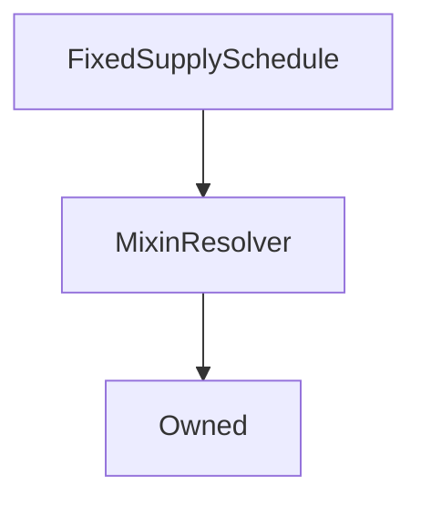

# FixedSupplySchedule

## Description

**Source:** [contracts/FixedSupplySchedule.sol](https://github.com/Synthetixio/synthetix/tree/v2.29.1-alpha/contracts/FixedSupplySchedule.sol)

## Architecture

### Libraries

- [SafeMath](/contracts/source/libraries/SafeMath) for `uint`
- [SafeDecimalMath](/contracts/source/libraries/SafeDecimalMath) for `uint`
- [Math](/contracts/source/libraries/Math) for `uint`

### Inheritance Graph

## Constants

### `DEFAULT_MINT_BUFFER`

[Source](https://github.com/Synthetixio/synthetix/tree/v2.29.1-alpha/contracts/FixedSupplySchedule.sol#L31)

**Type:** `uint256`

### `DEFAULT_MINT_PERIOD_DURATION`

[Source](https://github.com/Synthetixio/synthetix/tree/v2.29.1-alpha/contracts/FixedSupplySchedule.sol#L29)

**Type:** `uint256`

### `MAX_MINTER_REWARD`

[Source](https://github.com/Synthetixio/synthetix/tree/v2.29.1-alpha/contracts/FixedSupplySchedule.sol#L26)

**Type:** `uint256`

## Variables

### `fixedPeriodicSupply`

[Source](https://github.com/Synthetixio/synthetix/tree/v2.29.1-alpha/contracts/FixedSupplySchedule.sol#L46)

**Type:** `uint256`

### `inflationStartDate`

[Source](https://github.com/Synthetixio/synthetix/tree/v2.29.1-alpha/contracts/FixedSupplySchedule.sol#L36)

**Type:** `uint256`

### `lastMintEvent`

[Source](https://github.com/Synthetixio/synthetix/tree/v2.29.1-alpha/contracts/FixedSupplySchedule.sol#L38)

**Type:** `uint256`

### `mintBuffer`

[Source](https://github.com/Synthetixio/synthetix/tree/v2.29.1-alpha/contracts/FixedSupplySchedule.sol#L44)

**Type:** `uint256`

### `mintPeriodCounter`

[Source](https://github.com/Synthetixio/synthetix/tree/v2.29.1-alpha/contracts/FixedSupplySchedule.sol#L40)

**Type:** `uint256`

### `mintPeriodDuration`

[Source](https://github.com/Synthetixio/synthetix/tree/v2.29.1-alpha/contracts/FixedSupplySchedule.sol#L42)

**Type:** `uint256`

### `minterReward`

[Source](https://github.com/Synthetixio/synthetix/tree/v2.29.1-alpha/contracts/FixedSupplySchedule.sol#L50)

**Type:** `uint256`

### `supplyEnd`

[Source](https://github.com/Synthetixio/synthetix/tree/v2.29.1-alpha/contracts/FixedSupplySchedule.sol#L48)

**Type:** `uint256`

## Constructor

### `constructor`

[Source](https://github.com/Synthetixio/synthetix/tree/v2.29.1-alpha/contracts/FixedSupplySchedule.sol#L58)

??? example "Details"

    **Signature**

    `(address _owner, address _resolver, uint256 _inflationStartDate, uint256 _lastMintEvent, uint256 _mintPeriodCounter, uint256 _mintPeriodDuration, uint256 _mintBuffer, uint256 _fixedPeriodicSupply, uint256 _supplyEnd, uint256 _minterReward)`

    **Visibility**

    `public`

    **State Mutability**

    `nonpayable`

    **Requires**

    * [require(..., Buffer can't be greater than period)](https://github.com/Synthetixio/synthetix/tree/v2.29.1-alpha/contracts/FixedSupplySchedule.sol#L82)

    * [require(..., Reward can't exceed max minter reward)](https://github.com/Synthetixio/synthetix/tree/v2.29.1-alpha/contracts/FixedSupplySchedule.sol#L83)

## Views

### `isMintable`

[Source](https://github.com/Synthetixio/synthetix/tree/v2.29.1-alpha/contracts/FixedSupplySchedule.sol#L154)

??? example "Details"

    **Signature**

    `isMintable() returns (bool)`

    **Visibility**

    `public`

    **State Mutability**

    `view`

### `mintableSupply`

[Source](https://github.com/Synthetixio/synthetix/tree/v2.29.1-alpha/contracts/FixedSupplySchedule.sol#L109)

??? example "Details"

    **Signature**

    `mintableSupply() returns (uint256)`

    **Visibility**

    `external`

    **State Mutability**

    `view`

### `periodsSinceLastIssuance`

[Source](https://github.com/Synthetixio/synthetix/tree/v2.29.1-alpha/contracts/FixedSupplySchedule.sol#L143)

??? example "Details"

    **Signature**

    `periodsSinceLastIssuance() returns (uint256)`

    **Visibility**

    `public`

    **State Mutability**

    `view`

## Restricted Functions

### `recordMintEvent`

[Source](https://github.com/Synthetixio/synthetix/tree/v2.29.1-alpha/contracts/FixedSupplySchedule.sol#L169)

??? example "Details"

    **Signature**

    `recordMintEvent(uint256 supplyMinted) returns (bool)`

    **Visibility**

    `external`

    **State Mutability**

    `nonpayable`

    **Modifiers**

    * [onlySynthetix](#onlysynthetix)

    **Emits**

    * [SupplyMinted](#supplyminted)

### `setMinterReward`

[Source](https://github.com/Synthetixio/synthetix/tree/v2.29.1-alpha/contracts/FixedSupplySchedule.sol#L192)

??? example "Details"

    **Signature**

    `setMinterReward(uint256 amount)`

    **Visibility**

    `external`

    **State Mutability**

    `nonpayable`

    **Requires**

    * [require(..., Reward can't exceed max minter reward)](https://github.com/Synthetixio/synthetix/tree/v2.29.1-alpha/contracts/FixedSupplySchedule.sol#L193)

    **Modifiers**

    * [onlyOwner](#onlyowner)

    **Emits**

    * [MinterRewardUpdated](#minterrewardupdated)

## Internal Functions

### `synthetix`

[Source](https://github.com/Synthetixio/synthetix/tree/v2.29.1-alpha/contracts/FixedSupplySchedule.sol#L102)

??? example "Details"

    **Signature**

    `synthetix() returns (contract ISynthetix)`

    **Visibility**

    `internal`

    **State Mutability**

    `view`

## Modifiers

### `onlySynthetix`

[Source](https://github.com/Synthetixio/synthetix/tree/v2.29.1-alpha/contracts/FixedSupplySchedule.sol#L203)

## Events

### `MinterRewardUpdated`

[Source](https://github.com/Synthetixio/synthetix/tree/v2.29.1-alpha/contracts/FixedSupplySchedule.sol#L217)

**Signature**: `MinterRewardUpdated(uint256 newRewardAmount)`

### `SupplyMinted`

[Source](https://github.com/Synthetixio/synthetix/tree/v2.29.1-alpha/contracts/FixedSupplySchedule.sol#L212)

**Signature**: `SupplyMinted(uint256 supplyMinted, uint256 numberOfPeriodsIssued, uint256 lastMintEvent, uint256 timestamp)`
