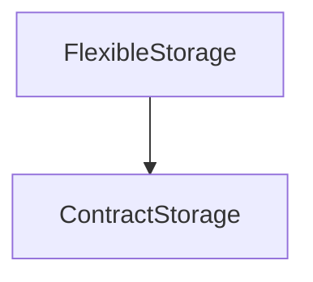

# FlexibleStorage

## Description

**Source:** [contracts/FlexibleStorage.sol](https://github.com/Synthetixio/synthetix/tree/v2.31.0-alpha/contracts/FlexibleStorage.sol)

## Architecture

### Inheritance Graph

## Constructor

### `constructor`

[Source](https://github.com/Synthetixio/synthetix/tree/v2.31.0-alpha/contracts/FlexibleStorage.sol#L19)

??? example "Details"

    **Signature**

    `(address _resolver)`

    **Visibility**

    `public`

    **State Mutability**

    `nonpayable`

## Views

### `getAddressValue`

[Source](https://github.com/Synthetixio/synthetix/tree/v2.31.0-alpha/contracts/FlexibleStorage.sol#L98)

??? example "Details"

    **Signature**

    `getAddressValue(bytes32 contractName, bytes32 record) returns (address)`

    **Visibility**

    `external`

    **State Mutability**

    `view`

### `getAddressValues`

[Source](https://github.com/Synthetixio/synthetix/tree/v2.31.0-alpha/contracts/FlexibleStorage.sol#L102)

??? example "Details"

    **Signature**

    `getAddressValues(bytes32 contractName, bytes32[] records) returns (address[])`

    **Visibility**

    `external`

    **State Mutability**

    `view`

### `getBoolValue`

[Source](https://github.com/Synthetixio/synthetix/tree/v2.31.0-alpha/contracts/FlexibleStorage.sol#L112)

??? example "Details"

    **Signature**

    `getBoolValue(bytes32 contractName, bytes32 record) returns (bool)`

    **Visibility**

    `external`

    **State Mutability**

    `view`

### `getBoolValues`

[Source](https://github.com/Synthetixio/synthetix/tree/v2.31.0-alpha/contracts/FlexibleStorage.sol#L116)

??? example "Details"

    **Signature**

    `getBoolValues(bytes32 contractName, bytes32[] records) returns (bool[])`

    **Visibility**

    `external`

    **State Mutability**

    `view`

### `getBytes32Value`

[Source](https://github.com/Synthetixio/synthetix/tree/v2.31.0-alpha/contracts/FlexibleStorage.sol#L126)

??? example "Details"

    **Signature**

    `getBytes32Value(bytes32 contractName, bytes32 record) returns (bytes32)`

    **Visibility**

    `external`

    **State Mutability**

    `view`

### `getBytes32Values`

[Source](https://github.com/Synthetixio/synthetix/tree/v2.31.0-alpha/contracts/FlexibleStorage.sol#L130)

??? example "Details"

    **Signature**

    `getBytes32Values(bytes32 contractName, bytes32[] records) returns (bytes32[])`

    **Visibility**

    `external`

    **State Mutability**

    `view`

### `getIntValue`

[Source](https://github.com/Synthetixio/synthetix/tree/v2.31.0-alpha/contracts/FlexibleStorage.sol#L84)

??? example "Details"

    **Signature**

    `getIntValue(bytes32 contractName, bytes32 record) returns (int256)`

    **Visibility**

    `external`

    **State Mutability**

    `view`

### `getIntValues`

[Source](https://github.com/Synthetixio/synthetix/tree/v2.31.0-alpha/contracts/FlexibleStorage.sol#L88)

??? example "Details"

    **Signature**

    `getIntValues(bytes32 contractName, bytes32[] records) returns (int256[])`

    **Visibility**

    `external`

    **State Mutability**

    `view`

### `getUIntValue`

[Source](https://github.com/Synthetixio/synthetix/tree/v2.31.0-alpha/contracts/FlexibleStorage.sol#L70)

??? example "Details"

    **Signature**

    `getUIntValue(bytes32 contractName, bytes32 record) returns (uint256)`

    **Visibility**

    `external`

    **State Mutability**

    `view`

### `getUIntValues`

[Source](https://github.com/Synthetixio/synthetix/tree/v2.31.0-alpha/contracts/FlexibleStorage.sol#L74)

??? example "Details"

    **Signature**

    `getUIntValues(bytes32 contractName, bytes32[] records) returns (uint256[])`

    **Visibility**

    `external`

    **State Mutability**

    `view`

## Restricted Functions

### `deleteAddressValue`

[Source](https://github.com/Synthetixio/synthetix/tree/v2.31.0-alpha/contracts/FlexibleStorage.sol#L213)

??? example "Details"

    **Signature**

    `deleteAddressValue(bytes32 contractName, bytes32 record)`

    **Visibility**

    `external`

    **State Mutability**

    `nonpayable`

    **Modifiers**

    * [onlyContract](#onlycontract)

    **Emits**

    * [ValueDeletedAddress](#valuedeletedaddress)

### `deleteBoolValue`

[Source](https://github.com/Synthetixio/synthetix/tree/v2.31.0-alpha/contracts/FlexibleStorage.sol#L239)

??? example "Details"

    **Signature**

    `deleteBoolValue(bytes32 contractName, bytes32 record)`

    **Visibility**

    `external`

    **State Mutability**

    `nonpayable`

    **Modifiers**

    * [onlyContract](#onlycontract)

    **Emits**

    * [ValueDeletedBool](#valuedeletedbool)

### `deleteBytes32Value`

[Source](https://github.com/Synthetixio/synthetix/tree/v2.31.0-alpha/contracts/FlexibleStorage.sol#L265)

??? example "Details"

    **Signature**

    `deleteBytes32Value(bytes32 contractName, bytes32 record)`

    **Visibility**

    `external`

    **State Mutability**

    `nonpayable`

    **Modifiers**

    * [onlyContract](#onlycontract)

    **Emits**

    * [ValueDeletedBytes32](#valuedeletedbytes32)

### `deleteIntValue`

[Source](https://github.com/Synthetixio/synthetix/tree/v2.31.0-alpha/contracts/FlexibleStorage.sol#L187)

??? example "Details"

    **Signature**

    `deleteIntValue(bytes32 contractName, bytes32 record)`

    **Visibility**

    `external`

    **State Mutability**

    `nonpayable`

    **Modifiers**

    * [onlyContract](#onlycontract)

    **Emits**

    * [ValueDeletedInt](#valuedeletedint)

### `deleteUIntValue`

[Source](https://github.com/Synthetixio/synthetix/tree/v2.31.0-alpha/contracts/FlexibleStorage.sol#L161)

??? example "Details"

    **Signature**

    `deleteUIntValue(bytes32 contractName, bytes32 record)`

    **Visibility**

    `external`

    **State Mutability**

    `nonpayable`

    **Modifiers**

    * [onlyContract](#onlycontract)

    **Emits**

    * [ValueDeletedUInt](#valuedeleteduint)

### `setAddressValue`

[Source](https://github.com/Synthetixio/synthetix/tree/v2.31.0-alpha/contracts/FlexibleStorage.sol#L193)

??? example "Details"

    **Signature**

    `setAddressValue(bytes32 contractName, bytes32 record, address value)`

    **Visibility**

    `external`

    **State Mutability**

    `nonpayable`

    **Modifiers**

    * [onlyContract](#onlycontract)

### `setAddressValues`

[Source](https://github.com/Synthetixio/synthetix/tree/v2.31.0-alpha/contracts/FlexibleStorage.sol#L201)

??? example "Details"

    **Signature**

    `setAddressValues(bytes32 contractName, bytes32[] records, address[] values)`

    **Visibility**

    `external`

    **State Mutability**

    `nonpayable`

    **Requires**

    * [require(..., Input lengths must match)](https://github.com/Synthetixio/synthetix/tree/v2.31.0-alpha/contracts/FlexibleStorage.sol#L206)

    **Modifiers**

    * [onlyContract](#onlycontract)

### `setBoolValue`

[Source](https://github.com/Synthetixio/synthetix/tree/v2.31.0-alpha/contracts/FlexibleStorage.sol#L219)

??? example "Details"

    **Signature**

    `setBoolValue(bytes32 contractName, bytes32 record, bool value)`

    **Visibility**

    `external`

    **State Mutability**

    `nonpayable`

    **Modifiers**

    * [onlyContract](#onlycontract)

### `setBoolValues`

[Source](https://github.com/Synthetixio/synthetix/tree/v2.31.0-alpha/contracts/FlexibleStorage.sol#L227)

??? example "Details"

    **Signature**

    `setBoolValues(bytes32 contractName, bytes32[] records, bool[] values)`

    **Visibility**

    `external`

    **State Mutability**

    `nonpayable`

    **Requires**

    * [require(..., Input lengths must match)](https://github.com/Synthetixio/synthetix/tree/v2.31.0-alpha/contracts/FlexibleStorage.sol#L232)

    **Modifiers**

    * [onlyContract](#onlycontract)

### `setBytes32Value`

[Source](https://github.com/Synthetixio/synthetix/tree/v2.31.0-alpha/contracts/FlexibleStorage.sol#L245)

??? example "Details"

    **Signature**

    `setBytes32Value(bytes32 contractName, bytes32 record, bytes32 value)`

    **Visibility**

    `external`

    **State Mutability**

    `nonpayable`

    **Modifiers**

    * [onlyContract](#onlycontract)

### `setBytes32Values`

[Source](https://github.com/Synthetixio/synthetix/tree/v2.31.0-alpha/contracts/FlexibleStorage.sol#L253)

??? example "Details"

    **Signature**

    `setBytes32Values(bytes32 contractName, bytes32[] records, bytes32[] values)`

    **Visibility**

    `external`

    **State Mutability**

    `nonpayable`

    **Requires**

    * [require(..., Input lengths must match)](https://github.com/Synthetixio/synthetix/tree/v2.31.0-alpha/contracts/FlexibleStorage.sol#L258)

    **Modifiers**

    * [onlyContract](#onlycontract)

### `setIntValue`

[Source](https://github.com/Synthetixio/synthetix/tree/v2.31.0-alpha/contracts/FlexibleStorage.sol#L167)

??? example "Details"

    **Signature**

    `setIntValue(bytes32 contractName, bytes32 record, int256 value)`

    **Visibility**

    `external`

    **State Mutability**

    `nonpayable`

    **Modifiers**

    * [onlyContract](#onlycontract)

### `setIntValues`

[Source](https://github.com/Synthetixio/synthetix/tree/v2.31.0-alpha/contracts/FlexibleStorage.sol#L175)

??? example "Details"

    **Signature**

    `setIntValues(bytes32 contractName, bytes32[] records, int256[] values)`

    **Visibility**

    `external`

    **State Mutability**

    `nonpayable`

    **Requires**

    * [require(..., Input lengths must match)](https://github.com/Synthetixio/synthetix/tree/v2.31.0-alpha/contracts/FlexibleStorage.sol#L180)

    **Modifiers**

    * [onlyContract](#onlycontract)

### `setUIntValue`

[Source](https://github.com/Synthetixio/synthetix/tree/v2.31.0-alpha/contracts/FlexibleStorage.sol#L141)

??? example "Details"

    **Signature**

    `setUIntValue(bytes32 contractName, bytes32 record, uint256 value)`

    **Visibility**

    `external`

    **State Mutability**

    `nonpayable`

    **Modifiers**

    * [onlyContract](#onlycontract)

### `setUIntValues`

[Source](https://github.com/Synthetixio/synthetix/tree/v2.31.0-alpha/contracts/FlexibleStorage.sol#L149)

??? example "Details"

    **Signature**

    `setUIntValues(bytes32 contractName, bytes32[] records, uint256[] values)`

    **Visibility**

    `external`

    **State Mutability**

    `nonpayable`

    **Requires**

    * [require(..., Input lengths must match)](https://github.com/Synthetixio/synthetix/tree/v2.31.0-alpha/contracts/FlexibleStorage.sol#L154)

    **Modifiers**

    * [onlyContract](#onlycontract)

## Internal Functions

### `_setAddressValue`

[Source](https://github.com/Synthetixio/synthetix/tree/v2.31.0-alpha/contracts/FlexibleStorage.sol#L41)

??? example "Details"

    **Signature**

    `_setAddressValue(bytes32 contractName, bytes32 record, address value)`

    **Visibility**

    `internal`

    **State Mutability**

    `nonpayable`

    **Emits**

    * [ValueSetAddress](#valuesetaddress)

### `_setBoolValue`

[Source](https://github.com/Synthetixio/synthetix/tree/v2.31.0-alpha/contracts/FlexibleStorage.sol#L50)

??? example "Details"

    **Signature**

    `_setBoolValue(bytes32 contractName, bytes32 record, bool value)`

    **Visibility**

    `internal`

    **State Mutability**

    `nonpayable`

    **Emits**

    * [ValueSetBool](#valuesetbool)

### `_setBytes32Value`

[Source](https://github.com/Synthetixio/synthetix/tree/v2.31.0-alpha/contracts/FlexibleStorage.sol#L59)

??? example "Details"

    **Signature**

    `_setBytes32Value(bytes32 contractName, bytes32 record, bytes32 value)`

    **Visibility**

    `internal`

    **State Mutability**

    `nonpayable`

    **Emits**

    * [ValueSetBytes32](#valuesetbytes32)

### `_setIntValue`

[Source](https://github.com/Synthetixio/synthetix/tree/v2.31.0-alpha/contracts/FlexibleStorage.sol#L32)

??? example "Details"

    **Signature**

    `_setIntValue(bytes32 contractName, bytes32 record, int256 value)`

    **Visibility**

    `internal`

    **State Mutability**

    `nonpayable`

    **Emits**

    * [ValueSetInt](#valuesetint)

### `_setUIntValue`

[Source](https://github.com/Synthetixio/synthetix/tree/v2.31.0-alpha/contracts/FlexibleStorage.sol#L23)

??? example "Details"

    **Signature**

    `_setUIntValue(bytes32 contractName, bytes32 record, uint256 value)`

    **Visibility**

    `internal`

    **State Mutability**

    `nonpayable`

    **Emits**

    * [ValueSetUInt](#valuesetuint)

## Events

### `ValueDeletedAddress`

[Source](https://github.com/Synthetixio/synthetix/tree/v2.31.0-alpha/contracts/FlexibleStorage.sol#L280)

**Signature**: `ValueDeletedAddress(bytes32 contractName, bytes32 record, address value)`

### `ValueDeletedBool`

[Source](https://github.com/Synthetixio/synthetix/tree/v2.31.0-alpha/contracts/FlexibleStorage.sol#L283)

**Signature**: `ValueDeletedBool(bytes32 contractName, bytes32 record, bool value)`

### `ValueDeletedBytes32`

[Source](https://github.com/Synthetixio/synthetix/tree/v2.31.0-alpha/contracts/FlexibleStorage.sol#L286)

**Signature**: `ValueDeletedBytes32(bytes32 contractName, bytes32 record, bytes32 value)`

### `ValueDeletedInt`

[Source](https://github.com/Synthetixio/synthetix/tree/v2.31.0-alpha/contracts/FlexibleStorage.sol#L277)

**Signature**: `ValueDeletedInt(bytes32 contractName, bytes32 record, int256 value)`

### `ValueDeletedUInt`

[Source](https://github.com/Synthetixio/synthetix/tree/v2.31.0-alpha/contracts/FlexibleStorage.sol#L274)

**Signature**: `ValueDeletedUInt(bytes32 contractName, bytes32 record, uint256 value)`

### `ValueSetAddress`

[Source](https://github.com/Synthetixio/synthetix/tree/v2.31.0-alpha/contracts/FlexibleStorage.sol#L279)

**Signature**: `ValueSetAddress(bytes32 contractName, bytes32 record, address value)`

### `ValueSetBool`

[Source](https://github.com/Synthetixio/synthetix/tree/v2.31.0-alpha/contracts/FlexibleStorage.sol#L282)

**Signature**: `ValueSetBool(bytes32 contractName, bytes32 record, bool value)`

### `ValueSetBytes32`

[Source](https://github.com/Synthetixio/synthetix/tree/v2.31.0-alpha/contracts/FlexibleStorage.sol#L285)

**Signature**: `ValueSetBytes32(bytes32 contractName, bytes32 record, bytes32 value)`

### `ValueSetInt`

[Source](https://github.com/Synthetixio/synthetix/tree/v2.31.0-alpha/contracts/FlexibleStorage.sol#L276)

**Signature**: `ValueSetInt(bytes32 contractName, bytes32 record, int256 value)`

### `ValueSetUInt`

[Source](https://github.com/Synthetixio/synthetix/tree/v2.31.0-alpha/contracts/FlexibleStorage.sol#L273)

**Signature**: `ValueSetUInt(bytes32 contractName, bytes32 record, uint256 value)`
