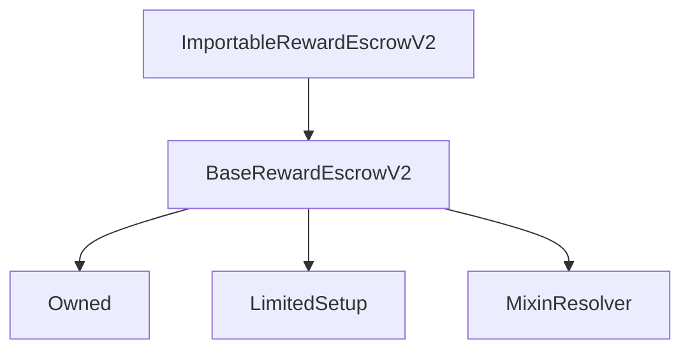

# ImportableRewardEscrowV2

## Description

**Source:** [contracts/ImportableRewardEscrowV2.sol](https://github.com/Synthetixio/synthetix/tree/v2.36.0-alpha/contracts/ImportableRewardEscrowV2.sol)

## Architecture

### Inheritance Graph

## Constructor

### `constructor`

[Source](https://github.com/Synthetixio/synthetix/tree/v2.36.0-alpha/contracts/ImportableRewardEscrowV2.sol#L15)

??? example "Details"

    **Signature**

    `(address _owner, address _resolver)`

    **Visibility**

    `public`

    **State Mutability**

    `nonpayable`

## Views

### `resolverAddressesRequired`

[Source](https://github.com/Synthetixio/synthetix/tree/v2.36.0-alpha/contracts/ImportableRewardEscrowV2.sol#L19)

??? example "Details"

    **Signature**

    `resolverAddressesRequired() returns (bytes32[])`

    **Visibility**

    `public`

    **State Mutability**

    `view`

## Restricted Functions

### `importVestingEntries`

[Source](https://github.com/Synthetixio/synthetix/tree/v2.36.0-alpha/contracts/ImportableRewardEscrowV2.sol#L32)

??? example "Details"

    **Signature**

    `importVestingEntries(address account, uint256 escrowedAmount, struct VestingEntries.VestingEntry[] vestingEntries)`

    **Visibility**

    `external`

    **State Mutability**

    `nonpayable`

    **Requires**

    * [require(..., Insufficient balance in the contract to provide for escrowed balance)](https://github.com/Synthetixio/synthetix/tree/v2.36.0-alpha/contracts/ImportableRewardEscrowV2.sol#L39)

    **Modifiers**

    * [onlySynthetixBridge](#onlysynthetixbridge)

## Internal Functions

### `_importVestingEntry`

[Source](https://github.com/Synthetixio/synthetix/tree/v2.36.0-alpha/contracts/ImportableRewardEscrowV2.sol#L52)

??? example "Details"

    **Signature**

    `_importVestingEntry(address account, struct VestingEntries.VestingEntry entry)`

    **Visibility**

    `internal`

    **State Mutability**

    `nonpayable`

### `synthetixBridgeToBase`

[Source](https://github.com/Synthetixio/synthetix/tree/v2.36.0-alpha/contracts/ImportableRewardEscrowV2.sol#L26)

??? example "Details"

    **Signature**

    `synthetixBridgeToBase() returns (address)`

    **Visibility**

    `internal`

    **State Mutability**

    `view`

## Modifiers

### `onlySynthetixBridge`

[Source](https://github.com/Synthetixio/synthetix/tree/v2.36.0-alpha/contracts/ImportableRewardEscrowV2.sol#L63)
