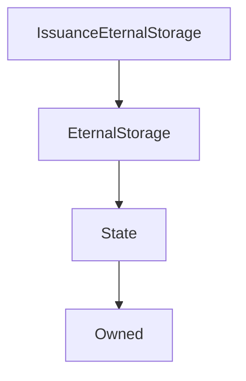

# IssuanceEternalStorage

## Description

!!! todo "Work in Progress"

    This needs filling in

**Source:** [contracts/IssuanceEternalStorage.sol](https://github.com/Synthetixio/synthetix/tree/v2.22.4/contracts/IssuanceEternalStorage.sol)

## Architecture

### Inheritance Graph

## Constructor

### `constructor`

[Source](https://github.com/Synthetixio/synthetix/tree/v2.22.4/contracts/IssuanceEternalStorage.sol#L11)

??? example "Details"

    **Signature**

    `(address _owner, address _issuer)`

    **Visibility**

    `public`

    **State Mutability**

    `nonpayable`
