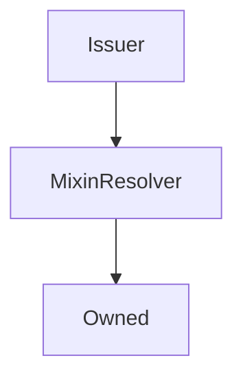

# Issuer

## Description

This contract does all the heavy lifting of issuing and burning `sUSD`. It's used primarily to reduce the size of the `Synthetix` contract

**Source:** [contracts/Issuer.sol](https://github.com/Synthetixio/synthetix/tree/v2.21.15/contracts/Issuer.sol)

## Architecture

### Libraries

- [SafeMath](/contracts/source/libraries/SafeMath) for `uint`
- [SafeDecimalMath](/contracts/source/libraries/SafeDecimalMath) for `uint`

### Inheritance Graph

### Related Contracts

<centered-image>
    
</centered-image>

??? example "Details"

    - [`FeePool`](FeePool.md): The Synthetix contract remits exchange fees as sUSD to the fee pool, and also uses it to keep track of historical issuance records for each issuer.
    - [`SynthetixState`](SynthetixState.md): This state contract stores the debt ledger and the current issuance information for synth issuers.

<!--
If any, see:

<centered-image>
    
</centered-image>
--->

## Constants

### `LAST_ISSUE_EVENT`

[Source](https://github.com/Synthetixio/synthetix/tree/v2.21.15/contracts/Issuer.sol#L26)

**Type:** `bytes32`

### `MAX_MINIMUM_STAKING_TIME`

[Source](https://github.com/Synthetixio/synthetix/tree/v2.21.15/contracts/Issuer.sol#L29)

**Type:** `uint256`

## Variables

### `minimumStakeTime`

[Source](https://github.com/Synthetixio/synthetix/tree/v2.21.15/contracts/Issuer.sol#L31)

**Type:** `uint256`

## Constructor

### `constructor`

[Source](https://github.com/Synthetixio/synthetix/tree/v2.21.15/contracts/Issuer.sol#L51)

??? example "Details"

    **Signature**

    `(address _owner, address _resolver)`

    **Visibility**

    `public`

    **State Mutability**

    `nonpayable`

## Views

### `canBurnSynths`

[Source](https://github.com/Synthetixio/synthetix/tree/v2.21.15/contracts/Issuer.sol#L83)

??? example "Details"

    **Signature**

    `canBurnSynths(address account)`

    **Visibility**

    `public`

    **State Mutability**

    `view`

### `lastIssueEvent`

[Source](https://github.com/Synthetixio/synthetix/tree/v2.21.15/contracts/Issuer.sol#L87)

??? example "Details"

    **Signature**

    `lastIssueEvent(address account)`

    **Visibility**

    `public`

    **State Mutability**

    `view`

## Restricted Functions

### `burnSynths`

[Source](https://github.com/Synthetixio/synthetix/tree/v2.21.15/contracts/Issuer.sol#L170)

??? example "Details"

    **Signature**

    `burnSynths(address from, uint256 amount)`

    **Visibility**

    `external`

    **State Mutability**

    `nonpayable`

    **Modifiers**

    * [onlySynthetix](#onlysynthetix)

### `burnSynthsOnBehalf`

[Source](https://github.com/Synthetixio/synthetix/tree/v2.21.15/contracts/Issuer.sol#L161)

??? example "Details"

    **Signature**

    `burnSynthsOnBehalf(address burnForAddress, address from, uint256 amount)`

    **Visibility**

    `external`

    **State Mutability**

    `nonpayable`

    **Requires**

    * [require(..., Not approved to act on behalf)](https://github.com/Synthetixio/synthetix/tree/v2.21.15/contracts/Issuer.sol#L166)

    **Modifiers**

    * [onlySynthetix](#onlysynthetix)

### `burnSynthsToTarget`

[Source](https://github.com/Synthetixio/synthetix/tree/v2.21.15/contracts/Issuer.sol#L200)

??? example "Details"

    **Signature**

    `burnSynthsToTarget(address from)`

    **Visibility**

    `external`

    **State Mutability**

    `nonpayable`

    **Modifiers**

    * [onlySynthetix](#onlysynthetix)

### `burnSynthsToTargetOnBehalf`

[Source](https://github.com/Synthetixio/synthetix/tree/v2.21.15/contracts/Issuer.sol#L195)

??? example "Details"

    **Signature**

    `burnSynthsToTargetOnBehalf(address burnForAddress, address from)`

    **Visibility**

    `external`

    **State Mutability**

    `nonpayable`

    **Requires**

    * [require(..., Not approved to act on behalf)](https://github.com/Synthetixio/synthetix/tree/v2.21.15/contracts/Issuer.sol#L196)

    **Modifiers**

    * [onlySynthetix](#onlysynthetix)

### `issueMaxSynths`

[Source](https://github.com/Synthetixio/synthetix/tree/v2.21.15/contracts/Issuer.sol#L134)

??? example "Details"

    **Signature**

    `issueMaxSynths(address from)`

    **Visibility**

    `external`

    **State Mutability**

    `nonpayable`

    **Modifiers**

    * [onlySynthetix](#onlysynthetix)

### `issueMaxSynthsOnBehalf`

[Source](https://github.com/Synthetixio/synthetix/tree/v2.21.15/contracts/Issuer.sol#L119)

??? example "Details"

    **Signature**

    `issueMaxSynthsOnBehalf(address issueForAddress, address from)`

    **Visibility**

    `external`

    **State Mutability**

    `nonpayable`

    **Requires**

    * [require(..., Not approved to act on behalf)](https://github.com/Synthetixio/synthetix/tree/v2.21.15/contracts/Issuer.sol#L120)

    **Modifiers**

    * [onlySynthetix](#onlysynthetix)

### `issueSynths`

[Source](https://github.com/Synthetixio/synthetix/tree/v2.21.15/contracts/Issuer.sol#L126)

??? example "Details"

    **Signature**

    `issueSynths(address from, uint256 amount)`

    **Visibility**

    `external`

    **State Mutability**

    `nonpayable`

    **Requires**

    * [require(..., Amount too large)](https://github.com/Synthetixio/synthetix/tree/v2.21.15/contracts/Issuer.sol#L129)

    **Modifiers**

    * [onlySynthetix](#onlysynthetix)

### `issueSynthsOnBehalf`

[Source](https://github.com/Synthetixio/synthetix/tree/v2.21.15/contracts/Issuer.sol#L107)

??? example "Details"

    **Signature**

    `issueSynthsOnBehalf(address issueForAddress, address from, uint256 amount)`

    **Visibility**

    `external`

    **State Mutability**

    `nonpayable`

    **Requires**

    * [require(..., Not approved to act on behalf)](https://github.com/Synthetixio/synthetix/tree/v2.21.15/contracts/Issuer.sol#L112)

    * [require(..., Amount too large)](https://github.com/Synthetixio/synthetix/tree/v2.21.15/contracts/Issuer.sol#L115)

    **Modifiers**

    * [onlySynthetix](#onlysynthetix)

### `setMinimumStakeTime`

[Source](https://github.com/Synthetixio/synthetix/tree/v2.21.15/contracts/Issuer.sol#L94)

??? example "Details"

    **Signature**

    `setMinimumStakeTime(uint256 _seconds)`

    **Visibility**

    `external`

    **State Mutability**

    `nonpayable`

    **Requires**

    * [require(..., stake time exceed maximum 1 week)](https://github.com/Synthetixio/synthetix/tree/v2.21.15/contracts/Issuer.sol#L96)

    **Modifiers**

    * [onlyOwner](#onlyowner)

    **Emits**

    * [MinimumStakeTimeUpdated](#minimumstaketimeupdated)

## Internal Functions

### `_addToDebtRegister`

[Source](https://github.com/Synthetixio/synthetix/tree/v2.21.15/contracts/Issuer.sol#L265)

??? example "Details"

    **Signature**

    `_addToDebtRegister(address from, uint256 amount, uint256 existingDebt, uint256 totalDebtIssued)`

    **Visibility**

    `internal`

    **State Mutability**

    `nonpayable`

### `_appendAccountIssuanceRecord`

[Source](https://github.com/Synthetixio/synthetix/tree/v2.21.15/contracts/Issuer.sol#L252)

??? example "Details"

    **Signature**

    `_appendAccountIssuanceRecord(address from)`

    **Visibility**

    `internal`

    **State Mutability**

    `nonpayable`

### `_burnSynths`

[Source](https://github.com/Synthetixio/synthetix/tree/v2.21.15/contracts/Issuer.sol#L175)

??? example "Details"

    **Signature**

    `_burnSynths(address from, uint256 amount)`

    **Visibility**

    `internal`

    **State Mutability**

    `nonpayable`

    **Requires**

    * [require(..., Minimum stake time not reached)](https://github.com/Synthetixio/synthetix/tree/v2.21.15/contracts/Issuer.sol#L176)

    * [require(..., No debt to forgive)](https://github.com/Synthetixio/synthetix/tree/v2.21.15/contracts/Issuer.sol#L184)

### `_burnSynthsToTarget`

[Source](https://github.com/Synthetixio/synthetix/tree/v2.21.15/contracts/Issuer.sol#L206)

??? example "Details"

    **Signature**

    `_burnSynthsToTarget(address from)`

    **Visibility**

    `internal`

    **State Mutability**

    `nonpayable`

    **Requires**

    * [require(..., No debt to forgive)](https://github.com/Synthetixio/synthetix/tree/v2.21.15/contracts/Issuer.sol#L210)

### `_internalBurnSynths`

[Source](https://github.com/Synthetixio/synthetix/tree/v2.21.15/contracts/Issuer.sol#L223)

??? example "Details"

    **Signature**

    `_internalBurnSynths(address from, uint256 amount, uint256 existingDebt, uint256 totalSystemValue)`

    **Visibility**

    `internal`

    **State Mutability**

    `nonpayable`

### `_internalIssueSynths`

[Source](https://github.com/Synthetixio/synthetix/tree/v2.21.15/contracts/Issuer.sol#L142)

??? example "Details"

    **Signature**

    `_internalIssueSynths(address from, uint256 amount, uint256 existingDebt, uint256 totalSystemDebt)`

    **Visibility**

    `internal`

    **State Mutability**

    `nonpayable`

### `_removeFromDebtRegister`

[Source](https://github.com/Synthetixio/synthetix/tree/v2.21.15/contracts/Issuer.sol#L313)

??? example "Details"

    **Signature**

    `_removeFromDebtRegister(address from, uint256 amount, uint256 existingDebt, uint256 totalDebtIssued)`

    **Visibility**

    `internal`

    **State Mutability**

    `nonpayable`

### `_setLastIssueEvent`

[Source](https://github.com/Synthetixio/synthetix/tree/v2.21.15/contracts/Issuer.sol#L102)

??? example "Details"

    **Signature**

    `_setLastIssueEvent(address account)`

    **Visibility**

    `internal`

    **State Mutability**

    `nonpayable`

### `delegateApprovals`

[Source](https://github.com/Synthetixio/synthetix/tree/v2.21.15/contracts/Issuer.sol#L70)

??? example "Details"

    **Signature**

    `delegateApprovals()`

    **Visibility**

    `internal`

    **State Mutability**

    `view`

### `exchanger`

[Source](https://github.com/Synthetixio/synthetix/tree/v2.21.15/contracts/Issuer.sol#L58)

??? example "Details"

    **Signature**

    `exchanger()`

    **Visibility**

    `internal`

    **State Mutability**

    `view`

### `feePool`

[Source](https://github.com/Synthetixio/synthetix/tree/v2.21.15/contracts/Issuer.sol#L66)

??? example "Details"

    **Signature**

    `feePool()`

    **Visibility**

    `internal`

    **State Mutability**

    `view`

### `issuanceEternalStorage`

[Source](https://github.com/Synthetixio/synthetix/tree/v2.21.15/contracts/Issuer.sol#L74)

??? example "Details"

    **Signature**

    `issuanceEternalStorage()`

    **Visibility**

    `internal`

    **State Mutability**

    `view`

### `synthetix`

[Source](https://github.com/Synthetixio/synthetix/tree/v2.21.15/contracts/Issuer.sol#L54)

??? example "Details"

    **Signature**

    `synthetix()`

    **Visibility**

    `internal`

    **State Mutability**

    `view`

### `synthetixState`

[Source](https://github.com/Synthetixio/synthetix/tree/v2.21.15/contracts/Issuer.sol#L62)

??? example "Details"

    **Signature**

    `synthetixState()`

    **Visibility**

    `internal`

    **State Mutability**

    `view`

## Modifiers

### `onlySynthetix`

[Source](https://github.com/Synthetixio/synthetix/tree/v2.21.15/contracts/Issuer.sol#L359)

## Events

### `MinimumStakeTimeUpdated`

[Source](https://github.com/Synthetixio/synthetix/tree/v2.21.15/contracts/Issuer.sol#L366)

**Signature**: `MinimumStakeTimeUpdated(uint256 minimumStakeTime)`
