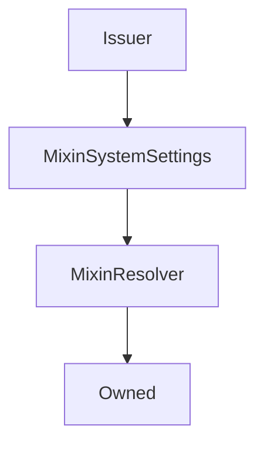

# Issuer

## Description

This contract does all the heavy lifting of issuing and burning `sUSD`. It's used primarily to reduce the size of the `Synthetix` contract

**Source:** [contracts/Issuer.sol](https://github.com/Synthetixio/synthetix/tree/v2.28.4/contracts/Issuer.sol)

## Architecture

### Libraries

- [SafeMath](/contracts/source/libraries/SafeMath) for `uint`
- [SafeDecimalMath](/contracts/source/libraries/SafeDecimalMath) for `uint`

### Inheritance Graph

### Related Contracts

<centered-image>
    
</centered-image>

??? example "Details"

    - [`FeePool`](FeePool.md): The Synthetix contract remits exchange fees as sUSD to the fee pool, and also uses it to keep track of historical issuance records for each issuer.
    - [`SynthetixState`](SynthetixState.md): This state contract stores the debt ledger and the current issuance information for synth issuers.

<!--
If any, see:

<centered-image>
    
</centered-image>
--->

## Constants

### `CONTRACT_NAME`

[Source](https://github.com/Synthetixio/synthetix/tree/v2.28.4/contracts/Issuer.sol#L34)

**Type:** `bytes32`

### `LAST_ISSUE_EVENT`

[Source](https://github.com/Synthetixio/synthetix/tree/v2.28.4/contracts/Issuer.sol#L35)

**Type:** `bytes32`

## Variables

### `availableSynths`

[Source](https://github.com/Synthetixio/synthetix/tree/v2.28.4/contracts/Issuer.sol#L38)

**Type:** `contract ISynth[]`

### `synths`

[Source](https://github.com/Synthetixio/synthetix/tree/v2.28.4/contracts/Issuer.sol#L39)

**Type:** `mapping(bytes32 => contract ISynth)`

### `synthsByAddress`

[Source](https://github.com/Synthetixio/synthetix/tree/v2.28.4/contracts/Issuer.sol#L40)

**Type:** `mapping(address => bytes32)`

## Constructor

### `constructor`

[Source](https://github.com/Synthetixio/synthetix/tree/v2.28.4/contracts/Issuer.sol#L70)

??? example "Details"

    **Signature**

    `(address _owner, address _resolver)`

    **Visibility**

    `public`

    **State Mutability**

    `nonpayable`

## Views

### `anySynthOrSNXRateIsInvalid`

[Source](https://github.com/Synthetixio/synthetix/tree/v2.28.4/contracts/Issuer.sol#L313)

??? example "Details"

    **Signature**

    `anySynthOrSNXRateIsInvalid() returns (bool)`

    **Visibility**

    `external`

    **State Mutability**

    `view`

### `availableCurrencyKeys`

[Source](https://github.com/Synthetixio/synthetix/tree/v2.28.4/contracts/Issuer.sol#L305)

??? example "Details"

    **Signature**

    `availableCurrencyKeys() returns (bytes32[])`

    **Visibility**

    `external`

    **State Mutability**

    `view`

### `availableSynthCount`

[Source](https://github.com/Synthetixio/synthetix/tree/v2.28.4/contracts/Issuer.sol#L309)

??? example "Details"

    **Signature**

    `availableSynthCount() returns (uint256)`

    **Visibility**

    `external`

    **State Mutability**

    `view`

### `canBurnSynths`

[Source](https://github.com/Synthetixio/synthetix/tree/v2.28.4/contracts/Issuer.sol#L301)

??? example "Details"

    **Signature**

    `canBurnSynths(address account) returns (bool)`

    **Visibility**

    `external`

    **State Mutability**

    `view`

### `collateral`

[Source](https://github.com/Synthetixio/synthetix/tree/v2.28.4/contracts/Issuer.sol#L339)

??? example "Details"

    **Signature**

    `collateral(address account) returns (uint256)`

    **Visibility**

    `external`

    **State Mutability**

    `view`

### `collateralisationRatio`

[Source](https://github.com/Synthetixio/synthetix/tree/v2.28.4/contracts/Issuer.sol#L327)

??? example "Details"

    **Signature**

    `collateralisationRatio(address _issuer) returns (uint256)`

    **Visibility**

    `external`

    **State Mutability**

    `view`

### `collateralisationRatioAndAnyRatesInvalid`

[Source](https://github.com/Synthetixio/synthetix/tree/v2.28.4/contracts/Issuer.sol#L331)

??? example "Details"

    **Signature**

    `collateralisationRatioAndAnyRatesInvalid(address _issuer) returns (uint256, bool)`

    **Visibility**

    `external`

    **State Mutability**

    `view`

### `debtBalanceOf`

[Source](https://github.com/Synthetixio/synthetix/tree/v2.28.4/contracts/Issuer.sol#L343)

??? example "Details"

    **Signature**

    `debtBalanceOf(address _issuer, bytes32 currencyKey) returns (uint256)`

    **Visibility**

    `external`

    **State Mutability**

    `view`

### `issuanceRatio`

[Source](https://github.com/Synthetixio/synthetix/tree/v2.28.4/contracts/Issuer.sol#L127)

??? example "Details"

    **Signature**

    `issuanceRatio() returns (uint256)`

    **Visibility**

    `external`

    **State Mutability**

    `view`

### `lastIssueEvent`

[Source](https://github.com/Synthetixio/synthetix/tree/v2.28.4/contracts/Issuer.sol#L323)

??? example "Details"

    **Signature**

    `lastIssueEvent(address account) returns (uint256)`

    **Visibility**

    `external`

    **State Mutability**

    `view`

### `maxIssuableSynths`

[Source](https://github.com/Synthetixio/synthetix/tree/v2.28.4/contracts/Issuer.sol#L367)

??? example "Details"

    **Signature**

    `maxIssuableSynths(address _issuer) returns (uint256)`

    **Visibility**

    `external`

    **State Mutability**

    `view`

### `minimumStakeTime`

[Source](https://github.com/Synthetixio/synthetix/tree/v2.28.4/contracts/Issuer.sol#L297)

??? example "Details"

    **Signature**

    `minimumStakeTime() returns (uint256)`

    **Visibility**

    `external`

    **State Mutability**

    `view`

### `remainingIssuableSynths`

[Source](https://github.com/Synthetixio/synthetix/tree/v2.28.4/contracts/Issuer.sol#L355)

??? example "Details"

    **Signature**

    `remainingIssuableSynths(address _issuer) returns (uint256, uint256, uint256)`

    **Visibility**

    `external`

    **State Mutability**

    `view`

### `totalIssuedSynths`

[Source](https://github.com/Synthetixio/synthetix/tree/v2.28.4/contracts/Issuer.sol#L319)

??? example "Details"

    **Signature**

    `totalIssuedSynths(bytes32 currencyKey, bool excludeEtherCollateral) returns (uint256)`

    **Visibility**

    `external`

    **State Mutability**

    `view`

### `transferableSynthetixAndAnyRateIsInvalid`

[Source](https://github.com/Synthetixio/synthetix/tree/v2.28.4/contracts/Issuer.sol#L371)

??? example "Details"

    **Signature**

    `transferableSynthetixAndAnyRateIsInvalid(address account, uint256 balance) returns (uint256, bool)`

    **Visibility**

    `external`

    **State Mutability**

    `view`

## Restricted Functions

### `addSynth`

[Source](https://github.com/Synthetixio/synthetix/tree/v2.28.4/contracts/Issuer.sol#L398)

??? example "Details"

    **Signature**

    `addSynth(contract ISynth synth)`

    **Visibility**

    `external`

    **State Mutability**

    `nonpayable`

    **Requires**

    * [require(..., Synth already exists)](https://github.com/Synthetixio/synthetix/tree/v2.28.4/contracts/Issuer.sol#L401)

    * [require(..., Synth address already exists)](https://github.com/Synthetixio/synthetix/tree/v2.28.4/contracts/Issuer.sol#L402)

    **Modifiers**

    * [onlyOwner](#onlyowner)

    **Emits**

    * [SynthAdded](#synthadded)

### `burnSynths`

[Source](https://github.com/Synthetixio/synthetix/tree/v2.28.4/contracts/Issuer.sol#L502)

??? example "Details"

    **Signature**

    `burnSynths(address from, uint256 amount)`

    **Visibility**

    `external`

    **State Mutability**

    `nonpayable`

    **Modifiers**

    * [onlySynthetix](#onlysynthetix)

### `burnSynthsOnBehalf`

[Source](https://github.com/Synthetixio/synthetix/tree/v2.28.4/contracts/Issuer.sol#L493)

??? example "Details"

    **Signature**

    `burnSynthsOnBehalf(address burnForAddress, address from, uint256 amount)`

    **Visibility**

    `external`

    **State Mutability**

    `nonpayable`

    **Requires**

    * [require(..., Not approved to act on behalf)](https://github.com/Synthetixio/synthetix/tree/v2.28.4/contracts/Issuer.sol#L498)

    **Modifiers**

    * [onlySynthetix](#onlysynthetix)

### `burnSynthsToTarget`

[Source](https://github.com/Synthetixio/synthetix/tree/v2.28.4/contracts/Issuer.sol#L576)

??? example "Details"

    **Signature**

    `burnSynthsToTarget(address from)`

    **Visibility**

    `external`

    **State Mutability**

    `nonpayable`

    **Modifiers**

    * [onlySynthetix](#onlysynthetix)

### `burnSynthsToTargetOnBehalf`

[Source](https://github.com/Synthetixio/synthetix/tree/v2.28.4/contracts/Issuer.sol#L571)

??? example "Details"

    **Signature**

    `burnSynthsToTargetOnBehalf(address burnForAddress, address from)`

    **Visibility**

    `external`

    **State Mutability**

    `nonpayable`

    **Requires**

    * [require(..., Not approved to act on behalf)](https://github.com/Synthetixio/synthetix/tree/v2.28.4/contracts/Issuer.sol#L572)

    **Modifiers**

    * [onlySynthetix](#onlysynthetix)

### `issueMaxSynths`

[Source](https://github.com/Synthetixio/synthetix/tree/v2.28.4/contracts/Issuer.sol#L484)

??? example "Details"

    **Signature**

    `issueMaxSynths(address from)`

    **Visibility**

    `external`

    **State Mutability**

    `nonpayable`

    **Requires**

    * [require(..., A synth or SNX rate is invalid)](https://github.com/Synthetixio/synthetix/tree/v2.28.4/contracts/Issuer.sol#L488)

    **Modifiers**

    * [onlySynthetix](#onlysynthetix)

### `issueMaxSynthsOnBehalf`

[Source](https://github.com/Synthetixio/synthetix/tree/v2.28.4/contracts/Issuer.sol#L461)

??? example "Details"

    **Signature**

    `issueMaxSynthsOnBehalf(address issueForAddress, address from)`

    **Visibility**

    `external`

    **State Mutability**

    `nonpayable`

    **Requires**

    * [require(..., Not approved to act on behalf)](https://github.com/Synthetixio/synthetix/tree/v2.28.4/contracts/Issuer.sol#L462)

    * [require(..., A synth or SNX rate is invalid)](https://github.com/Synthetixio/synthetix/tree/v2.28.4/contracts/Issuer.sol#L468)

    **Modifiers**

    * [onlySynthetix](#onlysynthetix)

### `issueSynths`

[Source](https://github.com/Synthetixio/synthetix/tree/v2.28.4/contracts/Issuer.sol#L473)

??? example "Details"

    **Signature**

    `issueSynths(address from, uint256 amount)`

    **Visibility**

    `external`

    **State Mutability**

    `nonpayable`

    **Requires**

    * [require(..., A synth or SNX rate is invalid)](https://github.com/Synthetixio/synthetix/tree/v2.28.4/contracts/Issuer.sol#L477)

    * [require(..., Amount too large)](https://github.com/Synthetixio/synthetix/tree/v2.28.4/contracts/Issuer.sol#L479)

    **Modifiers**

    * [onlySynthetix](#onlysynthetix)

### `issueSynthsOnBehalf`

[Source](https://github.com/Synthetixio/synthetix/tree/v2.28.4/contracts/Issuer.sol#L443)

??? example "Details"

    **Signature**

    `issueSynthsOnBehalf(address issueForAddress, address from, uint256 amount)`

    **Visibility**

    `external`

    **State Mutability**

    `nonpayable`

    **Requires**

    * [require(..., Not approved to act on behalf)](https://github.com/Synthetixio/synthetix/tree/v2.28.4/contracts/Issuer.sol#L448)

    * [require(..., A synth or SNX rate is invalid)](https://github.com/Synthetixio/synthetix/tree/v2.28.4/contracts/Issuer.sol#L454)

    * [require(..., Amount too large)](https://github.com/Synthetixio/synthetix/tree/v2.28.4/contracts/Issuer.sol#L456)

    **Modifiers**

    * [onlySynthetix](#onlysynthetix)

### `liquidateDelinquentAccount`

[Source](https://github.com/Synthetixio/synthetix/tree/v2.28.4/contracts/Issuer.sol#L628)

??? example "Details"

    **Signature**

    `liquidateDelinquentAccount(address account, uint256 susdAmount, address liquidator) returns (uint256, uint256)`

    **Visibility**

    `external`

    **State Mutability**

    `nonpayable`

    **Requires**

    * [require(..., sUSD needs to be settled)](https://github.com/Synthetixio/synthetix/tree/v2.28.4/contracts/Issuer.sol#L634)

    * [require(..., Account not open for liquidation)](https://github.com/Synthetixio/synthetix/tree/v2.28.4/contracts/Issuer.sol#L638)

    * [require(..., Not enough sUSD)](https://github.com/Synthetixio/synthetix/tree/v2.28.4/contracts/Issuer.sol#L641)

    * [require(..., A synth or SNX rate is invalid)](https://github.com/Synthetixio/synthetix/tree/v2.28.4/contracts/Issuer.sol#L653)

    **Modifiers**

    * [onlySynthetix](#onlysynthetix)

### `removeSynth`

[Source](https://github.com/Synthetixio/synthetix/tree/v2.28.4/contracts/Issuer.sol#L411)

??? example "Details"

    **Signature**

    `removeSynth(bytes32 currencyKey)`

    **Visibility**

    `external`

    **State Mutability**

    `nonpayable`

    **Requires**

    * [require(..., Synth does not exist)](https://github.com/Synthetixio/synthetix/tree/v2.28.4/contracts/Issuer.sol#L412)

    * [require(..., Synth supply exists)](https://github.com/Synthetixio/synthetix/tree/v2.28.4/contracts/Issuer.sol#L413)

    * [require(..., Cannot remove synth)](https://github.com/Synthetixio/synthetix/tree/v2.28.4/contracts/Issuer.sol#L414)

    **Modifiers**

    * [onlyOwner](#onlyowner)

    **Emits**

    * [SynthRemoved](#synthremoved)

## Internal Functions

### `_addToDebtRegister`

[Source](https://github.com/Synthetixio/synthetix/tree/v2.28.4/contracts/Issuer.sol#L707)

??? example "Details"

    **Signature**

    `_addToDebtRegister(address from, uint256 amount, uint256 existingDebt, uint256 totalDebtIssued)`

    **Visibility**

    `internal`

    **State Mutability**

    `nonpayable`

### `_appendAccountIssuanceRecord`

[Source](https://github.com/Synthetixio/synthetix/tree/v2.28.4/contracts/Issuer.sol#L699)

??? example "Details"

    **Signature**

    `_appendAccountIssuanceRecord(address from)`

    **Visibility**

    `internal`

    **State Mutability**

    `nonpayable`

### `_availableCurrencyKeysWithOptionalSNX`

[Source](https://github.com/Synthetixio/synthetix/tree/v2.28.4/contracts/Issuer.sol#L131)

??? example "Details"

    **Signature**

    `_availableCurrencyKeysWithOptionalSNX(bool withSNX) returns (bytes32[])`

    **Visibility**

    `internal`

    **State Mutability**

    `view`

### `_burnSynths`

[Source](https://github.com/Synthetixio/synthetix/tree/v2.28.4/contracts/Issuer.sol#L528)

??? example "Details"

    **Signature**

    `_burnSynths(address from, uint256 amount)`

    **Visibility**

    `internal`

    **State Mutability**

    `nonpayable`

    **Requires**

    * [require(..., Minimum stake time not reached)](https://github.com/Synthetixio/synthetix/tree/v2.28.4/contracts/Issuer.sol#L529)

    * [require(..., A synth or SNX rate is invalid)](https://github.com/Synthetixio/synthetix/tree/v2.28.4/contracts/Issuer.sol#L537)

    * [require(..., No debt to forgive)](https://github.com/Synthetixio/synthetix/tree/v2.28.4/contracts/Issuer.sol#L539)

### `_burnSynthsForLiquidation`

[Source](https://github.com/Synthetixio/synthetix/tree/v2.28.4/contracts/Issuer.sol#L552)

??? example "Details"

    **Signature**

    `_burnSynthsForLiquidation(address burnForAddress, address liquidator, uint256 amount, uint256 existingDebt, uint256 totalDebtIssued)`

    **Visibility**

    `internal`

    **State Mutability**

    `nonpayable`

### `_burnSynthsToTarget`

[Source](https://github.com/Synthetixio/synthetix/tree/v2.28.4/contracts/Issuer.sol#L582)

??? example "Details"

    **Signature**

    `_burnSynthsToTarget(address from)`

    **Visibility**

    `internal`

    **State Mutability**

    `nonpayable`

    **Requires**

    * [require(..., A synth or SNX rate is invalid)](https://github.com/Synthetixio/synthetix/tree/v2.28.4/contracts/Issuer.sol#L586)

    * [require(..., No debt to forgive)](https://github.com/Synthetixio/synthetix/tree/v2.28.4/contracts/Issuer.sol#L588)

### `_canBurnSynths`

[Source](https://github.com/Synthetixio/synthetix/tree/v2.28.4/contracts/Issuer.sol#L233)

??? example "Details"

    **Signature**

    `_canBurnSynths(address account) returns (bool)`

    **Visibility**

    `internal`

    **State Mutability**

    `view`

### `_collateral`

[Source](https://github.com/Synthetixio/synthetix/tree/v2.28.4/contracts/Issuer.sol#L281)

??? example "Details"

    **Signature**

    `_collateral(address account) returns (uint256)`

    **Visibility**

    `internal`

    **State Mutability**

    `view`

### `_collateralisationRatio`

[Source](https://github.com/Synthetixio/synthetix/tree/v2.28.4/contracts/Issuer.sol#L270)

??? example "Details"

    **Signature**

    `_collateralisationRatio(address _issuer) returns (uint256, bool)`

    **Visibility**

    `internal`

    **State Mutability**

    `view`

### `_debtBalanceOfAndTotalDebt`

[Source](https://github.com/Synthetixio/synthetix/tree/v2.28.4/contracts/Issuer.sol#L193)

??? example "Details"

    **Signature**

    `_debtBalanceOfAndTotalDebt(address _issuer, bytes32 currencyKey) returns (uint256, uint256, bool)`

    **Visibility**

    `internal`

    **State Mutability**

    `view`

### `_internalBurnSynths`

[Source](https://github.com/Synthetixio/synthetix/tree/v2.28.4/contracts/Issuer.sol#L599)

??? example "Details"

    **Signature**

    `_internalBurnSynths(address from, uint256 amount, uint256 existingDebt, uint256 totalSystemValue, uint256 maxIssuableSynthsForAccount)`

    **Visibility**

    `internal`

    **State Mutability**

    `nonpayable`

### `_internalIssueSynths`

[Source](https://github.com/Synthetixio/synthetix/tree/v2.28.4/contracts/Issuer.sol#L508)

??? example "Details"

    **Signature**

    `_internalIssueSynths(address from, uint256 amount, uint256 existingDebt, uint256 totalSystemDebt)`

    **Visibility**

    `internal`

    **State Mutability**

    `nonpayable`

### `_lastIssueEvent`

[Source](https://github.com/Synthetixio/synthetix/tree/v2.28.4/contracts/Issuer.sol#L237)

??? example "Details"

    **Signature**

    `_lastIssueEvent(address account) returns (uint256)`

    **Visibility**

    `internal`

    **State Mutability**

    `view`

### `_maxIssuableSynths`

[Source](https://github.com/Synthetixio/synthetix/tree/v2.28.4/contracts/Issuer.sol#L262)

??? example "Details"

    **Signature**

    `_maxIssuableSynths(address _issuer) returns (uint256)`

    **Visibility**

    `internal`

    **State Mutability**

    `view`

### `_remainingIssuableSynths`

[Source](https://github.com/Synthetixio/synthetix/tree/v2.28.4/contracts/Issuer.sol#L242)

??? example "Details"

    **Signature**

    `_remainingIssuableSynths(address _issuer) returns (uint256, uint256, uint256, bool)`

    **Visibility**

    `internal`

    **State Mutability**

    `view`

### `_removeFromDebtRegister`

[Source](https://github.com/Synthetixio/synthetix/tree/v2.28.4/contracts/Issuer.sol#L749)

??? example "Details"

    **Signature**

    `_removeFromDebtRegister(address from, uint256 amount, uint256 existingDebt, uint256 totalDebtIssued)`

    **Visibility**

    `internal`

    **State Mutability**

    `nonpayable`

### `_setLastIssueEvent`

[Source](https://github.com/Synthetixio/synthetix/tree/v2.28.4/contracts/Issuer.sol#L690)

??? example "Details"

    **Signature**

    `_setLastIssueEvent(address account)`

    **Visibility**

    `internal`

    **State Mutability**

    `nonpayable`

### `_totalIssuedSynths`

[Source](https://github.com/Synthetixio/synthetix/tree/v2.28.4/contracts/Issuer.sol#L145)

??? example "Details"

    **Signature**

    `_totalIssuedSynths(bytes32 currencyKey, bool excludeEtherCollateral) returns (uint256, bool)`

    **Visibility**

    `internal`

    **State Mutability**

    `view`

### `delegateApprovals`

[Source](https://github.com/Synthetixio/synthetix/tree/v2.28.4/contracts/Issuer.sol#L106)

??? example "Details"

    **Signature**

    `delegateApprovals() returns (contract IDelegateApprovals)`

    **Visibility**

    `internal`

    **State Mutability**

    `view`

### `etherCollateral`

[Source](https://github.com/Synthetixio/synthetix/tree/v2.28.4/contracts/Issuer.sol#L110)

??? example "Details"

    **Signature**

    `etherCollateral() returns (contract IEtherCollateral)`

    **Visibility**

    `internal`

    **State Mutability**

    `view`

### `etherCollateralsUSD`

[Source](https://github.com/Synthetixio/synthetix/tree/v2.28.4/contracts/Issuer.sol#L114)

??? example "Details"

    **Signature**

    `etherCollateralsUSD() returns (contract IEtherCollateralsUSD)`

    **Visibility**

    `internal`

    **State Mutability**

    `view`

### `exchangeRates`

[Source](https://github.com/Synthetixio/synthetix/tree/v2.28.4/contracts/Issuer.sol#L90)

??? example "Details"

    **Signature**

    `exchangeRates() returns (contract IExchangeRates)`

    **Visibility**

    `internal`

    **State Mutability**

    `view`

### `exchanger`

[Source](https://github.com/Synthetixio/synthetix/tree/v2.28.4/contracts/Issuer.sol#L86)

??? example "Details"

    **Signature**

    `exchanger() returns (contract IExchanger)`

    **Visibility**

    `internal`

    **State Mutability**

    `view`

### `feePool`

[Source](https://github.com/Synthetixio/synthetix/tree/v2.28.4/contracts/Issuer.sol#L98)

??? example "Details"

    **Signature**

    `feePool() returns (contract IFeePool)`

    **Visibility**

    `internal`

    **State Mutability**

    `view`

### `liquidations`

[Source](https://github.com/Synthetixio/synthetix/tree/v2.28.4/contracts/Issuer.sol#L102)

??? example "Details"

    **Signature**

    `liquidations() returns (contract ILiquidations)`

    **Visibility**

    `internal`

    **State Mutability**

    `view`

### `rewardEscrow`

[Source](https://github.com/Synthetixio/synthetix/tree/v2.28.4/contracts/Issuer.sol#L119)

??? example "Details"

    **Signature**

    `rewardEscrow() returns (contract IRewardEscrow)`

    **Visibility**

    `internal`

    **State Mutability**

    `view`

### `synthetix`

[Source](https://github.com/Synthetixio/synthetix/tree/v2.28.4/contracts/Issuer.sol#L78)

??? example "Details"

    **Signature**

    `synthetix() returns (contract ISynthetix)`

    **Visibility**

    `internal`

    **State Mutability**

    `view`

### `synthetixERC20`

[Source](https://github.com/Synthetixio/synthetix/tree/v2.28.4/contracts/Issuer.sol#L82)

??? example "Details"

    **Signature**

    `synthetixERC20() returns (contract IERC20)`

    **Visibility**

    `internal`

    **State Mutability**

    `view`

### `synthetixEscrow`

[Source](https://github.com/Synthetixio/synthetix/tree/v2.28.4/contracts/Issuer.sol#L123)

??? example "Details"

    **Signature**

    `synthetixEscrow() returns (contract IHasBalance)`

    **Visibility**

    `internal`

    **State Mutability**

    `view`

### `synthetixState`

[Source](https://github.com/Synthetixio/synthetix/tree/v2.28.4/contracts/Issuer.sol#L94)

??? example "Details"

    **Signature**

    `synthetixState() returns (contract ISynthetixState)`

    **Visibility**

    `internal`

    **State Mutability**

    `view`

## Modifiers

### `onlySynthetix`

[Source](https://github.com/Synthetixio/synthetix/tree/v2.28.4/contracts/Issuer.sol#L795)

## Events

### `SynthAdded`

[Source](https://github.com/Synthetixio/synthetix/tree/v2.28.4/contracts/Issuer.sol#L802)

**Signature**: `SynthAdded(bytes32 currencyKey, address synth)`

### `SynthRemoved`

[Source](https://github.com/Synthetixio/synthetix/tree/v2.28.4/contracts/Issuer.sol#L803)

**Signature**: `SynthRemoved(bytes32 currencyKey, address synth)`
