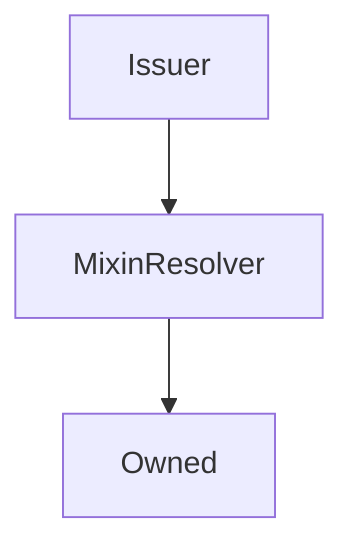

# Issuer

## Description

This contract does all the heavy lifting of issuing and burning `sUSD`. It's used primarily to reduce the size of the `Synthetix` contract

**Source:** [contracts/Issuer.sol](https://github.com/Synthetixio/synthetix/tree/v2.22.4/contracts/Issuer.sol)

## Architecture

### Libraries

- [SafeMath](/contracts/source/libraries/SafeMath) for `uint`
- [SafeDecimalMath](/contracts/source/libraries/SafeDecimalMath) for `uint`

### Inheritance Graph

### Related Contracts

<centered-image>
    
</centered-image>

??? example "Details"

    - [`FeePool`](FeePool.md): The Synthetix contract remits exchange fees as sUSD to the fee pool, and also uses it to keep track of historical issuance records for each issuer.
    - [`SynthetixState`](SynthetixState.md): This state contract stores the debt ledger and the current issuance information for synth issuers.

<!--
If any, see:

<centered-image>
    
</centered-image>
--->

## Constants

### `LAST_ISSUE_EVENT`

[Source](https://github.com/Synthetixio/synthetix/tree/v2.22.4/contracts/Issuer.sol#L29)

**Type:** `bytes32`

### `MAX_MINIMUM_STAKING_TIME`

[Source](https://github.com/Synthetixio/synthetix/tree/v2.22.4/contracts/Issuer.sol#L32)

**Type:** `uint256`

## Variables

### `minimumStakeTime`

[Source](https://github.com/Synthetixio/synthetix/tree/v2.22.4/contracts/Issuer.sol#L34)

**Type:** `uint256`

## Constructor

### `constructor`

[Source](https://github.com/Synthetixio/synthetix/tree/v2.22.4/contracts/Issuer.sol#L58)

??? example "Details"

    **Signature**

    `(address _owner, address _resolver)`

    **Visibility**

    `public`

    **State Mutability**

    `nonpayable`

## Views

### `canBurnSynths`

[Source](https://github.com/Synthetixio/synthetix/tree/v2.22.4/contracts/Issuer.sol#L98)

??? example "Details"

    **Signature**

    `canBurnSynths(address account) returns (bool)`

    **Visibility**

    `public`

    **State Mutability**

    `view`

### `lastIssueEvent`

[Source](https://github.com/Synthetixio/synthetix/tree/v2.22.4/contracts/Issuer.sol#L102)

??? example "Details"

    **Signature**

    `lastIssueEvent(address account) returns (uint256)`

    **Visibility**

    `public`

    **State Mutability**

    `view`

## Restricted Functions

### `burnSynths`

[Source](https://github.com/Synthetixio/synthetix/tree/v2.22.4/contracts/Issuer.sol#L185)

??? example "Details"

    **Signature**

    `burnSynths(address from, uint256 amount)`

    **Visibility**

    `external`

    **State Mutability**

    `nonpayable`

    **Modifiers**

    * [onlySynthetix](#onlysynthetix)

### `burnSynthsOnBehalf`

[Source](https://github.com/Synthetixio/synthetix/tree/v2.22.4/contracts/Issuer.sol#L176)

??? example "Details"

    **Signature**

    `burnSynthsOnBehalf(address burnForAddress, address from, uint256 amount)`

    **Visibility**

    `external`

    **State Mutability**

    `nonpayable`

    **Requires**

    * [require(..., Not approved to act on behalf)](https://github.com/Synthetixio/synthetix/tree/v2.22.4/contracts/Issuer.sol#L181)

    **Modifiers**

    * [onlySynthetix](#onlysynthetix)

### `burnSynthsToTarget`

[Source](https://github.com/Synthetixio/synthetix/tree/v2.22.4/contracts/Issuer.sol#L236)

??? example "Details"

    **Signature**

    `burnSynthsToTarget(address from)`

    **Visibility**

    `external`

    **State Mutability**

    `nonpayable`

    **Modifiers**

    * [onlySynthetix](#onlysynthetix)

### `burnSynthsToTargetOnBehalf`

[Source](https://github.com/Synthetixio/synthetix/tree/v2.22.4/contracts/Issuer.sol#L231)

??? example "Details"

    **Signature**

    `burnSynthsToTargetOnBehalf(address burnForAddress, address from)`

    **Visibility**

    `external`

    **State Mutability**

    `nonpayable`

    **Requires**

    * [require(..., Not approved to act on behalf)](https://github.com/Synthetixio/synthetix/tree/v2.22.4/contracts/Issuer.sol#L232)

    **Modifiers**

    * [onlySynthetix](#onlysynthetix)

### `issueMaxSynths`

[Source](https://github.com/Synthetixio/synthetix/tree/v2.22.4/contracts/Issuer.sol#L149)

??? example "Details"

    **Signature**

    `issueMaxSynths(address from)`

    **Visibility**

    `external`

    **State Mutability**

    `nonpayable`

    **Modifiers**

    * [onlySynthetix](#onlysynthetix)

### `issueMaxSynthsOnBehalf`

[Source](https://github.com/Synthetixio/synthetix/tree/v2.22.4/contracts/Issuer.sol#L134)

??? example "Details"

    **Signature**

    `issueMaxSynthsOnBehalf(address issueForAddress, address from)`

    **Visibility**

    `external`

    **State Mutability**

    `nonpayable`

    **Requires**

    * [require(..., Not approved to act on behalf)](https://github.com/Synthetixio/synthetix/tree/v2.22.4/contracts/Issuer.sol#L135)

    **Modifiers**

    * [onlySynthetix](#onlysynthetix)

### `issueSynths`

[Source](https://github.com/Synthetixio/synthetix/tree/v2.22.4/contracts/Issuer.sol#L141)

??? example "Details"

    **Signature**

    `issueSynths(address from, uint256 amount)`

    **Visibility**

    `external`

    **State Mutability**

    `nonpayable`

    **Requires**

    * [require(..., Amount too large)](https://github.com/Synthetixio/synthetix/tree/v2.22.4/contracts/Issuer.sol#L144)

    **Modifiers**

    * [onlySynthetix](#onlysynthetix)

### `issueSynthsOnBehalf`

[Source](https://github.com/Synthetixio/synthetix/tree/v2.22.4/contracts/Issuer.sol#L122)

??? example "Details"

    **Signature**

    `issueSynthsOnBehalf(address issueForAddress, address from, uint256 amount)`

    **Visibility**

    `external`

    **State Mutability**

    `nonpayable`

    **Requires**

    * [require(..., Not approved to act on behalf)](https://github.com/Synthetixio/synthetix/tree/v2.22.4/contracts/Issuer.sol#L127)

    * [require(..., Amount too large)](https://github.com/Synthetixio/synthetix/tree/v2.22.4/contracts/Issuer.sol#L130)

    **Modifiers**

    * [onlySynthetix](#onlysynthetix)

### `liquidateDelinquentAccount`

[Source](https://github.com/Synthetixio/synthetix/tree/v2.22.4/contracts/Issuer.sol#L288)

??? example "Details"

    **Signature**

    `liquidateDelinquentAccount(address account, uint256 susdAmount, address liquidator) returns (uint256, uint256)`

    **Visibility**

    `external`

    **State Mutability**

    `nonpayable`

    **Requires**

    * [require(..., sUSD needs to be settled)](https://github.com/Synthetixio/synthetix/tree/v2.22.4/contracts/Issuer.sol#L294)

    * [require(..., Account not open for liquidation)](https://github.com/Synthetixio/synthetix/tree/v2.22.4/contracts/Issuer.sol#L298)

    * [require(..., Not enough sUSD)](https://github.com/Synthetixio/synthetix/tree/v2.22.4/contracts/Issuer.sol#L301)

    **Modifiers**

    * [onlySynthetix](#onlysynthetix)

### `setMinimumStakeTime`

[Source](https://github.com/Synthetixio/synthetix/tree/v2.22.4/contracts/Issuer.sol#L109)

??? example "Details"

    **Signature**

    `setMinimumStakeTime(uint256 _seconds)`

    **Visibility**

    `external`

    **State Mutability**

    `nonpayable`

    **Requires**

    * [require(..., stake time exceed maximum 1 week)](https://github.com/Synthetixio/synthetix/tree/v2.22.4/contracts/Issuer.sol#L111)

    **Modifiers**

    * [onlyOwner](#onlyowner)

    **Emits**

    * [MinimumStakeTimeUpdated](#minimumstaketimeupdated)

## Internal Functions

### `_addToDebtRegister`

[Source](https://github.com/Synthetixio/synthetix/tree/v2.22.4/contracts/Issuer.sol#L364)

??? example "Details"

    **Signature**

    `_addToDebtRegister(address from, uint256 amount, uint256 existingDebt, uint256 totalDebtIssued)`

    **Visibility**

    `internal`

    **State Mutability**

    `nonpayable`

### `_appendAccountIssuanceRecord`

[Source](https://github.com/Synthetixio/synthetix/tree/v2.22.4/contracts/Issuer.sol#L351)

??? example "Details"

    **Signature**

    `_appendAccountIssuanceRecord(address from)`

    **Visibility**

    `internal`

    **State Mutability**

    `nonpayable`

### `_burnSynths`

[Source](https://github.com/Synthetixio/synthetix/tree/v2.22.4/contracts/Issuer.sol#L190)

??? example "Details"

    **Signature**

    `_burnSynths(address from, uint256 amount)`

    **Visibility**

    `internal`

    **State Mutability**

    `nonpayable`

    **Requires**

    * [require(..., Minimum stake time not reached)](https://github.com/Synthetixio/synthetix/tree/v2.22.4/contracts/Issuer.sol#L191)

    * [require(..., No debt to forgive)](https://github.com/Synthetixio/synthetix/tree/v2.22.4/contracts/Issuer.sol#L199)

### `_burnSynthsForLiquidation`

[Source](https://github.com/Synthetixio/synthetix/tree/v2.22.4/contracts/Issuer.sol#L212)

??? example "Details"

    **Signature**

    `_burnSynthsForLiquidation(address burnForAddress, address liquidator, uint256 amount, uint256 existingDebt, uint256 totalDebtIssued)`

    **Visibility**

    `internal`

    **State Mutability**

    `nonpayable`

### `_burnSynthsToTarget`

[Source](https://github.com/Synthetixio/synthetix/tree/v2.22.4/contracts/Issuer.sol#L242)

??? example "Details"

    **Signature**

    `_burnSynthsToTarget(address from)`

    **Visibility**

    `internal`

    **State Mutability**

    `nonpayable`

    **Requires**

    * [require(..., No debt to forgive)](https://github.com/Synthetixio/synthetix/tree/v2.22.4/contracts/Issuer.sol#L246)

### `_internalBurnSynths`

[Source](https://github.com/Synthetixio/synthetix/tree/v2.22.4/contracts/Issuer.sol#L259)

??? example "Details"

    **Signature**

    `_internalBurnSynths(address from, uint256 amount, uint256 existingDebt, uint256 totalSystemValue, uint256 maxIssuableSynths)`

    **Visibility**

    `internal`

    **State Mutability**

    `nonpayable`

### `_internalIssueSynths`

[Source](https://github.com/Synthetixio/synthetix/tree/v2.22.4/contracts/Issuer.sol#L157)

??? example "Details"

    **Signature**

    `_internalIssueSynths(address from, uint256 amount, uint256 existingDebt, uint256 totalSystemDebt)`

    **Visibility**

    `internal`

    **State Mutability**

    `nonpayable`

### `_removeFromDebtRegister`

[Source](https://github.com/Synthetixio/synthetix/tree/v2.22.4/contracts/Issuer.sol#L412)

??? example "Details"

    **Signature**

    `_removeFromDebtRegister(address from, uint256 amount, uint256 existingDebt, uint256 totalDebtIssued)`

    **Visibility**

    `internal`

    **State Mutability**

    `nonpayable`

### `_setLastIssueEvent`

[Source](https://github.com/Synthetixio/synthetix/tree/v2.22.4/contracts/Issuer.sol#L117)

??? example "Details"

    **Signature**

    `_setLastIssueEvent(address account)`

    **Visibility**

    `internal`

    **State Mutability**

    `nonpayable`

### `delegateApprovals`

[Source](https://github.com/Synthetixio/synthetix/tree/v2.22.4/contracts/Issuer.sol#L85)

??? example "Details"

    **Signature**

    `delegateApprovals() returns (contract IDelegateApprovals)`

    **Visibility**

    `internal`

    **State Mutability**

    `view`

### `exchangeRates`

[Source](https://github.com/Synthetixio/synthetix/tree/v2.22.4/contracts/Issuer.sol#L69)

??? example "Details"

    **Signature**

    `exchangeRates() returns (contract IExchangeRates)`

    **Visibility**

    `internal`

    **State Mutability**

    `view`

### `exchanger`

[Source](https://github.com/Synthetixio/synthetix/tree/v2.22.4/contracts/Issuer.sol#L65)

??? example "Details"

    **Signature**

    `exchanger() returns (contract IExchanger)`

    **Visibility**

    `internal`

    **State Mutability**

    `view`

### `feePool`

[Source](https://github.com/Synthetixio/synthetix/tree/v2.22.4/contracts/Issuer.sol#L77)

??? example "Details"

    **Signature**

    `feePool() returns (contract IFeePool)`

    **Visibility**

    `internal`

    **State Mutability**

    `view`

### `issuanceEternalStorage`

[Source](https://github.com/Synthetixio/synthetix/tree/v2.22.4/contracts/Issuer.sol#L89)

??? example "Details"

    **Signature**

    `issuanceEternalStorage() returns (contract IssuanceEternalStorage)`

    **Visibility**

    `internal`

    **State Mutability**

    `view`

### `liquidations`

[Source](https://github.com/Synthetixio/synthetix/tree/v2.22.4/contracts/Issuer.sol#L81)

??? example "Details"

    **Signature**

    `liquidations() returns (contract ILiquidations)`

    **Visibility**

    `internal`

    **State Mutability**

    `view`

### `synthetix`

[Source](https://github.com/Synthetixio/synthetix/tree/v2.22.4/contracts/Issuer.sol#L61)

??? example "Details"

    **Signature**

    `synthetix() returns (contract ISynthetix)`

    **Visibility**

    `internal`

    **State Mutability**

    `view`

### `synthetixState`

[Source](https://github.com/Synthetixio/synthetix/tree/v2.22.4/contracts/Issuer.sol#L73)

??? example "Details"

    **Signature**

    `synthetixState() returns (contract ISynthetixState)`

    **Visibility**

    `internal`

    **State Mutability**

    `view`

## Modifiers

### `onlySynthetix`

[Source](https://github.com/Synthetixio/synthetix/tree/v2.22.4/contracts/Issuer.sol#L458)

## Events

### `MinimumStakeTimeUpdated`

[Source](https://github.com/Synthetixio/synthetix/tree/v2.22.4/contracts/Issuer.sol#L465)

**Signature**: `MinimumStakeTimeUpdated(uint256 minimumStakeTime)`
