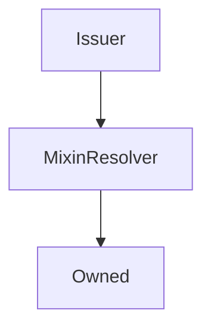

# Issuer

## Description

This contract does all the heavy lifting of issuing and burning `sUSD`. It's used primarily to reduce the size of the `Synthetix` contract

**Source:** [contracts/Issuer.sol](https://github.com/Synthetixio/synthetix/tree/v2.26.0-alpha/contracts/Issuer.sol)

## Architecture

### Libraries

- [SafeMath](/contracts/source/libraries/SafeMath) for `uint`
- [SafeDecimalMath](/contracts/source/libraries/SafeDecimalMath) for `uint`

### Inheritance Graph

### Related Contracts

<centered-image>
    
</centered-image>

??? example "Details"

    - [`FeePool`](FeePool.md): The Synthetix contract remits exchange fees as sUSD to the fee pool, and also uses it to keep track of historical issuance records for each issuer.
    - [`SynthetixState`](SynthetixState.md): This state contract stores the debt ledger and the current issuance information for synth issuers.

<!--
If any, see:

<centered-image>
    
</centered-image>
--->

## Constants

### `LAST_ISSUE_EVENT`

[Source](https://github.com/Synthetixio/synthetix/tree/v2.26.0-alpha/contracts/Issuer.sol#L33)

**Type:** `bytes32`

### `MAX_MINIMUM_STAKING_TIME`

[Source](https://github.com/Synthetixio/synthetix/tree/v2.26.0-alpha/contracts/Issuer.sol#L36)

**Type:** `uint256`

## Variables

### `availableSynths`

[Source](https://github.com/Synthetixio/synthetix/tree/v2.26.0-alpha/contracts/Issuer.sol#L41)

**Type:** `contract ISynth[]`

### `minimumStakeTime`

[Source](https://github.com/Synthetixio/synthetix/tree/v2.26.0-alpha/contracts/Issuer.sol#L38)

**Type:** `uint256`

### `synths`

[Source](https://github.com/Synthetixio/synthetix/tree/v2.26.0-alpha/contracts/Issuer.sol#L42)

**Type:** `mapping(bytes32 => contract ISynth)`

### `synthsByAddress`

[Source](https://github.com/Synthetixio/synthetix/tree/v2.26.0-alpha/contracts/Issuer.sol#L43)

**Type:** `mapping(address => bytes32)`

## Constructor

### `constructor`

[Source](https://github.com/Synthetixio/synthetix/tree/v2.26.0-alpha/contracts/Issuer.sol#L73)

??? example "Details"

    **Signature**

    `(address _owner, address _resolver)`

    **Visibility**

    `public`

    **State Mutability**

    `nonpayable`

## Views

### `anySynthOrSNXRateIsStale`

[Source](https://github.com/Synthetixio/synthetix/tree/v2.26.0-alpha/contracts/Issuer.sol#L298)

??? example "Details"

    **Signature**

    `anySynthOrSNXRateIsStale() returns (bool)`

    **Visibility**

    `external`

    **State Mutability**

    `view`

### `availableCurrencyKeys`

[Source](https://github.com/Synthetixio/synthetix/tree/v2.26.0-alpha/contracts/Issuer.sol#L290)

??? example "Details"

    **Signature**

    `availableCurrencyKeys() returns (bytes32[])`

    **Visibility**

    `external`

    **State Mutability**

    `view`

### `availableSynthCount`

[Source](https://github.com/Synthetixio/synthetix/tree/v2.26.0-alpha/contracts/Issuer.sol#L294)

??? example "Details"

    **Signature**

    `availableSynthCount() returns (uint256)`

    **Visibility**

    `external`

    **State Mutability**

    `view`

### `canBurnSynths`

[Source](https://github.com/Synthetixio/synthetix/tree/v2.26.0-alpha/contracts/Issuer.sol#L286)

??? example "Details"

    **Signature**

    `canBurnSynths(address account) returns (bool)`

    **Visibility**

    `external`

    **State Mutability**

    `view`

### `collateral`

[Source](https://github.com/Synthetixio/synthetix/tree/v2.26.0-alpha/contracts/Issuer.sol#L324)

??? example "Details"

    **Signature**

    `collateral(address account) returns (uint256)`

    **Visibility**

    `external`

    **State Mutability**

    `view`

### `collateralisationRatio`

[Source](https://github.com/Synthetixio/synthetix/tree/v2.26.0-alpha/contracts/Issuer.sol#L312)

??? example "Details"

    **Signature**

    `collateralisationRatio(address _issuer) returns (uint256)`

    **Visibility**

    `external`

    **State Mutability**

    `view`

### `collateralisationRatioAndAnyRatesStale`

[Source](https://github.com/Synthetixio/synthetix/tree/v2.26.0-alpha/contracts/Issuer.sol#L316)

??? example "Details"

    **Signature**

    `collateralisationRatioAndAnyRatesStale(address _issuer) returns (uint256, bool)`

    **Visibility**

    `external`

    **State Mutability**

    `view`

### `debtBalanceOf`

[Source](https://github.com/Synthetixio/synthetix/tree/v2.26.0-alpha/contracts/Issuer.sol#L328)

??? example "Details"

    **Signature**

    `debtBalanceOf(address _issuer, bytes32 currencyKey) returns (uint256)`

    **Visibility**

    `external`

    **State Mutability**

    `view`

### `lastIssueEvent`

[Source](https://github.com/Synthetixio/synthetix/tree/v2.26.0-alpha/contracts/Issuer.sol#L308)

??? example "Details"

    **Signature**

    `lastIssueEvent(address account) returns (uint256)`

    **Visibility**

    `external`

    **State Mutability**

    `view`

### `maxIssuableSynths`

[Source](https://github.com/Synthetixio/synthetix/tree/v2.26.0-alpha/contracts/Issuer.sol#L352)

??? example "Details"

    **Signature**

    `maxIssuableSynths(address _issuer) returns (uint256)`

    **Visibility**

    `external`

    **State Mutability**

    `view`

### `remainingIssuableSynths`

[Source](https://github.com/Synthetixio/synthetix/tree/v2.26.0-alpha/contracts/Issuer.sol#L340)

??? example "Details"

    **Signature**

    `remainingIssuableSynths(address _issuer) returns (uint256, uint256, uint256)`

    **Visibility**

    `external`

    **State Mutability**

    `view`

### `totalIssuedSynths`

[Source](https://github.com/Synthetixio/synthetix/tree/v2.26.0-alpha/contracts/Issuer.sol#L304)

??? example "Details"

    **Signature**

    `totalIssuedSynths(bytes32 currencyKey, bool excludeEtherCollateral) returns (uint256)`

    **Visibility**

    `external`

    **State Mutability**

    `view`

### `transferableSynthetixAndAnyRateIsStale`

[Source](https://github.com/Synthetixio/synthetix/tree/v2.26.0-alpha/contracts/Issuer.sol#L356)

??? example "Details"

    **Signature**

    `transferableSynthetixAndAnyRateIsStale(address account, uint256 balance) returns (uint256, bool)`

    **Visibility**

    `external`

    **State Mutability**

    `view`

## Restricted Functions

### `addSynth`

[Source](https://github.com/Synthetixio/synthetix/tree/v2.26.0-alpha/contracts/Issuer.sol#L392)

??? example "Details"

    **Signature**

    `addSynth(contract ISynth synth)`

    **Visibility**

    `external`

    **State Mutability**

    `nonpayable`

    **Requires**

    * [require(..., Synth already exists)](https://github.com/Synthetixio/synthetix/tree/v2.26.0-alpha/contracts/Issuer.sol#L395)

    * [require(..., Synth address already exists)](https://github.com/Synthetixio/synthetix/tree/v2.26.0-alpha/contracts/Issuer.sol#L396)

    **Modifiers**

    * [onlyOwner](#onlyowner)

    **Emits**

    * [SynthAdded](#synthadded)

### `burnSynths`

[Source](https://github.com/Synthetixio/synthetix/tree/v2.26.0-alpha/contracts/Issuer.sol#L496)

??? example "Details"

    **Signature**

    `burnSynths(address from, uint256 amount)`

    **Visibility**

    `external`

    **State Mutability**

    `nonpayable`

    **Modifiers**

    * [onlySynthetix](#onlysynthetix)

### `burnSynthsOnBehalf`

[Source](https://github.com/Synthetixio/synthetix/tree/v2.26.0-alpha/contracts/Issuer.sol#L487)

??? example "Details"

    **Signature**

    `burnSynthsOnBehalf(address burnForAddress, address from, uint256 amount)`

    **Visibility**

    `external`

    **State Mutability**

    `nonpayable`

    **Requires**

    * [require(..., Not approved to act on behalf)](https://github.com/Synthetixio/synthetix/tree/v2.26.0-alpha/contracts/Issuer.sol#L492)

    **Modifiers**

    * [onlySynthetix](#onlysynthetix)

### `burnSynthsToTarget`

[Source](https://github.com/Synthetixio/synthetix/tree/v2.26.0-alpha/contracts/Issuer.sol#L570)

??? example "Details"

    **Signature**

    `burnSynthsToTarget(address from)`

    **Visibility**

    `external`

    **State Mutability**

    `nonpayable`

    **Modifiers**

    * [onlySynthetix](#onlysynthetix)

### `burnSynthsToTargetOnBehalf`

[Source](https://github.com/Synthetixio/synthetix/tree/v2.26.0-alpha/contracts/Issuer.sol#L565)

??? example "Details"

    **Signature**

    `burnSynthsToTargetOnBehalf(address burnForAddress, address from)`

    **Visibility**

    `external`

    **State Mutability**

    `nonpayable`

    **Requires**

    * [require(..., Not approved to act on behalf)](https://github.com/Synthetixio/synthetix/tree/v2.26.0-alpha/contracts/Issuer.sol#L566)

    **Modifiers**

    * [onlySynthetix](#onlysynthetix)

### `issueMaxSynths`

[Source](https://github.com/Synthetixio/synthetix/tree/v2.26.0-alpha/contracts/Issuer.sol#L478)

??? example "Details"

    **Signature**

    `issueMaxSynths(address from)`

    **Visibility**

    `external`

    **State Mutability**

    `nonpayable`

    **Requires**

    * [require(..., A synth or SNX rate is stale)](https://github.com/Synthetixio/synthetix/tree/v2.26.0-alpha/contracts/Issuer.sol#L482)

    **Modifiers**

    * [onlySynthetix](#onlysynthetix)

### `issueMaxSynthsOnBehalf`

[Source](https://github.com/Synthetixio/synthetix/tree/v2.26.0-alpha/contracts/Issuer.sol#L455)

??? example "Details"

    **Signature**

    `issueMaxSynthsOnBehalf(address issueForAddress, address from)`

    **Visibility**

    `external`

    **State Mutability**

    `nonpayable`

    **Requires**

    * [require(..., Not approved to act on behalf)](https://github.com/Synthetixio/synthetix/tree/v2.26.0-alpha/contracts/Issuer.sol#L456)

    * [require(..., A synth or SNX rate is stale)](https://github.com/Synthetixio/synthetix/tree/v2.26.0-alpha/contracts/Issuer.sol#L462)

    **Modifiers**

    * [onlySynthetix](#onlysynthetix)

### `issueSynths`

[Source](https://github.com/Synthetixio/synthetix/tree/v2.26.0-alpha/contracts/Issuer.sol#L467)

??? example "Details"

    **Signature**

    `issueSynths(address from, uint256 amount)`

    **Visibility**

    `external`

    **State Mutability**

    `nonpayable`

    **Requires**

    * [require(..., A synth or SNX rate is stale)](https://github.com/Synthetixio/synthetix/tree/v2.26.0-alpha/contracts/Issuer.sol#L471)

    * [require(..., Amount too large)](https://github.com/Synthetixio/synthetix/tree/v2.26.0-alpha/contracts/Issuer.sol#L473)

    **Modifiers**

    * [onlySynthetix](#onlysynthetix)

### `issueSynthsOnBehalf`

[Source](https://github.com/Synthetixio/synthetix/tree/v2.26.0-alpha/contracts/Issuer.sol#L437)

??? example "Details"

    **Signature**

    `issueSynthsOnBehalf(address issueForAddress, address from, uint256 amount)`

    **Visibility**

    `external`

    **State Mutability**

    `nonpayable`

    **Requires**

    * [require(..., Not approved to act on behalf)](https://github.com/Synthetixio/synthetix/tree/v2.26.0-alpha/contracts/Issuer.sol#L442)

    * [require(..., A synth or SNX rate is stale)](https://github.com/Synthetixio/synthetix/tree/v2.26.0-alpha/contracts/Issuer.sol#L448)

    * [require(..., Amount too large)](https://github.com/Synthetixio/synthetix/tree/v2.26.0-alpha/contracts/Issuer.sol#L450)

    **Modifiers**

    * [onlySynthetix](#onlysynthetix)

### `liquidateDelinquentAccount`

[Source](https://github.com/Synthetixio/synthetix/tree/v2.26.0-alpha/contracts/Issuer.sol#L622)

??? example "Details"

    **Signature**

    `liquidateDelinquentAccount(address account, uint256 susdAmount, address liquidator) returns (uint256, uint256)`

    **Visibility**

    `external`

    **State Mutability**

    `nonpayable`

    **Requires**

    * [require(..., sUSD needs to be settled)](https://github.com/Synthetixio/synthetix/tree/v2.26.0-alpha/contracts/Issuer.sol#L628)

    * [require(..., Account not open for liquidation)](https://github.com/Synthetixio/synthetix/tree/v2.26.0-alpha/contracts/Issuer.sol#L632)

    * [require(..., Not enough sUSD)](https://github.com/Synthetixio/synthetix/tree/v2.26.0-alpha/contracts/Issuer.sol#L635)

    * [require(..., A synth or SNX rate is stale)](https://github.com/Synthetixio/synthetix/tree/v2.26.0-alpha/contracts/Issuer.sol#L647)

    **Modifiers**

    * [onlySynthetix](#onlysynthetix)

### `removeSynth`

[Source](https://github.com/Synthetixio/synthetix/tree/v2.26.0-alpha/contracts/Issuer.sol#L405)

??? example "Details"

    **Signature**

    `removeSynth(bytes32 currencyKey)`

    **Visibility**

    `external`

    **State Mutability**

    `nonpayable`

    **Requires**

    * [require(..., Synth does not exist)](https://github.com/Synthetixio/synthetix/tree/v2.26.0-alpha/contracts/Issuer.sol#L406)

    * [require(..., Synth supply exists)](https://github.com/Synthetixio/synthetix/tree/v2.26.0-alpha/contracts/Issuer.sol#L407)

    * [require(..., Cannot remove synth)](https://github.com/Synthetixio/synthetix/tree/v2.26.0-alpha/contracts/Issuer.sol#L408)

    **Modifiers**

    * [onlyOwner](#onlyowner)

    **Emits**

    * [SynthRemoved](#synthremoved)

### `setMinimumStakeTime`

[Source](https://github.com/Synthetixio/synthetix/tree/v2.26.0-alpha/contracts/Issuer.sol#L383)

??? example "Details"

    **Signature**

    `setMinimumStakeTime(uint256 _seconds)`

    **Visibility**

    `external`

    **State Mutability**

    `nonpayable`

    **Requires**

    * [require(..., stake time exceed maximum 1 week)](https://github.com/Synthetixio/synthetix/tree/v2.26.0-alpha/contracts/Issuer.sol#L385)

    **Modifiers**

    * [onlyOwner](#onlyowner)

    **Emits**

    * [MinimumStakeTimeUpdated](#minimumstaketimeupdated)

## Internal Functions

### `_addToDebtRegister`

[Source](https://github.com/Synthetixio/synthetix/tree/v2.26.0-alpha/contracts/Issuer.sol#L697)

??? example "Details"

    **Signature**

    `_addToDebtRegister(address from, uint256 amount, uint256 existingDebt, uint256 totalDebtIssued)`

    **Visibility**

    `internal`

    **State Mutability**

    `nonpayable`

### `_appendAccountIssuanceRecord`

[Source](https://github.com/Synthetixio/synthetix/tree/v2.26.0-alpha/contracts/Issuer.sol#L689)

??? example "Details"

    **Signature**

    `_appendAccountIssuanceRecord(address from)`

    **Visibility**

    `internal`

    **State Mutability**

    `nonpayable`

### `_availableCurrencyKeysWithOptionalSNX`

[Source](https://github.com/Synthetixio/synthetix/tree/v2.26.0-alpha/contracts/Issuer.sol#L127)

??? example "Details"

    **Signature**

    `_availableCurrencyKeysWithOptionalSNX(bool withSNX) returns (bytes32[])`

    **Visibility**

    `internal`

    **State Mutability**

    `view`

### `_burnSynths`

[Source](https://github.com/Synthetixio/synthetix/tree/v2.26.0-alpha/contracts/Issuer.sol#L522)

??? example "Details"

    **Signature**

    `_burnSynths(address from, uint256 amount)`

    **Visibility**

    `internal`

    **State Mutability**

    `nonpayable`

    **Requires**

    * [require(..., Minimum stake time not reached)](https://github.com/Synthetixio/synthetix/tree/v2.26.0-alpha/contracts/Issuer.sol#L523)

    * [require(..., A synth or SNX rate is stale)](https://github.com/Synthetixio/synthetix/tree/v2.26.0-alpha/contracts/Issuer.sol#L531)

    * [require(..., No debt to forgive)](https://github.com/Synthetixio/synthetix/tree/v2.26.0-alpha/contracts/Issuer.sol#L533)

### `_burnSynthsForLiquidation`

[Source](https://github.com/Synthetixio/synthetix/tree/v2.26.0-alpha/contracts/Issuer.sol#L546)

??? example "Details"

    **Signature**

    `_burnSynthsForLiquidation(address burnForAddress, address liquidator, uint256 amount, uint256 existingDebt, uint256 totalDebtIssued)`

    **Visibility**

    `internal`

    **State Mutability**

    `nonpayable`

### `_burnSynthsToTarget`

[Source](https://github.com/Synthetixio/synthetix/tree/v2.26.0-alpha/contracts/Issuer.sol#L576)

??? example "Details"

    **Signature**

    `_burnSynthsToTarget(address from)`

    **Visibility**

    `internal`

    **State Mutability**

    `nonpayable`

    **Requires**

    * [require(..., A synth or SNX rate is stale)](https://github.com/Synthetixio/synthetix/tree/v2.26.0-alpha/contracts/Issuer.sol#L580)

    * [require(..., No debt to forgive)](https://github.com/Synthetixio/synthetix/tree/v2.26.0-alpha/contracts/Issuer.sol#L582)

### `_canBurnSynths`

[Source](https://github.com/Synthetixio/synthetix/tree/v2.26.0-alpha/contracts/Issuer.sol#L222)

??? example "Details"

    **Signature**

    `_canBurnSynths(address account) returns (bool)`

    **Visibility**

    `internal`

    **State Mutability**

    `view`

### `_collateral`

[Source](https://github.com/Synthetixio/synthetix/tree/v2.26.0-alpha/contracts/Issuer.sol#L270)

??? example "Details"

    **Signature**

    `_collateral(address account) returns (uint256)`

    **Visibility**

    `internal`

    **State Mutability**

    `view`

### `_collateralisationRatio`

[Source](https://github.com/Synthetixio/synthetix/tree/v2.26.0-alpha/contracts/Issuer.sol#L259)

??? example "Details"

    **Signature**

    `_collateralisationRatio(address _issuer) returns (uint256, bool)`

    **Visibility**

    `internal`

    **State Mutability**

    `view`

### `_debtBalanceOfAndTotalDebt`

[Source](https://github.com/Synthetixio/synthetix/tree/v2.26.0-alpha/contracts/Issuer.sol#L182)

??? example "Details"

    **Signature**

    `_debtBalanceOfAndTotalDebt(address _issuer, bytes32 currencyKey) returns (uint256, uint256, bool)`

    **Visibility**

    `internal`

    **State Mutability**

    `view`

### `_internalBurnSynths`

[Source](https://github.com/Synthetixio/synthetix/tree/v2.26.0-alpha/contracts/Issuer.sol#L593)

??? example "Details"

    **Signature**

    `_internalBurnSynths(address from, uint256 amount, uint256 existingDebt, uint256 totalSystemValue, uint256 maxIssuableSynthsForAccount)`

    **Visibility**

    `internal`

    **State Mutability**

    `nonpayable`

### `_internalIssueSynths`

[Source](https://github.com/Synthetixio/synthetix/tree/v2.26.0-alpha/contracts/Issuer.sol#L502)

??? example "Details"

    **Signature**

    `_internalIssueSynths(address from, uint256 amount, uint256 existingDebt, uint256 totalSystemDebt)`

    **Visibility**

    `internal`

    **State Mutability**

    `nonpayable`

### `_lastIssueEvent`

[Source](https://github.com/Synthetixio/synthetix/tree/v2.26.0-alpha/contracts/Issuer.sol#L226)

??? example "Details"

    **Signature**

    `_lastIssueEvent(address account) returns (uint256)`

    **Visibility**

    `internal`

    **State Mutability**

    `view`

### `_maxIssuableSynths`

[Source](https://github.com/Synthetixio/synthetix/tree/v2.26.0-alpha/contracts/Issuer.sol#L251)

??? example "Details"

    **Signature**

    `_maxIssuableSynths(address _issuer) returns (uint256)`

    **Visibility**

    `internal`

    **State Mutability**

    `view`

### `_remainingIssuableSynths`

[Source](https://github.com/Synthetixio/synthetix/tree/v2.26.0-alpha/contracts/Issuer.sol#L231)

??? example "Details"

    **Signature**

    `_remainingIssuableSynths(address _issuer) returns (uint256, uint256, uint256, bool)`

    **Visibility**

    `internal`

    **State Mutability**

    `view`

### `_removeFromDebtRegister`

[Source](https://github.com/Synthetixio/synthetix/tree/v2.26.0-alpha/contracts/Issuer.sol#L739)

??? example "Details"

    **Signature**

    `_removeFromDebtRegister(address from, uint256 amount, uint256 existingDebt, uint256 totalDebtIssued)`

    **Visibility**

    `internal`

    **State Mutability**

    `nonpayable`

### `_setLastIssueEvent`

[Source](https://github.com/Synthetixio/synthetix/tree/v2.26.0-alpha/contracts/Issuer.sol#L684)

??? example "Details"

    **Signature**

    `_setLastIssueEvent(address account)`

    **Visibility**

    `internal`

    **State Mutability**

    `nonpayable`

### `_totalIssuedSynths`

[Source](https://github.com/Synthetixio/synthetix/tree/v2.26.0-alpha/contracts/Issuer.sol#L141)

??? example "Details"

    **Signature**

    `_totalIssuedSynths(bytes32 currencyKey, bool excludeEtherCollateral) returns (uint256, bool)`

    **Visibility**

    `internal`

    **State Mutability**

    `view`

### `delegateApprovals`

[Source](https://github.com/Synthetixio/synthetix/tree/v2.26.0-alpha/contracts/Issuer.sol#L104)

??? example "Details"

    **Signature**

    `delegateApprovals() returns (contract IDelegateApprovals)`

    **Visibility**

    `internal`

    **State Mutability**

    `view`

### `etherCollateral`

[Source](https://github.com/Synthetixio/synthetix/tree/v2.26.0-alpha/contracts/Issuer.sol#L115)

??? example "Details"

    **Signature**

    `etherCollateral() returns (contract IEtherCollateral)`

    **Visibility**

    `internal`

    **State Mutability**

    `view`

### `exchangeRates`

[Source](https://github.com/Synthetixio/synthetix/tree/v2.26.0-alpha/contracts/Issuer.sol#L88)

??? example "Details"

    **Signature**

    `exchangeRates() returns (contract IExchangeRates)`

    **Visibility**

    `internal`

    **State Mutability**

    `view`

### `exchanger`

[Source](https://github.com/Synthetixio/synthetix/tree/v2.26.0-alpha/contracts/Issuer.sol#L84)

??? example "Details"

    **Signature**

    `exchanger() returns (contract IExchanger)`

    **Visibility**

    `internal`

    **State Mutability**

    `view`

### `feePool`

[Source](https://github.com/Synthetixio/synthetix/tree/v2.26.0-alpha/contracts/Issuer.sol#L96)

??? example "Details"

    **Signature**

    `feePool() returns (contract IFeePool)`

    **Visibility**

    `internal`

    **State Mutability**

    `view`

### `issuanceEternalStorage`

[Source](https://github.com/Synthetixio/synthetix/tree/v2.26.0-alpha/contracts/Issuer.sol#L108)

??? example "Details"

    **Signature**

    `issuanceEternalStorage() returns (contract IssuanceEternalStorage)`

    **Visibility**

    `internal`

    **State Mutability**

    `view`

### `liquidations`

[Source](https://github.com/Synthetixio/synthetix/tree/v2.26.0-alpha/contracts/Issuer.sol#L100)

??? example "Details"

    **Signature**

    `liquidations() returns (contract ILiquidations)`

    **Visibility**

    `internal`

    **State Mutability**

    `view`

### `rewardEscrow`

[Source](https://github.com/Synthetixio/synthetix/tree/v2.26.0-alpha/contracts/Issuer.sol#L119)

??? example "Details"

    **Signature**

    `rewardEscrow() returns (contract IRewardEscrow)`

    **Visibility**

    `internal`

    **State Mutability**

    `view`

### `synthetix`

[Source](https://github.com/Synthetixio/synthetix/tree/v2.26.0-alpha/contracts/Issuer.sol#L76)

??? example "Details"

    **Signature**

    `synthetix() returns (contract ISynthetix)`

    **Visibility**

    `internal`

    **State Mutability**

    `view`

### `synthetixERC20`

[Source](https://github.com/Synthetixio/synthetix/tree/v2.26.0-alpha/contracts/Issuer.sol#L80)

??? example "Details"

    **Signature**

    `synthetixERC20() returns (contract IERC20)`

    **Visibility**

    `internal`

    **State Mutability**

    `view`

### `synthetixEscrow`

[Source](https://github.com/Synthetixio/synthetix/tree/v2.26.0-alpha/contracts/Issuer.sol#L123)

??? example "Details"

    **Signature**

    `synthetixEscrow() returns (contract IHasBalance)`

    **Visibility**

    `internal`

    **State Mutability**

    `view`

### `synthetixState`

[Source](https://github.com/Synthetixio/synthetix/tree/v2.26.0-alpha/contracts/Issuer.sol#L92)

??? example "Details"

    **Signature**

    `synthetixState() returns (contract ISynthetixState)`

    **Visibility**

    `internal`

    **State Mutability**

    `view`

## Modifiers

### `onlySynthetix`

[Source](https://github.com/Synthetixio/synthetix/tree/v2.26.0-alpha/contracts/Issuer.sol#L785)

## Events

### `MinimumStakeTimeUpdated`

[Source](https://github.com/Synthetixio/synthetix/tree/v2.26.0-alpha/contracts/Issuer.sol#L792)

**Signature**: `MinimumStakeTimeUpdated(uint256 minimumStakeTime)`

### `SynthAdded`

[Source](https://github.com/Synthetixio/synthetix/tree/v2.26.0-alpha/contracts/Issuer.sol#L794)

**Signature**: `SynthAdded(bytes32 currencyKey, address synth)`

### `SynthRemoved`

[Source](https://github.com/Synthetixio/synthetix/tree/v2.26.0-alpha/contracts/Issuer.sol#L795)

**Signature**: `SynthRemoved(bytes32 currencyKey, address synth)`
