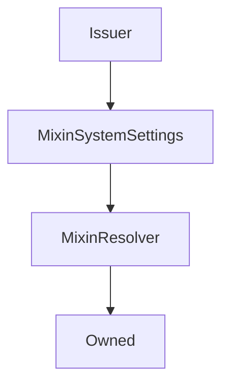

# Issuer

## Description

This contract does all the heavy lifting of issuing and burning `sUSD`. It's used primarily to reduce the size of the `Synthetix` contract

**Source:** [contracts/Issuer.sol](https://github.com/Synthetixio/synthetix/tree/v2.29.1-alpha/contracts/Issuer.sol)

## Architecture

### Libraries

- [SafeMath](/contracts/source/libraries/SafeMath) for `uint`
- [SafeDecimalMath](/contracts/source/libraries/SafeDecimalMath) for `uint`

### Inheritance Graph

### Related Contracts

<centered-image>
    
</centered-image>

??? example "Details"

    - [`FeePool`](FeePool.md): The Synthetix contract remits exchange fees as sUSD to the fee pool, and also uses it to keep track of historical issuance records for each issuer.
    - [`SynthetixState`](SynthetixState.md): This state contract stores the debt ledger and the current issuance information for synth issuers.

<!--
If any, see:

<centered-image>
    
</centered-image>
--->

## Constants

### `CONTRACT_NAME`

[Source](https://github.com/Synthetixio/synthetix/tree/v2.29.1-alpha/contracts/Issuer.sol#L47)

**Type:** `bytes32`

## Variables

### `availableSynths`

[Source](https://github.com/Synthetixio/synthetix/tree/v2.29.1-alpha/contracts/Issuer.sol#L35)

**Type:** `contract ISynth[]`

### `synths`

[Source](https://github.com/Synthetixio/synthetix/tree/v2.29.1-alpha/contracts/Issuer.sol#L36)

**Type:** `mapping(bytes32 => contract ISynth)`

### `synthsByAddress`

[Source](https://github.com/Synthetixio/synthetix/tree/v2.29.1-alpha/contracts/Issuer.sol#L37)

**Type:** `mapping(address => bytes32)`

## Constructor

### `constructor`

[Source](https://github.com/Synthetixio/synthetix/tree/v2.29.1-alpha/contracts/Issuer.sol#L85)

??? example "Details"

    **Signature**

    `(address _owner, address _resolver)`

    **Visibility**

    `public`

    **State Mutability**

    `nonpayable`

## Views

### `anySynthOrSNXRateIsInvalid`

[Source](https://github.com/Synthetixio/synthetix/tree/v2.29.1-alpha/contracts/Issuer.sol#L361)

??? example "Details"

    **Signature**

    `anySynthOrSNXRateIsInvalid() returns (bool)`

    **Visibility**

    `external`

    **State Mutability**

    `view`

### `availableCurrencyKeys`

[Source](https://github.com/Synthetixio/synthetix/tree/v2.29.1-alpha/contracts/Issuer.sol#L353)

??? example "Details"

    **Signature**

    `availableCurrencyKeys() returns (bytes32[])`

    **Visibility**

    `external`

    **State Mutability**

    `view`

### `availableSynthCount`

[Source](https://github.com/Synthetixio/synthetix/tree/v2.29.1-alpha/contracts/Issuer.sol#L357)

??? example "Details"

    **Signature**

    `availableSynthCount() returns (uint256)`

    **Visibility**

    `external`

    **State Mutability**

    `view`

### `cachedSNXIssuedDebtForCurrencies`

[Source](https://github.com/Synthetixio/synthetix/tree/v2.29.1-alpha/contracts/Issuer.sol#L452)

??? example "Details"

    **Signature**

    `cachedSNXIssuedDebtForCurrencies(bytes32[] currencyKeys) returns (uint256[])`

    **Visibility**

    `external`

    **State Mutability**

    `view`

### `cachedSNXIssuedDebtInfo`

[Source](https://github.com/Synthetixio/synthetix/tree/v2.29.1-alpha/contracts/Issuer.sol#L472)

??? example "Details"

    **Signature**

    `cachedSNXIssuedDebtInfo() returns (uint256, uint256, bool)`

    **Visibility**

    `external`

    **State Mutability**

    `view`

### `canBurnSynths`

[Source](https://github.com/Synthetixio/synthetix/tree/v2.29.1-alpha/contracts/Issuer.sol#L349)

??? example "Details"

    **Signature**

    `canBurnSynths(address account) returns (bool)`

    **Visibility**

    `external`

    **State Mutability**

    `view`

### `collateral`

[Source](https://github.com/Synthetixio/synthetix/tree/v2.29.1-alpha/contracts/Issuer.sol#L385)

??? example "Details"

    **Signature**

    `collateral(address account) returns (uint256)`

    **Visibility**

    `external`

    **State Mutability**

    `view`

### `collateralisationRatio`

[Source](https://github.com/Synthetixio/synthetix/tree/v2.29.1-alpha/contracts/Issuer.sol#L373)

??? example "Details"

    **Signature**

    `collateralisationRatio(address _issuer) returns (uint256)`

    **Visibility**

    `external`

    **State Mutability**

    `view`

### `collateralisationRatioAndAnyRatesInvalid`

[Source](https://github.com/Synthetixio/synthetix/tree/v2.29.1-alpha/contracts/Issuer.sol#L377)

??? example "Details"

    **Signature**

    `collateralisationRatioAndAnyRatesInvalid(address _issuer) returns (uint256, bool)`

    **Visibility**

    `external`

    **State Mutability**

    `view`

### `currentSNXIssuedDebt`

[Source](https://github.com/Synthetixio/synthetix/tree/v2.29.1-alpha/contracts/Issuer.sol#L460)

??? example "Details"

    **Signature**

    `currentSNXIssuedDebt() returns (uint256, bool)`

    **Visibility**

    `external`

    **State Mutability**

    `view`

### `currentSNXIssuedDebtForCurrencies`

[Source](https://github.com/Synthetixio/synthetix/tree/v2.29.1-alpha/contracts/Issuer.sol#L443)

??? example "Details"

    **Signature**

    `currentSNXIssuedDebtForCurrencies(bytes32[] currencyKeys) returns (uint256[], bool)`

    **Visibility**

    `public`

    **State Mutability**

    `view`

### `debtBalanceOf`

[Source](https://github.com/Synthetixio/synthetix/tree/v2.29.1-alpha/contracts/Issuer.sol#L389)

??? example "Details"

    **Signature**

    `debtBalanceOf(address _issuer, bytes32 currencyKey) returns (uint256)`

    **Visibility**

    `external`

    **State Mutability**

    `view`

### `debtCacheIsStale`

[Source](https://github.com/Synthetixio/synthetix/tree/v2.29.1-alpha/contracts/Issuer.sol#L486)

??? example "Details"

    **Signature**

    `debtCacheIsStale() returns (bool)`

    **Visibility**

    `external`

    **State Mutability**

    `view`

### `debtSnapshotStaleTime`

[Source](https://github.com/Synthetixio/synthetix/tree/v2.29.1-alpha/contracts/Issuer.sol#L147)

??? example "Details"

    **Signature**

    `debtSnapshotStaleTime() returns (uint256)`

    **Visibility**

    `external`

    **State Mutability**

    `view`

### `issuanceRatio`

[Source](https://github.com/Synthetixio/synthetix/tree/v2.29.1-alpha/contracts/Issuer.sol#L143)

??? example "Details"

    **Signature**

    `issuanceRatio() returns (uint256)`

    **Visibility**

    `external`

    **State Mutability**

    `view`

### `lastIssueEvent`

[Source](https://github.com/Synthetixio/synthetix/tree/v2.29.1-alpha/contracts/Issuer.sol#L369)

??? example "Details"

    **Signature**

    `lastIssueEvent(address account) returns (uint256)`

    **Visibility**

    `external`

    **State Mutability**

    `view`

### `maxIssuableSynths`

[Source](https://github.com/Synthetixio/synthetix/tree/v2.29.1-alpha/contracts/Issuer.sol#L413)

??? example "Details"

    **Signature**

    `maxIssuableSynths(address _issuer) returns (uint256)`

    **Visibility**

    `external`

    **State Mutability**

    `view`

### `minimumStakeTime`

[Source](https://github.com/Synthetixio/synthetix/tree/v2.29.1-alpha/contracts/Issuer.sol#L345)

**Type:** `uint256`

??? example "Details"

    **Signature**

    `minimumStakeTime() returns (uint256)`

    **Visibility**

    `external`

    **State Mutability**

    `view`

### `remainingIssuableSynths`

[Source](https://github.com/Synthetixio/synthetix/tree/v2.29.1-alpha/contracts/Issuer.sol#L401)

??? example "Details"

    **Signature**

    `remainingIssuableSynths(address _issuer) returns (uint256, uint256, uint256)`

    **Visibility**

    `external`

    **State Mutability**

    `view`

### `totalIssuedSynths`

[Source](https://github.com/Synthetixio/synthetix/tree/v2.29.1-alpha/contracts/Issuer.sol#L365)

??? example "Details"

    **Signature**

    `totalIssuedSynths(bytes32 currencyKey, bool excludeEtherCollateral) returns (uint256)`

    **Visibility**

    `external`

    **State Mutability**

    `view`

### `transferableSynthetixAndAnyRateIsInvalid`

[Source](https://github.com/Synthetixio/synthetix/tree/v2.29.1-alpha/contracts/Issuer.sol#L418)

??? example "Details"

    **Signature**

    `transferableSynthetixAndAnyRateIsInvalid(address account, uint256 balance) returns (uint256, bool)`

    **Visibility**

    `external`

    **State Mutability**

    `view`

## Restricted Functions

### `addSynth`

[Source](https://github.com/Synthetixio/synthetix/tree/v2.29.1-alpha/contracts/Issuer.sol#L504)

??? example "Details"

    **Signature**

    `addSynth(contract ISynth synth)`

    **Visibility**

    `external`

    **State Mutability**

    `nonpayable`

    **Requires**

    * [_requireSynthDoesNotExist](https://github.com/Synthetixio/synthetix/tree/v2.29.1-alpha/contracts/Issuer.sol#L506)

    * [require(..., Synth address already exists)](https://github.com/Synthetixio/synthetix/tree/v2.29.1-alpha/contracts/Issuer.sol#L507)

    * [require(..., Synth has unpurged debt cached)](https://github.com/Synthetixio/synthetix/tree/v2.29.1-alpha/contracts/Issuer.sol#L512)

    **Modifiers**

    * [onlyOwner](#onlyowner)

    **Emits**

    * [SynthAdded](#synthadded)

### `burnSynths`

[Source](https://github.com/Synthetixio/synthetix/tree/v2.29.1-alpha/contracts/Issuer.sol#L578)

??? example "Details"

    **Signature**

    `burnSynths(address from, uint256 amount)`

    **Visibility**

    `external`

    **State Mutability**

    `nonpayable`

    **Modifiers**

    * [onlySynthetix](#onlysynthetix)

### `burnSynthsOnBehalf`

[Source](https://github.com/Synthetixio/synthetix/tree/v2.29.1-alpha/contracts/Issuer.sol#L582)

??? example "Details"

    **Signature**

    `burnSynthsOnBehalf(address burnForAddress, address from, uint256 amount)`

    **Visibility**

    `external`

    **State Mutability**

    `nonpayable`

    **Requires**

    * [_requireCanBurnOnBehalf](https://github.com/Synthetixio/synthetix/tree/v2.29.1-alpha/contracts/Issuer.sol#L587)

    **Modifiers**

    * [onlySynthetix](#onlysynthetix)

### `burnSynthsToTarget`

[Source](https://github.com/Synthetixio/synthetix/tree/v2.29.1-alpha/contracts/Issuer.sol#L591)

??? example "Details"

    **Signature**

    `burnSynthsToTarget(address from)`

    **Visibility**

    `external`

    **State Mutability**

    `nonpayable`

    **Modifiers**

    * [onlySynthetix](#onlysynthetix)

### `burnSynthsToTargetOnBehalf`

[Source](https://github.com/Synthetixio/synthetix/tree/v2.29.1-alpha/contracts/Issuer.sol#L595)

??? example "Details"

    **Signature**

    `burnSynthsToTargetOnBehalf(address burnForAddress, address from)`

    **Visibility**

    `external`

    **State Mutability**

    `nonpayable`

    **Requires**

    * [_requireCanBurnOnBehalf](https://github.com/Synthetixio/synthetix/tree/v2.29.1-alpha/contracts/Issuer.sol#L596)

    **Modifiers**

    * [onlySynthetix](#onlysynthetix)

### `issueMaxSynths`

[Source](https://github.com/Synthetixio/synthetix/tree/v2.29.1-alpha/contracts/Issuer.sol#L560)

??? example "Details"

    **Signature**

    `issueMaxSynths(address from)`

    **Visibility**

    `external`

    **State Mutability**

    `nonpayable`

    **Modifiers**

    * [onlySynthetix](#onlysynthetix)

### `issueMaxSynthsOnBehalf`

[Source](https://github.com/Synthetixio/synthetix/tree/v2.29.1-alpha/contracts/Issuer.sol#L573)

??? example "Details"

    **Signature**

    `issueMaxSynthsOnBehalf(address issueForAddress, address from)`

    **Visibility**

    `external`

    **State Mutability**

    `nonpayable`

    **Requires**

    * [_requireCanIssueOnBehalf](https://github.com/Synthetixio/synthetix/tree/v2.29.1-alpha/contracts/Issuer.sol#L574)

    **Modifiers**

    * [onlySynthetix](#onlysynthetix)

### `issueSynths`

[Source](https://github.com/Synthetixio/synthetix/tree/v2.29.1-alpha/contracts/Issuer.sol#L556)

??? example "Details"

    **Signature**

    `issueSynths(address from, uint256 amount)`

    **Visibility**

    `external`

    **State Mutability**

    `nonpayable`

    **Modifiers**

    * [onlySynthetix](#onlysynthetix)

### `issueSynthsOnBehalf`

[Source](https://github.com/Synthetixio/synthetix/tree/v2.29.1-alpha/contracts/Issuer.sol#L564)

??? example "Details"

    **Signature**

    `issueSynthsOnBehalf(address issueForAddress, address from, uint256 amount)`

    **Visibility**

    `external`

    **State Mutability**

    `nonpayable`

    **Requires**

    * [_requireCanIssueOnBehalf](https://github.com/Synthetixio/synthetix/tree/v2.29.1-alpha/contracts/Issuer.sol#L569)

    **Modifiers**

    * [onlySynthetix](#onlysynthetix)

### `liquidateDelinquentAccount`

[Source](https://github.com/Synthetixio/synthetix/tree/v2.29.1-alpha/contracts/Issuer.sol#L600)

??? example "Details"

    **Signature**

    `liquidateDelinquentAccount(address account, uint256 susdAmount, address liquidator) returns (uint256, uint256)`

    **Visibility**

    `external`

    **State Mutability**

    `nonpayable`

    **Requires**

    * [require(..., sUSD needs to be settled)](https://github.com/Synthetixio/synthetix/tree/v2.29.1-alpha/contracts/Issuer.sol#L606)

    * [require(..., Account not open for liquidation)](https://github.com/Synthetixio/synthetix/tree/v2.29.1-alpha/contracts/Issuer.sol#L609)

    * [require(..., Not enough sUSD)](https://github.com/Synthetixio/synthetix/tree/v2.29.1-alpha/contracts/Issuer.sol#L612)

    * [_requireRatesNotInvalid](https://github.com/Synthetixio/synthetix/tree/v2.29.1-alpha/contracts/Issuer.sol#L619)

    **Modifiers**

    * [onlySynthetix](#onlysynthetix)

### `purgeDebtCacheForSynth`

[Source](https://github.com/Synthetixio/synthetix/tree/v2.29.1-alpha/contracts/Issuer.sol#L499)

??? example "Details"

    **Signature**

    `purgeDebtCacheForSynth(bytes32 currencyKey)`

    **Visibility**

    `external`

    **State Mutability**

    `nonpayable`

    **Requires**

    * [_requireSynthDoesNotExist](https://github.com/Synthetixio/synthetix/tree/v2.29.1-alpha/contracts/Issuer.sol#L500)

    **Modifiers**

    * [onlyOwner](#onlyowner)

### `removeSynth`

[Source](https://github.com/Synthetixio/synthetix/tree/v2.29.1-alpha/contracts/Issuer.sol#L522)

??? example "Details"

    **Signature**

    `removeSynth(bytes32 currencyKey)`

    **Visibility**

    `external`

    **State Mutability**

    `nonpayable`

    **Requires**

    * [require(..., Synth does not exist)](https://github.com/Synthetixio/synthetix/tree/v2.29.1-alpha/contracts/Issuer.sol#L524)

    * [require(..., Synth supply exists)](https://github.com/Synthetixio/synthetix/tree/v2.29.1-alpha/contracts/Issuer.sol#L525)

    * [require(..., Cannot remove synth)](https://github.com/Synthetixio/synthetix/tree/v2.29.1-alpha/contracts/Issuer.sol#L526)

    **Modifiers**

    * [onlyOwner](#onlyowner)

    **Emits**

    * [SynthRemoved](#synthremoved)

## Internal Functions

### `_addToDebtRegister`

[Source](https://github.com/Synthetixio/synthetix/tree/v2.29.1-alpha/contracts/Issuer.sol#L836)

??? example "Details"

    **Signature**

    `_addToDebtRegister(address from, uint256 amount, uint256 existingDebt, uint256 totalDebtIssued)`

    **Visibility**

    `internal`

    **State Mutability**

    `nonpayable`

### `_appendAccountIssuanceRecord`

[Source](https://github.com/Synthetixio/synthetix/tree/v2.29.1-alpha/contracts/Issuer.sol#L829)

??? example "Details"

    **Signature**

    `_appendAccountIssuanceRecord(address from)`

    **Visibility**

    `internal`

    **State Mutability**

    `nonpayable`

### `_availableCurrencyKeysWithOptionalSNX`

[Source](https://github.com/Synthetixio/synthetix/tree/v2.29.1-alpha/contracts/Issuer.sol#L151)

??? example "Details"

    **Signature**

    `_availableCurrencyKeysWithOptionalSNX(bool withSNX) returns (bytes32[])`

    **Visibility**

    `internal`

    **State Mutability**

    `view`

### `_burnSynths`

[Source](https://github.com/Synthetixio/synthetix/tree/v2.29.1-alpha/contracts/Issuer.sol#L758)

??? example "Details"

    **Signature**

    `_burnSynths(address debtAccount, address burnAccount, uint256 amount, uint256 existingDebt, uint256 totalDebtIssued) returns (uint256)`

    **Visibility**

    `internal`

    **State Mutability**

    `nonpayable`

### `_cacheIsInvalid`

[Source](https://github.com/Synthetixio/synthetix/tree/v2.29.1-alpha/contracts/Issuer.sol#L197)

??? example "Details"

    **Signature**

    `_cacheIsInvalid(contract IFlexibleStorage store) returns (bool)`

    **Visibility**

    `internal`

    **State Mutability**

    `view`

### `_cachedSNXIssuedDebtAndTimestamp`

[Source](https://github.com/Synthetixio/synthetix/tree/v2.29.1-alpha/contracts/Issuer.sol#L188)

??? example "Details"

    **Signature**

    `_cachedSNXIssuedDebtAndTimestamp(contract IFlexibleStorage store) returns (uint256, uint256)`

    **Visibility**

    `internal`

    **State Mutability**

    `view`

### `_canBurnSynths`

[Source](https://github.com/Synthetixio/synthetix/tree/v2.29.1-alpha/contracts/Issuer.sol#L272)

??? example "Details"

    **Signature**

    `_canBurnSynths(address account) returns (bool)`

    **Visibility**

    `internal`

    **State Mutability**

    `view`

### `_changeDebtCacheValidityIfNeeded`

[Source](https://github.com/Synthetixio/synthetix/tree/v2.29.1-alpha/contracts/Issuer.sol#L918)

??? example "Details"

    **Signature**

    `_changeDebtCacheValidityIfNeeded(contract IFlexibleStorage store, bool currentlyInvalid)`

    **Visibility**

    `internal`

    **State Mutability**

    `nonpayable`

### `_collateral`

[Source](https://github.com/Synthetixio/synthetix/tree/v2.29.1-alpha/contracts/Issuer.sol#L331)

??? example "Details"

    **Signature**

    `_collateral(address account) returns (uint256)`

    **Visibility**

    `internal`

    **State Mutability**

    `view`

### `_collateralisationRatio`

[Source](https://github.com/Synthetixio/synthetix/tree/v2.29.1-alpha/contracts/Issuer.sol#L320)

??? example "Details"

    **Signature**

    `_collateralisationRatio(address _issuer) returns (uint256, bool)`

    **Visibility**

    `internal`

    **State Mutability**

    `view`

### `_debtBalanceOfAndTotalDebt`

[Source](https://github.com/Synthetixio/synthetix/tree/v2.29.1-alpha/contracts/Issuer.sol#L234)

??? example "Details"

    **Signature**

    `_debtBalanceOfAndTotalDebt(address _issuer, bytes32 currencyKey) returns (uint256, uint256, bool)`

    **Visibility**

    `internal`

    **State Mutability**

    `view`

### `_issueSynths`

[Source](https://github.com/Synthetixio/synthetix/tree/v2.29.1-alpha/contracts/Issuer.sol#L728)

??? example "Details"

    **Signature**

    `_issueSynths(address from, uint256 amount, bool issueMax)`

    **Visibility**

    `internal`

    **State Mutability**

    `nonpayable`

    **Requires**

    * [_requireRatesNotInvalid](https://github.com/Synthetixio/synthetix/tree/v2.29.1-alpha/contracts/Issuer.sol#L734)

### `_issuedSynthValues`

[Source](https://github.com/Synthetixio/synthetix/tree/v2.29.1-alpha/contracts/Issuer.sol#L165)

??? example "Details"

    **Signature**

    `_issuedSynthValues(bytes32[] currencyKeys, uint256[] rates) returns (uint256[])`

    **Visibility**

    `internal`

    **State Mutability**

    `view`

### `_lastIssueEvent`

[Source](https://github.com/Synthetixio/synthetix/tree/v2.29.1-alpha/contracts/Issuer.sol#L276)

??? example "Details"

    **Signature**

    `_lastIssueEvent(address account) returns (uint256)`

    **Visibility**

    `internal`

    **State Mutability**

    `view`

### `_maxIssuableSynths`

[Source](https://github.com/Synthetixio/synthetix/tree/v2.29.1-alpha/contracts/Issuer.sol#L311)

??? example "Details"

    **Signature**

    `_maxIssuableSynths(address _issuer) returns (uint256, bool)`

    **Visibility**

    `internal`

    **State Mutability**

    `view`

### `_onlySynthetix`

[Source](https://github.com/Synthetixio/synthetix/tree/v2.29.1-alpha/contracts/Issuer.sol#L977)

??? example "Details"

    **Signature**

    `_onlySynthetix()`

    **Visibility**

    `internal`

    **State Mutability**

    `view`

    **Requires**

    * [require(..., Issuer: Only the synthetix contract can perform this action)](https://github.com/Synthetixio/synthetix/tree/v2.29.1-alpha/contracts/Issuer.sol#L978)

### `_remainingIssuableSynths`

[Source](https://github.com/Synthetixio/synthetix/tree/v2.29.1-alpha/contracts/Issuer.sol#L281)

??? example "Details"

    **Signature**

    `_remainingIssuableSynths(address _issuer) returns (uint256, uint256, uint256, bool)`

    **Visibility**

    `internal`

    **State Mutability**

    `view`

### `_removeFromDebtRegister`

[Source](https://github.com/Synthetixio/synthetix/tree/v2.29.1-alpha/contracts/Issuer.sol#L876)

??? example "Details"

    **Signature**

    `_removeFromDebtRegister(address from, uint256 debtToRemove, uint256 existingDebt, uint256 totalDebtIssued)`

    **Visibility**

    `internal`

    **State Mutability**

    `nonpayable`

### `_requireCanBurnOnBehalf`

[Source](https://github.com/Synthetixio/synthetix/tree/v2.29.1-alpha/contracts/Issuer.sol#L724)

??? example "Details"

    **Signature**

    `_requireCanBurnOnBehalf(address burnForAddress, address from)`

    **Visibility**

    `internal`

    **State Mutability**

    `view`

    **Requires**

    * [require(..., Not approved to act on behalf)](https://github.com/Synthetixio/synthetix/tree/v2.29.1-alpha/contracts/Issuer.sol#L725)

### `_requireCanIssueOnBehalf`

[Source](https://github.com/Synthetixio/synthetix/tree/v2.29.1-alpha/contracts/Issuer.sol#L720)

??? example "Details"

    **Signature**

    `_requireCanIssueOnBehalf(address issueForAddress, address from)`

    **Visibility**

    `internal`

    **State Mutability**

    `view`

    **Requires**

    * [require(..., Not approved to act on behalf)](https://github.com/Synthetixio/synthetix/tree/v2.29.1-alpha/contracts/Issuer.sol#L721)

### `_requireRatesNotInvalid`

[Source](https://github.com/Synthetixio/synthetix/tree/v2.29.1-alpha/contracts/Issuer.sol#L716)

??? example "Details"

    **Signature**

    `_requireRatesNotInvalid(bool anyRateIsInvalid)`

    **Visibility**

    `internal`

    **State Mutability**

    `pure`

    **Requires**

    * [require(..., A synth or SNX rate is invalid)](https://github.com/Synthetixio/synthetix/tree/v2.29.1-alpha/contracts/Issuer.sol#L717)

### `_requireSynthDoesNotExist`

[Source](https://github.com/Synthetixio/synthetix/tree/v2.29.1-alpha/contracts/Issuer.sol#L494)

??? example "Details"

    **Signature**

    `_requireSynthDoesNotExist(bytes32 currencyKey)`

    **Visibility**

    `internal`

    **State Mutability**

    `view`

    **Requires**

    * [require(..., Synth exists)](https://github.com/Synthetixio/synthetix/tree/v2.29.1-alpha/contracts/Issuer.sol#L495)

### `_requireSystemActive`

[Source](https://github.com/Synthetixio/synthetix/tree/v2.29.1-alpha/contracts/Issuer.sol#L986)

??? example "Details"

    **Signature**

    `_requireSystemActive()`

    **Visibility**

    `internal`

    **State Mutability**

    `view`

### `_setLastIssueEvent`

[Source](https://github.com/Synthetixio/synthetix/tree/v2.29.1-alpha/contracts/Issuer.sol#L820)

??? example "Details"

    **Signature**

    `_setLastIssueEvent(address account)`

    **Visibility**

    `internal`

    **State Mutability**

    `nonpayable`

### `_snxToUSD`

[Source](https://github.com/Synthetixio/synthetix/tree/v2.29.1-alpha/contracts/Issuer.sol#L303)

??? example "Details"

    **Signature**

    `_snxToUSD(uint256 amount, uint256 snxRate) returns (uint256)`

    **Visibility**

    `internal`

    **State Mutability**

    `pure`

### `_totalIssuedSynths`

[Source](https://github.com/Synthetixio/synthetix/tree/v2.29.1-alpha/contracts/Issuer.sol#L201)

??? example "Details"

    **Signature**

    `_totalIssuedSynths(bytes32 currencyKey, bool excludeEtherCollateral) returns (uint256, bool)`

    **Visibility**

    `internal`

    **State Mutability**

    `view`

### `_updateSNXIssuedDebtForCurrencies`

[Source](https://github.com/Synthetixio/synthetix/tree/v2.29.1-alpha/contracts/Issuer.sol#L926)

??? example "Details"

    **Signature**

    `_updateSNXIssuedDebtForCurrencies(bytes32[] currencyKeys, uint256[] currentRates, bool anyRateIsInvalid)`

    **Visibility**

    `internal`

    **State Mutability**

    `nonpayable`

    **Requires**

    * [require(..., Input array lengths differ)](https://github.com/Synthetixio/synthetix/tree/v2.29.1-alpha/contracts/Issuer.sol#L932)

### `_updateSNXIssuedDebtForSynth`

[Source](https://github.com/Synthetixio/synthetix/tree/v2.29.1-alpha/contracts/Issuer.sol#L967)

??? example "Details"

    **Signature**

    `_updateSNXIssuedDebtForSynth(bytes32 currencyKey, uint256 currencyRate)`

    **Visibility**

    `internal`

    **State Mutability**

    `nonpayable`

### `_usdToSnx`

[Source](https://github.com/Synthetixio/synthetix/tree/v2.29.1-alpha/contracts/Issuer.sol#L307)

??? example "Details"

    **Signature**

    `_usdToSnx(uint256 amount, uint256 snxRate) returns (uint256)`

    **Visibility**

    `internal`

    **State Mutability**

    `pure`

### `_voluntaryBurnSynths`

[Source](https://github.com/Synthetixio/synthetix/tree/v2.29.1-alpha/contracts/Issuer.sol#L787)

??? example "Details"

    **Signature**

    `_voluntaryBurnSynths(address from, uint256 amount, bool burnToTarget)`

    **Visibility**

    `internal`

    **State Mutability**

    `nonpayable`

    **Requires**

    * [_requireRatesNotInvalid](https://github.com/Synthetixio/synthetix/tree/v2.29.1-alpha/contracts/Issuer.sol#L804)

    * [require(..., No debt to forgive)](https://github.com/Synthetixio/synthetix/tree/v2.29.1-alpha/contracts/Issuer.sol#L805)

### `delegateApprovals`

[Source](https://github.com/Synthetixio/synthetix/tree/v2.29.1-alpha/contracts/Issuer.sol#L122)

??? example "Details"

    **Signature**

    `delegateApprovals() returns (contract IDelegateApprovals)`

    **Visibility**

    `internal`

    **State Mutability**

    `view`

### `etherCollateral`

[Source](https://github.com/Synthetixio/synthetix/tree/v2.29.1-alpha/contracts/Issuer.sol#L126)

??? example "Details"

    **Signature**

    `etherCollateral() returns (contract IEtherCollateral)`

    **Visibility**

    `internal`

    **State Mutability**

    `view`

### `etherCollateralsUSD`

[Source](https://github.com/Synthetixio/synthetix/tree/v2.29.1-alpha/contracts/Issuer.sol#L130)

??? example "Details"

    **Signature**

    `etherCollateralsUSD() returns (contract IEtherCollateralsUSD)`

    **Visibility**

    `internal`

    **State Mutability**

    `view`

### `exchangeRates`

[Source](https://github.com/Synthetixio/synthetix/tree/v2.29.1-alpha/contracts/Issuer.sol#L102)

??? example "Details"

    **Signature**

    `exchangeRates() returns (contract IExchangeRates)`

    **Visibility**

    `internal`

    **State Mutability**

    `view`

### `exchanger`

[Source](https://github.com/Synthetixio/synthetix/tree/v2.29.1-alpha/contracts/Issuer.sol#L98)

??? example "Details"

    **Signature**

    `exchanger() returns (contract IExchanger)`

    **Visibility**

    `internal`

    **State Mutability**

    `view`

### `feePool`

[Source](https://github.com/Synthetixio/synthetix/tree/v2.29.1-alpha/contracts/Issuer.sol#L110)

??? example "Details"

    **Signature**

    `feePool() returns (contract IFeePool)`

    **Visibility**

    `internal`

    **State Mutability**

    `view`

### `liquidations`

[Source](https://github.com/Synthetixio/synthetix/tree/v2.29.1-alpha/contracts/Issuer.sol#L114)

??? example "Details"

    **Signature**

    `liquidations() returns (contract ILiquidations)`

    **Visibility**

    `internal`

    **State Mutability**

    `view`

### `rewardEscrow`

[Source](https://github.com/Synthetixio/synthetix/tree/v2.29.1-alpha/contracts/Issuer.sol#L135)

??? example "Details"

    **Signature**

    `rewardEscrow() returns (contract IRewardEscrow)`

    **Visibility**

    `internal`

    **State Mutability**

    `view`

### `synthetix`

[Source](https://github.com/Synthetixio/synthetix/tree/v2.29.1-alpha/contracts/Issuer.sol#L94)

??? example "Details"

    **Signature**

    `synthetix() returns (contract ISynthetix)`

    **Visibility**

    `internal`

    **State Mutability**

    `view`

### `synthetixEscrow`

[Source](https://github.com/Synthetixio/synthetix/tree/v2.29.1-alpha/contracts/Issuer.sol#L139)

??? example "Details"

    **Signature**

    `synthetixEscrow() returns (contract IHasBalance)`

    **Visibility**

    `internal`

    **State Mutability**

    `view`

### `synthetixState`

[Source](https://github.com/Synthetixio/synthetix/tree/v2.29.1-alpha/contracts/Issuer.sol#L106)

??? example "Details"

    **Signature**

    `synthetixState() returns (contract ISynthetixState)`

    **Visibility**

    `internal`

    **State Mutability**

    `view`

### `systemStatus`

[Source](https://github.com/Synthetixio/synthetix/tree/v2.29.1-alpha/contracts/Issuer.sol#L118)

??? example "Details"

    **Signature**

    `systemStatus() returns (contract ISystemStatus)`

    **Visibility**

    `internal`

    **State Mutability**

    `view`

## External Functions

### `cacheSNXIssuedDebt`

[Source](https://github.com/Synthetixio/synthetix/tree/v2.29.1-alpha/contracts/Issuer.sol#L659)

??? example "Details"

    **Signature**

    `cacheSNXIssuedDebt()`

    **Visibility**

    `external`

    **State Mutability**

    `nonpayable`

    **Modifiers**

    * [requireSystemActive](#requiresystemactive)

    **Emits**

    * [DebtCacheUpdated](#debtcacheupdated)

    * [DebtCacheSynchronised](#debtcachesynchronised)

### `updateSNXIssuedDebtForCurrencies`

[Source](https://github.com/Synthetixio/synthetix/tree/v2.29.1-alpha/contracts/Issuer.sol#L686)

??? example "Details"

    **Signature**

    `updateSNXIssuedDebtForCurrencies(bytes32[] currencyKeys)`

    **Visibility**

    `external`

    **State Mutability**

    `nonpayable`

    **Modifiers**

    * [requireSystemActive](#requiresystemactive)

### `updateSNXIssuedDebtOnExchange`

[Source](https://github.com/Synthetixio/synthetix/tree/v2.29.1-alpha/contracts/Issuer.sol#L691)

??? example "Details"

    **Signature**

    `updateSNXIssuedDebtOnExchange(bytes32[2] currencyKeys, uint256[2] currencyRates)`

    **Visibility**

    `external`

    **State Mutability**

    `nonpayable`

    **Requires**

    * [require(..., Sender is not Exchanger)](https://github.com/Synthetixio/synthetix/tree/v2.29.1-alpha/contracts/Issuer.sol#L692)

## Modifiers

### `onlySynthetix`

[Source](https://github.com/Synthetixio/synthetix/tree/v2.29.1-alpha/contracts/Issuer.sol#L981)

### `requireSystemActive`

[Source](https://github.com/Synthetixio/synthetix/tree/v2.29.1-alpha/contracts/Issuer.sol#L990)

## Events

### `DebtCacheSynchronised`

[Source](https://github.com/Synthetixio/synthetix/tree/v2.29.1-alpha/contracts/Issuer.sol#L1000)

**Signature**: `DebtCacheSynchronised(uint256 timestamp)`

### `DebtCacheUpdated`

[Source](https://github.com/Synthetixio/synthetix/tree/v2.29.1-alpha/contracts/Issuer.sol#L999)

**Signature**: `DebtCacheUpdated(uint256 cachedDebt)`

### `DebtCacheValidityChanged`

[Source](https://github.com/Synthetixio/synthetix/tree/v2.29.1-alpha/contracts/Issuer.sol#L1001)

**Signature**: `DebtCacheValidityChanged(bool isInvalid)`

### `SynthAdded`

[Source](https://github.com/Synthetixio/synthetix/tree/v2.29.1-alpha/contracts/Issuer.sol#L997)

**Signature**: `SynthAdded(bytes32 currencyKey, address synth)`

### `SynthRemoved`

[Source](https://github.com/Synthetixio/synthetix/tree/v2.29.1-alpha/contracts/Issuer.sol#L998)

**Signature**: `SynthRemoved(bytes32 currencyKey, address synth)`
