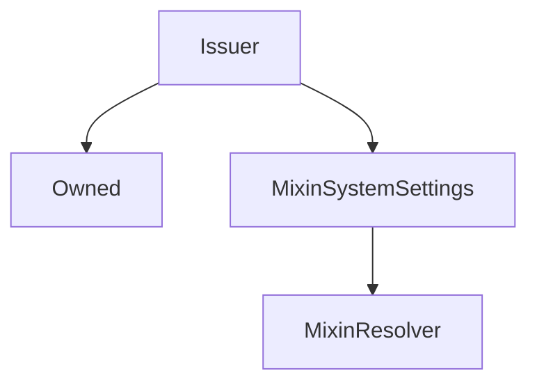

# Issuer

## Description

This contract does all the heavy lifting of issuing and burning `sUSD`. It's used primarily to reduce the size of the `Synthetix` contract

**Source:** [contracts/Issuer.sol](https://github.com/Synthetixio/synthetix/tree/v2.35.1-alpha/contracts/Issuer.sol)

## Architecture

### Libraries

- [SafeMath](/contracts/source/libraries/SafeMath) for `uint`
- [SafeDecimalMath](/contracts/source/libraries/SafeDecimalMath) for `uint`

### Inheritance Graph

### Related Contracts

<centered-image>
    
</centered-image>

??? example "Details"

    - [`FeePool`](FeePool.md): The Synthetix contract remits exchange fees as sUSD to the fee pool, and also uses it to keep track of historical issuance records for each issuer.
    - [`SynthetixState`](SynthetixState.md): This state contract stores the debt ledger and the current issuance information for synth issuers.

<!--
If any, see:

<centered-image>
    
</centered-image>
--->

## Constants

### `CONTRACT_NAME`

[Source](https://github.com/Synthetixio/synthetix/tree/v2.35.1-alpha/contracts/Issuer.sol#L67)

**Type:** `bytes32`

## Variables

### `availableSynths`

[Source](https://github.com/Synthetixio/synthetix/tree/v2.35.1-alpha/contracts/Issuer.sol#L55)

**Type:** `contract ISynth[]`

### `synths`

[Source](https://github.com/Synthetixio/synthetix/tree/v2.35.1-alpha/contracts/Issuer.sol#L56)

**Type:** `mapping(bytes32 => contract ISynth)`

### `synthsByAddress`

[Source](https://github.com/Synthetixio/synthetix/tree/v2.35.1-alpha/contracts/Issuer.sol#L57)

**Type:** `mapping(address => bytes32)`

## Constructor

### `constructor`

[Source](https://github.com/Synthetixio/synthetix/tree/v2.35.1-alpha/contracts/Issuer.sol#L86)

??? example "Details"

    **Signature**

    `(address _owner, address _resolver)`

    **Visibility**

    `public`

    **State Mutability**

    `nonpayable`

## Views

### `anySynthOrSNXRateIsInvalid`

[Source](https://github.com/Synthetixio/synthetix/tree/v2.35.1-alpha/contracts/Issuer.sol#L340)

??? example "Details"

    **Signature**

    `anySynthOrSNXRateIsInvalid() returns (bool)`

    **Visibility**

    `external`

    **State Mutability**

    `view`

### `availableCurrencyKeys`

[Source](https://github.com/Synthetixio/synthetix/tree/v2.35.1-alpha/contracts/Issuer.sol#L332)

??? example "Details"

    **Signature**

    `availableCurrencyKeys() returns (bytes32[])`

    **Visibility**

    `external`

    **State Mutability**

    `view`

### `availableSynthCount`

[Source](https://github.com/Synthetixio/synthetix/tree/v2.35.1-alpha/contracts/Issuer.sol#L336)

??? example "Details"

    **Signature**

    `availableSynthCount() returns (uint256)`

    **Visibility**

    `external`

    **State Mutability**

    `view`

### `canBurnSynths`

[Source](https://github.com/Synthetixio/synthetix/tree/v2.35.1-alpha/contracts/Issuer.sol#L328)

??? example "Details"

    **Signature**

    `canBurnSynths(address account) returns (bool)`

    **Visibility**

    `external`

    **State Mutability**

    `view`

### `collateral`

[Source](https://github.com/Synthetixio/synthetix/tree/v2.35.1-alpha/contracts/Issuer.sol#L364)

??? example "Details"

    **Signature**

    `collateral(address account) returns (uint256)`

    **Visibility**

    `external`

    **State Mutability**

    `view`

### `collateralisationRatio`

[Source](https://github.com/Synthetixio/synthetix/tree/v2.35.1-alpha/contracts/Issuer.sol#L352)

??? example "Details"

    **Signature**

    `collateralisationRatio(address _issuer) returns (uint256)`

    **Visibility**

    `external`

    **State Mutability**

    `view`

### `collateralisationRatioAndAnyRatesInvalid`

[Source](https://github.com/Synthetixio/synthetix/tree/v2.35.1-alpha/contracts/Issuer.sol#L356)

??? example "Details"

    **Signature**

    `collateralisationRatioAndAnyRatesInvalid(address _issuer) returns (uint256, bool)`

    **Visibility**

    `external`

    **State Mutability**

    `view`

### `debtBalanceOf`

[Source](https://github.com/Synthetixio/synthetix/tree/v2.35.1-alpha/contracts/Issuer.sol#L368)

??? example "Details"

    **Signature**

    `debtBalanceOf(address _issuer, bytes32 currencyKey) returns (uint256)`

    **Visibility**

    `external`

    **State Mutability**

    `view`

### `getSynths`

[Source](https://github.com/Synthetixio/synthetix/tree/v2.35.1-alpha/contracts/Issuer.sol#L422)

??? example "Details"

    **Signature**

    `getSynths(bytes32[] currencyKeys) returns (contract ISynth[])`

    **Visibility**

    `external`

    **State Mutability**

    `view`

### `issuanceRatio`

[Source](https://github.com/Synthetixio/synthetix/tree/v2.35.1-alpha/contracts/Issuer.sol#L160)

??? example "Details"

    **Signature**

    `issuanceRatio() returns (uint256)`

    **Visibility**

    `external`

    **State Mutability**

    `view`

### `lastIssueEvent`

[Source](https://github.com/Synthetixio/synthetix/tree/v2.35.1-alpha/contracts/Issuer.sol#L348)

??? example "Details"

    **Signature**

    `lastIssueEvent(address account) returns (uint256)`

    **Visibility**

    `external`

    **State Mutability**

    `view`

### `maxIssuableSynths`

[Source](https://github.com/Synthetixio/synthetix/tree/v2.35.1-alpha/contracts/Issuer.sol#L392)

??? example "Details"

    **Signature**

    `maxIssuableSynths(address _issuer) returns (uint256)`

    **Visibility**

    `external`

    **State Mutability**

    `view`

### `minimumStakeTime`

[Source](https://github.com/Synthetixio/synthetix/tree/v2.35.1-alpha/contracts/Issuer.sol#L324)

**Type:** `uint256`

??? example "Details"

    **Signature**

    `minimumStakeTime() returns (uint256)`

    **Visibility**

    `external`

    **State Mutability**

    `view`

### `remainingIssuableSynths`

[Source](https://github.com/Synthetixio/synthetix/tree/v2.35.1-alpha/contracts/Issuer.sol#L380)

??? example "Details"

    **Signature**

    `remainingIssuableSynths(address _issuer) returns (uint256, uint256, uint256)`

    **Visibility**

    `external`

    **State Mutability**

    `view`

### `resolverAddressesRequired`

[Source](https://github.com/Synthetixio/synthetix/tree/v2.35.1-alpha/contracts/Issuer.sol#L89)

??? example "Details"

    **Signature**

    `resolverAddressesRequired() returns (bytes32[])`

    **Visibility**

    `public`

    **State Mutability**

    `view`

### `totalIssuedSynths`

[Source](https://github.com/Synthetixio/synthetix/tree/v2.35.1-alpha/contracts/Issuer.sol#L344)

??? example "Details"

    **Signature**

    `totalIssuedSynths(bytes32 currencyKey, bool excludeEtherCollateral) returns (uint256)`

    **Visibility**

    `external`

    **State Mutability**

    `view`

### `transferableSynthetixAndAnyRateIsInvalid`

[Source](https://github.com/Synthetixio/synthetix/tree/v2.35.1-alpha/contracts/Issuer.sol#L397)

??? example "Details"

    **Signature**

    `transferableSynthetixAndAnyRateIsInvalid(address account, uint256 balance) returns (uint256, bool)`

    **Visibility**

    `external`

    **State Mutability**

    `view`

## Restricted Functions

### `addSynth`

[Source](https://github.com/Synthetixio/synthetix/tree/v2.35.1-alpha/contracts/Issuer.sol#L447)

??? example "Details"

    **Signature**

    `addSynth(contract ISynth synth)`

    **Visibility**

    `external`

    **State Mutability**

    `nonpayable`

    **Modifiers**

    * [onlyOwner](#onlyowner)

### `addSynths`

[Source](https://github.com/Synthetixio/synthetix/tree/v2.35.1-alpha/contracts/Issuer.sol#L455)

??? example "Details"

    **Signature**

    `addSynths(contract ISynth[] synthsToAdd)`

    **Visibility**

    `external`

    **State Mutability**

    `nonpayable`

    **Modifiers**

    * [onlyOwner](#onlyowner)

### `burnSynths`

[Source](https://github.com/Synthetixio/synthetix/tree/v2.35.1-alpha/contracts/Issuer.sol#L542)

??? example "Details"

    **Signature**

    `burnSynths(address from, uint256 amount)`

    **Visibility**

    `external`

    **State Mutability**

    `nonpayable`

    **Modifiers**

    * [onlySynthetix](#onlysynthetix)

### `burnSynthsOnBehalf`

[Source](https://github.com/Synthetixio/synthetix/tree/v2.35.1-alpha/contracts/Issuer.sol#L546)

??? example "Details"

    **Signature**

    `burnSynthsOnBehalf(address burnForAddress, address from, uint256 amount)`

    **Visibility**

    `external`

    **State Mutability**

    `nonpayable`

    **Requires**

    * [_requireCanBurnOnBehalf](https://github.com/Synthetixio/synthetix/tree/v2.35.1-alpha/contracts/Issuer.sol#L551)

    **Modifiers**

    * [onlySynthetix](#onlysynthetix)

### `burnSynthsToTarget`

[Source](https://github.com/Synthetixio/synthetix/tree/v2.35.1-alpha/contracts/Issuer.sol#L555)

??? example "Details"

    **Signature**

    `burnSynthsToTarget(address from)`

    **Visibility**

    `external`

    **State Mutability**

    `nonpayable`

    **Modifiers**

    * [onlySynthetix](#onlysynthetix)

### `burnSynthsToTargetOnBehalf`

[Source](https://github.com/Synthetixio/synthetix/tree/v2.35.1-alpha/contracts/Issuer.sol#L559)

??? example "Details"

    **Signature**

    `burnSynthsToTargetOnBehalf(address burnForAddress, address from)`

    **Visibility**

    `external`

    **State Mutability**

    `nonpayable`

    **Requires**

    * [_requireCanBurnOnBehalf](https://github.com/Synthetixio/synthetix/tree/v2.35.1-alpha/contracts/Issuer.sol#L560)

    **Modifiers**

    * [onlySynthetix](#onlysynthetix)

### `issueMaxSynths`

[Source](https://github.com/Synthetixio/synthetix/tree/v2.35.1-alpha/contracts/Issuer.sol#L524)

??? example "Details"

    **Signature**

    `issueMaxSynths(address from)`

    **Visibility**

    `external`

    **State Mutability**

    `nonpayable`

    **Modifiers**

    * [onlySynthetix](#onlysynthetix)

### `issueMaxSynthsOnBehalf`

[Source](https://github.com/Synthetixio/synthetix/tree/v2.35.1-alpha/contracts/Issuer.sol#L537)

??? example "Details"

    **Signature**

    `issueMaxSynthsOnBehalf(address issueForAddress, address from)`

    **Visibility**

    `external`

    **State Mutability**

    `nonpayable`

    **Requires**

    * [_requireCanIssueOnBehalf](https://github.com/Synthetixio/synthetix/tree/v2.35.1-alpha/contracts/Issuer.sol#L538)

    **Modifiers**

    * [onlySynthetix](#onlysynthetix)

### `issueSynths`

[Source](https://github.com/Synthetixio/synthetix/tree/v2.35.1-alpha/contracts/Issuer.sol#L520)

??? example "Details"

    **Signature**

    `issueSynths(address from, uint256 amount)`

    **Visibility**

    `external`

    **State Mutability**

    `nonpayable`

    **Modifiers**

    * [onlySynthetix](#onlysynthetix)

### `issueSynthsOnBehalf`

[Source](https://github.com/Synthetixio/synthetix/tree/v2.35.1-alpha/contracts/Issuer.sol#L528)

??? example "Details"

    **Signature**

    `issueSynthsOnBehalf(address issueForAddress, address from, uint256 amount)`

    **Visibility**

    `external`

    **State Mutability**

    `nonpayable`

    **Requires**

    * [_requireCanIssueOnBehalf](https://github.com/Synthetixio/synthetix/tree/v2.35.1-alpha/contracts/Issuer.sol#L533)

    **Modifiers**

    * [onlySynthetix](#onlysynthetix)

### `liquidateDelinquentAccount`

[Source](https://github.com/Synthetixio/synthetix/tree/v2.35.1-alpha/contracts/Issuer.sol#L564)

??? example "Details"

    **Signature**

    `liquidateDelinquentAccount(address account, uint256 susdAmount, address liquidator) returns (uint256, uint256)`

    **Visibility**

    `external`

    **State Mutability**

    `nonpayable`

    **Requires**

    * [require(..., sUSD needs to be settled)](https://github.com/Synthetixio/synthetix/tree/v2.35.1-alpha/contracts/Issuer.sol#L570)

    * [require(..., Account not open for liquidation)](https://github.com/Synthetixio/synthetix/tree/v2.35.1-alpha/contracts/Issuer.sol#L573)

    * [require(..., Not enough sUSD)](https://github.com/Synthetixio/synthetix/tree/v2.35.1-alpha/contracts/Issuer.sol#L576)

    * [_requireRatesNotInvalid](https://github.com/Synthetixio/synthetix/tree/v2.35.1-alpha/contracts/Issuer.sol#L583)

    **Modifiers**

    * [onlySynthetix](#onlysynthetix)

### `removeSynth`

[Source](https://github.com/Synthetixio/synthetix/tree/v2.35.1-alpha/contracts/Issuer.sol#L495)

??? example "Details"

    **Signature**

    `removeSynth(bytes32 currencyKey)`

    **Visibility**

    `external`

    **State Mutability**

    `nonpayable`

    **Modifiers**

    * [onlyOwner](#onlyowner)

### `removeSynths`

[Source](https://github.com/Synthetixio/synthetix/tree/v2.35.1-alpha/contracts/Issuer.sol#L505)

??? example "Details"

    **Signature**

    `removeSynths(bytes32[] currencyKeys)`

    **Visibility**

    `external`

    **State Mutability**

    `nonpayable`

    **Modifiers**

    * [onlyOwner](#onlyowner)

## Internal Functions

### `_addSynth`

[Source](https://github.com/Synthetixio/synthetix/tree/v2.35.1-alpha/contracts/Issuer.sol#L435)

??? example "Details"

    **Signature**

    `_addSynth(contract ISynth synth)`

    **Visibility**

    `internal`

    **State Mutability**

    `nonpayable`

    **Requires**

    * [require(..., Synth exists)](https://github.com/Synthetixio/synthetix/tree/v2.35.1-alpha/contracts/Issuer.sol#L437)

    * [require(..., Synth address already exists)](https://github.com/Synthetixio/synthetix/tree/v2.35.1-alpha/contracts/Issuer.sol#L438)

    **Emits**

    * [SynthAdded](#synthadded)

### `_addToDebtRegister`

[Source](https://github.com/Synthetixio/synthetix/tree/v2.35.1-alpha/contracts/Issuer.sol#L745)

??? example "Details"

    **Signature**

    `_addToDebtRegister(address from, uint256 amount, uint256 existingDebt, uint256 totalDebtIssued)`

    **Visibility**

    `internal`

    **State Mutability**

    `nonpayable`

### `_appendAccountIssuanceRecord`

[Source](https://github.com/Synthetixio/synthetix/tree/v2.35.1-alpha/contracts/Issuer.sol#L738)

??? example "Details"

    **Signature**

    `_appendAccountIssuanceRecord(address from)`

    **Visibility**

    `internal`

    **State Mutability**

    `nonpayable`

### `_availableCurrencyKeysWithOptionalSNX`

[Source](https://github.com/Synthetixio/synthetix/tree/v2.35.1-alpha/contracts/Issuer.sol#L164)

??? example "Details"

    **Signature**

    `_availableCurrencyKeysWithOptionalSNX(bool withSNX) returns (bytes32[])`

    **Visibility**

    `internal`

    **State Mutability**

    `view`

### `_burnSynths`

[Source](https://github.com/Synthetixio/synthetix/tree/v2.35.1-alpha/contracts/Issuer.sol#L667)

??? example "Details"

    **Signature**

    `_burnSynths(address debtAccount, address burnAccount, uint256 amount, uint256 existingDebt, uint256 totalDebtIssued) returns (uint256)`

    **Visibility**

    `internal`

    **State Mutability**

    `nonpayable`

### `_canBurnSynths`

[Source](https://github.com/Synthetixio/synthetix/tree/v2.35.1-alpha/contracts/Issuer.sol#L251)

??? example "Details"

    **Signature**

    `_canBurnSynths(address account) returns (bool)`

    **Visibility**

    `internal`

    **State Mutability**

    `view`

### `_collateral`

[Source](https://github.com/Synthetixio/synthetix/tree/v2.35.1-alpha/contracts/Issuer.sol#L310)

??? example "Details"

    **Signature**

    `_collateral(address account) returns (uint256)`

    **Visibility**

    `internal`

    **State Mutability**

    `view`

### `_collateralisationRatio`

[Source](https://github.com/Synthetixio/synthetix/tree/v2.35.1-alpha/contracts/Issuer.sol#L299)

??? example "Details"

    **Signature**

    `_collateralisationRatio(address _issuer) returns (uint256, bool)`

    **Visibility**

    `internal`

    **State Mutability**

    `view`

### `_debtBalanceOfAndTotalDebt`

[Source](https://github.com/Synthetixio/synthetix/tree/v2.35.1-alpha/contracts/Issuer.sol#L213)

??? example "Details"

    **Signature**

    `_debtBalanceOfAndTotalDebt(address _issuer, bytes32 currencyKey) returns (uint256, uint256, bool)`

    **Visibility**

    `internal`

    **State Mutability**

    `view`

### `_issueSynths`

[Source](https://github.com/Synthetixio/synthetix/tree/v2.35.1-alpha/contracts/Issuer.sol#L637)

??? example "Details"

    **Signature**

    `_issueSynths(address from, uint256 amount, bool issueMax)`

    **Visibility**

    `internal`

    **State Mutability**

    `nonpayable`

    **Requires**

    * [_requireRatesNotInvalid](https://github.com/Synthetixio/synthetix/tree/v2.35.1-alpha/contracts/Issuer.sol#L643)

### `_lastIssueEvent`

[Source](https://github.com/Synthetixio/synthetix/tree/v2.35.1-alpha/contracts/Issuer.sol#L255)

??? example "Details"

    **Signature**

    `_lastIssueEvent(address account) returns (uint256)`

    **Visibility**

    `internal`

    **State Mutability**

    `view`

### `_maxIssuableSynths`

[Source](https://github.com/Synthetixio/synthetix/tree/v2.35.1-alpha/contracts/Issuer.sol#L290)

??? example "Details"

    **Signature**

    `_maxIssuableSynths(address _issuer) returns (uint256, bool)`

    **Visibility**

    `internal`

    **State Mutability**

    `view`

### `_onlySynthetix`

[Source](https://github.com/Synthetixio/synthetix/tree/v2.35.1-alpha/contracts/Issuer.sol#L829)

??? example "Details"

    **Signature**

    `_onlySynthetix()`

    **Visibility**

    `internal`

    **State Mutability**

    `view`

    **Requires**

    * [require(..., Issuer: Only the synthetix contract can perform this action)](https://github.com/Synthetixio/synthetix/tree/v2.35.1-alpha/contracts/Issuer.sol#L830)

### `_remainingIssuableSynths`

[Source](https://github.com/Synthetixio/synthetix/tree/v2.35.1-alpha/contracts/Issuer.sol#L260)

??? example "Details"

    **Signature**

    `_remainingIssuableSynths(address _issuer) returns (uint256, uint256, uint256, bool)`

    **Visibility**

    `internal`

    **State Mutability**

    `view`

### `_removeFromDebtRegister`

[Source](https://github.com/Synthetixio/synthetix/tree/v2.35.1-alpha/contracts/Issuer.sol#L785)

??? example "Details"

    **Signature**

    `_removeFromDebtRegister(address from, uint256 debtToRemove, uint256 existingDebt, uint256 totalDebtIssued)`

    **Visibility**

    `internal`

    **State Mutability**

    `nonpayable`

### `_removeSynth`

[Source](https://github.com/Synthetixio/synthetix/tree/v2.35.1-alpha/contracts/Issuer.sol#L465)

??? example "Details"

    **Signature**

    `_removeSynth(bytes32 currencyKey)`

    **Visibility**

    `internal`

    **State Mutability**

    `nonpayable`

    **Requires**

    * [require(..., Synth does not exist)](https://github.com/Synthetixio/synthetix/tree/v2.35.1-alpha/contracts/Issuer.sol#L467)

    * [require(..., Synth supply exists)](https://github.com/Synthetixio/synthetix/tree/v2.35.1-alpha/contracts/Issuer.sol#L468)

    * [require(..., Cannot remove synth)](https://github.com/Synthetixio/synthetix/tree/v2.35.1-alpha/contracts/Issuer.sol#L469)

    **Emits**

    * [SynthRemoved](#synthremoved)

### `_requireCanBurnOnBehalf`

[Source](https://github.com/Synthetixio/synthetix/tree/v2.35.1-alpha/contracts/Issuer.sol#L633)

??? example "Details"

    **Signature**

    `_requireCanBurnOnBehalf(address burnForAddress, address from)`

    **Visibility**

    `internal`

    **State Mutability**

    `view`

    **Requires**

    * [require(..., Not approved to act on behalf)](https://github.com/Synthetixio/synthetix/tree/v2.35.1-alpha/contracts/Issuer.sol#L634)

### `_requireCanIssueOnBehalf`

[Source](https://github.com/Synthetixio/synthetix/tree/v2.35.1-alpha/contracts/Issuer.sol#L629)

??? example "Details"

    **Signature**

    `_requireCanIssueOnBehalf(address issueForAddress, address from)`

    **Visibility**

    `internal`

    **State Mutability**

    `view`

    **Requires**

    * [require(..., Not approved to act on behalf)](https://github.com/Synthetixio/synthetix/tree/v2.35.1-alpha/contracts/Issuer.sol#L630)

### `_requireRatesNotInvalid`

[Source](https://github.com/Synthetixio/synthetix/tree/v2.35.1-alpha/contracts/Issuer.sol#L625)

??? example "Details"

    **Signature**

    `_requireRatesNotInvalid(bool anyRateIsInvalid)`

    **Visibility**

    `internal`

    **State Mutability**

    `pure`

    **Requires**

    * [require(..., A synth or SNX rate is invalid)](https://github.com/Synthetixio/synthetix/tree/v2.35.1-alpha/contracts/Issuer.sol#L626)

### `_setLastIssueEvent`

[Source](https://github.com/Synthetixio/synthetix/tree/v2.35.1-alpha/contracts/Issuer.sol#L729)

??? example "Details"

    **Signature**

    `_setLastIssueEvent(address account)`

    **Visibility**

    `internal`

    **State Mutability**

    `nonpayable`

### `_snxToUSD`

[Source](https://github.com/Synthetixio/synthetix/tree/v2.35.1-alpha/contracts/Issuer.sol#L282)

??? example "Details"

    **Signature**

    `_snxToUSD(uint256 amount, uint256 snxRate) returns (uint256)`

    **Visibility**

    `internal`

    **State Mutability**

    `pure`

### `_totalIssuedSynths`

[Source](https://github.com/Synthetixio/synthetix/tree/v2.35.1-alpha/contracts/Issuer.sol#L178)

??? example "Details"

    **Signature**

    `_totalIssuedSynths(bytes32 currencyKey, bool excludeCollateral) returns (uint256, bool)`

    **Visibility**

    `internal`

    **State Mutability**

    `view`

### `_usdToSnx`

[Source](https://github.com/Synthetixio/synthetix/tree/v2.35.1-alpha/contracts/Issuer.sol#L286)

??? example "Details"

    **Signature**

    `_usdToSnx(uint256 amount, uint256 snxRate) returns (uint256)`

    **Visibility**

    `internal`

    **State Mutability**

    `pure`

### `_voluntaryBurnSynths`

[Source](https://github.com/Synthetixio/synthetix/tree/v2.35.1-alpha/contracts/Issuer.sol#L696)

??? example "Details"

    **Signature**

    `_voluntaryBurnSynths(address from, uint256 amount, bool burnToTarget)`

    **Visibility**

    `internal`

    **State Mutability**

    `nonpayable`

    **Requires**

    * [_requireRatesNotInvalid](https://github.com/Synthetixio/synthetix/tree/v2.35.1-alpha/contracts/Issuer.sol#L713)

    * [require(..., No debt to forgive)](https://github.com/Synthetixio/synthetix/tree/v2.35.1-alpha/contracts/Issuer.sol#L714)

### `collateralManager`

[Source](https://github.com/Synthetixio/synthetix/tree/v2.35.1-alpha/contracts/Issuer.sol#L144)

??? example "Details"

    **Signature**

    `collateralManager() returns (contract ICollateralManager)`

    **Visibility**

    `internal`

    **State Mutability**

    `view`

### `debtCache`

[Source](https://github.com/Synthetixio/synthetix/tree/v2.35.1-alpha/contracts/Issuer.sol#L156)

??? example "Details"

    **Signature**

    `debtCache() returns (contract IIssuerInternalDebtCache)`

    **Visibility**

    `internal`

    **State Mutability**

    `view`

### `delegateApprovals`

[Source](https://github.com/Synthetixio/synthetix/tree/v2.35.1-alpha/contracts/Issuer.sol#L132)

??? example "Details"

    **Signature**

    `delegateApprovals() returns (contract IDelegateApprovals)`

    **Visibility**

    `internal`

    **State Mutability**

    `view`

### `etherCollateral`

[Source](https://github.com/Synthetixio/synthetix/tree/v2.35.1-alpha/contracts/Issuer.sol#L136)

??? example "Details"

    **Signature**

    `etherCollateral() returns (contract IEtherCollateral)`

    **Visibility**

    `internal`

    **State Mutability**

    `view`

### `etherCollateralsUSD`

[Source](https://github.com/Synthetixio/synthetix/tree/v2.35.1-alpha/contracts/Issuer.sol#L140)

??? example "Details"

    **Signature**

    `etherCollateralsUSD() returns (contract IEtherCollateralsUSD)`

    **Visibility**

    `internal`

    **State Mutability**

    `view`

### `exchangeRates`

[Source](https://github.com/Synthetixio/synthetix/tree/v2.35.1-alpha/contracts/Issuer.sol#L116)

??? example "Details"

    **Signature**

    `exchangeRates() returns (contract IExchangeRates)`

    **Visibility**

    `internal`

    **State Mutability**

    `view`

### `exchanger`

[Source](https://github.com/Synthetixio/synthetix/tree/v2.35.1-alpha/contracts/Issuer.sol#L112)

??? example "Details"

    **Signature**

    `exchanger() returns (contract IExchanger)`

    **Visibility**

    `internal`

    **State Mutability**

    `view`

### `feePool`

[Source](https://github.com/Synthetixio/synthetix/tree/v2.35.1-alpha/contracts/Issuer.sol#L124)

??? example "Details"

    **Signature**

    `feePool() returns (contract IFeePool)`

    **Visibility**

    `internal`

    **State Mutability**

    `view`

### `liquidations`

[Source](https://github.com/Synthetixio/synthetix/tree/v2.35.1-alpha/contracts/Issuer.sol#L128)

??? example "Details"

    **Signature**

    `liquidations() returns (contract ILiquidations)`

    **Visibility**

    `internal`

    **State Mutability**

    `view`

### `rewardEscrow`

[Source](https://github.com/Synthetixio/synthetix/tree/v2.35.1-alpha/contracts/Issuer.sol#L148)

??? example "Details"

    **Signature**

    `rewardEscrow() returns (contract IRewardEscrow)`

    **Visibility**

    `internal`

    **State Mutability**

    `view`

### `synthetix`

[Source](https://github.com/Synthetixio/synthetix/tree/v2.35.1-alpha/contracts/Issuer.sol#L108)

??? example "Details"

    **Signature**

    `synthetix() returns (contract ISynthetix)`

    **Visibility**

    `internal`

    **State Mutability**

    `view`

### `synthetixEscrow`

[Source](https://github.com/Synthetixio/synthetix/tree/v2.35.1-alpha/contracts/Issuer.sol#L152)

??? example "Details"

    **Signature**

    `synthetixEscrow() returns (contract IHasBalance)`

    **Visibility**

    `internal`

    **State Mutability**

    `view`

### `synthetixState`

[Source](https://github.com/Synthetixio/synthetix/tree/v2.35.1-alpha/contracts/Issuer.sol#L120)

??? example "Details"

    **Signature**

    `synthetixState() returns (contract ISynthetixState)`

    **Visibility**

    `internal`

    **State Mutability**

    `view`

## Modifiers

### `onlySynthetix`

[Source](https://github.com/Synthetixio/synthetix/tree/v2.35.1-alpha/contracts/Issuer.sol#L833)

## Events

### `SynthAdded`

[Source](https://github.com/Synthetixio/synthetix/tree/v2.35.1-alpha/contracts/Issuer.sol#L840)

**Signature**: `SynthAdded(bytes32 currencyKey, address synth)`

### `SynthRemoved`

[Source](https://github.com/Synthetixio/synthetix/tree/v2.35.1-alpha/contracts/Issuer.sol#L841)

**Signature**: `SynthRemoved(bytes32 currencyKey, address synth)`
