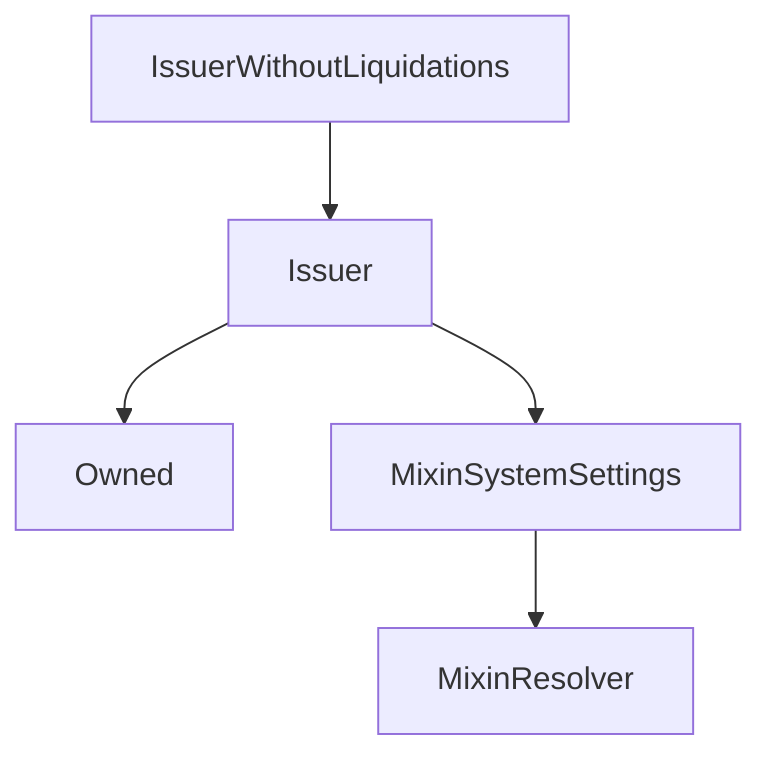

# IssuerWithoutLiquidations

## Description

**Source:** [contracts/IssuerWithoutLiquidations.sol](https://github.com/Synthetixio/synthetix/tree/v2.37.0/contracts/IssuerWithoutLiquidations.sol)

## Architecture

### Inheritance Graph

## Constructor

### `constructor`

[Source](https://github.com/Synthetixio/synthetix/tree/v2.37.0/contracts/IssuerWithoutLiquidations.sol#L9)

??? example "Details"

    **Signature**

    `(address _owner, address _resolver)`

    **Visibility**

    `public`

    **State Mutability**

    `nonpayable`

## Restricted Functions

### `liquidateDelinquentAccount`

[Source](https://github.com/Synthetixio/synthetix/tree/v2.37.0/contracts/IssuerWithoutLiquidations.sol#L11)

??? example "Details"

    **Signature**

    `liquidateDelinquentAccount(address account, uint256 susdAmount, address liquidator) returns (uint256, uint256)`

    **Visibility**

    `external`

    **State Mutability**

    `nonpayable`

    **Modifiers**

    * [onlySynthetix](#onlysynthetix)
