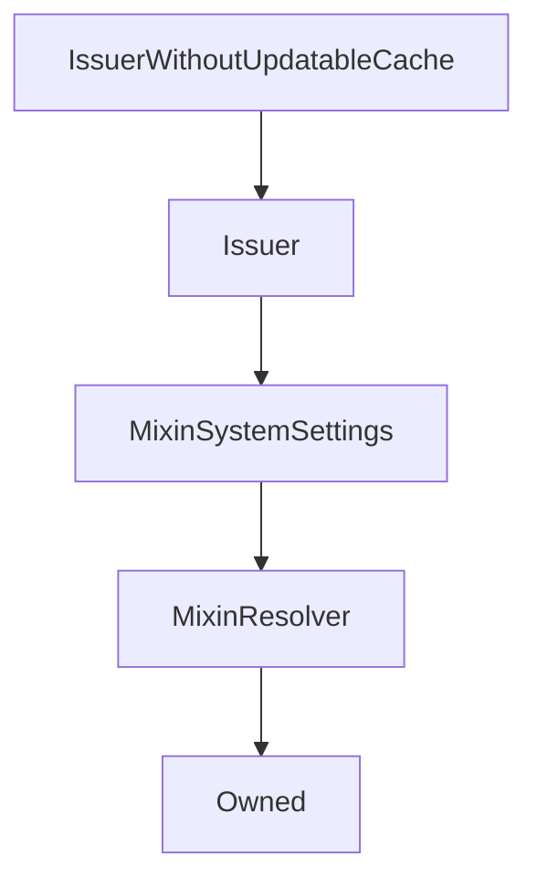

# IssuerWithoutUpdatableCache

## Description

**Source:** [contracts/IssuerWithoutUpdatableCache.sol](https://github.com/Synthetixio/synthetix/tree/v2.30.2-ovm/contracts/IssuerWithoutUpdatableCache.sol)

## Architecture

### Inheritance Graph

## Constructor

### `constructor`

[Source](https://github.com/Synthetixio/synthetix/tree/v2.30.2-ovm/contracts/IssuerWithoutUpdatableCache.sol#L7)

??? example "Details"

    **Signature**

    `(address _owner, address _resolver)`

    **Visibility**

    `public`

    **State Mutability**

    `nonpayable`

## External Functions

### `cacheSNXIssuedDebt`

[Source](https://github.com/Synthetixio/synthetix/tree/v2.30.2-ovm/contracts/IssuerWithoutUpdatableCache.sol#L13)

??? example "Details"

    **Signature**

    `cacheSNXIssuedDebt()`

    **Visibility**

    `external`

    **State Mutability**

    `nonpayable`

    **Modifiers**

    * [requireSystemActiveIfNotOwner](#requiresystemactiveifnotowner)

### `updateSNXIssuedDebtForCurrencies`

[Source](https://github.com/Synthetixio/synthetix/tree/v2.30.2-ovm/contracts/IssuerWithoutUpdatableCache.sol#L11)

??? example "Details"

    **Signature**

    `updateSNXIssuedDebtForCurrencies(bytes32[] currencyKeys)`

    **Visibility**

    `external`

    **State Mutability**

    `nonpayable`

### `updateSNXIssuedDebtOnExchange`

[Source](https://github.com/Synthetixio/synthetix/tree/v2.30.2-ovm/contracts/IssuerWithoutUpdatableCache.sol#L9)

??? example "Details"

    **Signature**

    `updateSNXIssuedDebtOnExchange(bytes32[2] currencyKeys, uint256[2] currencyRates)`

    **Visibility**

    `external`

    **State Mutability**

    `nonpayable`
