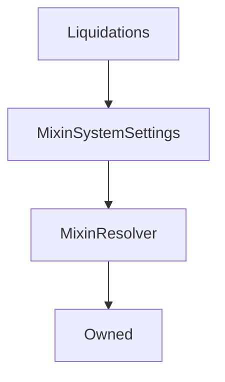

# Liquidations

## Description

!!! Info "Documentation Pending"

    This contract documentation is missing some descriptions.

**Source:** [contracts/Liquidations.sol](https://github.com/Synthetixio/synthetix/tree/v2.33.1/contracts/Liquidations.sol)

## Architecture

### Libraries

- [SafeMath](/contracts/source/libraries/SafeMath) for `uint`
- [SafeDecimalMath](/contracts/source/libraries/SafeDecimalMath) for `uint`

### Inheritance Graph

## Structs

### `LiquidationEntry`

[Source](https://github.com/Synthetixio/synthetix/tree/v2.33.1/contracts/Liquidations.sol#L25)

| Field      | Type      | Description |
| ---------- | --------- | ----------- |
| `deadline` | `uint256` | TBA         |
| `caller`   | `address` | TBA         |

## Constants

### `LIQUIDATION_CALLER`

[Source](https://github.com/Synthetixio/synthetix/tree/v2.33.1/contracts/Liquidations.sol#L50)

**Type:** `bytes32`

### `LIQUIDATION_DEADLINE`

[Source](https://github.com/Synthetixio/synthetix/tree/v2.33.1/contracts/Liquidations.sol#L49)

**Type:** `bytes32`

## Constructor

### `constructor`

[Source](https://github.com/Synthetixio/synthetix/tree/v2.33.1/contracts/Liquidations.sol#L52)

??? example "Details"

    **Signature**

    `(address _owner, address _resolver)`

    **Visibility**

    `public`

    **State Mutability**

    `nonpayable`

## Views

### `calculateAmountToFixCollateral`

[Source](https://github.com/Synthetixio/synthetix/tree/v2.33.1/contracts/Liquidations.sol#L145)

??? example "Details"

    **Signature**

    `calculateAmountToFixCollateral(uint256 debtBalance, uint256 collateral) returns (uint256)`

    **Visibility**

    `external`

    **State Mutability**

    `view`

### `getLiquidationDeadlineForAccount`

[Source](https://github.com/Synthetixio/synthetix/tree/v2.33.1/contracts/Liquidations.sol#L104)

??? example "Details"

    **Signature**

    `getLiquidationDeadlineForAccount(address account) returns (uint256)`

    **Visibility**

    `external`

    **State Mutability**

    `view`

### `isLiquidationDeadlinePassed`

[Source](https://github.com/Synthetixio/synthetix/tree/v2.33.1/contracts/Liquidations.sol#L127)

??? example "Details"

    **Signature**

    `isLiquidationDeadlinePassed(address account) returns (bool)`

    **Visibility**

    `external`

    **State Mutability**

    `view`

### `isOpenForLiquidation`

[Source](https://github.com/Synthetixio/synthetix/tree/v2.33.1/contracts/Liquidations.sol#L109)

??? example "Details"

    **Signature**

    `isOpenForLiquidation(address account) returns (bool)`

    **Visibility**

    `external`

    **State Mutability**

    `view`

### `issuanceRatio`

[Source](https://github.com/Synthetixio/synthetix/tree/v2.33.1/contracts/Liquidations.sol#L84)

??? example "Details"

    **Signature**

    `issuanceRatio() returns (uint256)`

    **Visibility**

    `external`

    **State Mutability**

    `view`

### `liquidationCollateralRatio`

[Source](https://github.com/Synthetixio/synthetix/tree/v2.33.1/contracts/Liquidations.sol#L100)

??? example "Details"

    **Signature**

    `liquidationCollateralRatio() returns (uint256)`

    **Visibility**

    `external`

    **State Mutability**

    `view`

### `liquidationDelay`

[Source](https://github.com/Synthetixio/synthetix/tree/v2.33.1/contracts/Liquidations.sol#L88)

**Type:** `uint256`

??? example "Details"

    **Signature**

    `liquidationDelay() returns (uint256)`

    **Visibility**

    `external`

    **State Mutability**

    `view`

### `liquidationPenalty`

[Source](https://github.com/Synthetixio/synthetix/tree/v2.33.1/contracts/Liquidations.sol#L96)

**Type:** `uint256`

??? example "Details"

    **Signature**

    `liquidationPenalty() returns (uint256)`

    **Visibility**

    `external`

    **State Mutability**

    `view`

### `liquidationRatio`

[Source](https://github.com/Synthetixio/synthetix/tree/v2.33.1/contracts/Liquidations.sol#L92)

**Type:** `uint256`

??? example "Details"

    **Signature**

    `liquidationRatio() returns (uint256)`

    **Visibility**

    `external`

    **State Mutability**

    `view`

## Restricted Functions

### `removeAccountInLiquidation`

[Source](https://github.com/Synthetixio/synthetix/tree/v2.33.1/contracts/Liquidations.sol#L198)

??? example "Details"

    **Signature**

    `removeAccountInLiquidation(address account)`

    **Visibility**

    `external`

    **State Mutability**

    `nonpayable`

    **Modifiers**

    * [onlyIssuer](#onlyissuer)

## Internal Functions

### `_deadlinePassed`

[Source](https://github.com/Synthetixio/synthetix/tree/v2.33.1/contracts/Liquidations.sol#L132)

??? example "Details"

    **Signature**

    `_deadlinePassed(uint256 deadline) returns (bool)`

    **Visibility**

    `internal`

    **State Mutability**

    `view`

### `_getKey`

[Source](https://github.com/Synthetixio/synthetix/tree/v2.33.1/contracts/Liquidations.sol#L164)

??? example "Details"

    **Signature**

    `_getKey(bytes32 _scope, address _account) returns (bytes32)`

    **Visibility**

    `internal`

    **State Mutability**

    `pure`

### `_getLiquidationEntryForAccount`

[Source](https://github.com/Synthetixio/synthetix/tree/v2.33.1/contracts/Liquidations.sol#L157)

??? example "Details"

    **Signature**

    `_getLiquidationEntryForAccount(address account) returns (struct Liquidations.LiquidationEntry)`

    **Visibility**

    `internal`

    **State Mutability**

    `view`

### `_removeLiquidationEntry`

[Source](https://github.com/Synthetixio/synthetix/tree/v2.33.1/contracts/Liquidations.sol#L233)

??? example "Details"

    **Signature**

    `_removeLiquidationEntry(address _account)`

    **Visibility**

    `internal`

    **State Mutability**

    `nonpayable`

    **Emits**

    * [AccountRemovedFromLiquidation](#accountremovedfromliquidation)

### `_storeLiquidationEntry`

[Source](https://github.com/Synthetixio/synthetix/tree/v2.33.1/contracts/Liquidations.sol#L223)

??? example "Details"

    **Signature**

    `_storeLiquidationEntry(address _account, uint256 _deadline, address _caller)`

    **Visibility**

    `internal`

    **State Mutability**

    `nonpayable`

### `eternalStorageLiquidations`

[Source](https://github.com/Synthetixio/synthetix/tree/v2.33.1/contracts/Liquidations.sol#L77)

??? example "Details"

    **Signature**

    `eternalStorageLiquidations() returns (contract EternalStorage)`

    **Visibility**

    `internal`

    **State Mutability**

    `view`

### `exchangeRates`

[Source](https://github.com/Synthetixio/synthetix/tree/v2.33.1/contracts/Liquidations.sol#L72)

??? example "Details"

    **Signature**

    `exchangeRates() returns (contract IExchangeRates)`

    **Visibility**

    `internal`

    **State Mutability**

    `view`

### `issuer`

[Source](https://github.com/Synthetixio/synthetix/tree/v2.33.1/contracts/Liquidations.sol#L68)

??? example "Details"

    **Signature**

    `issuer() returns (contract IIssuer)`

    **Visibility**

    `internal`

    **State Mutability**

    `view`

### `synthetix`

[Source](https://github.com/Synthetixio/synthetix/tree/v2.33.1/contracts/Liquidations.sol#L60)

??? example "Details"

    **Signature**

    `synthetix() returns (contract ISynthetix)`

    **Visibility**

    `internal`

    **State Mutability**

    `view`

### `systemStatus`

[Source](https://github.com/Synthetixio/synthetix/tree/v2.33.1/contracts/Liquidations.sol#L64)

??? example "Details"

    **Signature**

    `systemStatus() returns (contract ISystemStatus)`

    **Visibility**

    `internal`

    **State Mutability**

    `view`

## External Functions

### `checkAndRemoveAccountInLiquidation`

[Source](https://github.com/Synthetixio/synthetix/tree/v2.33.1/contracts/Liquidations.sol#L208)

??? example "Details"

    **Signature**

    `checkAndRemoveAccountInLiquidation(address account)`

    **Visibility**

    `external`

    **State Mutability**

    `nonpayable`

    **Requires**

    * [require(..., Account has no liquidation set)](https://github.com/Synthetixio/synthetix/tree/v2.33.1/contracts/Liquidations.sol#L213)

    **Modifiers**

    * [rateNotInvalid](#ratenotinvalid)

### `flagAccountForLiquidation`

[Source](https://github.com/Synthetixio/synthetix/tree/v2.33.1/contracts/Liquidations.sol#L172)

??? example "Details"

    **Signature**

    `flagAccountForLiquidation(address account)`

    **Visibility**

    `external`

    **State Mutability**

    `nonpayable`

    **Requires**

    * [require(..., Liquidation ratio not set)](https://github.com/Synthetixio/synthetix/tree/v2.33.1/contracts/Liquidations.sol#L175)

    * [require(..., Liquidation delay not set)](https://github.com/Synthetixio/synthetix/tree/v2.33.1/contracts/Liquidations.sol#L176)

    * [require(..., Account already flagged for liquidation)](https://github.com/Synthetixio/synthetix/tree/v2.33.1/contracts/Liquidations.sol#L179)

    * [require(..., Account issuance ratio is less than liquidation ratio)](https://github.com/Synthetixio/synthetix/tree/v2.33.1/contracts/Liquidations.sol#L184)

    **Modifiers**

    * [rateNotInvalid](#ratenotinvalid)

    **Emits**

    * [AccountFlaggedForLiquidation](#accountflaggedforliquidation)

## Modifiers

### `onlyIssuer`

[Source](https://github.com/Synthetixio/synthetix/tree/v2.33.1/contracts/Liquidations.sol#L243)

### `rateNotInvalid`

[Source](https://github.com/Synthetixio/synthetix/tree/v2.33.1/contracts/Liquidations.sol#L248)

**Signature**: `rateNotInvalid(bytes32 currencyKey)`

## Events

### `AccountFlaggedForLiquidation`

[Source](https://github.com/Synthetixio/synthetix/tree/v2.33.1/contracts/Liquidations.sol#L255)

**Signature**: `AccountFlaggedForLiquidation(address account, uint256 deadline)`

### `AccountRemovedFromLiquidation`

[Source](https://github.com/Synthetixio/synthetix/tree/v2.33.1/contracts/Liquidations.sol#L256)

**Signature**: `AccountRemovedFromLiquidation(address account, uint256 time)`
