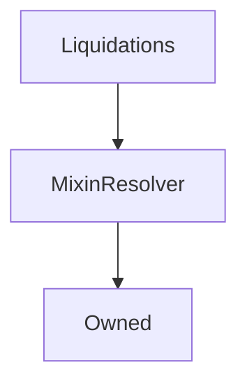

# Liquidations

## Description

!!! Info "Documentation Pending"

    This contract documentation is missing some descriptions.

**Source:** [contracts/Liquidations.sol](https://github.com/Synthetixio/synthetix/tree/v2.26.0-alpha/contracts/Liquidations.sol)

## Architecture

### Libraries

- [SafeMath](/contracts/source/libraries/SafeMath) for `uint`
- [SafeDecimalMath](/contracts/source/libraries/SafeDecimalMath) for `uint`

### Inheritance Graph

## Structs

### `LiquidationEntry`

[Source](https://github.com/Synthetixio/synthetix/tree/v2.26.0-alpha/contracts/Liquidations.sol#L25)

| Field      | Type      | Description |
| ---------- | --------- | ----------- |
| `deadline` | `uint256` | TBA         |
| `caller`   | `address` | TBA         |

## Constants

### `LIQUIDATION_CALLER`

[Source](https://github.com/Synthetixio/synthetix/tree/v2.26.0-alpha/contracts/Liquidations.sol#L60)

**Type:** `bytes32`

### `LIQUIDATION_DEADLINE`

[Source](https://github.com/Synthetixio/synthetix/tree/v2.26.0-alpha/contracts/Liquidations.sol#L59)

**Type:** `bytes32`

### `MAX_LIQUIDATION_DELAY`

[Source](https://github.com/Synthetixio/synthetix/tree/v2.26.0-alpha/contracts/Liquidations.sol#L55)

**Type:** `uint256`

### `MAX_LIQUIDATION_PENALTY`

[Source](https://github.com/Synthetixio/synthetix/tree/v2.26.0-alpha/contracts/Liquidations.sol#L51)

**Type:** `uint256`

### `MAX_LIQUIDATION_RATIO`

[Source](https://github.com/Synthetixio/synthetix/tree/v2.26.0-alpha/contracts/Liquidations.sol#L49)

**Type:** `uint256`

### `MIN_LIQUIDATION_DELAY`

[Source](https://github.com/Synthetixio/synthetix/tree/v2.26.0-alpha/contracts/Liquidations.sol#L56)

**Type:** `uint256`

### `RATIO_FROM_TARGET_BUFFER`

[Source](https://github.com/Synthetixio/synthetix/tree/v2.26.0-alpha/contracts/Liquidations.sol#L53)

**Type:** `uint256`

## Variables

### `liquidationDelay`

[Source](https://github.com/Synthetixio/synthetix/tree/v2.26.0-alpha/contracts/Liquidations.sol#L63)

**Type:** `uint256`

### `liquidationPenalty`

[Source](https://github.com/Synthetixio/synthetix/tree/v2.26.0-alpha/contracts/Liquidations.sol#L65)

**Type:** `uint256`

### `liquidationRatio`

[Source](https://github.com/Synthetixio/synthetix/tree/v2.26.0-alpha/contracts/Liquidations.sol#L64)

**Type:** `uint256`

## Constructor

### `constructor`

[Source](https://github.com/Synthetixio/synthetix/tree/v2.26.0-alpha/contracts/Liquidations.sol#L67)

??? example "Details"

    **Signature**

    `(address _owner, address _resolver)`

    **Visibility**

    `public`

    **State Mutability**

    `nonpayable`

## Views

### `calculateAmountToFixCollateral`

[Source](https://github.com/Synthetixio/synthetix/tree/v2.26.0-alpha/contracts/Liquidations.sol#L145)

??? example "Details"

    **Signature**

    `calculateAmountToFixCollateral(uint256 debtBalance, uint256 collateral) returns (uint256)`

    **Visibility**

    `external`

    **State Mutability**

    `view`

### `getLiquidationDeadlineForAccount`

[Source](https://github.com/Synthetixio/synthetix/tree/v2.26.0-alpha/contracts/Liquidations.sol#L104)

??? example "Details"

    **Signature**

    `getLiquidationDeadlineForAccount(address account) returns (uint256)`

    **Visibility**

    `external`

    **State Mutability**

    `view`

### `isLiquidationDeadlinePassed`

[Source](https://github.com/Synthetixio/synthetix/tree/v2.26.0-alpha/contracts/Liquidations.sol#L127)

??? example "Details"

    **Signature**

    `isLiquidationDeadlinePassed(address account) returns (bool)`

    **Visibility**

    `external`

    **State Mutability**

    `view`

### `isOpenForLiquidation`

[Source](https://github.com/Synthetixio/synthetix/tree/v2.26.0-alpha/contracts/Liquidations.sol#L109)

??? example "Details"

    **Signature**

    `isOpenForLiquidation(address account) returns (bool)`

    **Visibility**

    `external`

    **State Mutability**

    `view`

### `liquidationCollateralRatio`

[Source](https://github.com/Synthetixio/synthetix/tree/v2.26.0-alpha/contracts/Liquidations.sol#L100)

??? example "Details"

    **Signature**

    `liquidationCollateralRatio() returns (uint256)`

    **Visibility**

    `external`

    **State Mutability**

    `view`

## Restricted Functions

### `removeAccountInLiquidation`

[Source](https://github.com/Synthetixio/synthetix/tree/v2.26.0-alpha/contracts/Liquidations.sol#L227)

??? example "Details"

    **Signature**

    `removeAccountInLiquidation(address account)`

    **Visibility**

    `external`

    **State Mutability**

    `nonpayable`

    **Modifiers**

    * [onlyIssuer](#onlyissuer)

### `setLiquidationDelay`

[Source](https://github.com/Synthetixio/synthetix/tree/v2.26.0-alpha/contracts/Liquidations.sol#L169)

??? example "Details"

    **Signature**

    `setLiquidationDelay(uint256 time)`

    **Visibility**

    `external`

    **State Mutability**

    `nonpayable`

    **Requires**

    * [require(..., Must be less than 30 days)](https://github.com/Synthetixio/synthetix/tree/v2.26.0-alpha/contracts/Liquidations.sol#L170)

    * [require(..., Must be greater than 1 day)](https://github.com/Synthetixio/synthetix/tree/v2.26.0-alpha/contracts/Liquidations.sol#L171)

    **Modifiers**

    * [onlyOwner](#onlyowner)

    **Emits**

    * [LiquidationDelayUpdated](#liquidationdelayupdated)

### `setLiquidationPenalty`

[Source](https://github.com/Synthetixio/synthetix/tree/v2.26.0-alpha/contracts/Liquidations.sol#L196)

??? example "Details"

    **Signature**

    `setLiquidationPenalty(uint256 penalty)`

    **Visibility**

    `external`

    **State Mutability**

    `nonpayable`

    **Requires**

    * [require(..., penalty > MAX_LIQUIDATION_PENALTY)](https://github.com/Synthetixio/synthetix/tree/v2.26.0-alpha/contracts/Liquidations.sol#L197)

    **Modifiers**

    * [onlyOwner](#onlyowner)

    **Emits**

    * [LiquidationPenaltyUpdated](#liquidationpenaltyupdated)

### `setLiquidationRatio`

[Source](https://github.com/Synthetixio/synthetix/tree/v2.26.0-alpha/contracts/Liquidations.sol#L180)

??? example "Details"

    **Signature**

    `setLiquidationRatio(uint256 _liquidationRatio)`

    **Visibility**

    `external`

    **State Mutability**

    `nonpayable`

    **Requires**

    * [require(..., liquidationRatio > MAX_LIQUIDATION_RATIO / (1 + penalty))](https://github.com/Synthetixio/synthetix/tree/v2.26.0-alpha/contracts/Liquidations.sol#L181)

    * [require(..., liquidationRatio < MIN_LIQUIDATION_RATIO)](https://github.com/Synthetixio/synthetix/tree/v2.26.0-alpha/contracts/Liquidations.sol#L189)

    **Modifiers**

    * [onlyOwner](#onlyowner)

    **Emits**

    * [LiquidationRatioUpdated](#liquidationratioupdated)

## Internal Functions

### `_deadlinePassed`

[Source](https://github.com/Synthetixio/synthetix/tree/v2.26.0-alpha/contracts/Liquidations.sol#L132)

??? example "Details"

    **Signature**

    `_deadlinePassed(uint256 deadline) returns (bool)`

    **Visibility**

    `internal`

    **State Mutability**

    `view`

### `_getKey`

[Source](https://github.com/Synthetixio/synthetix/tree/v2.26.0-alpha/contracts/Liquidations.sol#L164)

??? example "Details"

    **Signature**

    `_getKey(bytes32 _scope, address _account) returns (bytes32)`

    **Visibility**

    `internal`

    **State Mutability**

    `pure`

### `_getLiquidationEntryForAccount`

[Source](https://github.com/Synthetixio/synthetix/tree/v2.26.0-alpha/contracts/Liquidations.sol#L157)

??? example "Details"

    **Signature**

    `_getLiquidationEntryForAccount(address account) returns (struct Liquidations.LiquidationEntry)`

    **Visibility**

    `internal`

    **State Mutability**

    `view`

### `_removeLiquidationEntry`

[Source](https://github.com/Synthetixio/synthetix/tree/v2.26.0-alpha/contracts/Liquidations.sol#L262)

??? example "Details"

    **Signature**

    `_removeLiquidationEntry(address _account)`

    **Visibility**

    `internal`

    **State Mutability**

    `nonpayable`

    **Emits**

    * [AccountRemovedFromLiquidation](#accountremovedfromliquidation)

### `_storeLiquidationEntry`

[Source](https://github.com/Synthetixio/synthetix/tree/v2.26.0-alpha/contracts/Liquidations.sol#L252)

??? example "Details"

    **Signature**

    `_storeLiquidationEntry(address _account, uint256 _deadline, address _caller)`

    **Visibility**

    `internal`

    **State Mutability**

    `nonpayable`

### `eternalStorageLiquidations`

[Source](https://github.com/Synthetixio/synthetix/tree/v2.26.0-alpha/contracts/Liquidations.sol#L91)

??? example "Details"

    **Signature**

    `eternalStorageLiquidations() returns (contract EternalStorage)`

    **Visibility**

    `internal`

    **State Mutability**

    `view`

### `exchangeRates`

[Source](https://github.com/Synthetixio/synthetix/tree/v2.26.0-alpha/contracts/Liquidations.sol#L86)

??? example "Details"

    **Signature**

    `exchangeRates() returns (contract IExchangeRates)`

    **Visibility**

    `internal`

    **State Mutability**

    `view`

### `issuer`

[Source](https://github.com/Synthetixio/synthetix/tree/v2.26.0-alpha/contracts/Liquidations.sol#L82)

??? example "Details"

    **Signature**

    `issuer() returns (contract IIssuer)`

    **Visibility**

    `internal`

    **State Mutability**

    `view`

### `synthetix`

[Source](https://github.com/Synthetixio/synthetix/tree/v2.26.0-alpha/contracts/Liquidations.sol#L70)

??? example "Details"

    **Signature**

    `synthetix() returns (contract ISynthetix)`

    **Visibility**

    `internal`

    **State Mutability**

    `view`

### `synthetixState`

[Source](https://github.com/Synthetixio/synthetix/tree/v2.26.0-alpha/contracts/Liquidations.sol#L74)

??? example "Details"

    **Signature**

    `synthetixState() returns (contract ISynthetixState)`

    **Visibility**

    `internal`

    **State Mutability**

    `view`

### `systemStatus`

[Source](https://github.com/Synthetixio/synthetix/tree/v2.26.0-alpha/contracts/Liquidations.sol#L78)

??? example "Details"

    **Signature**

    `systemStatus() returns (contract ISystemStatus)`

    **Visibility**

    `internal`

    **State Mutability**

    `view`

## External Functions

### `checkAndRemoveAccountInLiquidation`

[Source](https://github.com/Synthetixio/synthetix/tree/v2.26.0-alpha/contracts/Liquidations.sol#L237)

??? example "Details"

    **Signature**

    `checkAndRemoveAccountInLiquidation(address account)`

    **Visibility**

    `external`

    **State Mutability**

    `nonpayable`

    **Requires**

    * [require(..., Account has no liquidation set)](https://github.com/Synthetixio/synthetix/tree/v2.26.0-alpha/contracts/Liquidations.sol#L242)

    **Modifiers**

    * [rateNotStale](#ratenotstale)

### `flagAccountForLiquidation`

[Source](https://github.com/Synthetixio/synthetix/tree/v2.26.0-alpha/contracts/Liquidations.sol#L207)

??? example "Details"

    **Signature**

    `flagAccountForLiquidation(address account)`

    **Visibility**

    `external`

    **State Mutability**

    `nonpayable`

    **Requires**

    * [require(..., Account already flagged for liquidation)](https://github.com/Synthetixio/synthetix/tree/v2.26.0-alpha/contracts/Liquidations.sol#L211)

    * [require(..., Account issuance ratio is less than liquidation ratio)](https://github.com/Synthetixio/synthetix/tree/v2.26.0-alpha/contracts/Liquidations.sol#L216)

    **Modifiers**

    * [rateNotStale](#ratenotstale)

    **Emits**

    * [AccountFlaggedForLiquidation](#accountflaggedforliquidation)

## Modifiers

### `onlyIssuer`

[Source](https://github.com/Synthetixio/synthetix/tree/v2.26.0-alpha/contracts/Liquidations.sol#L272)

### `rateNotStale`

[Source](https://github.com/Synthetixio/synthetix/tree/v2.26.0-alpha/contracts/Liquidations.sol#L277)

**Signature**: `rateNotStale(bytes32 currencyKey)`

## Events

### `AccountFlaggedForLiquidation`

[Source](https://github.com/Synthetixio/synthetix/tree/v2.26.0-alpha/contracts/Liquidations.sol#L284)

**Signature**: `AccountFlaggedForLiquidation(address account, uint256 deadline)`

### `AccountRemovedFromLiquidation`

[Source](https://github.com/Synthetixio/synthetix/tree/v2.26.0-alpha/contracts/Liquidations.sol#L285)

**Signature**: `AccountRemovedFromLiquidation(address account, uint256 time)`

### `LiquidationDelayUpdated`

[Source](https://github.com/Synthetixio/synthetix/tree/v2.26.0-alpha/contracts/Liquidations.sol#L286)

**Signature**: `LiquidationDelayUpdated(uint256 newDelay)`

### `LiquidationPenaltyUpdated`

[Source](https://github.com/Synthetixio/synthetix/tree/v2.26.0-alpha/contracts/Liquidations.sol#L288)

**Signature**: `LiquidationPenaltyUpdated(uint256 newPenalty)`

### `LiquidationRatioUpdated`

[Source](https://github.com/Synthetixio/synthetix/tree/v2.26.0-alpha/contracts/Liquidations.sol#L287)

**Signature**: `LiquidationRatioUpdated(uint256 newRatio)`
