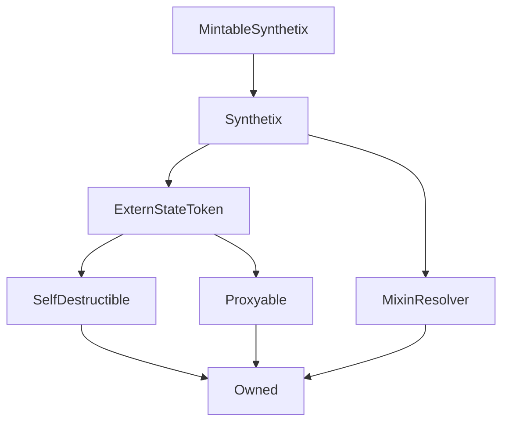

# MintableSynthetix

## Description

**Source:** [contracts/MintableSynthetix.sol](https://github.com/Synthetixio/synthetix/tree/v2.30.2-ovm/contracts/MintableSynthetix.sol)

## Architecture

### Inheritance Graph

## Constructor

### `constructor`

[Source](https://github.com/Synthetixio/synthetix/tree/v2.30.2-ovm/contracts/MintableSynthetix.sol#L10)

??? example "Details"

    **Signature**

    `(address payable _proxy, contract TokenState _tokenState, address _owner, uint256 _totalSupply, address _resolver)`

    **Visibility**

    `public`

    **State Mutability**

    `nonpayable`

## Internal Functions

### `secondaryDeposit`

[Source](https://github.com/Synthetixio/synthetix/tree/v2.30.2-ovm/contracts/MintableSynthetix.sol#L22)

??? example "Details"

    **Signature**

    `secondaryDeposit() returns (address)`

    **Visibility**

    `internal`

    **State Mutability**

    `view`

## External Functions

### `burnSecondary`

[Source](https://github.com/Synthetixio/synthetix/tree/v2.30.2-ovm/contracts/MintableSynthetix.sol#L36)

??? example "Details"

    **Signature**

    `burnSecondary(address account, uint256 amount)`

    **Visibility**

    `external`

    **State Mutability**

    `nonpayable`

    **Requires**

    * [require(..., Can only be invoked by the SecondaryDeposit contract)](https://github.com/Synthetixio/synthetix/tree/v2.30.2-ovm/contracts/MintableSynthetix.sol#L37)

### `mintSecondary`

[Source](https://github.com/Synthetixio/synthetix/tree/v2.30.2-ovm/contracts/MintableSynthetix.sol#L28)

??? example "Details"

    **Signature**

    `mintSecondary(address account, uint256 amount)`

    **Visibility**

    `external`

    **State Mutability**

    `nonpayable`

    **Requires**

    * [require(..., Can only be invoked by the SecondaryDeposit contract)](https://github.com/Synthetixio/synthetix/tree/v2.30.2-ovm/contracts/MintableSynthetix.sol#L29)
