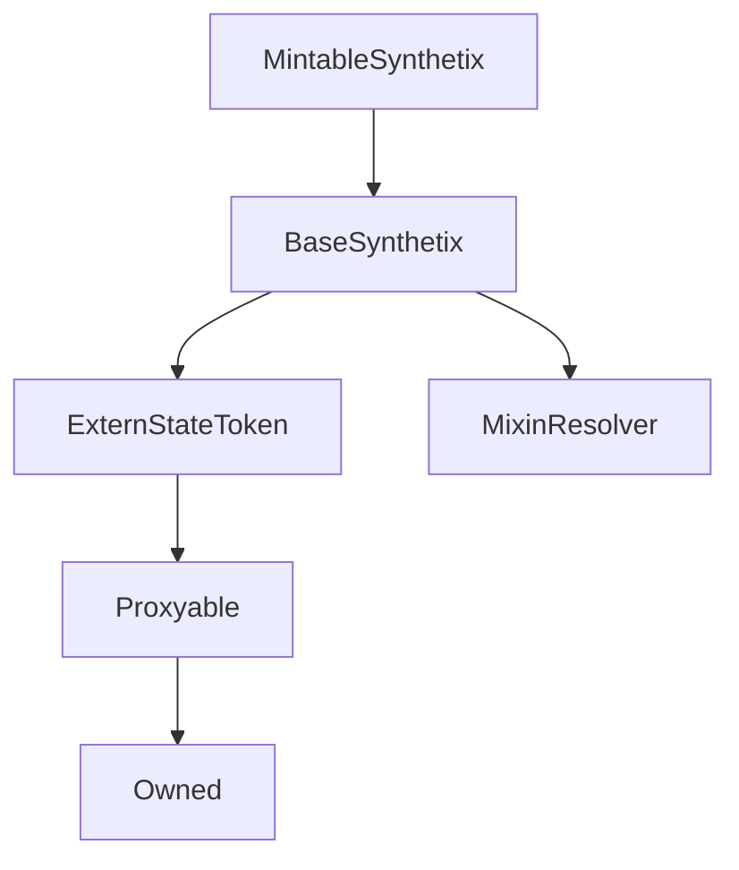

# MintableSynthetix

## Description

**Source:** [contracts/MintableSynthetix.sol](https://github.com/Synthetixio/synthetix/tree/v2.36.1/contracts/MintableSynthetix.sol)

## Architecture

### Inheritance Graph

## Constructor

### `constructor`

[Source](https://github.com/Synthetixio/synthetix/tree/v2.36.1/contracts/MintableSynthetix.sol#L11)

??? example "Details"

    **Signature**

    `(address payable _proxy, contract TokenState _tokenState, address _owner, uint256 _totalSupply, address _resolver)`

    **Visibility**

    `public`

    **State Mutability**

    `nonpayable`

## Views

### `resolverAddressesRequired`

[Source](https://github.com/Synthetixio/synthetix/tree/v2.36.1/contracts/MintableSynthetix.sol#L39)

??? example "Details"

    **Signature**

    `resolverAddressesRequired() returns (bytes32[])`

    **Visibility**

    `public`

    **State Mutability**

    `view`

## Restricted Functions

### `burnSecondary`

[Source](https://github.com/Synthetixio/synthetix/tree/v2.36.1/contracts/MintableSynthetix.sol#L62)

??? example "Details"

    **Signature**

    `burnSecondary(address account, uint256 amount)`

    **Visibility**

    `external`

    **State Mutability**

    `nonpayable`

    **Modifiers**

    * [onlyBridge](#onlybridge)

    * [systemActive](#systemactive)

### `mintSecondary`

[Source](https://github.com/Synthetixio/synthetix/tree/v2.36.1/contracts/MintableSynthetix.sol#L52)

??? example "Details"

    **Signature**

    `mintSecondary(address account, uint256 amount)`

    **Visibility**

    `external`

    **State Mutability**

    `nonpayable`

    **Modifiers**

    * [onlyBridge](#onlybridge)

### `mintSecondaryRewards`

[Source](https://github.com/Synthetixio/synthetix/tree/v2.36.1/contracts/MintableSynthetix.sol#L56)

??? example "Details"

    **Signature**

    `mintSecondaryRewards(uint256 amount)`

    **Visibility**

    `external`

    **State Mutability**

    `nonpayable`

    **Modifiers**

    * [onlyBridge](#onlybridge)

## Internal Functions

### `_mintSecondary`

[Source](https://github.com/Synthetixio/synthetix/tree/v2.36.1/contracts/MintableSynthetix.sol#L21)

??? example "Details"

    **Signature**

    `_mintSecondary(address account, uint256 amount)`

    **Visibility**

    `internal`

    **State Mutability**

    `nonpayable`

### `onlyAllowFromBridge`

[Source](https://github.com/Synthetixio/synthetix/tree/v2.36.1/contracts/MintableSynthetix.sol#L27)

??? example "Details"

    **Signature**

    `onlyAllowFromBridge()`

    **Visibility**

    `internal`

    **State Mutability**

    `view`

    **Requires**

    * [require(..., Can only be invoked by bridge)](https://github.com/Synthetixio/synthetix/tree/v2.36.1/contracts/MintableSynthetix.sol#L28)

### `synthetixBridge`

[Source](https://github.com/Synthetixio/synthetix/tree/v2.36.1/contracts/MintableSynthetix.sol#L46)

??? example "Details"

    **Signature**

    `synthetixBridge() returns (address)`

    **Visibility**

    `internal`

    **State Mutability**

    `view`

## Modifiers

### `onlyBridge`

[Source](https://github.com/Synthetixio/synthetix/tree/v2.36.1/contracts/MintableSynthetix.sol#L33)
