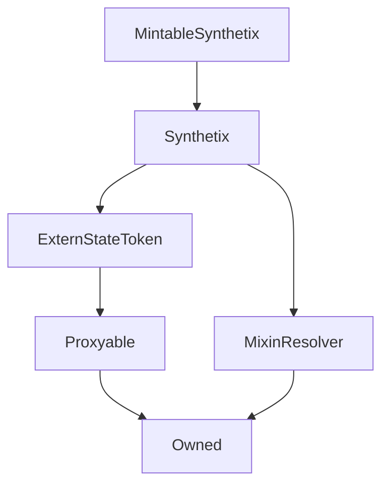

# MintableSynthetix

## Description

**Source:** [contracts/MintableSynthetix.sol](https://github.com/Synthetixio/synthetix/tree/v2.31.1/contracts/MintableSynthetix.sol)

## Architecture

### Inheritance Graph

## Constructor

### `constructor`

[Source](https://github.com/Synthetixio/synthetix/tree/v2.31.1/contracts/MintableSynthetix.sol#L11)

??? example "Details"

    **Signature**

    `(address payable _proxy, contract TokenState _tokenState, address _owner, uint256 _totalSupply, address _resolver)`

    **Visibility**

    `public`

    **State Mutability**

    `nonpayable`

## Restricted Functions

### `burnSecondary`

[Source](https://github.com/Synthetixio/synthetix/tree/v2.31.1/contracts/MintableSynthetix.sol#L58)

??? example "Details"

    **Signature**

    `burnSecondary(address account, uint256 amount)`

    **Visibility**

    `external`

    **State Mutability**

    `nonpayable`

    **Modifiers**

    * [onlyBridge](#onlybridge)

### `mintSecondary`

[Source](https://github.com/Synthetixio/synthetix/tree/v2.31.1/contracts/MintableSynthetix.sol#L48)

??? example "Details"

    **Signature**

    `mintSecondary(address account, uint256 amount)`

    **Visibility**

    `external`

    **State Mutability**

    `nonpayable`

    **Modifiers**

    * [onlyBridge](#onlybridge)

### `mintSecondaryRewards`

[Source](https://github.com/Synthetixio/synthetix/tree/v2.31.1/contracts/MintableSynthetix.sol#L52)

??? example "Details"

    **Signature**

    `mintSecondaryRewards(uint256 amount)`

    **Visibility**

    `external`

    **State Mutability**

    `nonpayable`

    **Modifiers**

    * [onlyBridge](#onlybridge)

## Internal Functions

### `_mintSecondary`

[Source](https://github.com/Synthetixio/synthetix/tree/v2.31.1/contracts/MintableSynthetix.sol#L23)

??? example "Details"

    **Signature**

    `_mintSecondary(address account, uint256 amount)`

    **Visibility**

    `internal`

    **State Mutability**

    `nonpayable`

### `onlyAllowFromBridge`

[Source](https://github.com/Synthetixio/synthetix/tree/v2.31.1/contracts/MintableSynthetix.sol#L29)

??? example "Details"

    **Signature**

    `onlyAllowFromBridge()`

    **Visibility**

    `internal`

    **State Mutability**

    `view`

    **Requires**

    * [require(..., Can only be invoked by the SynthetixBridgeToBase contract)](https://github.com/Synthetixio/synthetix/tree/v2.31.1/contracts/MintableSynthetix.sol#L30)

### `synthetixBridge`

[Source](https://github.com/Synthetixio/synthetix/tree/v2.31.1/contracts/MintableSynthetix.sol#L42)

??? example "Details"

    **Signature**

    `synthetixBridge() returns (address)`

    **Visibility**

    `internal`

    **State Mutability**

    `view`

## Modifiers

### `onlyBridge`

[Source](https://github.com/Synthetixio/synthetix/tree/v2.31.1/contracts/MintableSynthetix.sol#L35)
