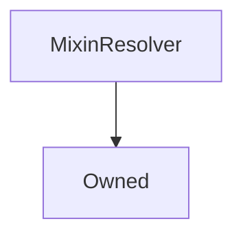

# MixinResolver

## Description

A utility that gives the inheritor access to the [`AddressResolver`](AddressResolver.md)

**Source:** [contracts/MixinResolver.sol](https://github.com/Synthetixio/synthetix/tree/v2.24.0-rc/contracts/MixinResolver.sol)

## Architecture

### Inheritance Graph

## Constants

### `MAX_ADDRESSES_FROM_RESOLVER`

[Source](https://github.com/Synthetixio/synthetix/tree/v2.24.0-rc/contracts/MixinResolver.sol#L18)

**Type:** `uint256`

## Variables

### `resolver`

[Source](https://github.com/Synthetixio/synthetix/tree/v2.24.0-rc/contracts/MixinResolver.sol#L12)

The `AddressResolver` instance

**Type:** `contract AddressResolver`

### `resolverAddressesRequired`

[Source](https://github.com/Synthetixio/synthetix/tree/v2.24.0-rc/contracts/MixinResolver.sol#L16)

**Type:** `bytes32[]`

## Constructor

### `constructor`

[Source](https://github.com/Synthetixio/synthetix/tree/v2.24.0-rc/contracts/MixinResolver.sol#L20)

??? example "Details"

    **Signature**

    `(address _resolver, bytes32[24] _addressesToCache)`

    **Visibility**

    `internal`

    **State Mutability**

    `nonpayable`

    **Requires**

    * [require(..., Owner must be set)](https://github.com/Synthetixio/synthetix/tree/v2.24.0-rc/contracts/MixinResolver.sol#L22)

## Views

### `getResolverAddressesRequired`

[Source](https://github.com/Synthetixio/synthetix/tree/v2.24.0-rc/contracts/MixinResolver.sol#L76)

??? example "Details"

    **Signature**

    `getResolverAddressesRequired() returns (bytes32[24])`

    **Visibility**

    `external`

    **State Mutability**

    `view`

### `isResolverCached`

[Source](https://github.com/Synthetixio/synthetix/tree/v2.24.0-rc/contracts/MixinResolver.sol#L58)

??? example "Details"

    **Signature**

    `isResolverCached(contract AddressResolver _resolver) returns (bool)`

    **Visibility**

    `external`

    **State Mutability**

    `view`

## Restricted Functions

### `setResolverAndSyncCache`

[Source](https://github.com/Synthetixio/synthetix/tree/v2.24.0-rc/contracts/MixinResolver.sol#L38)

??? example "Details"

    **Signature**

    `setResolverAndSyncCache(contract AddressResolver _resolver)`

    **Visibility**

    `external`

    **State Mutability**

    `nonpayable`

    **Modifiers**

    * [onlyOwner](#onlyowner)

## Internal Functions

### `appendToAddressCache`

[Source](https://github.com/Synthetixio/synthetix/tree/v2.24.0-rc/contracts/MixinResolver.sol#L87)

??? example "Details"

    **Signature**

    `appendToAddressCache(bytes32 name)`

    **Visibility**

    `internal`

    **State Mutability**

    `nonpayable`

    **Requires**

    * [require(..., Max resolver cache size met)](https://github.com/Synthetixio/synthetix/tree/v2.24.0-rc/contracts/MixinResolver.sol#L89)

### `requireAndGetAddress`

[Source](https://github.com/Synthetixio/synthetix/tree/v2.24.0-rc/contracts/MixinResolver.sol#L50)

??? example "Details"

    **Signature**

    `requireAndGetAddress(bytes32 name, string reason) returns (address)`

    **Visibility**

    `internal`

    **State Mutability**

    `view`

    **Requires**

    * [require(..., memory)](https://github.com/Synthetixio/synthetix/tree/v2.24.0-rc/contracts/MixinResolver.sol#L52)
