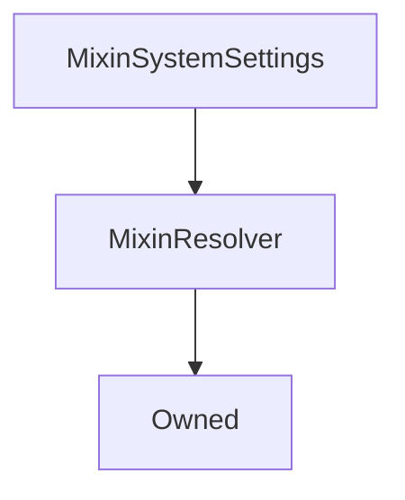

# MixinSystemSettings

## Description

**Source:** [contracts/MixinSystemSettings.sol](https://github.com/Synthetixio/synthetix/tree/v2.27.0-alpha/contracts/MixinSystemSettings.sol)

## Architecture

### Inheritance Graph

## Constructor

### `constructor`

[Source](https://github.com/Synthetixio/synthetix/tree/v2.27.0-alpha/contracts/MixinSystemSettings.sol#L27)

??? example "Details"

    **Signature**

    `()`

    **Visibility**

    `internal`

    **State Mutability**

    `nonpayable`

## Internal Functions

### `flexibleStorage`

[Source](https://github.com/Synthetixio/synthetix/tree/v2.27.0-alpha/contracts/MixinSystemSettings.sol#L31)

??? example "Details"

    **Signature**

    `flexibleStorage() returns (contract IFlexibleStorage)`

    **Visibility**

    `internal`

    **State Mutability**

    `view`

### `getAggregatorWarningFlags`

[Source](https://github.com/Synthetixio/synthetix/tree/v2.27.0-alpha/contracts/MixinSystemSettings.sol#L86)

??? example "Details"

    **Signature**

    `getAggregatorWarningFlags() returns (address)`

    **Visibility**

    `internal`

    **State Mutability**

    `view`

### `getExchangeFeeRate`

[Source](https://github.com/Synthetixio/synthetix/tree/v2.27.0-alpha/contracts/MixinSystemSettings.sol#L74)

??? example "Details"

    **Signature**

    `getExchangeFeeRate(bytes32 currencyKey) returns (uint256)`

    **Visibility**

    `internal`

    **State Mutability**

    `view`

### `getFeePeriodDuration`

[Source](https://github.com/Synthetixio/synthetix/tree/v2.27.0-alpha/contracts/MixinSystemSettings.sol#L48)

??? example "Details"

    **Signature**

    `getFeePeriodDuration() returns (uint256)`

    **Visibility**

    `internal`

    **State Mutability**

    `view`

### `getIssuanceRatio`

[Source](https://github.com/Synthetixio/synthetix/tree/v2.27.0-alpha/contracts/MixinSystemSettings.sol#L43)

??? example "Details"

    **Signature**

    `getIssuanceRatio() returns (uint256)`

    **Visibility**

    `internal`

    **State Mutability**

    `view`

### `getLiquidationDelay`

[Source](https://github.com/Synthetixio/synthetix/tree/v2.27.0-alpha/contracts/MixinSystemSettings.sol#L58)

??? example "Details"

    **Signature**

    `getLiquidationDelay() returns (uint256)`

    **Visibility**

    `internal`

    **State Mutability**

    `view`

### `getLiquidationPenalty`

[Source](https://github.com/Synthetixio/synthetix/tree/v2.27.0-alpha/contracts/MixinSystemSettings.sol#L66)

??? example "Details"

    **Signature**

    `getLiquidationPenalty() returns (uint256)`

    **Visibility**

    `internal`

    **State Mutability**

    `view`

### `getLiquidationRatio`

[Source](https://github.com/Synthetixio/synthetix/tree/v2.27.0-alpha/contracts/MixinSystemSettings.sol#L62)

??? example "Details"

    **Signature**

    `getLiquidationRatio() returns (uint256)`

    **Visibility**

    `internal`

    **State Mutability**

    `view`

### `getMinimumStakeTime`

[Source](https://github.com/Synthetixio/synthetix/tree/v2.27.0-alpha/contracts/MixinSystemSettings.sol#L82)

??? example "Details"

    **Signature**

    `getMinimumStakeTime() returns (uint256)`

    **Visibility**

    `internal`

    **State Mutability**

    `view`

### `getPriceDeviationThresholdFactor`

[Source](https://github.com/Synthetixio/synthetix/tree/v2.27.0-alpha/contracts/MixinSystemSettings.sol#L39)

??? example "Details"

    **Signature**

    `getPriceDeviationThresholdFactor() returns (uint256)`

    **Visibility**

    `internal`

    **State Mutability**

    `view`

### `getRateStalePeriod`

[Source](https://github.com/Synthetixio/synthetix/tree/v2.27.0-alpha/contracts/MixinSystemSettings.sol#L70)

??? example "Details"

    **Signature**

    `getRateStalePeriod() returns (uint256)`

    **Visibility**

    `internal`

    **State Mutability**

    `view`

### `getTargetThreshold`

[Source](https://github.com/Synthetixio/synthetix/tree/v2.27.0-alpha/contracts/MixinSystemSettings.sol#L53)

??? example "Details"

    **Signature**

    `getTargetThreshold() returns (uint256)`

    **Visibility**

    `internal`

    **State Mutability**

    `view`

### `getWaitingPeriodSecs`

[Source](https://github.com/Synthetixio/synthetix/tree/v2.27.0-alpha/contracts/MixinSystemSettings.sol#L35)

??? example "Details"

    **Signature**

    `getWaitingPeriodSecs() returns (uint256)`

    **Visibility**

    `internal`

    **State Mutability**

    `view`
