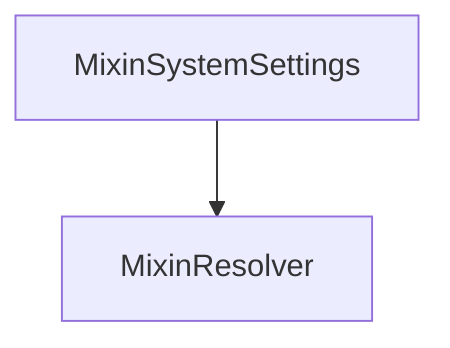

# MixinSystemSettings

## Description

**Source:** [contracts/MixinSystemSettings.sol](https://github.com/Synthetixio/synthetix/tree/v2.35.1-alpha/contracts/MixinSystemSettings.sol)

## Architecture

### Inheritance Graph

## Constructor

### `constructor`

[Source](https://github.com/Synthetixio/synthetix/tree/v2.35.1-alpha/contracts/MixinSystemSettings.sol#L31)

??? example "Details"

    **Signature**

    `(address _resolver)`

    **Visibility**

    `internal`

    **State Mutability**

    `nonpayable`

## Views

### `resolverAddressesRequired`

[Source](https://github.com/Synthetixio/synthetix/tree/v2.35.1-alpha/contracts/MixinSystemSettings.sol#L33)

??? example "Details"

    **Signature**

    `resolverAddressesRequired() returns (bytes32[])`

    **Visibility**

    `public`

    **State Mutability**

    `view`

## Internal Functions

### `flexibleStorage`

[Source](https://github.com/Synthetixio/synthetix/tree/v2.35.1-alpha/contracts/MixinSystemSettings.sol#L38)

??? example "Details"

    **Signature**

    `flexibleStorage() returns (contract IFlexibleStorage)`

    **Visibility**

    `internal`

    **State Mutability**

    `view`

### `getAggregatorWarningFlags`

[Source](https://github.com/Synthetixio/synthetix/tree/v2.35.1-alpha/contracts/MixinSystemSettings.sol#L101)

??? example "Details"

    **Signature**

    `getAggregatorWarningFlags() returns (address)`

    **Visibility**

    `internal`

    **State Mutability**

    `view`

### `getCrossDomainMessageGasLimit`

[Source](https://github.com/Synthetixio/synthetix/tree/v2.35.1-alpha/contracts/MixinSystemSettings.sol#L42)

??? example "Details"

    **Signature**

    `getCrossDomainMessageGasLimit() returns (uint256)`

    **Visibility**

    `internal`

    **State Mutability**

    `view`

### `getDebtSnapshotStaleTime`

[Source](https://github.com/Synthetixio/synthetix/tree/v2.35.1-alpha/contracts/MixinSystemSettings.sol#L105)

??? example "Details"

    **Signature**

    `getDebtSnapshotStaleTime() returns (uint256)`

    **Visibility**

    `internal`

    **State Mutability**

    `view`

### `getExchangeFeeRate`

[Source](https://github.com/Synthetixio/synthetix/tree/v2.35.1-alpha/contracts/MixinSystemSettings.sol#L89)

??? example "Details"

    **Signature**

    `getExchangeFeeRate(bytes32 currencyKey) returns (uint256)`

    **Visibility**

    `internal`

    **State Mutability**

    `view`

### `getFeePeriodDuration`

[Source](https://github.com/Synthetixio/synthetix/tree/v2.35.1-alpha/contracts/MixinSystemSettings.sol#L63)

??? example "Details"

    **Signature**

    `getFeePeriodDuration() returns (uint256)`

    **Visibility**

    `internal`

    **State Mutability**

    `view`

### `getIssuanceRatio`

[Source](https://github.com/Synthetixio/synthetix/tree/v2.35.1-alpha/contracts/MixinSystemSettings.sol#L58)

??? example "Details"

    **Signature**

    `getIssuanceRatio() returns (uint256)`

    **Visibility**

    `internal`

    **State Mutability**

    `view`

### `getLiquidationDelay`

[Source](https://github.com/Synthetixio/synthetix/tree/v2.35.1-alpha/contracts/MixinSystemSettings.sol#L73)

??? example "Details"

    **Signature**

    `getLiquidationDelay() returns (uint256)`

    **Visibility**

    `internal`

    **State Mutability**

    `view`

### `getLiquidationPenalty`

[Source](https://github.com/Synthetixio/synthetix/tree/v2.35.1-alpha/contracts/MixinSystemSettings.sol#L81)

??? example "Details"

    **Signature**

    `getLiquidationPenalty() returns (uint256)`

    **Visibility**

    `internal`

    **State Mutability**

    `view`

### `getLiquidationRatio`

[Source](https://github.com/Synthetixio/synthetix/tree/v2.35.1-alpha/contracts/MixinSystemSettings.sol#L77)

??? example "Details"

    **Signature**

    `getLiquidationRatio() returns (uint256)`

    **Visibility**

    `internal`

    **State Mutability**

    `view`

### `getMinimumStakeTime`

[Source](https://github.com/Synthetixio/synthetix/tree/v2.35.1-alpha/contracts/MixinSystemSettings.sol#L97)

??? example "Details"

    **Signature**

    `getMinimumStakeTime() returns (uint256)`

    **Visibility**

    `internal`

    **State Mutability**

    `view`

### `getPriceDeviationThresholdFactor`

[Source](https://github.com/Synthetixio/synthetix/tree/v2.35.1-alpha/contracts/MixinSystemSettings.sol#L54)

??? example "Details"

    **Signature**

    `getPriceDeviationThresholdFactor() returns (uint256)`

    **Visibility**

    `internal`

    **State Mutability**

    `view`

### `getRateStalePeriod`

[Source](https://github.com/Synthetixio/synthetix/tree/v2.35.1-alpha/contracts/MixinSystemSettings.sol#L85)

??? example "Details"

    **Signature**

    `getRateStalePeriod() returns (uint256)`

    **Visibility**

    `internal`

    **State Mutability**

    `view`

### `getTargetThreshold`

[Source](https://github.com/Synthetixio/synthetix/tree/v2.35.1-alpha/contracts/MixinSystemSettings.sol#L68)

??? example "Details"

    **Signature**

    `getTargetThreshold() returns (uint256)`

    **Visibility**

    `internal`

    **State Mutability**

    `view`

### `getTradingRewardsEnabled`

[Source](https://github.com/Synthetixio/synthetix/tree/v2.35.1-alpha/contracts/MixinSystemSettings.sol#L46)

??? example "Details"

    **Signature**

    `getTradingRewardsEnabled() returns (bool)`

    **Visibility**

    `internal`

    **State Mutability**

    `view`

### `getWaitingPeriodSecs`

[Source](https://github.com/Synthetixio/synthetix/tree/v2.35.1-alpha/contracts/MixinSystemSettings.sol#L50)

??? example "Details"

    **Signature**

    `getWaitingPeriodSecs() returns (uint256)`

    **Visibility**

    `internal`

    **State Mutability**

    `view`
