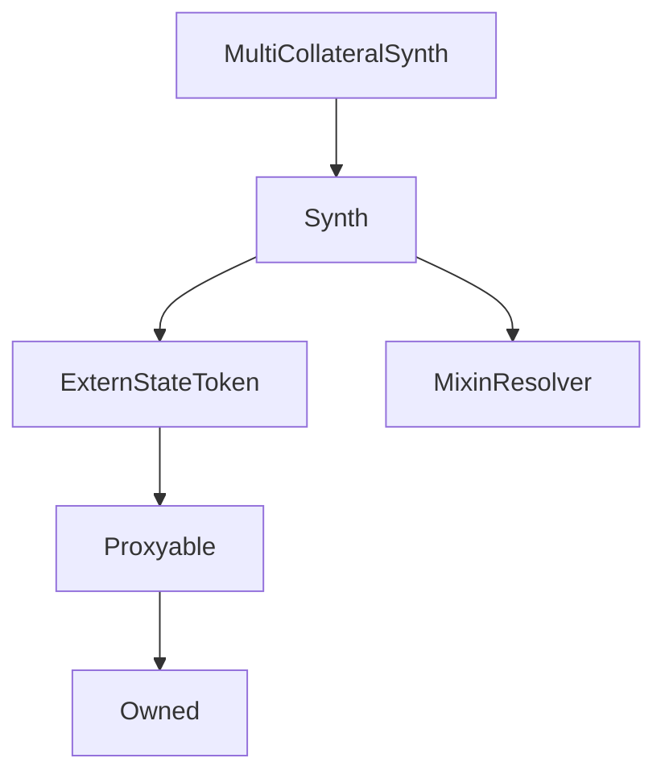

# MultiCollateralSynth

## Description

Implemented in [SIP 35: Skinny Ether Collateral](https://sips.synthetix.io/sips/sip-35)

This contract was required by [EtherCollateral](EtherCollateral.md) to allow it the ability to issue the MultiCollateralSynth in this case sETH.

It could be used where there a multiple Collateral contracts.
i.e. If there where a DAICollateral for issuing sUSD or a WBTCCollateral Contract for issuing sBTC then those synths would need to inherit MultiCollateralSynth and then have their corresponding Collateral Contract set via the constructor argument multiCollateralKey

**Source:** [contracts/MultiCollateralSynth.sol](https://github.com/Synthetixio/synthetix/tree/v2.36.0-alpha/contracts/MultiCollateralSynth.sol)

## Architecture

### Inheritance Graph

### Related Contracts

- [EtherCollateral](EtherCollateral.md)

## Constructor

### `constructor`

[Source](https://github.com/Synthetixio/synthetix/tree/v2.36.0-alpha/contracts/MultiCollateralSynth.sol#L22)

??? example "Details"

    **Signature**

    `(address payable _proxy, contract TokenState _tokenState, string _tokenName, string _tokenSymbol, address _owner, bytes32 _currencyKey, uint256 _totalSupply, address _resolver)`

    **Visibility**

    `public`

    **State Mutability**

    `nonpayable`

## Views

### `resolverAddressesRequired`

[Source](https://github.com/Synthetixio/synthetix/tree/v2.36.0-alpha/contracts/MultiCollateralSynth.sol#L47)

??? example "Details"

    **Signature**

    `resolverAddressesRequired() returns (bytes32[])`

    **Visibility**

    `public`

    **State Mutability**

    `view`

## Restricted Functions

### `burn`

[Source](https://github.com/Synthetixio/synthetix/tree/v2.36.0-alpha/contracts/MultiCollateralSynth.sol#L72)

??? example "Details"

    **Signature**

    `burn(address account, uint256 amount)`

    **Visibility**

    `external`

    **State Mutability**

    `nonpayable`

    **Modifiers**

    * [onlyInternalContracts](#onlyinternalcontracts)

### `issue`

[Source](https://github.com/Synthetixio/synthetix/tree/v2.36.0-alpha/contracts/MultiCollateralSynth.sol#L63)

??? example "Details"

    **Signature**

    `issue(address account, uint256 amount)`

    **Visibility**

    `external`

    **State Mutability**

    `nonpayable`

    **Modifiers**

    * [onlyInternalContracts](#onlyinternalcontracts)

## Internal Functions

### `collateralManager`

[Source](https://github.com/Synthetixio/synthetix/tree/v2.36.0-alpha/contracts/MultiCollateralSynth.sol#L35)

??? example "Details"

    **Signature**

    `collateralManager() returns (contract ICollateralManager)`

    **Visibility**

    `internal`

    **State Mutability**

    `view`

### `etherCollateral`

[Source](https://github.com/Synthetixio/synthetix/tree/v2.36.0-alpha/contracts/MultiCollateralSynth.sol#L39)

??? example "Details"

    **Signature**

    `etherCollateral() returns (contract IEtherCollateral)`

    **Visibility**

    `internal`

    **State Mutability**

    `view`

### `etherCollateralsUSD`

[Source](https://github.com/Synthetixio/synthetix/tree/v2.36.0-alpha/contracts/MultiCollateralSynth.sol#L43)

??? example "Details"

    **Signature**

    `etherCollateralsUSD() returns (contract IEtherCollateralsUSD)`

    **Visibility**

    `internal`

    **State Mutability**

    `view`

## Modifiers

### `onlyInternalContracts`

[Source](https://github.com/Synthetixio/synthetix/tree/v2.36.0-alpha/contracts/MultiCollateralSynth.sol#L79)
