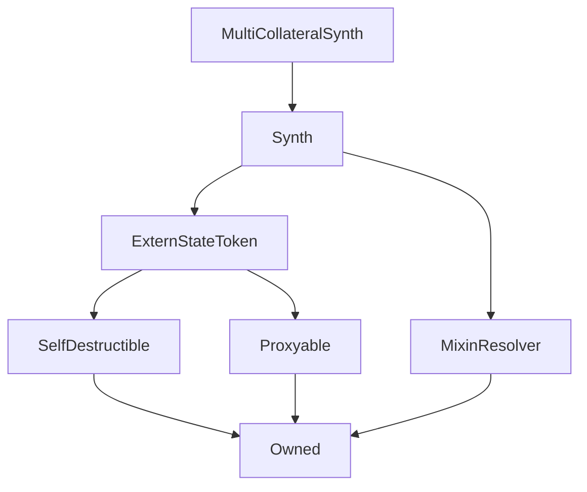

# MultiCollateralSynth

## Description

!!! todo "Work in Progress"

    This needs filling in

**Source:** [contracts/MultiCollateralSynth.sol](https://github.com/Synthetixio/synthetix/tree/v2.22.4/contracts/MultiCollateralSynth.sol)

## Architecture

### Inheritance Graph

## Variables

### `multiCollateralKey`

[Source](https://github.com/Synthetixio/synthetix/tree/v2.22.4/contracts/MultiCollateralSynth.sol#L9)

**Type:** `bytes32`

## Constructor

### `constructor`

[Source](https://github.com/Synthetixio/synthetix/tree/v2.22.4/contracts/MultiCollateralSynth.sol#L13)

??? example "Details"

    **Signature**

    `(address payable _proxy, contract TokenState _tokenState, string _tokenName, string _tokenSymbol, address _owner, bytes32 _currencyKey, uint256 _totalSupply, address _resolver, bytes32 _multiCollateralKey)`

    **Visibility**

    `public`

    **State Mutability**

    `nonpayable`

## Restricted Functions

### `burn`

[Source](https://github.com/Synthetixio/synthetix/tree/v2.22.4/contracts/MultiCollateralSynth.sol#L51)

??? example "Details"

    **Signature**

    `burn(address account, uint256 amount)`

    **Visibility**

    `external`

    **State Mutability**

    `nonpayable`

    **Modifiers**

    * [onlyInternalContracts](#onlyinternalcontracts)

### `issue`

[Source](https://github.com/Synthetixio/synthetix/tree/v2.22.4/contracts/MultiCollateralSynth.sol#L42)

??? example "Details"

    **Signature**

    `issue(address account, uint256 amount)`

    **Visibility**

    `external`

    **State Mutability**

    `nonpayable`

    **Modifiers**

    * [onlyInternalContracts](#onlyinternalcontracts)

## Internal Functions

### `multiCollateral`

[Source](https://github.com/Synthetixio/synthetix/tree/v2.22.4/contracts/MultiCollateralSynth.sol#L31)

??? example "Details"

    **Signature**

    `multiCollateral()`

    **Visibility**

    `internal`

    **State Mutability**

    `view`

## Modifiers

### `onlyInternalContracts`

[Source](https://github.com/Synthetixio/synthetix/tree/v2.22.4/contracts/MultiCollateralSynth.sol#L58)
