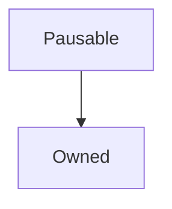

# Pausable

## Description

Allows an inheriting contract to be paused and resumed, providing a modifier that will allow modified functions to operate only if the contract is not paused.

**Source:** [contracts/Pausable.sol](https://github.com/Synthetixio/synthetix/tree/v2.24.0/contracts/Pausable.sol)

## Architecture

### Inheritance Graph

## Variables

### `lastPauseTime`

[Source](https://github.com/Synthetixio/synthetix/tree/v2.24.0/contracts/Pausable.sol#L9)

The UNIX timestamp in seconds at which the contract was last paused.

**Type:** `uint256`

### `paused`

[Source](https://github.com/Synthetixio/synthetix/tree/v2.24.0/contracts/Pausable.sol#L10)

**Type:** `bool`

## Constructor

### `constructor`

[Source](https://github.com/Synthetixio/synthetix/tree/v2.24.0/contracts/Pausable.sol#L12)

The owner this constructor initialises has the exclusive right to pause the contract. The contract begins unpaused.

??? example "Details"

    **Signature**

    `()`

    **Visibility**

    `internal`

    **State Mutability**

    `nonpayable`

    **Requires**

    * [require(..., Owner must be set)](https://github.com/Synthetixio/synthetix/tree/v2.24.0/contracts/Pausable.sol#L14)

## Restricted Functions

### `setPaused`

[Source](https://github.com/Synthetixio/synthetix/tree/v2.24.0/contracts/Pausable.sol#L22)

Pauses or unpauses the contract. Sets [`lastPauseTime`](#lastPauseTime) to the current timestamp if the contract is newly paused.

??? example "Details"

    **Signature**

    `setPaused(bool _paused)`

    **Visibility**

    `external`

    **State Mutability**

    `nonpayable`

    **Modifiers**

    * [onlyOwner](#onlyowner)

    **Emits**

    * [PauseChanged](#pausechanged)

## Modifiers

### `notPaused`

[Source](https://github.com/Synthetixio/synthetix/tree/v2.24.0/contracts/Pausable.sol#L42)

Reverts the transaction the contract is [`paused`](#paused). Provided for use by inheriting contracts.

## Events

### `PauseChanged`

[Source](https://github.com/Synthetixio/synthetix/tree/v2.24.0/contracts/Pausable.sol#L40)

The contract has gone from paused to unpaused or vice versa. This event reports the new state.

**Signature**: `PauseChanged(bool isPaused)`
