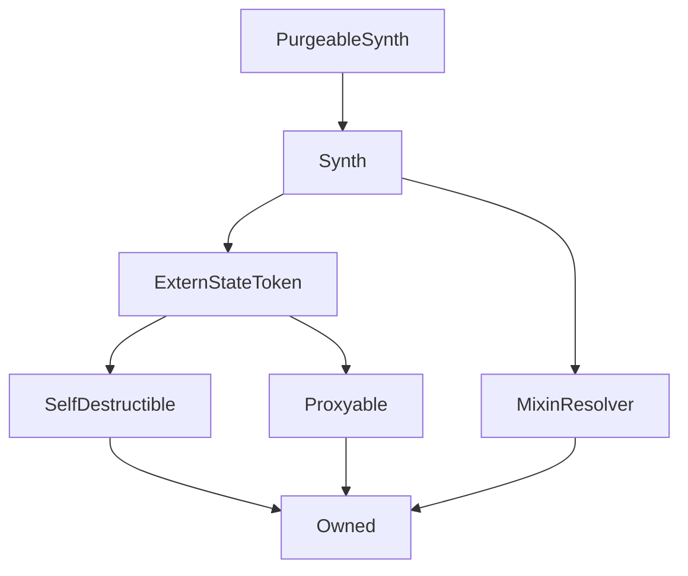

# PurgeableSynth

## Description

This is a [Synth](Synth.md) where all the holders can be force-[exchanged](Synthetix.md#exchange) back to `sUSD` at current rates so that the contract can be removed from the system or otherwise repurposed. In order to be liquidated, a Synth must either be frozen (if it is an inverse synth) or have its total outstanding supply worth less than $100\,000$ USD. Hence it is mainly useful for eliminating Synths which are unused or at the end of their useful life. The value of the token is read from the system's central [ExchangeRates](ExchangeRates.md) contract.

Purgeable synths were introduced by [SIP-3](https://github.com/Synthetixio/SIPs/blob/master/SIPS/sip-3.md) in response to increasing gas costs associated with minting, and to allow faster reconfiguration of inverse synths.

**Source:** [contracts/PurgeableSynth.sol](https://github.com/Synthetixio/synthetix/tree/v2.25.0-alpha/contracts/PurgeableSynth.sol)

## Architecture

### Libraries

- [SafeDecimalMath](/contracts/source/libraries/SafeDecimalMath) for `uint`

### Inheritance Graph

### Related Contracts

- [`ExchangeRates`](ExchangeRates.md)

## Variables

### `maxSupplyToPurgeInUSD`

[Source](https://github.com/Synthetixio/synthetix/tree/v2.25.0-alpha/contracts/PurgeableSynth.sol#L18)

Purging this Synth is disallowed unless the value of its supply is less than this. Initialised to $100\,000$.

**Type:** `uint256`

## Constructor

### `constructor`

[Source](https://github.com/Synthetixio/synthetix/tree/v2.25.0-alpha/contracts/PurgeableSynth.sol#L24)

??? example "Details"

    **Signature**

    `(address payable _proxy, contract TokenState _tokenState, string _tokenName, string _tokenSymbol, address payable _owner, bytes32 _currencyKey, uint256 _totalSupply, address _resolver)`

    **Visibility**

    `public`

    **State Mutability**

    `nonpayable`

## Restricted Functions

### `purge`

[Source](https://github.com/Synthetixio/synthetix/tree/v2.25.0-alpha/contracts/PurgeableSynth.sol#L45)

Allows the owner to liquidate all holders of this token back to `sUSD` if the total value of this Synth is worth less than [`maxSupplyToPurgeInUSD`](#maxsupplytopurgeinusd) US dollars at current prices, or if the token is an inverse synth whose price is frozen.

If this is successfully invoked, balances in the provided list of addresses will be deleted, and an equivalent value of sUSD credited to their account.

??? example "Details"

    **Signature**

    `purge(address[] addresses)`

    **Visibility**

    `external`

    **State Mutability**

    `nonpayable`

    **Requires**

    * [require(..., Cannot purge as total supply is above threshold and rate is not frozen.)](https://github.com/Synthetixio/synthetix/tree/v2.25.0-alpha/contracts/PurgeableSynth.sol#L51)

    **Modifiers**

    * [optionalProxy_onlyOwner](#optionalproxy_onlyowner)

## Internal Functions

### `emitPurged`

[Source](https://github.com/Synthetixio/synthetix/tree/v2.25.0-alpha/contracts/PurgeableSynth.sol#L72)

??? example "Details"

    **Signature**

    `emitPurged(address account, uint256 value)`

    **Visibility**

    `internal`

    **State Mutability**

    `nonpayable`

### `exchangeRates`

[Source](https://github.com/Synthetixio/synthetix/tree/v2.25.0-alpha/contracts/PurgeableSynth.sol#L39)

The contract address to obtain price information from.

It is necessary to know the current price of this Synth to work out whether it is below the purging threshold.

**Type:** `ExchangeRates public`

??? example "Details"

    **Signature**

    `exchangeRates() returns (contract IExchangeRates)`

    **Visibility**

    `internal`

    **State Mutability**

    `view`

## Events

### `Purged`

[Source](https://github.com/Synthetixio/synthetix/tree/v2.25.0-alpha/contracts/PurgeableSynth.sol#L69)

Records that a balance of this currency was liquidated back to `sUSD` for a particular account.

This event is emitted from the Synth's [proxy](Proxy.md#_emit) with the `emitPurged` function.

**Signature**: `Purged(address account, uint256 value)`
