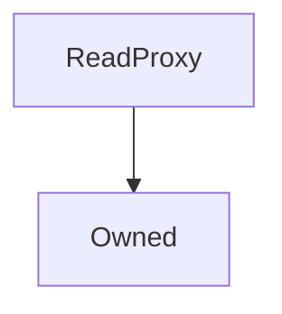

# ReadProxy

## Description

The ReadProxy is a simple proxy for readonly views. If any mutative function is attempted on the underlying the EVM will revert.

**Source:** [contracts/ReadProxy.sol](https://github.com/Synthetixio/synthetix/tree/v2.35.0-ovm/contracts/ReadProxy.sol)

## Architecture

### Inheritance Graph

## Variables

### `target`

[Source](https://github.com/Synthetixio/synthetix/tree/v2.35.0-ovm/contracts/ReadProxy.sol#L10)

**Type:** `address`

## Constructor

### `constructor`

[Source](https://github.com/Synthetixio/synthetix/tree/v2.35.0-ovm/contracts/ReadProxy.sol#L12)

??? example "Details"

    **Signature**

    `(address _owner)`

    **Visibility**

    `public`

    **State Mutability**

    `nonpayable`

## Restricted Functions

### `setTarget`

[Source](https://github.com/Synthetixio/synthetix/tree/v2.35.0-ovm/contracts/ReadProxy.sol#L14)

??? example "Details"

    **Signature**

    `setTarget(address _target)`

    **Visibility**

    `external`

    **State Mutability**

    `nonpayable`

    **Modifiers**

    * [onlyOwner](#onlyowner)

    **Emits**

    * [TargetUpdated](#targetupdated)

## Fallback Function

### `() (fallback function)`

[Source](https://github.com/Synthetixio/synthetix/tree/v2.35.0-ovm/contracts/ReadProxy.sol#L19)

??? example "Details"

    **Signature**

    `()`

    **Visibility**

    `external`

    **State Mutability**

    `nonpayable`

## Events

### `TargetUpdated`

[Source](https://github.com/Synthetixio/synthetix/tree/v2.35.0-ovm/contracts/ReadProxy.sol#L36)

**Signature**: `TargetUpdated(address newTarget)`
