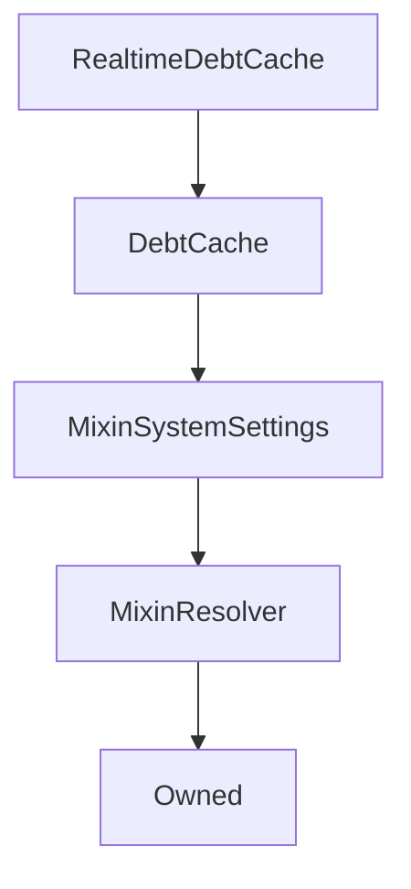

# RealtimeDebtCache

## Description

**Source:** [contracts/RealtimeDebtCache.sol](https://github.com/Synthetixio/synthetix/tree/v2.32.2-sip-95-remove-BCH-aggregator/contracts/RealtimeDebtCache.sol)

## Architecture

### Inheritance Graph

## Constructor

### `constructor`

[Source](https://github.com/Synthetixio/synthetix/tree/v2.32.2-sip-95-remove-BCH-aggregator/contracts/RealtimeDebtCache.sol#L9)

??? example "Details"

    **Signature**

    `(address _owner, address _resolver)`

    **Visibility**

    `public`

    **State Mutability**

    `nonpayable`

## Views

### `cacheInfo`

[Source](https://github.com/Synthetixio/synthetix/tree/v2.32.2-sip-95-remove-BCH-aggregator/contracts/RealtimeDebtCache.sol#L47)

??? example "Details"

    **Signature**

    `cacheInfo() returns (uint256, uint256, bool, bool)`

    **Visibility**

    `external`

    **State Mutability**

    `view`

### `cacheInvalid`

[Source](https://github.com/Synthetixio/synthetix/tree/v2.32.2-sip-95-remove-BCH-aggregator/contracts/RealtimeDebtCache.sol#L37)

??? example "Details"

    **Signature**

    `cacheInvalid() returns (bool)`

    **Visibility**

    `external`

    **State Mutability**

    `view`

### `cacheStale`

[Source](https://github.com/Synthetixio/synthetix/tree/v2.32.2-sip-95-remove-BCH-aggregator/contracts/RealtimeDebtCache.sol#L33)

??? example "Details"

    **Signature**

    `cacheStale() returns (bool)`

    **Visibility**

    `external`

    **State Mutability**

    `view`

### `cacheTimestamp`

[Source](https://github.com/Synthetixio/synthetix/tree/v2.32.2-sip-95-remove-BCH-aggregator/contracts/RealtimeDebtCache.sol#L29)

??? example "Details"

    **Signature**

    `cacheTimestamp() returns (uint256)`

    **Visibility**

    `external`

    **State Mutability**

    `view`

### `cachedDebt`

[Source](https://github.com/Synthetixio/synthetix/tree/v2.32.2-sip-95-remove-BCH-aggregator/contracts/RealtimeDebtCache.sol#L17)

??? example "Details"

    **Signature**

    `cachedDebt() returns (uint256)`

    **Visibility**

    `external`

    **State Mutability**

    `view`

### `cachedSynthDebt`

[Source](https://github.com/Synthetixio/synthetix/tree/v2.32.2-sip-95-remove-BCH-aggregator/contracts/RealtimeDebtCache.sol#L22)

??? example "Details"

    **Signature**

    `cachedSynthDebt(bytes32 currencyKey) returns (uint256)`

    **Visibility**

    `external`

    **State Mutability**

    `view`

### `cachedSynthDebts`

[Source](https://github.com/Synthetixio/synthetix/tree/v2.32.2-sip-95-remove-BCH-aggregator/contracts/RealtimeDebtCache.sol#L42)

??? example "Details"

    **Signature**

    `cachedSynthDebts(bytes32[] currencyKeys) returns (uint256[])`

    **Visibility**

    `external`

    **State Mutability**

    `view`

### `debtSnapshotStaleTime`

[Source](https://github.com/Synthetixio/synthetix/tree/v2.32.2-sip-95-remove-BCH-aggregator/contracts/RealtimeDebtCache.sol#L13)

??? example "Details"

    **Signature**

    `debtSnapshotStaleTime() returns (uint256)`

    **Visibility**

    `external`

    **State Mutability**

    `view`

## External Functions

### `purgeCachedSynthDebt`

[Source](https://github.com/Synthetixio/synthetix/tree/v2.32.2-sip-95-remove-BCH-aggregator/contracts/RealtimeDebtCache.sol#L64)

??? example "Details"

    **Signature**

    `purgeCachedSynthDebt(bytes32 currencyKey)`

    **Visibility**

    `external`

    **State Mutability**

    `nonpayable`

### `takeDebtSnapshot`

[Source](https://github.com/Synthetixio/synthetix/tree/v2.32.2-sip-95-remove-BCH-aggregator/contracts/RealtimeDebtCache.sol#L66)

??? example "Details"

    **Signature**

    `takeDebtSnapshot()`

    **Visibility**

    `external`

    **State Mutability**

    `nonpayable`

### `updateCachedSynthDebtWithRate`

[Source](https://github.com/Synthetixio/synthetix/tree/v2.32.2-sip-95-remove-BCH-aggregator/contracts/RealtimeDebtCache.sol#L70)

??? example "Details"

    **Signature**

    `updateCachedSynthDebtWithRate(bytes32 currencyKey, uint256 currencyRate)`

    **Visibility**

    `external`

    **State Mutability**

    `nonpayable`

### `updateCachedSynthDebts`

[Source](https://github.com/Synthetixio/synthetix/tree/v2.32.2-sip-95-remove-BCH-aggregator/contracts/RealtimeDebtCache.sol#L68)

??? example "Details"

    **Signature**

    `updateCachedSynthDebts(bytes32[] currencyKeys)`

    **Visibility**

    `external`

    **State Mutability**

    `nonpayable`

### `updateCachedSynthDebtsWithRates`

[Source](https://github.com/Synthetixio/synthetix/tree/v2.32.2-sip-95-remove-BCH-aggregator/contracts/RealtimeDebtCache.sol#L72)

??? example "Details"

    **Signature**

    `updateCachedSynthDebtsWithRates(bytes32[] currencyKeys, uint256[] currencyRates)`

    **Visibility**

    `external`

    **State Mutability**

    `nonpayable`

### `updateDebtCacheValidity`

[Source](https://github.com/Synthetixio/synthetix/tree/v2.32.2-sip-95-remove-BCH-aggregator/contracts/RealtimeDebtCache.sol#L74)

??? example "Details"

    **Signature**

    `updateDebtCacheValidity(bool currentlyInvalid)`

    **Visibility**

    `external`

    **State Mutability**

    `nonpayable`
