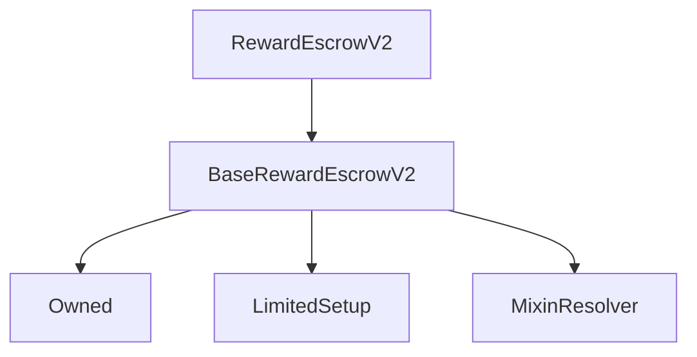

# RewardEscrowV2

## Description

**Source:** [contracts/RewardEscrowV2.sol](https://github.com/Synthetixio/synthetix/tree/v2.37.0/contracts/RewardEscrowV2.sol)

## Architecture

### Inheritance Graph

## Variables

### `migrateEntriesThresholdAmount`

[Source](https://github.com/Synthetixio/synthetix/tree/v2.37.0/contracts/RewardEscrowV2.sol#L16)

**Type:** `uint256`

### `totalBalancePendingMigration`

[Source](https://github.com/Synthetixio/synthetix/tree/v2.37.0/contracts/RewardEscrowV2.sol#L14)

**Type:** `mapping(address => uint256)`

## Constructor

### `constructor`

[Source](https://github.com/Synthetixio/synthetix/tree/v2.37.0/contracts/RewardEscrowV2.sol#L26)

??? example "Details"

    **Signature**

    `(address _owner, address _resolver)`

    **Visibility**

    `public`

    **State Mutability**

    `nonpayable`

## Views

### `resolverAddressesRequired`

[Source](https://github.com/Synthetixio/synthetix/tree/v2.37.0/contracts/RewardEscrowV2.sol#L30)

??? example "Details"

    **Signature**

    `resolverAddressesRequired() returns (bytes32[])`

    **Visibility**

    `public`

    **State Mutability**

    `view`

## Restricted Functions

### `burnForMigration`

[Source](https://github.com/Synthetixio/synthetix/tree/v2.37.0/contracts/RewardEscrowV2.sol#L191)

??? example "Details"

    **Signature**

    `burnForMigration(address account, uint256[] entryIDs) returns (uint256, struct VestingEntries.VestingEntry[])`

    **Visibility**

    `external`

    **State Mutability**

    `nonpayable`

    **Requires**

    * [require(..., Entry IDs required)](https://github.com/Synthetixio/synthetix/tree/v2.37.0/contracts/RewardEscrowV2.sol#L196)

    **Modifiers**

    * [onlySynthetixBridge](#onlysynthetixbridge)

    **Emits**

    * [BurnedForMigrationToL2](#burnedformigrationtol2)

### `importVestingSchedule`

[Source](https://github.com/Synthetixio/synthetix/tree/v2.37.0/contracts/RewardEscrowV2.sol#L117)

??? example "Details"

    **Signature**

    `importVestingSchedule(address[] accounts, uint256[] escrowAmounts)`

    **Visibility**

    `external`

    **State Mutability**

    `nonpayable`

    **Requires**

    * [require(..., Account and escrowAmounts Length mismatch)](https://github.com/Synthetixio/synthetix/tree/v2.37.0/contracts/RewardEscrowV2.sol#L122)

    **Modifiers**

    * [onlyDuringSetup](#onlyduringsetup)

    * [onlyOwner](#onlyowner)

### `migrateAccountEscrowBalances`

[Source](https://github.com/Synthetixio/synthetix/tree/v2.37.0/contracts/RewardEscrowV2.sol#L151)

??? example "Details"

    **Signature**

    `migrateAccountEscrowBalances(address[] accounts, uint256[] escrowBalances, uint256[] vestedBalances)`

    **Visibility**

    `external`

    **State Mutability**

    `nonpayable`

    **Requires**

    * [require(..., Number of accounts and balances don't match)](https://github.com/Synthetixio/synthetix/tree/v2.37.0/contracts/RewardEscrowV2.sol#L156)

    * [require(..., Number of accounts and vestedBalances don't match)](https://github.com/Synthetixio/synthetix/tree/v2.37.0/contracts/RewardEscrowV2.sol#L157)

    **Modifiers**

    * [onlyDuringSetup](#onlyduringsetup)

    * [onlyOwner](#onlyowner)

### `setMigrateEntriesThresholdAmount`

[Source](https://github.com/Synthetixio/synthetix/tree/v2.37.0/contracts/RewardEscrowV2.sol#L59)

??? example "Details"

    **Signature**

    `setMigrateEntriesThresholdAmount(uint256 amount)`

    **Visibility**

    `external`

    **State Mutability**

    `nonpayable`

    **Modifiers**

    * [onlyOwner](#onlyowner)

    **Emits**

    * [MigrateEntriesThresholdAmountUpdated](#migrateentriesthresholdamountupdated)

## Internal Functions

### `_importVestingEntry`

[Source](https://github.com/Synthetixio/synthetix/tree/v2.37.0/contracts/RewardEscrowV2.sol#L182)

??? example "Details"

    **Signature**

    `_importVestingEntry(address account, struct VestingEntries.VestingEntry entry)`

    **Visibility**

    `internal`

    **State Mutability**

    `nonpayable`

    **Emits**

    * [ImportedVestingEntry](#importedvestingentry)

### `oldRewardEscrow`

[Source](https://github.com/Synthetixio/synthetix/tree/v2.37.0/contracts/RewardEscrowV2.sol#L43)

??? example "Details"

    **Signature**

    `oldRewardEscrow() returns (contract IRewardEscrow)`

    **Visibility**

    `internal`

    **State Mutability**

    `view`

### `synthetixBridgeToOptimism`

[Source](https://github.com/Synthetixio/synthetix/tree/v2.37.0/contracts/RewardEscrowV2.sol#L39)

??? example "Details"

    **Signature**

    `synthetixBridgeToOptimism() returns (address)`

    **Visibility**

    `internal`

    **State Mutability**

    `view`

### `systemStatus`

[Source](https://github.com/Synthetixio/synthetix/tree/v2.37.0/contracts/RewardEscrowV2.sol#L47)

??? example "Details"

    **Signature**

    `systemStatus() returns (contract ISystemStatus)`

    **Visibility**

    `internal`

    **State Mutability**

    `view`

## External Functions

### `migrateVestingSchedule`

[Source](https://github.com/Synthetixio/synthetix/tree/v2.37.0/contracts/RewardEscrowV2.sol#L65)

??? example "Details"

    **Signature**

    `migrateVestingSchedule(address addressToMigrate)`

    **Visibility**

    `external`

    **State Mutability**

    `nonpayable`

    **Requires**

    * [require(..., No escrow migration pending)](https://github.com/Synthetixio/synthetix/tree/v2.37.0/contracts/RewardEscrowV2.sol#L68)

    * [require(..., Address escrow balance is 0)](https://github.com/Synthetixio/synthetix/tree/v2.37.0/contracts/RewardEscrowV2.sol#L69)

    **Modifiers**

    * [systemActive](#systemactive)

## Modifiers

### `onlySynthetixBridge`

[Source](https://github.com/Synthetixio/synthetix/tree/v2.37.0/contracts/RewardEscrowV2.sol#L230)

### `systemActive`

[Source](https://github.com/Synthetixio/synthetix/tree/v2.37.0/contracts/RewardEscrowV2.sol#L235)

## Events

### `BurnedForMigrationToL2`

[Source](https://github.com/Synthetixio/synthetix/tree/v2.37.0/contracts/RewardEscrowV2.sol#L243)

**Signature**: `BurnedForMigrationToL2(address account, uint256[] entryIDs, uint256 escrowedAmountMigrated, uint256 time)`

### `ImportedVestingEntry`

[Source](https://github.com/Synthetixio/synthetix/tree/v2.37.0/contracts/RewardEscrowV2.sol#L244)

**Signature**: `ImportedVestingEntry(address account, uint256 entryID, uint256 escrowAmount, uint256 endTime)`

### `ImportedVestingSchedule`

[Source](https://github.com/Synthetixio/synthetix/tree/v2.37.0/contracts/RewardEscrowV2.sol#L242)

**Signature**: `ImportedVestingSchedule(address account, uint256 time, uint256 escrowAmount)`

### `MigrateEntriesThresholdAmountUpdated`

[Source](https://github.com/Synthetixio/synthetix/tree/v2.37.0/contracts/RewardEscrowV2.sol#L245)

**Signature**: `MigrateEntriesThresholdAmountUpdated(uint256 newAmount)`

### `MigratedAccountEscrow`

[Source](https://github.com/Synthetixio/synthetix/tree/v2.37.0/contracts/RewardEscrowV2.sol#L241)

**Signature**: `MigratedAccountEscrow(address account, uint256 escrowedAmount, uint256 vestedAmount, uint256 time)`
