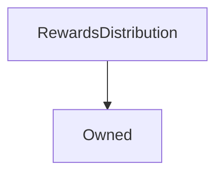

# RewardsDistribution

## Description

This contract distributes the inflationary supply rewards after they have been minted. The primary recipient remains the population of SNX stakers, but new ones can be added to receive an allocation of tokens first. These entries can then be modified or removed.

The actual quantity of tokens to inject into the supply each week is passed into [`distributeRewards`](#distributerewards) by [`Synthetix.mint`](Synthetix.md#mint); how much the quantity is on any given week is determined by the [`SupplySchedule`](SupplySchedule.md) contract.

Incentivising activities other than staking was first trialed with UniSwap, which was then formalised into [SIP-8](https://sips.synthetix.io/sips/sip-8), resulting in this contract.

**Source:** [contracts/RewardsDistribution.sol](https://github.com/Synthetixio/synthetix/tree/v2.24.0/contracts/RewardsDistribution.sol)

## Architecture

### Libraries

- [SafeMath](/contracts/source/libraries/SafeMath) for `uint`
- [SafeDecimalMath](/contracts/source/libraries/SafeDecimalMath) for `uint`

### Inheritance Graph

### Related Contracts

- \>[FeePoolProxy](Proxy.md)
- \>[RewardEscrow](RewardEscrow.md)
- \>[SynthetixProxy](Proxy.md)

## Structs

### `DistributionData`

[Source](https://github.com/Synthetixio/synthetix/tree/v2.24.0/contracts/RewardsDistribution.sol#L44)

Stores an address and a quantity of the inflationary tokens to send to it.

**Fields**

| Field         | Type      | Description                                                  |
| ------------- | --------- | ------------------------------------------------------------ |
| `destination` | `address` | The address to send a portion of the inflationary supply to. |
| `amount`      | `uint256` | The quantity of tokens to send.                              |

## Variables

### `authority`

[Source](https://github.com/Synthetixio/synthetix/tree/v2.24.0/contracts/RewardsDistribution.sol#L23)

The address authorised to call [`distributeRewards`](#distributerewards), which is used only by [`Synthetix.mint`](Synthetix.md#mint).

**Type:** `address`

### `distributions`

[Source](https://github.com/Synthetixio/synthetix/tree/v2.24.0/contracts/RewardsDistribution.sol#L52)

An array of distribution recipients and the amount of SNX each will receive from the weekly inflationary supply.

**Type:** `struct RewardsDistribution.DistributionData[]`

### `feePoolProxy`

[Source](https://github.com/Synthetixio/synthetix/tree/v2.24.0/contracts/RewardsDistribution.sol#L38)

The address of the [`FeePool`](FeePool.md) [`Proxy`](Proxy.md), which has to be informed how many rewards it has left to distribute once distributions have been made.

**Type:** `address`

### `rewardEscrow`

[Source](https://github.com/Synthetixio/synthetix/tree/v2.24.0/contracts/RewardsDistribution.sol#L33)

The address of the [`RewardEscrow`](RewardEscrow.md), where all remaining tokens are sent once other distributions have been made.

**Type:** `address`

### `synthetixProxy`

[Source](https://github.com/Synthetixio/synthetix/tree/v2.24.0/contracts/RewardsDistribution.sol#L28)

The address of the Synthetix [`ProxyERC20`](ProxyERC20.md) for transferring SNX to distribution recipients and the [`RewardEscrow`](RewardEscrow.md) contract.

**Type:** `address`

## Constructor

### `constructor`

[Source](https://github.com/Synthetixio/synthetix/tree/v2.24.0/contracts/RewardsDistribution.sol#L58)

Initialises the addresses of various related contracts, as well as the inherited [`Owned`](Owned.md) instance.

??? example "Details"

    **Signature**

    `(address _owner, address _authority, address _synthetixProxy, address _rewardEscrow, address _feePoolProxy)`

    **Visibility**

    `public`

    **State Mutability**

    `nonpayable`

## Views

### `distributionsLength`

[Source](https://github.com/Synthetixio/synthetix/tree/v2.24.0/contracts/RewardsDistribution.sol#L201)

The number of recipients receiving distributions. This is an alias for `distributions.length`.

??? example "Details"

    **Signature**

    `distributionsLength() returns (uint256)`

    **Visibility**

    `external`

    **State Mutability**

    `view`

## Restricted Functions

### `addRewardDistribution`

[Source](https://github.com/Synthetixio/synthetix/tree/v2.24.0/contracts/RewardsDistribution.sol#L103)

Allows the owner to add new reward distribution recipients.

This function always returns true if it does not revert.

??? example "Details"

    **Signature**

    `addRewardDistribution(address destination, uint256 amount) returns (bool)`

    **Visibility**

    `external`

    **State Mutability**

    `nonpayable`

    **Requires**

    * [require(..., Cant add a zero address)](https://github.com/Synthetixio/synthetix/tree/v2.24.0/contracts/RewardsDistribution.sol#L104)

    * [require(..., Cant add a zero amount)](https://github.com/Synthetixio/synthetix/tree/v2.24.0/contracts/RewardsDistribution.sol#L105)

    **Modifiers**

    * [onlyOwner](#onlyowner)

    **Emits**

    * [RewardDistributionAdded](#rewarddistributionadded)

### `editRewardDistribution`

[Source](https://github.com/Synthetixio/synthetix/tree/v2.24.0/contracts/RewardsDistribution.sol#L140)

Modifies a distribution recipient or the quantity to be released to them in the [`distributions`](#distributions) list at the specified index.

This function always returns true if it does not revert.

??? example "Details"

    **Signature**

    `editRewardDistribution(uint256 index, address destination, uint256 amount) returns (bool)`

    **Visibility**

    `external`

    **State Mutability**

    `nonpayable`

    **Requires**

    * [require(..., index out of bounds)](https://github.com/Synthetixio/synthetix/tree/v2.24.0/contracts/RewardsDistribution.sol#L145)

    **Modifiers**

    * [onlyOwner](#onlyowner)

### `removeRewardDistribution`

[Source](https://github.com/Synthetixio/synthetix/tree/v2.24.0/contracts/RewardsDistribution.sol#L119)

Removes a distribution recipient from the [`distributions`](#distributions) list at the specified index.

??? example "Details"

    **Signature**

    `removeRewardDistribution(uint256 index)`

    **Visibility**

    `external`

    **State Mutability**

    `nonpayable`

    **Requires**

    * [require(..., index out of bounds)](https://github.com/Synthetixio/synthetix/tree/v2.24.0/contracts/RewardsDistribution.sol#L120)

    **Modifiers**

    * [onlyOwner](#onlyowner)

### `setAuthority`

[Source](https://github.com/Synthetixio/synthetix/tree/v2.24.0/contracts/RewardsDistribution.sol#L89)

Allows the owner to set the address of the [fee authority](#feeauthority).

??? example "Details"

    **Signature**

    `setAuthority(address _authority)`

    **Visibility**

    `external`

    **State Mutability**

    `nonpayable`

    **Modifiers**

    * [onlyOwner](#onlyowner)

### `setFeePoolProxy`

[Source](https://github.com/Synthetixio/synthetix/tree/v2.24.0/contracts/RewardsDistribution.sol#L81)

Allows the owner to set the address of the [FeePool Proxy](#feepoolproxy).

??? example "Details"

    **Signature**

    `setFeePoolProxy(address _feePoolProxy)`

    **Visibility**

    `external`

    **State Mutability**

    `nonpayable`

    **Modifiers**

    * [onlyOwner](#onlyowner)

### `setRewardEscrow`

[Source](https://github.com/Synthetixio/synthetix/tree/v2.24.0/contracts/RewardsDistribution.sol#L77)

Allows the owner to set the address of the [RewardEscrow](#rewardescrow) contract.

??? example "Details"

    **Signature**

    `setRewardEscrow(address _rewardEscrow)`

    **Visibility**

    `external`

    **State Mutability**

    `nonpayable`

    **Modifiers**

    * [onlyOwner](#onlyowner)

### `setSynthetixProxy`

[Source](https://github.com/Synthetixio/synthetix/tree/v2.24.0/contracts/RewardsDistribution.sol#L73)

Allows the owner to set the address of the [Synthetix ProxyERC20](#synthetixproxy).

??? example "Details"

    **Signature**

    `setSynthetixProxy(address _synthetixProxy)`

    **Visibility**

    `external`

    **State Mutability**

    `nonpayable`

    **Modifiers**

    * [onlyOwner](#onlyowner)

## External Functions

### `distributeRewards`

[Source](https://github.com/Synthetixio/synthetix/tree/v2.24.0/contracts/RewardsDistribution.sol#L153)

Distributes a quantity of new SNX among stakers and other reward recipients as part of supply inflation.

First, for each element `d` in the [`distributions`](#distributions) list, `d.amount` SNX is sent to `d.destination`. The remaining tokens are then transferred to the [`RewardEscrow`](RewardEscrow.md) contract to be claimed by stakers, and the [`FeePool`](FeePool.md#setrewardstodistribute) is notified of the updated claimable supply.

This function always returns true if it does not revert.

!!! info "Sufficient SNX Balance"

    There will always be sufficient SNX in the RewardsDistribution contract to support this operation, since its SNX balance is directly credited the correct number of tokens by [`Synthetix.mint`](Synthetix.md#mint) immediately before the only call to this function. Only the Synthetix contract is authorised to execute rewards distribution, and this is the only place new SNX finds its way into the system.

??? example "Details"

    **Signature**

    `distributeRewards(uint256 amount) returns (bool)`

    **Visibility**

    `external`

    **State Mutability**

    `nonpayable`

    **Requires**

    * [require(..., Nothing to distribute)](https://github.com/Synthetixio/synthetix/tree/v2.24.0/contracts/RewardsDistribution.sol#L154)

    * [require(..., Caller is not authorised)](https://github.com/Synthetixio/synthetix/tree/v2.24.0/contracts/RewardsDistribution.sol#L155)

    * [require(..., RewardEscrow is not set)](https://github.com/Synthetixio/synthetix/tree/v2.24.0/contracts/RewardsDistribution.sol#L156)

    * [require(..., SynthetixProxy is not set)](https://github.com/Synthetixio/synthetix/tree/v2.24.0/contracts/RewardsDistribution.sol#L157)

    * [require(..., FeePoolProxy is not set)](https://github.com/Synthetixio/synthetix/tree/v2.24.0/contracts/RewardsDistribution.sol#L158)

    * [require(..., RewardsDistribution contract does not have enough tokens to distribute)](https://github.com/Synthetixio/synthetix/tree/v2.24.0/contracts/RewardsDistribution.sol#L159)

    **Emits**

    * [RewardsDistributed](#rewardsdistributed)

## Events

### `RewardDistributionAdded`

[Source](https://github.com/Synthetixio/synthetix/tree/v2.24.0/contracts/RewardsDistribution.sol#L207)

Records that a new recipient was added to the distributions list, and the index they were added at.

**Signature**: `RewardDistributionAdded(uint256 index, address destination, uint256 amount)`

### `RewardsDistributed`

[Source](https://github.com/Synthetixio/synthetix/tree/v2.24.0/contracts/RewardsDistribution.sol#L208)

Records that a quantity of the inflationary rewards have been dispersed among the [`distributions`](#distributions) recipients and the pool of stakers.

**Signature**: `RewardsDistributed(uint256 amount)`
