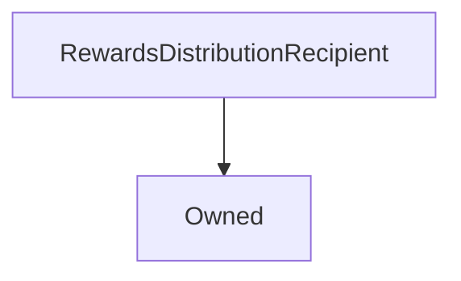

# RewardsDistributionRecipient

## Description

!!! Info "Documentation Pending"

    This contract documentation is missing some descriptions.

**Source:** [contracts/RewardsDistributionRecipient.sol](https://github.com/Synthetixio/synthetix/tree/v2.33.0/contracts/RewardsDistributionRecipient.sol)

## Architecture

### Inheritance Graph

## Variables

### `rewardsDistribution`

[Source](https://github.com/Synthetixio/synthetix/tree/v2.33.0/contracts/RewardsDistributionRecipient.sol#L9)

**Type:** `address`

## Restricted Functions

### `setRewardsDistribution`

[Source](https://github.com/Synthetixio/synthetix/tree/v2.33.0/contracts/RewardsDistributionRecipient.sol#L18)

??? example "Details"

    **Signature**

    `setRewardsDistribution(address _rewardsDistribution)`

    **Visibility**

    `external`

    **State Mutability**

    `nonpayable`

    **Modifiers**

    * [onlyOwner](#onlyowner)

## External Functions

### `notifyRewardAmount`

[Source](https://github.com/Synthetixio/synthetix/tree/v2.33.0/contracts/RewardsDistributionRecipient.sol#L11)

??? example "Details"

    **Signature**

    `notifyRewardAmount(uint256 reward)`

    **Visibility**

    `external`

    **State Mutability**

    `nonpayable`

## Modifiers

### `onlyRewardsDistribution`

[Source](https://github.com/Synthetixio/synthetix/tree/v2.33.0/contracts/RewardsDistributionRecipient.sol#L13)
