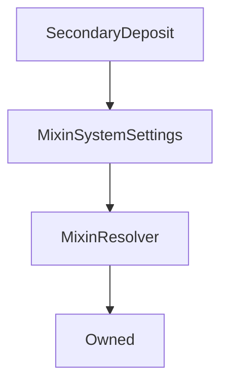

# SecondaryDeposit

## Description

**Source:** [contracts/SecondaryDeposit.sol](https://github.com/Synthetixio/synthetix/tree/v2.30.2-ovm/contracts/SecondaryDeposit.sol)

## Architecture

### Inheritance Graph

## Variables

### `activated`

[Source](https://github.com/Synthetixio/synthetix/tree/v2.30.2-ovm/contracts/SecondaryDeposit.sol#L20)

**Type:** `bool`

## Constructor

### `constructor`

[Source](https://github.com/Synthetixio/synthetix/tree/v2.30.2-ovm/contracts/SecondaryDeposit.sol#L40)

??? example "Details"

    **Signature**

    `(address _owner, address _resolver)`

    **Visibility**

    `public`

    **State Mutability**

    `nonpayable`

## Views

### `maximumDeposit`

[Source](https://github.com/Synthetixio/synthetix/tree/v2.30.2-ovm/contracts/SecondaryDeposit.sol#L78)

??? example "Details"

    **Signature**

    `maximumDeposit() returns (uint256)`

    **Visibility**

    `external`

    **State Mutability**

    `view`

## Restricted Functions

### `migrateDeposit`

[Source](https://github.com/Synthetixio/synthetix/tree/v2.30.2-ovm/contracts/SecondaryDeposit.sol#L155)

??? example "Details"

    **Signature**

    `migrateDeposit(address newDeposit)`

    **Visibility**

    `external`

    **State Mutability**

    `nonpayable`

    **Modifiers**

    * [onlyOwner](#onlyowner)

    **Emits**

    * [DepositMigrated](#depositmigrated)

## Internal Functions

### `companion`

[Source](https://github.com/Synthetixio/synthetix/tree/v2.30.2-ovm/contracts/SecondaryDeposit.sol#L72)

??? example "Details"

    **Signature**

    `companion() returns (address)`

    **Visibility**

    `internal`

    **State Mutability**

    `view`

### `issuer`

[Source](https://github.com/Synthetixio/synthetix/tree/v2.30.2-ovm/contracts/SecondaryDeposit.sol#L64)

??? example "Details"

    **Signature**

    `issuer() returns (contract IIssuer)`

    **Visibility**

    `internal`

    **State Mutability**

    `view`

### `messenger`

[Source](https://github.com/Synthetixio/synthetix/tree/v2.30.2-ovm/contracts/SecondaryDeposit.sol#L52)

??? example "Details"

    **Signature**

    `messenger() returns (contract ICrossDomainMessenger)`

    **Visibility**

    `internal`

    **State Mutability**

    `view`

### `rewardEscrow`

[Source](https://github.com/Synthetixio/synthetix/tree/v2.30.2-ovm/contracts/SecondaryDeposit.sol#L68)

??? example "Details"

    **Signature**

    `rewardEscrow() returns (contract IRewardEscrow)`

    **Visibility**

    `internal`

    **State Mutability**

    `view`

### `synthetix`

[Source](https://github.com/Synthetixio/synthetix/tree/v2.30.2-ovm/contracts/SecondaryDeposit.sol#L56)

??? example "Details"

    **Signature**

    `synthetix() returns (contract ISynthetix)`

    **Visibility**

    `internal`

    **State Mutability**

    `view`

### `synthetixERC20`

[Source](https://github.com/Synthetixio/synthetix/tree/v2.30.2-ovm/contracts/SecondaryDeposit.sol#L60)

??? example "Details"

    **Signature**

    `synthetixERC20() returns (contract IERC20)`

    **Visibility**

    `internal`

    **State Mutability**

    `view`

## External Functions

### `completeWithdrawal`

[Source](https://github.com/Synthetixio/synthetix/tree/v2.30.2-ovm/contracts/SecondaryDeposit.sol#L139)

??? example "Details"

    **Signature**

    `completeWithdrawal(address , uint256 )`

    **Visibility**

    `external`

    **State Mutability**

    `nonpayable`

### `deposit`

[Source](https://github.com/Synthetixio/synthetix/tree/v2.30.2-ovm/contracts/SecondaryDeposit.sol#L85)

??? example "Details"

    **Signature**

    `deposit(uint256 amount)`

    **Visibility**

    `external`

    **State Mutability**

    `nonpayable`

    **Requires**

    * [require(..., Function deactivated)](https://github.com/Synthetixio/synthetix/tree/v2.30.2-ovm/contracts/SecondaryDeposit.sol#L86)

    * [require(..., Cannot deposit more than the max)](https://github.com/Synthetixio/synthetix/tree/v2.30.2-ovm/contracts/SecondaryDeposit.sol#L88)

    * [require(..., Cannot deposit with debt)](https://github.com/Synthetixio/synthetix/tree/v2.30.2-ovm/contracts/SecondaryDeposit.sol#L90)

    **Emits**

    * [Deposit](#deposit)

### `initiateWithdrawal`

[Source](https://github.com/Synthetixio/synthetix/tree/v2.30.2-ovm/contracts/SecondaryDeposit.sol#L109)

??? example "Details"

    **Signature**

    `initiateWithdrawal(uint256 )`

    **Visibility**

    `external`

    **State Mutability**

    `nonpayable`

### `mintSecondaryFromDeposit`

[Source](https://github.com/Synthetixio/synthetix/tree/v2.30.2-ovm/contracts/SecondaryDeposit.sol#L127)

??? example "Details"

    **Signature**

    `mintSecondaryFromDeposit(address account, uint256 amount)`

    **Visibility**

    `external`

    **State Mutability**

    `nonpayable`

    **Requires**

    * [require(..., Only the relayer can call this)](https://github.com/Synthetixio/synthetix/tree/v2.30.2-ovm/contracts/SecondaryDeposit.sol#L129)

    * [require(..., Only deposit contract can invoke)](https://github.com/Synthetixio/synthetix/tree/v2.30.2-ovm/contracts/SecondaryDeposit.sol#L130)

    **Emits**

    * [MintedSecondary](#mintedsecondary)

## Events

### `Deposit`

[Source](https://github.com/Synthetixio/synthetix/tree/v2.30.2-ovm/contracts/SecondaryDeposit.sol#L168)

**Signature**: `Deposit(address account, uint256 amount)`

### `DepositMigrated`

[Source](https://github.com/Synthetixio/synthetix/tree/v2.30.2-ovm/contracts/SecondaryDeposit.sol#L169)

**Signature**: `DepositMigrated(address oldDeposit, address newDeposit, uint256 amount)`

### `MintedSecondary`

[Source](https://github.com/Synthetixio/synthetix/tree/v2.30.2-ovm/contracts/SecondaryDeposit.sol#L170)

**Signature**: `MintedSecondary(address account, uint256 amount)`
