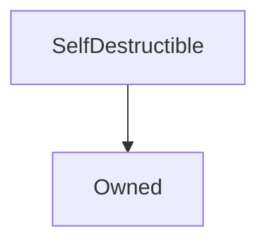

# SelfDestructible

## Description

SelfDestructible allows an inheriting contract to be destroyed by its owner, who must [announce an intention to destroy it](#initiateselfdestruct), and then wait for a four week cooling-off period before it can be [destroyed](#selfdestruct). Any ether remaining in the contract at this time is forwarded to [a nominated beneficiary](#selfdestructbeneficiary).

**Source:** [contracts/SelfDestructible.sol](https://github.com/Synthetixio/synthetix/tree/v2.30.2-ovm/contracts/SelfDestructible.sol)

## Architecture

### Inheritance Graph

## Constants

### `SELFDESTRUCT_DELAY`

[Source](https://github.com/Synthetixio/synthetix/tree/v2.30.2-ovm/contracts/SelfDestructible.sol#L9)

The duration (four weeks) that must be waited between self destruct initiation and actual destruction. That is the contract can only be destroyed after the timestamp `initiationTime + SELFDESTRUCT_DELAY`.

**Value:** `4 weeks`

**Type:** `uint256`

## Variables

### `initiationTime`

[Source](https://github.com/Synthetixio/synthetix/tree/v2.30.2-ovm/contracts/SelfDestructible.sol#L11)

The timestamp at which the self destruction was begun.

**Type:** `uint256`

### `selfDestructBeneficiary`

[Source](https://github.com/Synthetixio/synthetix/tree/v2.30.2-ovm/contracts/SelfDestructible.sol#L14)

The address where any lingering eth in this contract will be sent.

**Type:** `address`

### `selfDestructInitiated`

[Source](https://github.com/Synthetixio/synthetix/tree/v2.30.2-ovm/contracts/SelfDestructible.sol#L12)

True iff the contract is currently undergoing self destruction.

**Type:** `bool`

## Constructor

### `constructor`

[Source](https://github.com/Synthetixio/synthetix/tree/v2.30.2-ovm/contracts/SelfDestructible.sol#L16)

Initialises the inherited [`Owned`](Owned.md) instance and nominates that owner as the initial [self destruct beneficiary](#selfdestructbeneficiary).

??? example "Details"

    **Signature**

    `()`

    **Visibility**

    `internal`

    **State Mutability**

    `nonpayable`

    **Requires**

    * [require(..., Owner must be set)](https://github.com/Synthetixio/synthetix/tree/v2.30.2-ovm/contracts/SelfDestructible.sol#L18)

    **Emits**

    * [SelfDestructBeneficiaryUpdated](#selfdestructbeneficiaryupdated)

## Restricted Functions

### `initiateSelfDestruct`

[Source](https://github.com/Synthetixio/synthetix/tree/v2.30.2-ovm/contracts/SelfDestructible.sol#L39)

Begins the self destruct countdown, updating [`initiationTime`](#initiationtime) and [`selfDestructInitiated`](#selfdestructinitiated). Only once the delay has elapsed can the contract be destroyed.

??? example "Details"

    **Signature**

    `initiateSelfDestruct()`

    **Visibility**

    `external`

    **State Mutability**

    `nonpayable`

    **Modifiers**

    * [onlyOwner](#onlyowner)

    **Emits**

    * [SelfDestructInitiated](#selfdestructinitiated)

### `selfDestruct`

[Source](https://github.com/Synthetixio/synthetix/tree/v2.30.2-ovm/contracts/SelfDestructible.sol#L60)

If self destruction is active and the timer has elapsed, destroy this contract and forward its ether to [`selfDestructBeneficiary`](#selfdestructbeneficiary).

??? example "Details"

    **Signature**

    `selfDestruct()`

    **Visibility**

    `external`

    **State Mutability**

    `nonpayable`

    **Requires**

    * [require(..., Self Destruct not yet initiated)](https://github.com/Synthetixio/synthetix/tree/v2.30.2-ovm/contracts/SelfDestructible.sol#L61)

    * [require(..., Self destruct delay not met)](https://github.com/Synthetixio/synthetix/tree/v2.30.2-ovm/contracts/SelfDestructible.sol#L62)

    **Modifiers**

    * [onlyOwner](#onlyowner)

    **Emits**

    * [SelfDestructed](#selfdestructed)

### `setSelfDestructBeneficiary`

[Source](https://github.com/Synthetixio/synthetix/tree/v2.30.2-ovm/contracts/SelfDestructible.sol#L28)

Changes the [self destruct beneficiary](#selfdestructbeneficiary).

??? example "Details"

    **Signature**

    `setSelfDestructBeneficiary(address payable _beneficiary)`

    **Visibility**

    `external`

    **State Mutability**

    `nonpayable`

    **Requires**

    * [require(..., Beneficiary must not be zero)](https://github.com/Synthetixio/synthetix/tree/v2.30.2-ovm/contracts/SelfDestructible.sol#L29)

    **Modifiers**

    * [onlyOwner](#onlyowner)

    **Emits**

    * [SelfDestructBeneficiaryUpdated](#selfdestructbeneficiaryupdated)

### `terminateSelfDestruct`

[Source](https://github.com/Synthetixio/synthetix/tree/v2.30.2-ovm/contracts/SelfDestructible.sol#L49)

Resets the timer and disables self destruction.

??? example "Details"

    **Signature**

    `terminateSelfDestruct()`

    **Visibility**

    `external`

    **State Mutability**

    `nonpayable`

    **Modifiers**

    * [onlyOwner](#onlyowner)

    **Emits**

    * [SelfDestructTerminated](#selfdestructterminated)

## Events

### `SelfDestructBeneficiaryUpdated`

[Source](https://github.com/Synthetixio/synthetix/tree/v2.30.2-ovm/contracts/SelfDestructible.sol#L70)

The self destruct beneficiary was changed to the indicated new address.

**Signature**: `SelfDestructBeneficiaryUpdated(address newBeneficiary)`

### `SelfDestructInitiated`

[Source](https://github.com/Synthetixio/synthetix/tree/v2.30.2-ovm/contracts/SelfDestructible.sol#L69)

Self destruction was initiated with the indicated delay time.

**Signature**: `SelfDestructInitiated(uint256 selfDestructDelay)`

### `SelfDestructTerminated`

[Source](https://github.com/Synthetixio/synthetix/tree/v2.30.2-ovm/contracts/SelfDestructible.sol#L67)

Self destruction was terminated by the contract owner.

**Signature**: `SelfDestructTerminated()`

### `SelfDestructed`

[Source](https://github.com/Synthetixio/synthetix/tree/v2.30.2-ovm/contracts/SelfDestructible.sol#L68)

The contract was destroyed, forwarding the ether on to the [beneficiary](#selfdestructbeneficiary).

**Signature**: `SelfDestructed(address beneficiary)`
