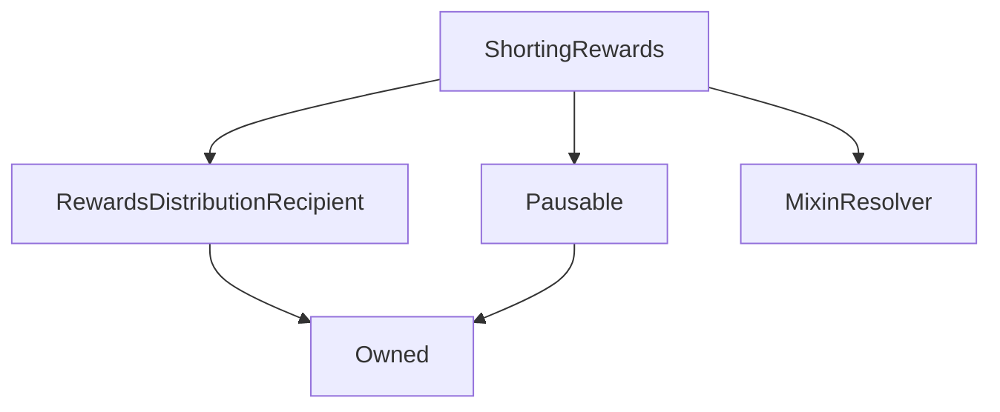

# ShortingRewards

## Description

**Source:** [contracts/ShortingRewards.sol](https://github.com/Synthetixio/synthetix/tree/v2.35.2-beta/contracts/ShortingRewards.sol)

## Architecture

### Libraries

- [SafeMath](/contracts/source/libraries/SafeMath) for `uint256`
- [SafeERC20](/contracts/source/libraries/SafeERC20) for `IERC20`

### Inheritance Graph

## Variables

### `lastUpdateTime`

[Source](https://github.com/Synthetixio/synthetix/tree/v2.35.2-beta/contracts/ShortingRewards.sol#L33)

**Type:** `uint256`

### `periodFinish`

[Source](https://github.com/Synthetixio/synthetix/tree/v2.35.2-beta/contracts/ShortingRewards.sol#L30)

**Type:** `uint256`

### `rewardPerTokenStored`

[Source](https://github.com/Synthetixio/synthetix/tree/v2.35.2-beta/contracts/ShortingRewards.sol#L34)

**Type:** `uint256`

### `rewardRate`

[Source](https://github.com/Synthetixio/synthetix/tree/v2.35.2-beta/contracts/ShortingRewards.sol#L31)

**Type:** `uint256`

### `rewards`

[Source](https://github.com/Synthetixio/synthetix/tree/v2.35.2-beta/contracts/ShortingRewards.sol#L37)

**Type:** `mapping(address => uint256)`

### `rewardsDuration`

[Source](https://github.com/Synthetixio/synthetix/tree/v2.35.2-beta/contracts/ShortingRewards.sol#L32)

**Type:** `uint256`

### `rewardsToken`

[Source](https://github.com/Synthetixio/synthetix/tree/v2.35.2-beta/contracts/ShortingRewards.sol#L27)

**Type:** `contract IERC20`

### `short`

[Source](https://github.com/Synthetixio/synthetix/tree/v2.35.2-beta/contracts/ShortingRewards.sol#L28)

**Type:** `contract ICollateralErc20`

### `synth`

[Source](https://github.com/Synthetixio/synthetix/tree/v2.35.2-beta/contracts/ShortingRewards.sol#L29)

**Type:** `bytes32`

### `userRewardPerTokenPaid`

[Source](https://github.com/Synthetixio/synthetix/tree/v2.35.2-beta/contracts/ShortingRewards.sol#L36)

**Type:** `mapping(address => uint256)`

## Constructor

### `constructor`

[Source](https://github.com/Synthetixio/synthetix/tree/v2.35.2-beta/contracts/ShortingRewards.sol#L48)

??? example "Details"

    **Signature**

    `(address _owner, address _resolver, address _rewardsDistribution, address _rewardsToken, address _short, bytes32 _synth)`

    **Visibility**

    `public`

    **State Mutability**

    `nonpayable`

## Views

### `balanceOf`

[Source](https://github.com/Synthetixio/synthetix/tree/v2.35.2-beta/contracts/ShortingRewards.sol#L77)

??? example "Details"

    **Signature**

    `balanceOf(address account) returns (uint256)`

    **Visibility**

    `external`

    **State Mutability**

    `view`

### `earned`

[Source](https://github.com/Synthetixio/synthetix/tree/v2.35.2-beta/contracts/ShortingRewards.sol#L95)

??? example "Details"

    **Signature**

    `earned(address account) returns (uint256)`

    **Visibility**

    `public`

    **State Mutability**

    `view`

### `getRewardForDuration`

[Source](https://github.com/Synthetixio/synthetix/tree/v2.35.2-beta/contracts/ShortingRewards.sol#L99)

??? example "Details"

    **Signature**

    `getRewardForDuration() returns (uint256)`

    **Visibility**

    `external`

    **State Mutability**

    `view`

### `lastTimeRewardApplicable`

[Source](https://github.com/Synthetixio/synthetix/tree/v2.35.2-beta/contracts/ShortingRewards.sol#L81)

??? example "Details"

    **Signature**

    `lastTimeRewardApplicable() returns (uint256)`

    **Visibility**

    `public`

    **State Mutability**

    `view`

### `resolverAddressesRequired`

[Source](https://github.com/Synthetixio/synthetix/tree/v2.35.2-beta/contracts/ShortingRewards.sol#L62)

??? example "Details"

    **Signature**

    `resolverAddressesRequired() returns (bytes32[])`

    **Visibility**

    `public`

    **State Mutability**

    `view`

### `rewardPerToken`

[Source](https://github.com/Synthetixio/synthetix/tree/v2.35.2-beta/contracts/ShortingRewards.sol#L85)

??? example "Details"

    **Signature**

    `rewardPerToken() returns (uint256)`

    **Visibility**

    `public`

    **State Mutability**

    `view`

### `totalSupply`

[Source](https://github.com/Synthetixio/synthetix/tree/v2.35.2-beta/contracts/ShortingRewards.sol#L73)

??? example "Details"

    **Signature**

    `totalSupply() returns (uint256)`

    **Visibility**

    `external`

    **State Mutability**

    `view`

## Restricted Functions

### `enrol`

[Source](https://github.com/Synthetixio/synthetix/tree/v2.35.2-beta/contracts/ShortingRewards.sol#L106)

??? example "Details"

    **Signature**

    `enrol(address account, uint256 amount)`

    **Visibility**

    `external`

    **State Mutability**

    `nonpayable`

    **Requires**

    * [require(..., Cannot stake 0)](https://github.com/Synthetixio/synthetix/tree/v2.35.2-beta/contracts/ShortingRewards.sol#L107)

    **Modifiers**

    * [onlyShortContract](#onlyshortcontract)

    * [nonReentrant](#nonreentrant)

    * [notPaused](#notpaused)

    * [updateReward](#updatereward)

    **Emits**

    * [Enrol](#enrol)

### `exit`

[Source](https://github.com/Synthetixio/synthetix/tree/v2.35.2-beta/contracts/ShortingRewards.sol#L129)

??? example "Details"

    **Signature**

    `exit(address account)`

    **Visibility**

    `external`

    **State Mutability**

    `nonpayable`

    **Modifiers**

    * [onlyShortContract](#onlyshortcontract)

### `notifyRewardAmount`

[Source](https://github.com/Synthetixio/synthetix/tree/v2.35.2-beta/contracts/ShortingRewards.sol#L136)

??? example "Details"

    **Signature**

    `notifyRewardAmount(uint256 reward)`

    **Visibility**

    `external`

    **State Mutability**

    `nonpayable`

    **Requires**

    * [require(..., Provided reward too high)](https://github.com/Synthetixio/synthetix/tree/v2.35.2-beta/contracts/ShortingRewards.sol#L150)

    **Modifiers**

    * [onlyRewardsDistribution](#onlyrewardsdistribution)

    * [updateReward](#updatereward)

    **Emits**

    * [RewardAdded](#rewardadded)

### `setRewardsDuration`

[Source](https://github.com/Synthetixio/synthetix/tree/v2.35.2-beta/contracts/ShortingRewards.sol#L157)

??? example "Details"

    **Signature**

    `setRewardsDuration(uint256 _rewardsDuration)`

    **Visibility**

    `external`

    **State Mutability**

    `nonpayable`

    **Requires**

    * [require(..., Previous rewards period must be complete before changing the duration for the new period)](https://github.com/Synthetixio/synthetix/tree/v2.35.2-beta/contracts/ShortingRewards.sol#L158)

    **Modifiers**

    * [onlyOwner](#onlyowner)

    **Emits**

    * [RewardsDurationUpdated](#rewardsdurationupdated)

### `withdraw`

[Source](https://github.com/Synthetixio/synthetix/tree/v2.35.2-beta/contracts/ShortingRewards.sol#L113)

??? example "Details"

    **Signature**

    `withdraw(address account, uint256 amount)`

    **Visibility**

    `public`

    **State Mutability**

    `nonpayable`

    **Requires**

    * [require(..., Cannot withdraw 0)](https://github.com/Synthetixio/synthetix/tree/v2.35.2-beta/contracts/ShortingRewards.sol#L114)

    **Modifiers**

    * [onlyShortContract](#onlyshortcontract)

    * [nonReentrant](#nonreentrant)

    * [updateReward](#updatereward)

    **Emits**

    * [Withdrawn](#withdrawn)

## Internal Functions

### `_short`

[Source](https://github.com/Synthetixio/synthetix/tree/v2.35.2-beta/contracts/ShortingRewards.sol#L67)

??? example "Details"

    **Signature**

    `_short() returns (contract ICollateralErc20)`

    **Visibility**

    `internal`

    **State Mutability**

    `view`

## External Functions

### `getReward`

[Source](https://github.com/Synthetixio/synthetix/tree/v2.35.2-beta/contracts/ShortingRewards.sol#L120)

??? example "Details"

    **Signature**

    `getReward(address account)`

    **Visibility**

    `public`

    **State Mutability**

    `nonpayable`

    **Modifiers**

    * [nonReentrant](#nonreentrant)

    * [updateReward](#updatereward)

## Modifiers

### `onlyShortContract`

[Source](https://github.com/Synthetixio/synthetix/tree/v2.35.2-beta/contracts/ShortingRewards.sol#L178)

### `updateReward`

[Source](https://github.com/Synthetixio/synthetix/tree/v2.35.2-beta/contracts/ShortingRewards.sol#L168)

**Signature**: `updateReward(address account)`

## Events

### `Enrol`

[Source](https://github.com/Synthetixio/synthetix/tree/v2.35.2-beta/contracts/ShortingRewards.sol#L186)

**Signature**: `Enrol(address user, uint256 amount)`

### `Recovered`

[Source](https://github.com/Synthetixio/synthetix/tree/v2.35.2-beta/contracts/ShortingRewards.sol#L190)

**Signature**: `Recovered(address token, uint256 amount)`

### `RewardAdded`

[Source](https://github.com/Synthetixio/synthetix/tree/v2.35.2-beta/contracts/ShortingRewards.sol#L185)

**Signature**: `RewardAdded(uint256 reward)`

### `RewardPaid`

[Source](https://github.com/Synthetixio/synthetix/tree/v2.35.2-beta/contracts/ShortingRewards.sol#L188)

**Signature**: `RewardPaid(address user, uint256 reward)`

### `RewardsDurationUpdated`

[Source](https://github.com/Synthetixio/synthetix/tree/v2.35.2-beta/contracts/ShortingRewards.sol#L189)

**Signature**: `RewardsDurationUpdated(uint256 newDuration)`

### `Withdrawn`

[Source](https://github.com/Synthetixio/synthetix/tree/v2.35.2-beta/contracts/ShortingRewards.sol#L187)

**Signature**: `Withdrawn(address user, uint256 amount)`
