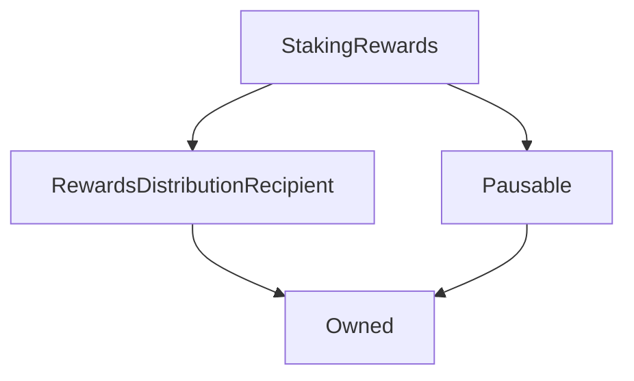

# StakingRewards

## Description

**Source:** [contracts/StakingRewards.sol](https://github.com/Synthetixio/synthetix/tree/v2.35.1-alpha/contracts/StakingRewards.sol)

## Architecture

### Libraries

- [SafeMath](/contracts/source/libraries/SafeMath) for `uint256`
- [SafeERC20](/contracts/source/libraries/SafeERC20) for `IERC20`

### Inheritance Graph

## Variables

### `lastUpdateTime`

[Source](https://github.com/Synthetixio/synthetix/tree/v2.35.1-alpha/contracts/StakingRewards.sol#L27)

**Type:** `uint256`

### `periodFinish`

[Source](https://github.com/Synthetixio/synthetix/tree/v2.35.1-alpha/contracts/StakingRewards.sol#L24)

**Type:** `uint256`

### `rewardPerTokenStored`

[Source](https://github.com/Synthetixio/synthetix/tree/v2.35.1-alpha/contracts/StakingRewards.sol#L28)

**Type:** `uint256`

### `rewardRate`

[Source](https://github.com/Synthetixio/synthetix/tree/v2.35.1-alpha/contracts/StakingRewards.sol#L25)

**Type:** `uint256`

### `rewards`

[Source](https://github.com/Synthetixio/synthetix/tree/v2.35.1-alpha/contracts/StakingRewards.sol#L31)

**Type:** `mapping(address => uint256)`

### `rewardsDuration`

[Source](https://github.com/Synthetixio/synthetix/tree/v2.35.1-alpha/contracts/StakingRewards.sol#L26)

**Type:** `uint256`

### `rewardsToken`

[Source](https://github.com/Synthetixio/synthetix/tree/v2.35.1-alpha/contracts/StakingRewards.sol#L22)

**Type:** `contract IERC20`

### `stakingToken`

[Source](https://github.com/Synthetixio/synthetix/tree/v2.35.1-alpha/contracts/StakingRewards.sol#L23)

**Type:** `contract IERC20`

### `userRewardPerTokenPaid`

[Source](https://github.com/Synthetixio/synthetix/tree/v2.35.1-alpha/contracts/StakingRewards.sol#L30)

**Type:** `mapping(address => uint256)`

## Constructor

### `constructor`

[Source](https://github.com/Synthetixio/synthetix/tree/v2.35.1-alpha/contracts/StakingRewards.sol#L38)

??? example "Details"

    **Signature**

    `(address _owner, address _rewardsDistribution, address _rewardsToken, address _stakingToken)`

    **Visibility**

    `public`

    **State Mutability**

    `nonpayable`

## Views

### `balanceOf`

[Source](https://github.com/Synthetixio/synthetix/tree/v2.35.1-alpha/contracts/StakingRewards.sol#L55)

??? example "Details"

    **Signature**

    `balanceOf(address account) returns (uint256)`

    **Visibility**

    `external`

    **State Mutability**

    `view`

### `earned`

[Source](https://github.com/Synthetixio/synthetix/tree/v2.35.1-alpha/contracts/StakingRewards.sol#L73)

??? example "Details"

    **Signature**

    `earned(address account) returns (uint256)`

    **Visibility**

    `public`

    **State Mutability**

    `view`

### `getRewardForDuration`

[Source](https://github.com/Synthetixio/synthetix/tree/v2.35.1-alpha/contracts/StakingRewards.sol#L77)

??? example "Details"

    **Signature**

    `getRewardForDuration() returns (uint256)`

    **Visibility**

    `external`

    **State Mutability**

    `view`

### `lastTimeRewardApplicable`

[Source](https://github.com/Synthetixio/synthetix/tree/v2.35.1-alpha/contracts/StakingRewards.sol#L59)

??? example "Details"

    **Signature**

    `lastTimeRewardApplicable() returns (uint256)`

    **Visibility**

    `public`

    **State Mutability**

    `view`

### `rewardPerToken`

[Source](https://github.com/Synthetixio/synthetix/tree/v2.35.1-alpha/contracts/StakingRewards.sol#L63)

??? example "Details"

    **Signature**

    `rewardPerToken() returns (uint256)`

    **Visibility**

    `public`

    **State Mutability**

    `view`

### `totalSupply`

[Source](https://github.com/Synthetixio/synthetix/tree/v2.35.1-alpha/contracts/StakingRewards.sol#L51)

??? example "Details"

    **Signature**

    `totalSupply() returns (uint256)`

    **Visibility**

    `external`

    **State Mutability**

    `view`

## Restricted Functions

### `notifyRewardAmount`

[Source](https://github.com/Synthetixio/synthetix/tree/v2.35.1-alpha/contracts/StakingRewards.sol#L115)

??? example "Details"

    **Signature**

    `notifyRewardAmount(uint256 reward)`

    **Visibility**

    `external`

    **State Mutability**

    `nonpayable`

    **Requires**

    * [require(..., Provided reward too high)](https://github.com/Synthetixio/synthetix/tree/v2.35.1-alpha/contracts/StakingRewards.sol#L129)

    **Modifiers**

    * [onlyRewardsDistribution](#onlyrewardsdistribution)

    * [updateReward](#updatereward)

    **Emits**

    * [RewardAdded](#rewardadded)

### `recoverERC20`

[Source](https://github.com/Synthetixio/synthetix/tree/v2.35.1-alpha/contracts/StakingRewards.sol#L137)

??? example "Details"

    **Signature**

    `recoverERC20(address tokenAddress, uint256 tokenAmount)`

    **Visibility**

    `external`

    **State Mutability**

    `nonpayable`

    **Requires**

    * [require(..., Cannot withdraw the staking token)](https://github.com/Synthetixio/synthetix/tree/v2.35.1-alpha/contracts/StakingRewards.sol#L138)

    **Modifiers**

    * [onlyOwner](#onlyowner)

    **Emits**

    * [Recovered](#recovered)

### `setRewardsDuration`

[Source](https://github.com/Synthetixio/synthetix/tree/v2.35.1-alpha/contracts/StakingRewards.sol#L143)

??? example "Details"

    **Signature**

    `setRewardsDuration(uint256 _rewardsDuration)`

    **Visibility**

    `external`

    **State Mutability**

    `nonpayable`

    **Requires**

    * [require(..., Previous rewards period must be complete before changing the duration for the new period)](https://github.com/Synthetixio/synthetix/tree/v2.35.1-alpha/contracts/StakingRewards.sol#L144)

    **Modifiers**

    * [onlyOwner](#onlyowner)

    **Emits**

    * [RewardsDurationUpdated](#rewardsdurationupdated)

## External Functions

### `exit`

[Source](https://github.com/Synthetixio/synthetix/tree/v2.35.1-alpha/contracts/StakingRewards.sol#L108)

??? example "Details"

    **Signature**

    `exit()`

    **Visibility**

    `external`

    **State Mutability**

    `nonpayable`

### `getReward`

[Source](https://github.com/Synthetixio/synthetix/tree/v2.35.1-alpha/contracts/StakingRewards.sol#L99)

??? example "Details"

    **Signature**

    `getReward()`

    **Visibility**

    `public`

    **State Mutability**

    `nonpayable`

    **Modifiers**

    * [nonReentrant](#nonreentrant)

    * [updateReward](#updatereward)

### `stake`

[Source](https://github.com/Synthetixio/synthetix/tree/v2.35.1-alpha/contracts/StakingRewards.sol#L83)

??? example "Details"

    **Signature**

    `stake(uint256 amount)`

    **Visibility**

    `external`

    **State Mutability**

    `nonpayable`

    **Requires**

    * [require(..., Cannot stake 0)](https://github.com/Synthetixio/synthetix/tree/v2.35.1-alpha/contracts/StakingRewards.sol#L84)

    **Modifiers**

    * [nonReentrant](#nonreentrant)

    * [notPaused](#notpaused)

    * [updateReward](#updatereward)

    **Emits**

    * [Staked](#staked)

### `withdraw`

[Source](https://github.com/Synthetixio/synthetix/tree/v2.35.1-alpha/contracts/StakingRewards.sol#L91)

??? example "Details"

    **Signature**

    `withdraw(uint256 amount)`

    **Visibility**

    `public`

    **State Mutability**

    `nonpayable`

    **Requires**

    * [require(..., Cannot withdraw 0)](https://github.com/Synthetixio/synthetix/tree/v2.35.1-alpha/contracts/StakingRewards.sol#L92)

    **Modifiers**

    * [nonReentrant](#nonreentrant)

    * [updateReward](#updatereward)

    **Emits**

    * [Withdrawn](#withdrawn)

## Modifiers

### `updateReward`

[Source](https://github.com/Synthetixio/synthetix/tree/v2.35.1-alpha/contracts/StakingRewards.sol#L154)

**Signature**: `updateReward(address account)`

## Events

### `Recovered`

[Source](https://github.com/Synthetixio/synthetix/tree/v2.35.1-alpha/contracts/StakingRewards.sol#L171)

**Signature**: `Recovered(address token, uint256 amount)`

### `RewardAdded`

[Source](https://github.com/Synthetixio/synthetix/tree/v2.35.1-alpha/contracts/StakingRewards.sol#L166)

**Signature**: `RewardAdded(uint256 reward)`

### `RewardPaid`

[Source](https://github.com/Synthetixio/synthetix/tree/v2.35.1-alpha/contracts/StakingRewards.sol#L169)

**Signature**: `RewardPaid(address user, uint256 reward)`

### `RewardsDurationUpdated`

[Source](https://github.com/Synthetixio/synthetix/tree/v2.35.1-alpha/contracts/StakingRewards.sol#L170)

**Signature**: `RewardsDurationUpdated(uint256 newDuration)`

### `Staked`

[Source](https://github.com/Synthetixio/synthetix/tree/v2.35.1-alpha/contracts/StakingRewards.sol#L167)

**Signature**: `Staked(address user, uint256 amount)`

### `Withdrawn`

[Source](https://github.com/Synthetixio/synthetix/tree/v2.35.1-alpha/contracts/StakingRewards.sol#L168)

**Signature**: `Withdrawn(address user, uint256 amount)`
