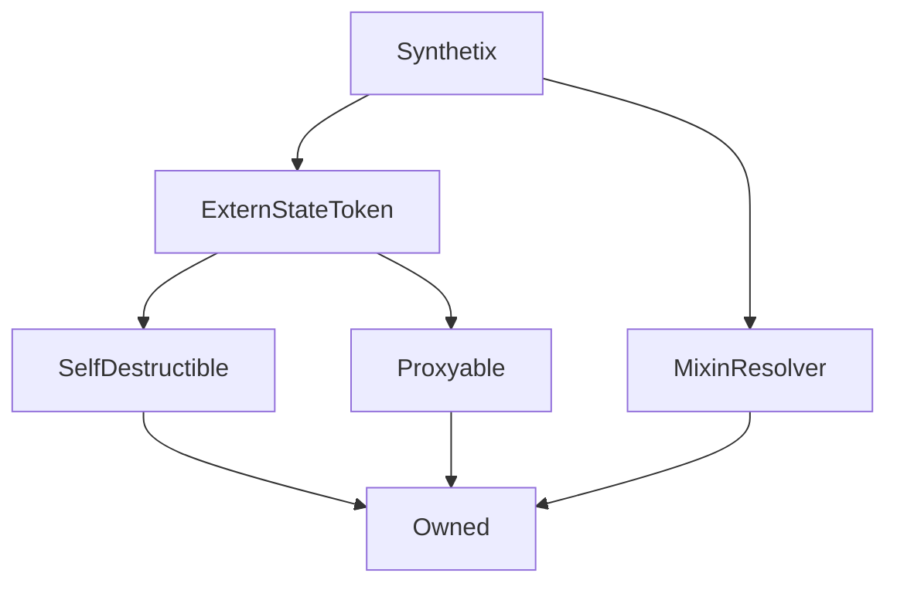

# Synthetix

## Description

**Source:** [contracts/Synthetix.sol](https://github.com/Synthetixio/synthetix/tree/v2.27.2-alpha/contracts/Synthetix.sol)

## Architecture

### Inheritance Graph

### Related Contracts

<centered-image>
    
</centered-image>

??? example "Details"

    - [`Depot`](Depot.md): The depot trades SNX and therefore knows the Synthetix address.
    - [`Exchanger`](Exchanger.md) The helper contract that performs the heavy lifting for `exchange()` and `settle()`.
    - [`ExchangeRates`](ExchangeRates.md): The Synthetix contract fetches prices from the exchange rates contract to facilitate synth exchange and to determine the value of various quantities of synths.
    - [`FeePool`](FeePool.md): The Synthetix contract remits exchange fees as sUSD to the fee pool, and also uses it to keep track of historical issuance records for each issuer.
    - [`Issuer`](Issuer.md) The helper contract that performs the heavy lifting for `issueSynths()`, `issueMaxSynths()` and `burnSynths()`.
    - [`Proxy`](Proxy.md): The Synthetix contract, which is [`Proxyable`](Proxyable.md), exists behind a `CALL`-style proxy for upgradeability.
    - [`RewardEscrow`](RewardEscrow.md): This is similar to the SynthetixEscrow contract, but it is where the SNX inflationary supply is kept before it is released to Synth issuers.
    - [`RewardsDistribution`](RewardsDistribution): This contract works closely with RewardEscrow to release portions of the inflationary supply to different recipients.
    - [`SupplySchedule`](SupplySchedule.md): The supply schedule determines the rate at which SNX are released from the inflationary supply.
    - [`Synth`](Synth.md): Synthetix manages the supply of synths. It keeps track of which ones exist, and they are all issued and burnt from the Synthetix contract. The Synthetix contract is also responsible for exchange between different synth flavours.
    - [`SynthetixEscrow`](SynthetixEscrow.md): The escrow contract keeps track of SNX owed to participants in the initial token sale, and releases them according to specified vesting schedules.
    - [`SynthetixState`](SynthetixState.md): This state contract stores the debt ledger and the current issuance information for synth issuers.

## Constants

### `DECIMALS`

[Source](https://github.com/Synthetixio/synthetix/tree/v2.27.2-alpha/contracts/Synthetix.sol#L27)

A constant used to initialise the ERC20 [`ExternStateToken.decimals`](ExternStateToken.md#decimals) field upon construction.

**Value:** `18`

**Type:** `uint8`

### `TOKEN_NAME`

[Source](https://github.com/Synthetixio/synthetix/tree/v2.27.2-alpha/contracts/Synthetix.sol#L25)

A constant used to initialise the ERC20 [`ExternStateToken.name`](ExternStateToken.md#name) field upon construction.

**Value:** `"Synthetix Network Token"`

**Type:** `string`

### `TOKEN_SYMBOL`

[Source](https://github.com/Synthetixio/synthetix/tree/v2.27.2-alpha/contracts/Synthetix.sol#L26)

A constant used to initialise the ERC20 [`ExternStateToken.symbol`](ExternStateToken.md#symbol) field upon construction.

**Value:** `"SNX"`

**Type:** `string`

### `sUSD`

[Source](https://github.com/Synthetixio/synthetix/tree/v2.27.2-alpha/contracts/Synthetix.sol#L28)

**Type:** `bytes32`

## Constructor

### `constructor`

[Source](https://github.com/Synthetixio/synthetix/tree/v2.27.2-alpha/contracts/Synthetix.sol#L50)

??? example "Details"

    **Signature**

    `(address payable _proxy, contract TokenState _tokenState, address _owner, uint256 _totalSupply, address _resolver)`

    **Visibility**

    `public`

    **State Mutability**

    `nonpayable`

## Views

### `anySynthOrSNXRateIsInvalid`

[Source](https://github.com/Synthetixio/synthetix/tree/v2.27.2-alpha/contracts/Synthetix.sol#L125)

??? example "Details"

    **Signature**

    `anySynthOrSNXRateIsInvalid() returns (bool)`

    **Visibility**

    `external`

    **State Mutability**

    `view`

### `availableCurrencyKeys`

[Source](https://github.com/Synthetixio/synthetix/tree/v2.27.2-alpha/contracts/Synthetix.sol#L101)

Returns the [currency key](Synth.md#currencykey) for each synth in [`availableSynths`](#availablesynths).

??? example "Details"

    **Signature**

    `availableCurrencyKeys() returns (bytes32[])`

    **Visibility**

    `external`

    **State Mutability**

    `view`

### `availableSynthCount`

[Source](https://github.com/Synthetixio/synthetix/tree/v2.27.2-alpha/contracts/Synthetix.sol#L105)

Returns the number of synths in the system, that is [`availableSynths.length`](#availablesynths).

??? example "Details"

    **Signature**

    `availableSynthCount() returns (uint256)`

    **Visibility**

    `external`

    **State Mutability**

    `view`

### `availableSynths`

[Source](https://github.com/Synthetixio/synthetix/tree/v2.27.2-alpha/contracts/Synthetix.sol#L109)

List of the active [`Synths`](Synth.md). Used to compute the total value of issued synths.

**Type:** `contract ISynth[]`

??? example "Details"

    **Signature**

    `availableSynths(uint256 index) returns (contract ISynth)`

    **Visibility**

    `external`

    **State Mutability**

    `view`

### `collateral`

[Source](https://github.com/Synthetixio/synthetix/tree/v2.27.2-alpha/contracts/Synthetix.sol#L295)

Returns the total SNX owned by the given account, locked and unlocked, escrowed and unescrowed. This is the quantity of SNX synths can be issued against.

This is computed as the sum of [`Synthetix.balanceOf(account)`](TokenState.md#balanceof), [`SynthetixEscrow.balanceOf(account)`](SynthetixEscrow.md#balanceof), and [`RewardEscrow.balanceOf(account)`](RewardEscrow.md#balanceof); so an account may issue synths against both its active balance and its unclaimed escrow funds.

??? example "Details"

    **Signature**

    `collateral(address account) returns (uint256)`

    **Visibility**

    `external`

    **State Mutability**

    `view`

### `collateralisationRatio`

[Source](https://github.com/Synthetixio/synthetix/tree/v2.27.2-alpha/contracts/Synthetix.sol#L291)

The ratio between value of synths that an account has issued and the value of the collateral they control. That is, this is just [`debtBalanceOf(issuer, "SNX") /`](#debtbalanceof) [`collateral(issuer)`](#collateral).

Ideally, issuers should maintain their collateralisation ratio at a level less than the [global issuance ratio](SynthetixState.md#issuanceratio), and they are incentivised to do this by the [fees they can claim](FeePool.md#claim) if they do so.

??? example "Details"

    **Signature**

    `collateralisationRatio(address _issuer) returns (uint256)`

    **Visibility**

    `external`

    **State Mutability**

    `view`

### `debtBalanceOf`

[Source](https://github.com/Synthetixio/synthetix/tree/v2.27.2-alpha/contracts/Synthetix.sol#L89)

Reports the quantity of a given currency required to free up all SNX locked in given account.

If $\mathrm{X}$ is the [total value of all issued synths](#totalissuedsynths), and $\check{\omega}$ is fraction of that value currently accounted for by this account's locked SNX, then the result is simply:

$$
\check{\omega} \ \mathrm{X}
$$

In order to account for fluctuations in synth prices and supply, the current ownership fraction is computed as the adjusted value:

$$
\check{\omega} = \omega \frac{\Delta_\text{last}}{\Delta_\text{entry}}
$$

Where $\omega$ is the account's debt ownership fraction at the time it [last issued or burnt](SynthetixState.md#issuancedata) synths, which produced the $\Delta_\text{entry}$ item in the [debt ledger](SynthetixState.md#debtledger). $\Delta_\text{last}$ is the latest value on the ledger. This logic is much the same as that found in [`FeePool._effectiveDebtRatioForPeriod`](FeePool.md#_effectivedebtratioforperiod). The actual value of $\omega$ is set in [`_addToDebtRegister`](#_addtodebtregister) and [`_removeFromDebtRegister`](#_removefromdebtregister).

??? example "Details"

    **Signature**

    `debtBalanceOf(address account, bytes32 currencyKey) returns (uint256)`

    **Visibility**

    `external`

    **State Mutability**

    `view`

### `isWaitingPeriod`

[Source](https://github.com/Synthetixio/synthetix/tree/v2.27.2-alpha/contracts/Synthetix.sol#L121)

Whether or not the waiting period is ongoing for the given synth. If so, no exchanges into this synth will be allowed, nor will that synth be able to be transferred.

??? example "Details"

    **Signature**

    `isWaitingPeriod(bytes32 currencyKey) returns (bool)`

    **Visibility**

    `external`

    **State Mutability**

    `view`

### `maxIssuableSynths`

[Source](https://github.com/Synthetixio/synthetix/tree/v2.27.2-alpha/contracts/Synthetix.sol#L129)

The maximum number of a given synth that is issuable against the issuer's collateral. This is simply [`issuanceRatio *`](SynthetixState.md#issuanceratio) [`collateral(issuer)`](#collateral), priced in the requested currency.

??? example "Details"

    **Signature**

    `maxIssuableSynths(address account) returns (uint256)`

    **Visibility**

    `external`

    **State Mutability**

    `view`

### `remainingIssuableSynths`

[Source](https://github.com/Synthetixio/synthetix/tree/v2.27.2-alpha/contracts/Synthetix.sol#L133)

The remaining sUSD synths this account can issue.

If $\text{maxIssuable}$ is [`maxIssuableSynths(issuer)`](#maxissuablesynths) and $\text{debt}$ is [`debtBalanceOf(issuer, currencyKey)`](#debtbalanceof), then the result of this function is $max(0, \text{maxIssuable} - \text{debt})$.

If prices fluctuate then the account's issued synth debt may exceed its current maximum issuable synths, in which case it may not issue any more synths until more collateral is added.

??? example "Details"

    **Signature**

    `remainingIssuableSynths(address account) returns (uint256, uint256, uint256)`

    **Visibility**

    `external`

    **State Mutability**

    `view`

### `synths`

[Source](https://github.com/Synthetixio/synthetix/tree/v2.27.2-alpha/contracts/Synthetix.sol#L113)

A mapping from currency keys (`bytes32`) to [`Synth`](Synth.md) token contract addresses.

**Type:** `mapping(bytes32 => contract ISynth)`

??? example "Details"

    **Signature**

    `synths(bytes32 currencyKey) returns (contract ISynth)`

    **Visibility**

    `external`

    **State Mutability**

    `view`

### `synthsByAddress`

[Source](https://github.com/Synthetixio/synthetix/tree/v2.27.2-alpha/contracts/Synthetix.sol#L117)

A reverse mapping from a synth's address to its `bytes32` currency key

**Type:** `mapping(address => bytes32)`

??? example "Details"

    **Signature**

    `synthsByAddress(address synthAddress) returns (bytes32)`

    **Visibility**

    `external`

    **State Mutability**

    `view`

### `totalIssuedSynths`

[Source](https://github.com/Synthetixio/synthetix/tree/v2.27.2-alpha/contracts/Synthetix.sol#L93)

Returns the total value of Synths in the system, priced in terms of a given currency.

This value is equivalent to:

$$
\frac{1}{\pi_d}\sum_{s \in \text{synths}}{\sigma_s \pi_s}
$$

Where $\sigma_s$ and $\pi_s$ are the total supply and price of synth $s$, and $\pi_d$ is the price of the denominating synth flavour.

??? example "Details"

    **Signature**

    `totalIssuedSynths(bytes32 currencyKey) returns (uint256)`

    **Visibility**

    `external`

    **State Mutability**

    `view`

### `totalIssuedSynthsExcludeEtherCollateral`

[Source](https://github.com/Synthetixio/synthetix/tree/v2.27.2-alpha/contracts/Synthetix.sol#L97)

??? example "Details"

    **Signature**

    `totalIssuedSynthsExcludeEtherCollateral(bytes32 currencyKey) returns (uint256)`

    **Visibility**

    `external`

    **State Mutability**

    `view`

### `transferableSynthetix`

[Source](https://github.com/Synthetixio/synthetix/tree/v2.27.2-alpha/contracts/Synthetix.sol#L299)

The quantity of SNX this account can transfer given that a portion of it may be locked due to issuance.

If $\text{balance}$ is [`balanceOf(account)`](TokenState.md#balanceof), and $\text{lockedSnx}$ is [`debtBalanceOf(account, "SNX") / SynthetixState.issuanceRatio`](#debtbalanceof), the function returns $max(0, \text{balance} - \text{lockedSnx})$. Escrowed tokens are not taken into account in this computation, so unescrowed tokens are locked immediately.

???+ info "A Note on Price Motion"

    The value of $\text{lockedSnx}$ depends on the current ($\pi$) and previous ($\pi'$) prices being reported by the oracle, and the issuance ratio ($\rho$).

    If we consider a situation where the synth supply has not changed in the time period under consideration, then ownership fractions do not change even if prices do. Further assuming that there is only a single synth circulating, debt balances correspond to the same number of synths, although perhaps not the same value.

    In such a situation, we can think of each user having issued a particular quantity of synths. This quantity depends on the prices of synths and SNX at the time of issuance.

    $$
    Q_s = \rho \ \frac{\pi'_c}{\pi'_s} \ Q_c
    $$

    Whose value at the present time priced [in terms of SNX](#effectivevalue), which is what [`debtBalanceOf(account, "SNX")`](#debtbalanceof) returns, is:

    $$
    {V_s}^{c} = \rho \ \frac{\pi'_c}{\pi'_s} \ \pi_c \ Q_c
    $$

    Note that this computation has a factor of $\rho$ in it, and this must be divided out in order to ascertain the quantity of SNX which are presently locked.

    $$
    \text{lockedSnx} = \frac{{V_s}^{c}}{\rho} = \frac{\pi'_c}{\pi'_s} \ \pi_c \ Q_c
    $$

    Which is to say that the quantity of SNX locked in this situation depends on the price.

    !!! todo "Extend this to the multicurrency case"

        Consider a two synth system, one primary synth and a secondary one which represents the price/supply of all other synths. Use the total issued value function to derive the behaviour for multiple currencies, and then examine a single currency as a special case.

??? example "Details"

    **Signature**

    `transferableSynthetix(address account) returns (uint256)`

    **Visibility**

    `external`

    **State Mutability**

    `view`

## Restricted Functions

### `emitExchangeRebate`

[Source](https://github.com/Synthetixio/synthetix/tree/v2.27.2-alpha/contracts/Synthetix.sol#L445)

??? example "Details"

    **Signature**

    `emitExchangeRebate(address account, bytes32 currencyKey, uint256 amount)`

    **Visibility**

    `external`

    **State Mutability**

    `nonpayable`

    **Modifiers**

    * [onlyExchanger](#onlyexchanger)

### `emitExchangeReclaim`

[Source](https://github.com/Synthetixio/synthetix/tree/v2.27.2-alpha/contracts/Synthetix.sol#L434)

??? example "Details"

    **Signature**

    `emitExchangeReclaim(address account, bytes32 currencyKey, uint256 amount)`

    **Visibility**

    `external`

    **State Mutability**

    `nonpayable`

    **Modifiers**

    * [onlyExchanger](#onlyexchanger)

### `emitExchangeTracking`

[Source](https://github.com/Synthetixio/synthetix/tree/v2.27.2-alpha/contracts/Synthetix.sol#L416)

??? example "Details"

    **Signature**

    `emitExchangeTracking(bytes32 trackingCode, bytes32 toCurrencyKey, uint256 toAmount)`

    **Visibility**

    `external`

    **State Mutability**

    `nonpayable`

    **Modifiers**

    * [onlyExchanger](#onlyexchanger)

### `emitSynthExchange`

[Source](https://github.com/Synthetixio/synthetix/tree/v2.27.2-alpha/contracts/Synthetix.sol#L395)

??? example "Details"

    **Signature**

    `emitSynthExchange(address account, bytes32 fromCurrencyKey, uint256 fromAmount, bytes32 toCurrencyKey, uint256 toAmount, address toAddress)`

    **Visibility**

    `external`

    **State Mutability**

    `nonpayable`

    **Modifiers**

    * [onlyExchanger](#onlyexchanger)

## Internal Functions

### `_canTransfer`

[Source](https://github.com/Synthetixio/synthetix/tree/v2.27.2-alpha/contracts/Synthetix.sol#L145)

??? example "Details"

    **Signature**

    `_canTransfer(address account, uint256 value) returns (bool)`

    **Visibility**

    `internal`

    **State Mutability**

    `view`

### `emitAccountLiquidated`

[Source](https://github.com/Synthetixio/synthetix/tree/v2.27.2-alpha/contracts/Synthetix.sol#L456)

??? example "Details"

    **Signature**

    `emitAccountLiquidated(address account, uint256 snxRedeemed, uint256 amountLiquidated, address liquidator)`

    **Visibility**

    `internal`

    **State Mutability**

    `nonpayable`

### `exchanger`

[Source](https://github.com/Synthetixio/synthetix/tree/v2.27.2-alpha/contracts/Synthetix.sol#L72)

??? example "Details"

    **Signature**

    `exchanger() returns (contract IExchanger)`

    **Visibility**

    `internal`

    **State Mutability**

    `view`

### `issuer`

[Source](https://github.com/Synthetixio/synthetix/tree/v2.27.2-alpha/contracts/Synthetix.sol#L76)

??? example "Details"

    **Signature**

    `issuer() returns (contract IIssuer)`

    **Visibility**

    `internal`

    **State Mutability**

    `view`

### `rewardsDistribution`

[Source](https://github.com/Synthetixio/synthetix/tree/v2.27.2-alpha/contracts/Synthetix.sol#L84)

??? example "Details"

    **Signature**

    `rewardsDistribution() returns (contract IRewardsDistribution)`

    **Visibility**

    `internal`

    **State Mutability**

    `view`

### `supplySchedule`

[Source](https://github.com/Synthetixio/synthetix/tree/v2.27.2-alpha/contracts/Synthetix.sol#L80)

??? example "Details"

    **Signature**

    `supplySchedule() returns (contract SupplySchedule)`

    **Visibility**

    `internal`

    **State Mutability**

    `view`

### `synthetixState`

[Source](https://github.com/Synthetixio/synthetix/tree/v2.27.2-alpha/contracts/Synthetix.sol#L64)

??? example "Details"

    **Signature**

    `synthetixState() returns (contract ISynthetixState)`

    **Visibility**

    `internal`

    **State Mutability**

    `view`

### `systemStatus`

[Source](https://github.com/Synthetixio/synthetix/tree/v2.27.2-alpha/contracts/Synthetix.sol#L68)

??? example "Details"

    **Signature**

    `systemStatus() returns (contract ISystemStatus)`

    **Visibility**

    `internal`

    **State Mutability**

    `view`

## External Functions

### `burnSynths`

[Source](https://github.com/Synthetixio/synthetix/tree/v2.27.2-alpha/contracts/Synthetix.sol#L200)

[Burns](Synth.md#burn) a quantity of `sUSD` in the calling address, in order to free up its locked SNX supply.

If the caller attempts to burn more synths than their SNX debt is worth, this function will only burn sufficiently many tokens to cover the debt and leave the rest untouched.

The new debt position of the caller is recorded with [`_appendAccountIssuanceRecord`](#appendaccountissuancerecord), and the adjustment to global debt recorded with [`_removeFromDebtRegister`](#_removefromdebtregister).

See [`Issuer`](Issuer.md#issueSynths) for further details.

??? example "Details"

    **Signature**

    `burnSynths(uint256 amount)`

    **Visibility**

    `external`

    **State Mutability**

    `nonpayable`

    **Modifiers**

    * [issuanceActive](#issuanceactive)

    * [optionalProxy](#optionalproxy)

### `burnSynthsOnBehalf`

[Source](https://github.com/Synthetixio/synthetix/tree/v2.27.2-alpha/contracts/Synthetix.sol#L204)

??? example "Details"

    **Signature**

    `burnSynthsOnBehalf(address burnForAddress, uint256 amount)`

    **Visibility**

    `external`

    **State Mutability**

    `nonpayable`

    **Modifiers**

    * [issuanceActive](#issuanceactive)

    * [optionalProxy](#optionalproxy)

### `burnSynthsToTarget`

[Source](https://github.com/Synthetixio/synthetix/tree/v2.27.2-alpha/contracts/Synthetix.sol#L208)

[Burns](Synth.md#burn) enough sUSD to get the user's [collaterisation ratio](#collateralisationratio) back to the target [issuance ratio](SynthetixState.md#issuanceratio).

??? example "Details"

    **Signature**

    `burnSynthsToTarget()`

    **Visibility**

    `external`

    **State Mutability**

    `nonpayable`

    **Modifiers**

    * [issuanceActive](#issuanceactive)

    * [optionalProxy](#optionalproxy)

### `burnSynthsToTargetOnBehalf`

[Source](https://github.com/Synthetixio/synthetix/tree/v2.27.2-alpha/contracts/Synthetix.sol#L212)

??? example "Details"

    **Signature**

    `burnSynthsToTargetOnBehalf(address burnForAddress)`

    **Visibility**

    `external`

    **State Mutability**

    `nonpayable`

    **Modifiers**

    * [issuanceActive](#issuanceactive)

    * [optionalProxy](#optionalproxy)

### `exchange`

[Source](https://github.com/Synthetixio/synthetix/tree/v2.27.2-alpha/contracts/Synthetix.sol#L216)

Exchanges one synth flavour for an equivalent value of another at current [exchange rates](ExchangeRates.md) and transfers the converted quantity to a destination address. An [exchange fee](FeePool.md#exchangefeerate) is charged on the way.

See [`Exchanger`](Exchanger.md#exchange) for further details.

??? example "Details"

    **Signature**

    `exchange(bytes32 sourceCurrencyKey, uint256 sourceAmount, bytes32 destinationCurrencyKey) returns (uint256)`

    **Visibility**

    `external`

    **State Mutability**

    `nonpayable`

    **Modifiers**

    * [exchangeActive](#exchangeactive)

    * [optionalProxy](#optionalproxy)

### `exchangeOnBehalf`

[Source](https://github.com/Synthetixio/synthetix/tree/v2.27.2-alpha/contracts/Synthetix.sol#L224)

??? example "Details"

    **Signature**

    `exchangeOnBehalf(address exchangeForAddress, bytes32 sourceCurrencyKey, uint256 sourceAmount, bytes32 destinationCurrencyKey) returns (uint256)`

    **Visibility**

    `external`

    **State Mutability**

    `nonpayable`

    **Modifiers**

    * [exchangeActive](#exchangeactive)

    * [optionalProxy](#optionalproxy)

### `exchangeOnBehalfWithTracking`

[Source](https://github.com/Synthetixio/synthetix/tree/v2.27.2-alpha/contracts/Synthetix.sol#L259)

??? example "Details"

    **Signature**

    `exchangeOnBehalfWithTracking(address exchangeForAddress, bytes32 sourceCurrencyKey, uint256 sourceAmount, bytes32 destinationCurrencyKey, address originator, bytes32 trackingCode) returns (uint256)`

    **Visibility**

    `external`

    **State Mutability**

    `nonpayable`

    **Modifiers**

    * [exchangeActive](#exchangeactive)

    * [optionalProxy](#optionalproxy)

### `exchangeWithTracking`

[Source](https://github.com/Synthetixio/synthetix/tree/v2.27.2-alpha/contracts/Synthetix.sol#L240)

??? example "Details"

    **Signature**

    `exchangeWithTracking(bytes32 sourceCurrencyKey, uint256 sourceAmount, bytes32 destinationCurrencyKey, address originator, bytes32 trackingCode) returns (uint256)`

    **Visibility**

    `external`

    **State Mutability**

    `nonpayable`

    **Modifiers**

    * [exchangeActive](#exchangeactive)

    * [optionalProxy](#optionalproxy)

### `issueMaxSynths`

[Source](https://github.com/Synthetixio/synthetix/tree/v2.27.2-alpha/contracts/Synthetix.sol#L192)

Issues the [maximum quantity](#remainingissuablesynths) `sUSD` issuable by the caller of a particular synth flavour. Otherwise, this operates exactly as [`issueSynths`](#issuesynths) does.

See [`Issuer`](Issuer.md#issueSynths) for further details.

??? example "Details"

    **Signature**

    `issueMaxSynths()`

    **Visibility**

    `external`

    **State Mutability**

    `nonpayable`

    **Modifiers**

    * [issuanceActive](#issuanceactive)

    * [optionalProxy](#optionalproxy)

### `issueMaxSynthsOnBehalf`

[Source](https://github.com/Synthetixio/synthetix/tree/v2.27.2-alpha/contracts/Synthetix.sol#L196)

??? example "Details"

    **Signature**

    `issueMaxSynthsOnBehalf(address issueForAddress)`

    **Visibility**

    `external`

    **State Mutability**

    `nonpayable`

    **Modifiers**

    * [issuanceActive](#issuanceactive)

    * [optionalProxy](#optionalproxy)

### `issueSynths`

[Source](https://github.com/Synthetixio/synthetix/tree/v2.27.2-alpha/contracts/Synthetix.sol#L184)

[Issues](Synth.md#issue) a new quantity of `sUSD` into the calling address. The new debt issuance is recorded with [`_addToDebtRegister`](#_addtodebtregister), and the account's issuance records are updated with [`_appendAccountIssuanceRecord`](#_appendaccountissuancerecord).

See [`Issuer`](Issuer.md#issueSynths) for further details.

??? example "Details"

    **Signature**

    `issueSynths(uint256 amount)`

    **Visibility**

    `external`

    **State Mutability**

    `nonpayable`

    **Modifiers**

    * [issuanceActive](#issuanceactive)

    * [optionalProxy](#optionalproxy)

### `issueSynthsOnBehalf`

[Source](https://github.com/Synthetixio/synthetix/tree/v2.27.2-alpha/contracts/Synthetix.sol#L188)

??? example "Details"

    **Signature**

    `issueSynthsOnBehalf(address issueForAddress, uint256 amount)`

    **Visibility**

    `external`

    **State Mutability**

    `nonpayable`

    **Modifiers**

    * [issuanceActive](#issuanceactive)

    * [optionalProxy](#optionalproxy)

### `liquidateDelinquentAccount`

[Source](https://github.com/Synthetixio/synthetix/tree/v2.27.2-alpha/contracts/Synthetix.sol#L340)

??? example "Details"

    **Signature**

    `liquidateDelinquentAccount(address account, uint256 susdAmount) returns (bool)`

    **Visibility**

    `external`

    **State Mutability**

    `nonpayable`

    **Modifiers**

    * [systemActive](#systemactive)

    * [optionalProxy](#optionalproxy)

### `mint`

[Source](https://github.com/Synthetixio/synthetix/tree/v2.27.2-alpha/contracts/Synthetix.sol#L303)

This function is responsible for creating the inflationary SNX supply. It is a public function, so any address can ensure new tokens are released on schedule. When a new quantity is minted, the calling address is rewarded with a small incentive of SNX tokens, defined by [`SupplySchedule.minterReward`](SupplySchedule.md#minterreward).

The supply is released according to the schedule defined in [`SupplySchedule.schedules`](SupplySchedule.md#schedules), being sent to the [`RewardsDistribution`](RewardsDistribution.md#distributerewards) contract for distribution and escrow. The total supply SNX supply is thus increased by the quantity specified by the schedule.

This function always returns true if the transaction did not revert.

??? example "Details"

    **Signature**

    `mint() returns (bool)`

    **Visibility**

    `external`

    **State Mutability**

    `nonpayable`

    **Requires**

    * [require(..., RewardsDistribution not set)](https://github.com/Synthetixio/synthetix/tree/v2.27.2-alpha/contracts/Synthetix.sol#L304)

    * [require(..., No supply is mintable)](https://github.com/Synthetixio/synthetix/tree/v2.27.2-alpha/contracts/Synthetix.sol#L310)

    **Modifiers**

    * [issuanceActive](#issuanceactive)

### `settle`

[Source](https://github.com/Synthetixio/synthetix/tree/v2.27.2-alpha/contracts/Synthetix.sol#L279)

Settles any amounts oustanding for previous exchanges into the given synth.

See [`Exchanger`](Exchanger.md#exchange) for further details.

??? example "Details"

    **Signature**

    `settle(bytes32 currencyKey) returns (uint256, uint256, uint256)`

    **Visibility**

    `external`

    **State Mutability**

    `nonpayable`

    **Modifiers**

    * [optionalProxy](#optionalproxy)

### `transfer`

[Source](https://github.com/Synthetixio/synthetix/tree/v2.27.2-alpha/contracts/Synthetix.sol#L161)

This is a ERC20 transfer functions.

A successful transfer requires the message sender to have sufficient balance, accounting for [locked SNX](#transferablesynthetix).

Implemented based on [`ExternStateToken._transfer_byProxy`](ExternStateToken#_transfer_byproxy).

??? example "Details"

    **Signature**

    `transfer(address to, uint256 value) returns (bool)`

    **Visibility**

    `external`

    **State Mutability**

    `nonpayable`

    **Modifiers**

    * [optionalProxy](#optionalproxy)

    * [systemActive](#systemactive)

### `transferFrom`

[Source](https://github.com/Synthetixio/synthetix/tree/v2.27.2-alpha/contracts/Synthetix.sol#L171)

This is a ERC20 transferFrom functions.

A successful transfer requires the token owner to have sufficient balance, accounting for [locked SNX](#transferablesynthetix).

Implemented based on [`ExternStateToken._transferFrom_byProxy`](ExternStateToken#_transferfrom_byproxy).

??? example "Details"

    **Signature**

    `transferFrom(address from, address to, uint256 value) returns (bool)`

    **Visibility**

    `external`

    **State Mutability**

    `nonpayable`

    **Modifiers**

    * [optionalProxy](#optionalproxy)

    * [systemActive](#systemactive)

## Modifiers

### `exchangeActive`

[Source](https://github.com/Synthetixio/synthetix/tree/v2.27.2-alpha/contracts/Synthetix.sol#L376)

**Signature**: `exchangeActive(bytes32 src, bytes32 dest)`

### `issuanceActive`

[Source](https://github.com/Synthetixio/synthetix/tree/v2.27.2-alpha/contracts/Synthetix.sol#L371)

### `onlyExchanger`

[Source](https://github.com/Synthetixio/synthetix/tree/v2.27.2-alpha/contracts/Synthetix.sol#L361)

### `systemActive`

[Source](https://github.com/Synthetixio/synthetix/tree/v2.27.2-alpha/contracts/Synthetix.sol#L366)

## Events

### `AccountLiquidated`

[Source](https://github.com/Synthetixio/synthetix/tree/v2.27.2-alpha/contracts/Synthetix.sol#L453)

**Signature**: `AccountLiquidated(address account, uint256 snxRedeemed, uint256 amountLiquidated, address liquidator)`

### `ExchangeRebate`

[Source](https://github.com/Synthetixio/synthetix/tree/v2.27.2-alpha/contracts/Synthetix.sol#L442)

!!! tip "Fee Rebates"

    See [SIP-37](https://sips.synthetix.io/sips/sip-37) on Fee Reclamation & Rebates.

Records that an `amount` of the synth denoted by `currencyKey` has been rebated (i.e. issued) by the system to the `account`.

The amount is the total net amount from all unsettled exchanges into the given synth

**Signature**: `ExchangeRebate(address account, bytes32 currencyKey, uint256 amount)`

### `ExchangeReclaim`

[Source](https://github.com/Synthetixio/synthetix/tree/v2.27.2-alpha/contracts/Synthetix.sol#L431)

!!! tip "Fee Reclaims"

    See [SIP-37](https://sips.synthetix.io/sips/sip-37) on Fee Reclamation & Rebates.

Records that an `amount` of the synth denoted by `currencyKey` has been reclaimed (i.e. burned) from the `account` to the system.

The amount is the total net amount from all unsettled exchanges into the given synth

**Signature**: `ExchangeReclaim(address account, bytes32 currencyKey, uint256 amount)`

### `ExchangeTracking`

[Source](https://github.com/Synthetixio/synthetix/tree/v2.27.2-alpha/contracts/Synthetix.sol#L413)

**Signature**: `ExchangeTracking(bytes32 trackingCode, bytes32 toCurrencyKey, uint256 toAmount)`

### `SynthExchange`

[Source](https://github.com/Synthetixio/synthetix/tree/v2.27.2-alpha/contracts/Synthetix.sol#L383)

Records that an [exchange](#exchange) between two flavours of synths occurred.

This event is emitted from the Synthetix [proxy](Proxy.md#_emit) with the `emitSynthExchange` function.

**Signature**: `SynthExchange(address account, bytes32 fromCurrencyKey, uint256 fromAmount, bytes32 toCurrencyKey, uint256 toAmount, address toAddress)`
