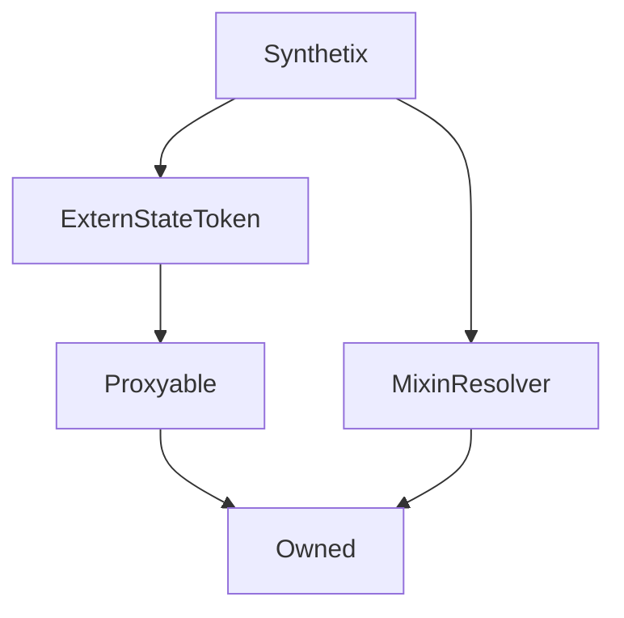

# Synthetix

## Description

**Source:** [contracts/Synthetix.sol](https://github.com/Synthetixio/synthetix/tree/v2.33.0/contracts/Synthetix.sol)

## Architecture

### Inheritance Graph

### Related Contracts

<centered-image>
    
</centered-image>

??? example "Details"

    - [`Depot`](Depot.md): The depot trades SNX and therefore knows the Synthetix address.
    - [`Exchanger`](Exchanger.md) The helper contract that performs the heavy lifting for `exchange()` and `settle()`.
    - [`ExchangeRates`](ExchangeRates.md): The Synthetix contract fetches prices from the exchange rates contract to facilitate synth exchange and to determine the value of various quantities of synths.
    - [`FeePool`](FeePool.md): The Synthetix contract remits exchange fees as sUSD to the fee pool, and also uses it to keep track of historical issuance records for each issuer.
    - [`Issuer`](Issuer.md) The helper contract that performs the heavy lifting for `issueSynths()`, `issueMaxSynths()` and `burnSynths()`.
    - [`Proxy`](Proxy.md): The Synthetix contract, which is [`Proxyable`](Proxyable.md), exists behind a `CALL`-style proxy for upgradeability.
    - [`RewardEscrow`](RewardEscrow.md): This is similar to the SynthetixEscrow contract, but it is where the SNX inflationary supply is kept before it is released to Synth issuers.
    - [`RewardsDistribution`](RewardsDistribution): This contract works closely with RewardEscrow to release portions of the inflationary supply to different recipients.
    - [`SupplySchedule`](SupplySchedule.md): The supply schedule determines the rate at which SNX are released from the inflationary supply.
    - [`Synth`](Synth.md): Synthetix manages the supply of synths. It keeps track of which ones exist, and they are all issued and burnt from the Synthetix contract. The Synthetix contract is also responsible for exchange between different synth flavours.
    - [`SynthetixEscrow`](SynthetixEscrow.md): The escrow contract keeps track of SNX owed to participants in the initial token sale, and releases them according to specified vesting schedules.
    - [`SynthetixState`](SynthetixState.md): This state contract stores the debt ledger and the current issuance information for synth issuers.

## Constants

### `DECIMALS`

[Source](https://github.com/Synthetixio/synthetix/tree/v2.33.0/contracts/Synthetix.sol#L28)

**Type:** `uint8`

### `TOKEN_NAME`

[Source](https://github.com/Synthetixio/synthetix/tree/v2.33.0/contracts/Synthetix.sol#L26)

**Type:** `string`

### `TOKEN_SYMBOL`

[Source](https://github.com/Synthetixio/synthetix/tree/v2.33.0/contracts/Synthetix.sol#L27)

**Type:** `string`

### `sUSD`

[Source](https://github.com/Synthetixio/synthetix/tree/v2.33.0/contracts/Synthetix.sol#L29)

**Type:** `bytes32`

## Constructor

### `constructor`

[Source](https://github.com/Synthetixio/synthetix/tree/v2.33.0/contracts/Synthetix.sol#L51)

??? example "Details"

    **Signature**

    `(address payable _proxy, contract TokenState _tokenState, address _owner, uint256 _totalSupply, address _resolver)`

    **Visibility**

    `public`

    **State Mutability**

    `nonpayable`

## Views

### `anySynthOrSNXRateIsInvalid`

[Source](https://github.com/Synthetixio/synthetix/tree/v2.33.0/contracts/Synthetix.sol#L126)

??? example "Details"

    **Signature**

    `anySynthOrSNXRateIsInvalid() returns (bool)`

    **Visibility**

    `external`

    **State Mutability**

    `view`

### `availableCurrencyKeys`

[Source](https://github.com/Synthetixio/synthetix/tree/v2.33.0/contracts/Synthetix.sol#L102)

??? example "Details"

    **Signature**

    `availableCurrencyKeys() returns (bytes32[])`

    **Visibility**

    `external`

    **State Mutability**

    `view`

### `availableSynthCount`

[Source](https://github.com/Synthetixio/synthetix/tree/v2.33.0/contracts/Synthetix.sol#L106)

??? example "Details"

    **Signature**

    `availableSynthCount() returns (uint256)`

    **Visibility**

    `external`

    **State Mutability**

    `view`

### `availableSynths`

[Source](https://github.com/Synthetixio/synthetix/tree/v2.33.0/contracts/Synthetix.sol#L110)

??? example "Details"

    **Signature**

    `availableSynths(uint256 index) returns (contract ISynth)`

    **Visibility**

    `external`

    **State Mutability**

    `view`

### `collateral`

[Source](https://github.com/Synthetixio/synthetix/tree/v2.33.0/contracts/Synthetix.sol#L318)

??? example "Details"

    **Signature**

    `collateral(address account) returns (uint256)`

    **Visibility**

    `external`

    **State Mutability**

    `view`

### `collateralisationRatio`

[Source](https://github.com/Synthetixio/synthetix/tree/v2.33.0/contracts/Synthetix.sol#L314)

??? example "Details"

    **Signature**

    `collateralisationRatio(address _issuer) returns (uint256)`

    **Visibility**

    `external`

    **State Mutability**

    `view`

### `debtBalanceOf`

[Source](https://github.com/Synthetixio/synthetix/tree/v2.33.0/contracts/Synthetix.sol#L90)

??? example "Details"

    **Signature**

    `debtBalanceOf(address account, bytes32 currencyKey) returns (uint256)`

    **Visibility**

    `external`

    **State Mutability**

    `view`

### `isWaitingPeriod`

[Source](https://github.com/Synthetixio/synthetix/tree/v2.33.0/contracts/Synthetix.sol#L122)

??? example "Details"

    **Signature**

    `isWaitingPeriod(bytes32 currencyKey) returns (bool)`

    **Visibility**

    `external`

    **State Mutability**

    `view`

### `maxIssuableSynths`

[Source](https://github.com/Synthetixio/synthetix/tree/v2.33.0/contracts/Synthetix.sol#L130)

??? example "Details"

    **Signature**

    `maxIssuableSynths(address account) returns (uint256)`

    **Visibility**

    `external`

    **State Mutability**

    `view`

### `remainingIssuableSynths`

[Source](https://github.com/Synthetixio/synthetix/tree/v2.33.0/contracts/Synthetix.sol#L134)

??? example "Details"

    **Signature**

    `remainingIssuableSynths(address account) returns (uint256, uint256, uint256)`

    **Visibility**

    `external`

    **State Mutability**

    `view`

### `synths`

[Source](https://github.com/Synthetixio/synthetix/tree/v2.33.0/contracts/Synthetix.sol#L114)

??? example "Details"

    **Signature**

    `synths(bytes32 currencyKey) returns (contract ISynth)`

    **Visibility**

    `external`

    **State Mutability**

    `view`

### `synthsByAddress`

[Source](https://github.com/Synthetixio/synthetix/tree/v2.33.0/contracts/Synthetix.sol#L118)

??? example "Details"

    **Signature**

    `synthsByAddress(address synthAddress) returns (bytes32)`

    **Visibility**

    `external`

    **State Mutability**

    `view`

### `totalIssuedSynths`

[Source](https://github.com/Synthetixio/synthetix/tree/v2.33.0/contracts/Synthetix.sol#L94)

??? example "Details"

    **Signature**

    `totalIssuedSynths(bytes32 currencyKey) returns (uint256)`

    **Visibility**

    `external`

    **State Mutability**

    `view`

### `totalIssuedSynthsExcludeEtherCollateral`

[Source](https://github.com/Synthetixio/synthetix/tree/v2.33.0/contracts/Synthetix.sol#L98)

??? example "Details"

    **Signature**

    `totalIssuedSynthsExcludeEtherCollateral(bytes32 currencyKey) returns (uint256)`

    **Visibility**

    `external`

    **State Mutability**

    `view`

### `transferableSynthetix`

[Source](https://github.com/Synthetixio/synthetix/tree/v2.33.0/contracts/Synthetix.sol#L322)

??? example "Details"

    **Signature**

    `transferableSynthetix(address account) returns (uint256)`

    **Visibility**

    `external`

    **State Mutability**

    `view`

## Restricted Functions

### `emitExchangeRebate`

[Source](https://github.com/Synthetixio/synthetix/tree/v2.33.0/contracts/Synthetix.sol#L473)

??? example "Details"

    **Signature**

    `emitExchangeRebate(address account, bytes32 currencyKey, uint256 amount)`

    **Visibility**

    `external`

    **State Mutability**

    `nonpayable`

    **Modifiers**

    * [onlyExchanger](#onlyexchanger)

### `emitExchangeReclaim`

[Source](https://github.com/Synthetixio/synthetix/tree/v2.33.0/contracts/Synthetix.sol#L462)

??? example "Details"

    **Signature**

    `emitExchangeReclaim(address account, bytes32 currencyKey, uint256 amount)`

    **Visibility**

    `external`

    **State Mutability**

    `nonpayable`

    **Modifiers**

    * [onlyExchanger](#onlyexchanger)

### `emitExchangeTracking`

[Source](https://github.com/Synthetixio/synthetix/tree/v2.33.0/contracts/Synthetix.sol#L451)

??? example "Details"

    **Signature**

    `emitExchangeTracking(bytes32 trackingCode, bytes32 toCurrencyKey, uint256 toAmount)`

    **Visibility**

    `external`

    **State Mutability**

    `nonpayable`

    **Modifiers**

    * [onlyExchanger](#onlyexchanger)

### `emitSynthExchange`

[Source](https://github.com/Synthetixio/synthetix/tree/v2.33.0/contracts/Synthetix.sol#L430)

??? example "Details"

    **Signature**

    `emitSynthExchange(address account, bytes32 fromCurrencyKey, uint256 fromAmount, bytes32 toCurrencyKey, uint256 toAmount, address toAddress)`

    **Visibility**

    `external`

    **State Mutability**

    `nonpayable`

    **Modifiers**

    * [onlyExchanger](#onlyexchanger)

## Internal Functions

### `_canTransfer`

[Source](https://github.com/Synthetixio/synthetix/tree/v2.33.0/contracts/Synthetix.sol#L146)

??? example "Details"

    **Signature**

    `_canTransfer(address account, uint256 value) returns (bool)`

    **Visibility**

    `internal`

    **State Mutability**

    `view`

### `emitAccountLiquidated`

[Source](https://github.com/Synthetixio/synthetix/tree/v2.33.0/contracts/Synthetix.sol#L484)

??? example "Details"

    **Signature**

    `emitAccountLiquidated(address account, uint256 snxRedeemed, uint256 amountLiquidated, address liquidator)`

    **Visibility**

    `internal`

    **State Mutability**

    `nonpayable`

### `exchanger`

[Source](https://github.com/Synthetixio/synthetix/tree/v2.33.0/contracts/Synthetix.sol#L73)

??? example "Details"

    **Signature**

    `exchanger() returns (contract IExchanger)`

    **Visibility**

    `internal`

    **State Mutability**

    `view`

### `issuer`

[Source](https://github.com/Synthetixio/synthetix/tree/v2.33.0/contracts/Synthetix.sol#L77)

??? example "Details"

    **Signature**

    `issuer() returns (contract IIssuer)`

    **Visibility**

    `internal`

    **State Mutability**

    `view`

### `rewardsDistribution`

[Source](https://github.com/Synthetixio/synthetix/tree/v2.33.0/contracts/Synthetix.sol#L85)

??? example "Details"

    **Signature**

    `rewardsDistribution() returns (contract IRewardsDistribution)`

    **Visibility**

    `internal`

    **State Mutability**

    `view`

### `supplySchedule`

[Source](https://github.com/Synthetixio/synthetix/tree/v2.33.0/contracts/Synthetix.sol#L81)

??? example "Details"

    **Signature**

    `supplySchedule() returns (contract SupplySchedule)`

    **Visibility**

    `internal`

    **State Mutability**

    `view`

### `synthetixState`

[Source](https://github.com/Synthetixio/synthetix/tree/v2.33.0/contracts/Synthetix.sol#L65)

??? example "Details"

    **Signature**

    `synthetixState() returns (contract ISynthetixState)`

    **Visibility**

    `internal`

    **State Mutability**

    `view`

### `systemStatus`

[Source](https://github.com/Synthetixio/synthetix/tree/v2.33.0/contracts/Synthetix.sol#L69)

??? example "Details"

    **Signature**

    `systemStatus() returns (contract ISystemStatus)`

    **Visibility**

    `internal`

    **State Mutability**

    `view`

## External Functions

### `burnSecondary`

[Source](https://github.com/Synthetixio/synthetix/tree/v2.33.0/contracts/Synthetix.sol#L390)

??? example "Details"

    **Signature**

    `burnSecondary(address , uint256 )`

    **Visibility**

    `external`

    **State Mutability**

    `nonpayable`

### `burnSynths`

[Source](https://github.com/Synthetixio/synthetix/tree/v2.33.0/contracts/Synthetix.sol#L201)

??? example "Details"

    **Signature**

    `burnSynths(uint256 amount)`

    **Visibility**

    `external`

    **State Mutability**

    `nonpayable`

    **Modifiers**

    * [issuanceActive](#issuanceactive)

    * [optionalProxy](#optionalproxy)

### `burnSynthsOnBehalf`

[Source](https://github.com/Synthetixio/synthetix/tree/v2.33.0/contracts/Synthetix.sol#L205)

??? example "Details"

    **Signature**

    `burnSynthsOnBehalf(address burnForAddress, uint256 amount)`

    **Visibility**

    `external`

    **State Mutability**

    `nonpayable`

    **Modifiers**

    * [issuanceActive](#issuanceactive)

    * [optionalProxy](#optionalproxy)

### `burnSynthsToTarget`

[Source](https://github.com/Synthetixio/synthetix/tree/v2.33.0/contracts/Synthetix.sol#L209)

??? example "Details"

    **Signature**

    `burnSynthsToTarget()`

    **Visibility**

    `external`

    **State Mutability**

    `nonpayable`

    **Modifiers**

    * [issuanceActive](#issuanceactive)

    * [optionalProxy](#optionalproxy)

### `burnSynthsToTargetOnBehalf`

[Source](https://github.com/Synthetixio/synthetix/tree/v2.33.0/contracts/Synthetix.sol#L213)

??? example "Details"

    **Signature**

    `burnSynthsToTargetOnBehalf(address burnForAddress)`

    **Visibility**

    `external`

    **State Mutability**

    `nonpayable`

    **Modifiers**

    * [issuanceActive](#issuanceactive)

    * [optionalProxy](#optionalproxy)

### `exchange`

[Source](https://github.com/Synthetixio/synthetix/tree/v2.33.0/contracts/Synthetix.sol#L217)

Exchanges one synth flavour for an equivalent value of another at current [exchange rates](ExchangeRates.md) and transfers the converted quantity to a destination address. An [exchange fee](FeePool.md#exchangefeerate) is charged on the way.

See [`Exchanger`](Exchanger.md#exchange) for further details.

??? example "Details"

    **Signature**

    `exchange(bytes32 sourceCurrencyKey, uint256 sourceAmount, bytes32 destinationCurrencyKey) returns (uint256)`

    **Visibility**

    `external`

    **State Mutability**

    `nonpayable`

    **Modifiers**

    * [exchangeActive](#exchangeactive)

    * [optionalProxy](#optionalproxy)

### `exchangeOnBehalf`

[Source](https://github.com/Synthetixio/synthetix/tree/v2.33.0/contracts/Synthetix.sol#L225)

??? example "Details"

    **Signature**

    `exchangeOnBehalf(address exchangeForAddress, bytes32 sourceCurrencyKey, uint256 sourceAmount, bytes32 destinationCurrencyKey) returns (uint256)`

    **Visibility**

    `external`

    **State Mutability**

    `nonpayable`

    **Modifiers**

    * [exchangeActive](#exchangeactive)

    * [optionalProxy](#optionalproxy)

### `exchangeOnBehalfWithTracking`

[Source](https://github.com/Synthetixio/synthetix/tree/v2.33.0/contracts/Synthetix.sol#L260)

??? example "Details"

    **Signature**

    `exchangeOnBehalfWithTracking(address exchangeForAddress, bytes32 sourceCurrencyKey, uint256 sourceAmount, bytes32 destinationCurrencyKey, address originator, bytes32 trackingCode) returns (uint256)`

    **Visibility**

    `external`

    **State Mutability**

    `nonpayable`

    **Modifiers**

    * [exchangeActive](#exchangeactive)

    * [optionalProxy](#optionalproxy)

### `exchangeWithTracking`

[Source](https://github.com/Synthetixio/synthetix/tree/v2.33.0/contracts/Synthetix.sol#L241)

??? example "Details"

    **Signature**

    `exchangeWithTracking(bytes32 sourceCurrencyKey, uint256 sourceAmount, bytes32 destinationCurrencyKey, address originator, bytes32 trackingCode) returns (uint256)`

    **Visibility**

    `external`

    **State Mutability**

    `nonpayable`

    **Modifiers**

    * [exchangeActive](#exchangeactive)

    * [optionalProxy](#optionalproxy)

### `exchangeWithVirtual`

[Source](https://github.com/Synthetixio/synthetix/tree/v2.33.0/contracts/Synthetix.sol#L280)

??? example "Details"

    **Signature**

    `exchangeWithVirtual(bytes32 sourceCurrencyKey, uint256 sourceAmount, bytes32 destinationCurrencyKey, bytes32 trackingCode) returns (uint256, contract IVirtualSynth)`

    **Visibility**

    `external`

    **State Mutability**

    `nonpayable`

    **Modifiers**

    * [exchangeActive](#exchangeactive)

    * [optionalProxy](#optionalproxy)

### `issueMaxSynths`

[Source](https://github.com/Synthetixio/synthetix/tree/v2.33.0/contracts/Synthetix.sol#L193)

??? example "Details"

    **Signature**

    `issueMaxSynths()`

    **Visibility**

    `external`

    **State Mutability**

    `nonpayable`

    **Modifiers**

    * [issuanceActive](#issuanceactive)

    * [optionalProxy](#optionalproxy)

### `issueMaxSynthsOnBehalf`

[Source](https://github.com/Synthetixio/synthetix/tree/v2.33.0/contracts/Synthetix.sol#L197)

??? example "Details"

    **Signature**

    `issueMaxSynthsOnBehalf(address issueForAddress)`

    **Visibility**

    `external`

    **State Mutability**

    `nonpayable`

    **Modifiers**

    * [issuanceActive](#issuanceactive)

    * [optionalProxy](#optionalproxy)

### `issueSynths`

[Source](https://github.com/Synthetixio/synthetix/tree/v2.33.0/contracts/Synthetix.sol#L185)

??? example "Details"

    **Signature**

    `issueSynths(uint256 amount)`

    **Visibility**

    `external`

    **State Mutability**

    `nonpayable`

    **Modifiers**

    * [issuanceActive](#issuanceactive)

    * [optionalProxy](#optionalproxy)

### `issueSynthsOnBehalf`

[Source](https://github.com/Synthetixio/synthetix/tree/v2.33.0/contracts/Synthetix.sol#L189)

??? example "Details"

    **Signature**

    `issueSynthsOnBehalf(address issueForAddress, uint256 amount)`

    **Visibility**

    `external`

    **State Mutability**

    `nonpayable`

    **Modifiers**

    * [issuanceActive](#issuanceactive)

    * [optionalProxy](#optionalproxy)

### `liquidateDelinquentAccount`

[Source](https://github.com/Synthetixio/synthetix/tree/v2.33.0/contracts/Synthetix.sol#L363)

??? example "Details"

    **Signature**

    `liquidateDelinquentAccount(address account, uint256 susdAmount) returns (bool)`

    **Visibility**

    `external`

    **State Mutability**

    `nonpayable`

    **Modifiers**

    * [systemActive](#systemactive)

    * [optionalProxy](#optionalproxy)

### `mint`

[Source](https://github.com/Synthetixio/synthetix/tree/v2.33.0/contracts/Synthetix.sol#L326)

This function is responsible for creating the inflationary SNX supply. It is a public function, so any address can ensure new tokens are released on schedule. When a new quantity is minted, the calling address is rewarded with a small incentive of SNX tokens, defined by [`SupplySchedule.minterReward`](SupplySchedule.md#minterreward).

The supply is released according to the schedule defined in [`SupplySchedule.schedules`](SupplySchedule.md#schedules), being sent to the [`RewardsDistribution`](RewardsDistribution.md#distributerewards) contract for distribution and escrow. The total supply SNX supply is thus increased by the quantity specified by the schedule.

This function always returns true if the transaction did not revert.

??? example "Details"

    **Signature**

    `mint() returns (bool)`

    **Visibility**

    `external`

    **State Mutability**

    `nonpayable`

    **Requires**

    * [require(..., RewardsDistribution not set)](https://github.com/Synthetixio/synthetix/tree/v2.33.0/contracts/Synthetix.sol#L327)

    * [require(..., No supply is mintable)](https://github.com/Synthetixio/synthetix/tree/v2.33.0/contracts/Synthetix.sol#L333)

    **Modifiers**

    * [issuanceActive](#issuanceactive)

### `mintSecondary`

[Source](https://github.com/Synthetixio/synthetix/tree/v2.33.0/contracts/Synthetix.sol#L382)

??? example "Details"

    **Signature**

    `mintSecondary(address , uint256 )`

    **Visibility**

    `external`

    **State Mutability**

    `nonpayable`

### `mintSecondaryRewards`

[Source](https://github.com/Synthetixio/synthetix/tree/v2.33.0/contracts/Synthetix.sol#L386)

??? example "Details"

    **Signature**

    `mintSecondaryRewards(uint256 )`

    **Visibility**

    `external`

    **State Mutability**

    `nonpayable`

### `settle`

[Source](https://github.com/Synthetixio/synthetix/tree/v2.33.0/contracts/Synthetix.sol#L302)

Settles any amounts oustanding for previous exchanges into the given synth.

See [`Exchanger`](Exchanger.md#exchange) for further details.

??? example "Details"

    **Signature**

    `settle(bytes32 currencyKey) returns (uint256, uint256, uint256)`

    **Visibility**

    `external`

    **State Mutability**

    `nonpayable`

    **Modifiers**

    * [optionalProxy](#optionalproxy)

### `transfer`

[Source](https://github.com/Synthetixio/synthetix/tree/v2.33.0/contracts/Synthetix.sol#L162)

??? example "Details"

    **Signature**

    `transfer(address to, uint256 value) returns (bool)`

    **Visibility**

    `external`

    **State Mutability**

    `nonpayable`

    **Modifiers**

    * [optionalProxy](#optionalproxy)

    * [systemActive](#systemactive)

### `transferFrom`

[Source](https://github.com/Synthetixio/synthetix/tree/v2.33.0/contracts/Synthetix.sol#L172)

??? example "Details"

    **Signature**

    `transferFrom(address from, address to, uint256 value) returns (bool)`

    **Visibility**

    `external`

    **State Mutability**

    `nonpayable`

    **Modifiers**

    * [optionalProxy](#optionalproxy)

    * [systemActive](#systemactive)

## Modifiers

### `exchangeActive`

[Source](https://github.com/Synthetixio/synthetix/tree/v2.33.0/contracts/Synthetix.sol#L411)

**Signature**: `exchangeActive(bytes32 src, bytes32 dest)`

### `issuanceActive`

[Source](https://github.com/Synthetixio/synthetix/tree/v2.33.0/contracts/Synthetix.sol#L406)

### `onlyExchanger`

[Source](https://github.com/Synthetixio/synthetix/tree/v2.33.0/contracts/Synthetix.sol#L396)

### `systemActive`

[Source](https://github.com/Synthetixio/synthetix/tree/v2.33.0/contracts/Synthetix.sol#L401)

## Events

### `AccountLiquidated`

[Source](https://github.com/Synthetixio/synthetix/tree/v2.33.0/contracts/Synthetix.sol#L481)

**Signature**: `AccountLiquidated(address account, uint256 snxRedeemed, uint256 amountLiquidated, address liquidator)`

### `ExchangeRebate`

[Source](https://github.com/Synthetixio/synthetix/tree/v2.33.0/contracts/Synthetix.sol#L470)

!!! tip "Fee Rebates"

    See [SIP-37](https://sips.synthetix.io/sips/sip-37) on Fee Reclamation & Rebates.

Records that an `amount` of the synth denoted by `currencyKey` has been rebated (i.e. issued) by the system to the `account`.

The amount is the total net amount from all unsettled exchanges into the given synth

**Signature**: `ExchangeRebate(address account, bytes32 currencyKey, uint256 amount)`

### `ExchangeReclaim`

[Source](https://github.com/Synthetixio/synthetix/tree/v2.33.0/contracts/Synthetix.sol#L459)

!!! tip "Fee Reclaims"

    See [SIP-37](https://sips.synthetix.io/sips/sip-37) on Fee Reclamation & Rebates.

Records that an `amount` of the synth denoted by `currencyKey` has been reclaimed (i.e. burned) from the `account` to the system.

The amount is the total net amount from all unsettled exchanges into the given synth

**Signature**: `ExchangeReclaim(address account, bytes32 currencyKey, uint256 amount)`

### `ExchangeTracking`

[Source](https://github.com/Synthetixio/synthetix/tree/v2.33.0/contracts/Synthetix.sol#L448)

**Signature**: `ExchangeTracking(bytes32 trackingCode, bytes32 toCurrencyKey, uint256 toAmount)`

### `SynthExchange`

[Source](https://github.com/Synthetixio/synthetix/tree/v2.33.0/contracts/Synthetix.sol#L418)

Records that an [exchange](#exchange) between two flavours of synths occurred.

This event is emitted from the Synthetix [proxy](Proxy.md#_emit) with the `emitSynthExchange` function.

**Signature**: `SynthExchange(address account, bytes32 fromCurrencyKey, uint256 fromAmount, bytes32 toCurrencyKey, uint256 toAmount, address toAddress)`
