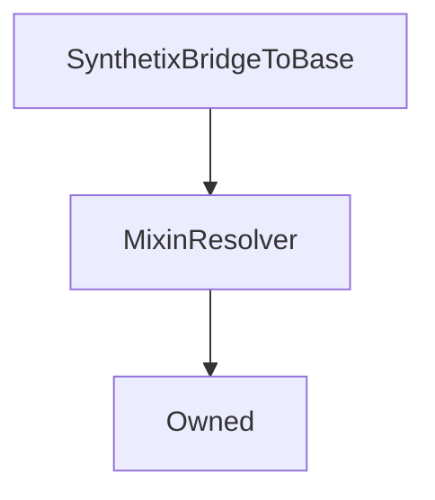

# SynthetixBridgeToBase

## Description

**Source:** [contracts/SynthetixBridgeToBase.sol](https://github.com/Synthetixio/synthetix/tree/v2.33.0-ovm/contracts/SynthetixBridgeToBase.sol)

## Architecture

### Inheritance Graph

## Constructor

### `constructor`

[Source](https://github.com/Synthetixio/synthetix/tree/v2.33.0-ovm/contracts/SynthetixBridgeToBase.sol#L31)

??? example "Details"

    **Signature**

    `(address _owner, address _resolver)`

    **Visibility**

    `public`

    **State Mutability**

    `nonpayable`

## Restricted Functions

### `mintSecondaryFromDeposit`

[Source](https://github.com/Synthetixio/synthetix/tree/v2.33.0-ovm/contracts/SynthetixBridgeToBase.sol#L79)

??? example "Details"

    **Signature**

    `mintSecondaryFromDeposit(address account, uint256 amount)`

    **Visibility**

    `external`

    **State Mutability**

    `nonpayable`

    **Modifiers**

    * [onlyOptimismBridge](#onlyoptimismbridge)

    **Emits**

    * [MintedSecondary](#mintedsecondary)

### `mintSecondaryFromDepositForRewards`

[Source](https://github.com/Synthetixio/synthetix/tree/v2.33.0-ovm/contracts/SynthetixBridgeToBase.sol#L87)

??? example "Details"

    **Signature**

    `mintSecondaryFromDepositForRewards(uint256 amount)`

    **Visibility**

    `external`

    **State Mutability**

    `nonpayable`

    **Modifiers**

    * [onlyOptimismBridge](#onlyoptimismbridge)

    **Emits**

    * [MintedSecondaryRewards](#mintedsecondaryrewards)

## Internal Functions

### `messenger`

[Source](https://github.com/Synthetixio/synthetix/tree/v2.33.0-ovm/contracts/SynthetixBridgeToBase.sol#L36)

??? example "Details"

    **Signature**

    `messenger() returns (contract iOVM_BaseCrossDomainMessenger)`

    **Visibility**

    `internal`

    **State Mutability**

    `view`

### `onlyAllowFromOptimism`

[Source](https://github.com/Synthetixio/synthetix/tree/v2.33.0-ovm/contracts/SynthetixBridgeToBase.sol#L48)

??? example "Details"

    **Signature**

    `onlyAllowFromOptimism()`

    **Visibility**

    `internal`

    **State Mutability**

    `view`

    **Requires**

    * [require(..., Only the relayer can call this)](https://github.com/Synthetixio/synthetix/tree/v2.33.0-ovm/contracts/SynthetixBridgeToBase.sol#L51)

    * [require(..., Only the L1 bridge can invoke)](https://github.com/Synthetixio/synthetix/tree/v2.33.0-ovm/contracts/SynthetixBridgeToBase.sol#L52)

### `synthetix`

[Source](https://github.com/Synthetixio/synthetix/tree/v2.33.0-ovm/contracts/SynthetixBridgeToBase.sol#L40)

??? example "Details"

    **Signature**

    `synthetix() returns (contract ISynthetix)`

    **Visibility**

    `internal`

    **State Mutability**

    `view`

### `synthetixBridgeToOptimism`

[Source](https://github.com/Synthetixio/synthetix/tree/v2.33.0-ovm/contracts/SynthetixBridgeToBase.sol#L44)

??? example "Details"

    **Signature**

    `synthetixBridgeToOptimism() returns (address)`

    **Visibility**

    `internal`

    **State Mutability**

    `view`

## External Functions

### `initiateWithdrawal`

[Source](https://github.com/Synthetixio/synthetix/tree/v2.33.0-ovm/contracts/SynthetixBridgeToBase.sol#L63)

??? example "Details"

    **Signature**

    `initiateWithdrawal(uint256 amount)`

    **Visibility**

    `external`

    **State Mutability**

    `nonpayable`

    **Emits**

    * [WithdrawalInitiated](#withdrawalinitiated)

## Modifiers

### `onlyOptimismBridge`

[Source](https://github.com/Synthetixio/synthetix/tree/v2.33.0-ovm/contracts/SynthetixBridgeToBase.sol#L55)

## Events

### `MintedSecondary`

[Source](https://github.com/Synthetixio/synthetix/tree/v2.33.0-ovm/contracts/SynthetixBridgeToBase.sol#L95)

**Signature**: `MintedSecondary(address account, uint256 amount)`

### `MintedSecondaryRewards`

[Source](https://github.com/Synthetixio/synthetix/tree/v2.33.0-ovm/contracts/SynthetixBridgeToBase.sol#L96)

**Signature**: `MintedSecondaryRewards(uint256 amount)`

### `WithdrawalInitiated`

[Source](https://github.com/Synthetixio/synthetix/tree/v2.33.0-ovm/contracts/SynthetixBridgeToBase.sol#L97)

**Signature**: `WithdrawalInitiated(address account, uint256 amount)`
