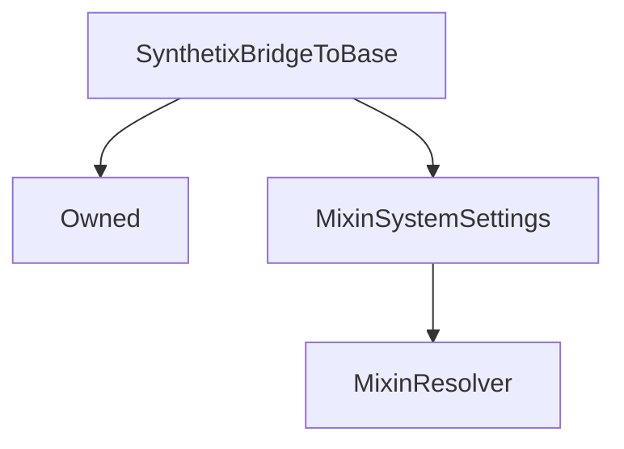

# SynthetixBridgeToBase

## Description

**Source:** [contracts/SynthetixBridgeToBase.sol](https://github.com/Synthetixio/synthetix/tree/v2.35.6/contracts/SynthetixBridgeToBase.sol)

## Architecture

### Inheritance Graph

## Constructor

### `constructor`

[Source](https://github.com/Synthetixio/synthetix/tree/v2.35.6/contracts/SynthetixBridgeToBase.sol#L26)

??? example "Details"

    **Signature**

    `(address _owner, address _resolver)`

    **Visibility**

    `public`

    **State Mutability**

    `nonpayable`

## Views

### `resolverAddressesRequired`

[Source](https://github.com/Synthetixio/synthetix/tree/v2.35.6/contracts/SynthetixBridgeToBase.sol#L61)

??? example "Details"

    **Signature**

    `resolverAddressesRequired() returns (bytes32[])`

    **Visibility**

    `public`

    **State Mutability**

    `view`

## Restricted Functions

### `completeDeposit`

[Source](https://github.com/Synthetixio/synthetix/tree/v2.35.6/contracts/SynthetixBridgeToBase.sol#L92)

??? example "Details"

    **Signature**

    `completeDeposit(address account, uint256 amount)`

    **Visibility**

    `external`

    **State Mutability**

    `nonpayable`

    **Modifiers**

    * [onlyOptimismBridge](#onlyoptimismbridge)

    **Emits**

    * [MintedSecondary](#mintedsecondary)

### `completeRewardDeposit`

[Source](https://github.com/Synthetixio/synthetix/tree/v2.35.6/contracts/SynthetixBridgeToBase.sol#L100)

??? example "Details"

    **Signature**

    `completeRewardDeposit(uint256 amount)`

    **Visibility**

    `external`

    **State Mutability**

    `nonpayable`

    **Modifiers**

    * [onlyOptimismBridge](#onlyoptimismbridge)

    **Emits**

    * [MintedSecondaryRewards](#mintedsecondaryrewards)

## Internal Functions

### `issuer`

[Source](https://github.com/Synthetixio/synthetix/tree/v2.35.6/contracts/SynthetixBridgeToBase.sol#L39)

??? example "Details"

    **Signature**

    `issuer() returns (contract IIssuer)`

    **Visibility**

    `internal`

    **State Mutability**

    `view`

### `messenger`

[Source](https://github.com/Synthetixio/synthetix/tree/v2.35.6/contracts/SynthetixBridgeToBase.sol#L31)

??? example "Details"

    **Signature**

    `messenger() returns (contract iOVM_BaseCrossDomainMessenger)`

    **Visibility**

    `internal`

    **State Mutability**

    `view`

### `onlyAllowFromOptimism`

[Source](https://github.com/Synthetixio/synthetix/tree/v2.35.6/contracts/SynthetixBridgeToBase.sol#L47)

??? example "Details"

    **Signature**

    `onlyAllowFromOptimism()`

    **Visibility**

    `internal`

    **State Mutability**

    `view`

    **Requires**

    * [require(..., Only the relayer can call this)](https://github.com/Synthetixio/synthetix/tree/v2.35.6/contracts/SynthetixBridgeToBase.sol#L50)

    * [require(..., Only the L1 bridge can invoke)](https://github.com/Synthetixio/synthetix/tree/v2.35.6/contracts/SynthetixBridgeToBase.sol#L51)

### `synthetix`

[Source](https://github.com/Synthetixio/synthetix/tree/v2.35.6/contracts/SynthetixBridgeToBase.sol#L35)

??? example "Details"

    **Signature**

    `synthetix() returns (contract ISynthetix)`

    **Visibility**

    `internal`

    **State Mutability**

    `view`

### `synthetixBridgeToOptimism`

[Source](https://github.com/Synthetixio/synthetix/tree/v2.35.6/contracts/SynthetixBridgeToBase.sol#L43)

??? example "Details"

    **Signature**

    `synthetixBridgeToOptimism() returns (address)`

    **Visibility**

    `internal`

    **State Mutability**

    `view`

## External Functions

### `initiateWithdrawal`

[Source](https://github.com/Synthetixio/synthetix/tree/v2.35.6/contracts/SynthetixBridgeToBase.sol#L74)

??? example "Details"

    **Signature**

    `initiateWithdrawal(uint256 amount)`

    **Visibility**

    `external`

    **State Mutability**

    `nonpayable`

    **Requires**

    * [require(..., Cannot withdraw with debt)](https://github.com/Synthetixio/synthetix/tree/v2.35.6/contracts/SynthetixBridgeToBase.sol#L75)

    **Emits**

    * [WithdrawalInitiated](#withdrawalinitiated)

## Modifiers

### `onlyOptimismBridge`

[Source](https://github.com/Synthetixio/synthetix/tree/v2.35.6/contracts/SynthetixBridgeToBase.sol#L54)

## Events

### `MintedSecondary`

[Source](https://github.com/Synthetixio/synthetix/tree/v2.35.6/contracts/SynthetixBridgeToBase.sol#L108)

**Signature**: `MintedSecondary(address account, uint256 amount)`

### `MintedSecondaryRewards`

[Source](https://github.com/Synthetixio/synthetix/tree/v2.35.6/contracts/SynthetixBridgeToBase.sol#L109)

**Signature**: `MintedSecondaryRewards(uint256 amount)`

### `WithdrawalInitiated`

[Source](https://github.com/Synthetixio/synthetix/tree/v2.35.6/contracts/SynthetixBridgeToBase.sol#L110)

**Signature**: `WithdrawalInitiated(address account, uint256 amount)`
