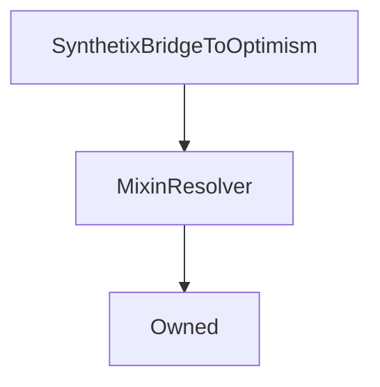

# SynthetixBridgeToOptimism

## Description

**Source:** [contracts/SynthetixBridgeToOptimism.sol](https://github.com/Synthetixio/synthetix/tree/v2.33.1/contracts/SynthetixBridgeToOptimism.sol)

## Architecture

### Inheritance Graph

## Variables

### `activated`

[Source](https://github.com/Synthetixio/synthetix/tree/v2.33.1/contracts/SynthetixBridgeToOptimism.sol#L35)

**Type:** `bool`

## Constructor

### `constructor`

[Source](https://github.com/Synthetixio/synthetix/tree/v2.33.1/contracts/SynthetixBridgeToOptimism.sol#L39)

??? example "Details"

    **Signature**

    `(address _owner, address _resolver)`

    **Visibility**

    `public`

    **State Mutability**

    `nonpayable`

## Restricted Functions

### `migrateBridge`

[Source](https://github.com/Synthetixio/synthetix/tree/v2.33.1/contracts/SynthetixBridgeToOptimism.sol#L136)

??? example "Details"

    **Signature**

    `migrateBridge(address newBridge)`

    **Visibility**

    `external`

    **State Mutability**

    `nonpayable`

    **Requires**

    * [require(..., Cannot migrate to address 0)](https://github.com/Synthetixio/synthetix/tree/v2.33.1/contracts/SynthetixBridgeToOptimism.sol#L137)

    **Modifiers**

    * [onlyOwner](#onlyowner)

    * [requireActive](#requireactive)

    **Emits**

    * [BridgeMigrated](#bridgemigrated)

## Internal Functions

### `_rewardDeposit`

[Source](https://github.com/Synthetixio/synthetix/tree/v2.33.1/contracts/SynthetixBridgeToOptimism.sol#L74)

??? example "Details"

    **Signature**

    `_rewardDeposit(uint256 amount)`

    **Visibility**

    `internal`

    **State Mutability**

    `nonpayable`

    **Emits**

    * [RewardDeposit](#rewarddeposit)

### `isActive`

[Source](https://github.com/Synthetixio/synthetix/tree/v2.33.1/contracts/SynthetixBridgeToOptimism.sol#L70)

??? example "Details"

    **Signature**

    `isActive()`

    **Visibility**

    `internal`

    **State Mutability**

    `view`

    **Requires**

    * [require(..., Function deactivated)](https://github.com/Synthetixio/synthetix/tree/v2.33.1/contracts/SynthetixBridgeToOptimism.sol#L71)

### `issuer`

[Source](https://github.com/Synthetixio/synthetix/tree/v2.33.1/contracts/SynthetixBridgeToOptimism.sol#L58)

??? example "Details"

    **Signature**

    `issuer() returns (contract IIssuer)`

    **Visibility**

    `internal`

    **State Mutability**

    `view`

### `messenger`

[Source](https://github.com/Synthetixio/synthetix/tree/v2.33.1/contracts/SynthetixBridgeToOptimism.sol#L46)

??? example "Details"

    **Signature**

    `messenger() returns (contract iOVM_BaseCrossDomainMessenger)`

    **Visibility**

    `internal`

    **State Mutability**

    `view`

### `rewardsDistribution`

[Source](https://github.com/Synthetixio/synthetix/tree/v2.33.1/contracts/SynthetixBridgeToOptimism.sol#L62)

??? example "Details"

    **Signature**

    `rewardsDistribution() returns (address)`

    **Visibility**

    `internal`

    **State Mutability**

    `view`

### `synthetix`

[Source](https://github.com/Synthetixio/synthetix/tree/v2.33.1/contracts/SynthetixBridgeToOptimism.sol#L50)

??? example "Details"

    **Signature**

    `synthetix() returns (contract ISynthetix)`

    **Visibility**

    `internal`

    **State Mutability**

    `view`

### `synthetixBridgeToBase`

[Source](https://github.com/Synthetixio/synthetix/tree/v2.33.1/contracts/SynthetixBridgeToOptimism.sol#L66)

??? example "Details"

    **Signature**

    `synthetixBridgeToBase() returns (address)`

    **Visibility**

    `internal`

    **State Mutability**

    `view`

### `synthetixERC20`

[Source](https://github.com/Synthetixio/synthetix/tree/v2.33.1/contracts/SynthetixBridgeToOptimism.sol#L54)

??? example "Details"

    **Signature**

    `synthetixERC20() returns (contract IERC20)`

    **Visibility**

    `internal`

    **State Mutability**

    `view`

## External Functions

### `completeWithdrawal`

[Source](https://github.com/Synthetixio/synthetix/tree/v2.33.1/contracts/SynthetixBridgeToOptimism.sol#L123)

??? example "Details"

    **Signature**

    `completeWithdrawal(address account, uint256 amount)`

    **Visibility**

    `external`

    **State Mutability**

    `nonpayable`

    **Requires**

    * [require(..., Only the relayer can call this)](https://github.com/Synthetixio/synthetix/tree/v2.33.1/contracts/SynthetixBridgeToOptimism.sol#L125)

    * [require(..., Only the L2 bridge can invoke)](https://github.com/Synthetixio/synthetix/tree/v2.33.1/contracts/SynthetixBridgeToOptimism.sol#L126)

    **Modifiers**

    * [requireActive](#requireactive)

    **Emits**

    * [WithdrawalCompleted](#withdrawalcompleted)

### `deposit`

[Source](https://github.com/Synthetixio/synthetix/tree/v2.33.1/contracts/SynthetixBridgeToOptimism.sol#L94)

??? example "Details"

    **Signature**

    `deposit(uint256 amount)`

    **Visibility**

    `external`

    **State Mutability**

    `nonpayable`

    **Requires**

    * [require(..., Cannot deposit with debt)](https://github.com/Synthetixio/synthetix/tree/v2.33.1/contracts/SynthetixBridgeToOptimism.sol#L95)

    **Modifiers**

    * [requireActive](#requireactive)

    **Emits**

    * [Deposit](#deposit)

### `notifyRewardAmount`

[Source](https://github.com/Synthetixio/synthetix/tree/v2.33.1/contracts/SynthetixBridgeToOptimism.sol#L149)

??? example "Details"

    **Signature**

    `notifyRewardAmount(uint256 amount)`

    **Visibility**

    `external`

    **State Mutability**

    `nonpayable`

    **Requires**

    * [require(..., Caller is not RewardsDistribution contract)](https://github.com/Synthetixio/synthetix/tree/v2.33.1/contracts/SynthetixBridgeToOptimism.sol#L150)

    **Modifiers**

    * [requireActive](#requireactive)

### `rewardDeposit`

[Source](https://github.com/Synthetixio/synthetix/tree/v2.33.1/contracts/SynthetixBridgeToOptimism.sol#L114)

??? example "Details"

    **Signature**

    `rewardDeposit(uint256 amount)`

    **Visibility**

    `external`

    **State Mutability**

    `nonpayable`

    **Modifiers**

    * [requireActive](#requireactive)

## Modifiers

### `requireActive`

[Source](https://github.com/Synthetixio/synthetix/tree/v2.33.1/contracts/SynthetixBridgeToOptimism.sol#L86)

## Events

### `BridgeMigrated`

[Source](https://github.com/Synthetixio/synthetix/tree/v2.33.1/contracts/SynthetixBridgeToOptimism.sol#L158)

**Signature**: `BridgeMigrated(address oldBridge, address newBridge, uint256 amount)`

### `Deposit`

[Source](https://github.com/Synthetixio/synthetix/tree/v2.33.1/contracts/SynthetixBridgeToOptimism.sol#L159)

**Signature**: `Deposit(address account, uint256 amount)`

### `RewardDeposit`

[Source](https://github.com/Synthetixio/synthetix/tree/v2.33.1/contracts/SynthetixBridgeToOptimism.sol#L160)

**Signature**: `RewardDeposit(address account, uint256 amount)`

### `WithdrawalCompleted`

[Source](https://github.com/Synthetixio/synthetix/tree/v2.33.1/contracts/SynthetixBridgeToOptimism.sol#L161)

**Signature**: `WithdrawalCompleted(address account, uint256 amount)`
