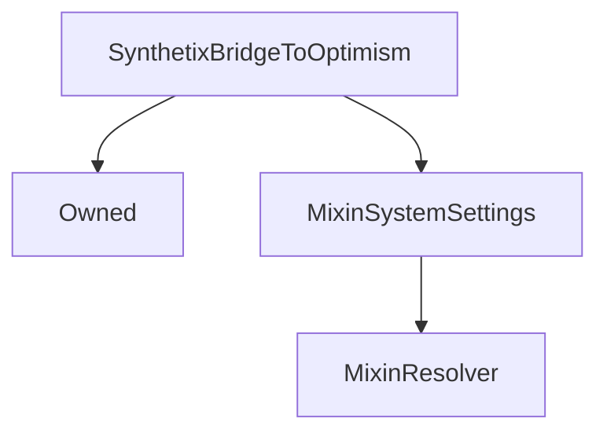

# SynthetixBridgeToOptimism

## Description

**Source:** [contracts/SynthetixBridgeToOptimism.sol](https://github.com/Synthetixio/synthetix/tree/v2.36.1/contracts/SynthetixBridgeToOptimism.sol)

## Architecture

### Inheritance Graph

## Variables

### `activated`

[Source](https://github.com/Synthetixio/synthetix/tree/v2.36.1/contracts/SynthetixBridgeToOptimism.sol#L32)

**Type:** `bool`

## Constructor

### `constructor`

[Source](https://github.com/Synthetixio/synthetix/tree/v2.36.1/contracts/SynthetixBridgeToOptimism.sol#L36)

??? example "Details"

    **Signature**

    `(address _owner, address _resolver)`

    **Visibility**

    `public`

    **State Mutability**

    `nonpayable`

## Views

### `resolverAddressesRequired`

[Source](https://github.com/Synthetixio/synthetix/tree/v2.36.1/contracts/SynthetixBridgeToOptimism.sol#L81)

??? example "Details"

    **Signature**

    `resolverAddressesRequired() returns (bytes32[])`

    **Visibility**

    `public`

    **State Mutability**

    `view`

## Restricted Functions

### `migrateBridge`

[Source](https://github.com/Synthetixio/synthetix/tree/v2.36.1/contracts/SynthetixBridgeToOptimism.sol#L139)

??? example "Details"

    **Signature**

    `migrateBridge(address newBridge)`

    **Visibility**

    `external`

    **State Mutability**

    `nonpayable`

    **Requires**

    * [require(..., Cannot migrate to address 0)](https://github.com/Synthetixio/synthetix/tree/v2.36.1/contracts/SynthetixBridgeToOptimism.sol#L140)

    **Modifiers**

    * [onlyOwner](#onlyowner)

    * [requireActive](#requireactive)

    **Emits**

    * [BridgeMigrated](#bridgemigrated)

## Internal Functions

### `_initiateRewardDeposit`

[Source](https://github.com/Synthetixio/synthetix/tree/v2.36.1/contracts/SynthetixBridgeToOptimism.sol#L175)

??? example "Details"

    **Signature**

    `_initiateRewardDeposit(uint256 _amount)`

    **Visibility**

    `internal`

    **State Mutability**

    `nonpayable`

    **Emits**

    * [RewardDeposit](#rewarddeposit)

### `hasZeroDebt`

[Source](https://github.com/Synthetixio/synthetix/tree/v2.36.1/contracts/SynthetixBridgeToOptimism.sol#L75)

??? example "Details"

    **Signature**

    `hasZeroDebt()`

    **Visibility**

    `internal`

    **State Mutability**

    `view`

    **Requires**

    * [require(..., Cannot deposit or migrate with debt)](https://github.com/Synthetixio/synthetix/tree/v2.36.1/contracts/SynthetixBridgeToOptimism.sol#L76)

### `isActive`

[Source](https://github.com/Synthetixio/synthetix/tree/v2.36.1/contracts/SynthetixBridgeToOptimism.sol#L71)

??? example "Details"

    **Signature**

    `isActive()`

    **Visibility**

    `internal`

    **State Mutability**

    `view`

    **Requires**

    * [require(..., Function deactivated)](https://github.com/Synthetixio/synthetix/tree/v2.36.1/contracts/SynthetixBridgeToOptimism.sol#L72)

### `issuer`

[Source](https://github.com/Synthetixio/synthetix/tree/v2.36.1/contracts/SynthetixBridgeToOptimism.sol#L55)

??? example "Details"

    **Signature**

    `issuer() returns (contract IIssuer)`

    **Visibility**

    `internal`

    **State Mutability**

    `view`

### `messenger`

[Source](https://github.com/Synthetixio/synthetix/tree/v2.36.1/contracts/SynthetixBridgeToOptimism.sol#L43)

??? example "Details"

    **Signature**

    `messenger() returns (contract iOVM_BaseCrossDomainMessenger)`

    **Visibility**

    `internal`

    **State Mutability**

    `view`

### `rewardEscrowV2`

[Source](https://github.com/Synthetixio/synthetix/tree/v2.36.1/contracts/SynthetixBridgeToOptimism.sol#L63)

??? example "Details"

    **Signature**

    `rewardEscrowV2() returns (contract IRewardEscrowV2)`

    **Visibility**

    `internal`

    **State Mutability**

    `view`

### `rewardsDistribution`

[Source](https://github.com/Synthetixio/synthetix/tree/v2.36.1/contracts/SynthetixBridgeToOptimism.sol#L59)

??? example "Details"

    **Signature**

    `rewardsDistribution() returns (address)`

    **Visibility**

    `internal`

    **State Mutability**

    `view`

### `synthetix`

[Source](https://github.com/Synthetixio/synthetix/tree/v2.36.1/contracts/SynthetixBridgeToOptimism.sol#L47)

??? example "Details"

    **Signature**

    `synthetix() returns (contract ISynthetix)`

    **Visibility**

    `internal`

    **State Mutability**

    `view`

### `synthetixBridgeToBase`

[Source](https://github.com/Synthetixio/synthetix/tree/v2.36.1/contracts/SynthetixBridgeToOptimism.sol#L67)

??? example "Details"

    **Signature**

    `synthetixBridgeToBase() returns (address)`

    **Visibility**

    `internal`

    **State Mutability**

    `view`

### `synthetixERC20`

[Source](https://github.com/Synthetixio/synthetix/tree/v2.36.1/contracts/SynthetixBridgeToOptimism.sol#L51)

??? example "Details"

    **Signature**

    `synthetixERC20() returns (contract IERC20)`

    **Visibility**

    `internal`

    **State Mutability**

    `view`

## External Functions

### `completeWithdrawal`

[Source](https://github.com/Synthetixio/synthetix/tree/v2.36.1/contracts/SynthetixBridgeToOptimism.sol#L126)

??? example "Details"

    **Signature**

    `completeWithdrawal(address account, uint256 amount)`

    **Visibility**

    `external`

    **State Mutability**

    `nonpayable`

    **Requires**

    * [require(..., Only the relayer can call this)](https://github.com/Synthetixio/synthetix/tree/v2.36.1/contracts/SynthetixBridgeToOptimism.sol#L128)

    * [require(..., Only the L2 bridge can invoke)](https://github.com/Synthetixio/synthetix/tree/v2.36.1/contracts/SynthetixBridgeToOptimism.sol#L129)

    **Modifiers**

    * [requireActive](#requireactive)

    **Emits**

    * [WithdrawalCompleted](#withdrawalcompleted)

### `depositAndMigrateEscrow`

[Source](https://github.com/Synthetixio/synthetix/tree/v2.36.1/contracts/SynthetixBridgeToOptimism.sol#L159)

??? example "Details"

    **Signature**

    `depositAndMigrateEscrow(uint256 depositAmount, uint256[][] entryIDs)`

    **Visibility**

    `public`

    **State Mutability**

    `nonpayable`

    **Modifiers**

    * [requireActive](#requireactive)

    * [requireZeroDebt](#requirezerodebt)

### `initiateDeposit`

[Source](https://github.com/Synthetixio/synthetix/tree/v2.36.1/contracts/SynthetixBridgeToOptimism.sol#L107)

??? example "Details"

    **Signature**

    `initiateDeposit(uint256 depositAmount)`

    **Visibility**

    `external`

    **State Mutability**

    `nonpayable`

    **Modifiers**

    * [requireActive](#requireactive)

    * [requireZeroDebt](#requirezerodebt)

### `initiateEscrowMigration`

[Source](https://github.com/Synthetixio/synthetix/tree/v2.36.1/contracts/SynthetixBridgeToOptimism.sol#L111)

??? example "Details"

    **Signature**

    `initiateEscrowMigration(uint256[][] entryIDs)`

    **Visibility**

    `public`

    **State Mutability**

    `nonpayable`

    **Modifiers**

    * [requireActive](#requireactive)

    * [requireZeroDebt](#requirezerodebt)

### `initiateRewardDeposit`

[Source](https://github.com/Synthetixio/synthetix/tree/v2.36.1/contracts/SynthetixBridgeToOptimism.sol#L116)

??? example "Details"

    **Signature**

    `initiateRewardDeposit(uint256 amount)`

    **Visibility**

    `external`

    **State Mutability**

    `nonpayable`

    **Modifiers**

    * [requireActive](#requireactive)

### `notifyRewardAmount`

[Source](https://github.com/Synthetixio/synthetix/tree/v2.36.1/contracts/SynthetixBridgeToOptimism.sol#L152)

??? example "Details"

    **Signature**

    `notifyRewardAmount(uint256 amount)`

    **Visibility**

    `external`

    **State Mutability**

    `nonpayable`

    **Requires**

    * [require(..., Caller is not RewardsDistribution contract)](https://github.com/Synthetixio/synthetix/tree/v2.36.1/contracts/SynthetixBridgeToOptimism.sol#L153)

    **Modifiers**

    * [requireActive](#requireactive)

## Modifiers

### `requireActive`

[Source](https://github.com/Synthetixio/synthetix/tree/v2.36.1/contracts/SynthetixBridgeToOptimism.sol#L95)

### `requireZeroDebt`

[Source](https://github.com/Synthetixio/synthetix/tree/v2.36.1/contracts/SynthetixBridgeToOptimism.sol#L100)

## Events

### `BridgeMigrated`

[Source](https://github.com/Synthetixio/synthetix/tree/v2.36.1/contracts/SynthetixBridgeToOptimism.sol#L240)

**Signature**: `BridgeMigrated(address oldBridge, address newBridge, uint256 amount)`

### `Deposit`

[Source](https://github.com/Synthetixio/synthetix/tree/v2.36.1/contracts/SynthetixBridgeToOptimism.sol#L241)

**Signature**: `Deposit(address account, uint256 amount)`

### `ExportedVestingEntries`

[Source](https://github.com/Synthetixio/synthetix/tree/v2.36.1/contracts/SynthetixBridgeToOptimism.sol#L242)

**Signature**: `ExportedVestingEntries(address account, uint256 escrowedAccountBalance, struct VestingEntries.VestingEntry[] vestingEntries)`

### `RewardDeposit`

[Source](https://github.com/Synthetixio/synthetix/tree/v2.36.1/contracts/SynthetixBridgeToOptimism.sol#L247)

**Signature**: `RewardDeposit(address account, uint256 amount)`

### `WithdrawalCompleted`

[Source](https://github.com/Synthetixio/synthetix/tree/v2.36.1/contracts/SynthetixBridgeToOptimism.sol#L248)

**Signature**: `WithdrawalCompleted(address account, uint256 amount)`
