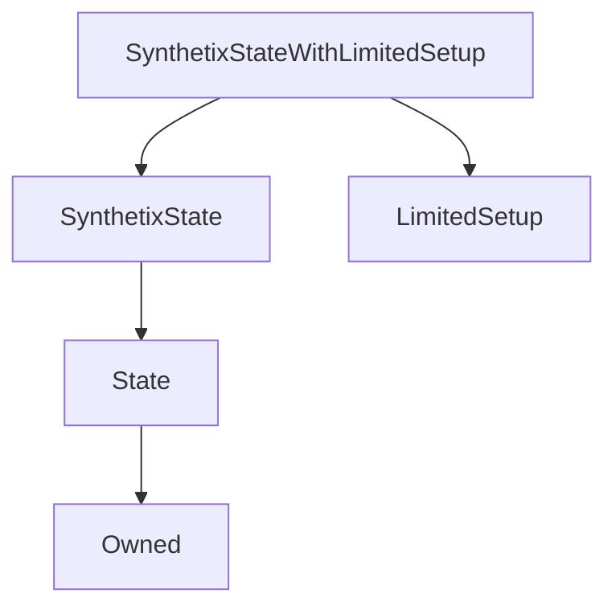

# SynthetixStateWithLimitedSetup

## Description

**Source:** [contracts/SynthetixStateWithLimitedSetup.sol](https://github.com/Synthetixio/synthetix/tree/v2.37.0/contracts/SynthetixStateWithLimitedSetup.sol)

## Architecture

### Inheritance Graph

## Variables

### `feePool`

[Source](https://github.com/Synthetixio/synthetix/tree/v2.37.0/contracts/SynthetixStateWithLimitedSetup.sol#L13)

**Type:** `contract IFeePool`

### `importedDebtAmount`

[Source](https://github.com/Synthetixio/synthetix/tree/v2.37.0/contracts/SynthetixStateWithLimitedSetup.sol#L16)

**Type:** `uint256`

## Constructor

### `constructor`

[Source](https://github.com/Synthetixio/synthetix/tree/v2.37.0/contracts/SynthetixStateWithLimitedSetup.sol#L18)

??? example "Details"

    **Signature**

    `(address _owner, address _associatedContract)`

    **Visibility**

    `public`

    **State Mutability**

    `nonpayable`

## Restricted Functions

### `importIssuerData`

[Source](https://github.com/Synthetixio/synthetix/tree/v2.37.0/contracts/SynthetixStateWithLimitedSetup.sol#L39)

??? example "Details"

    **Signature**

    `importIssuerData(address[] accounts, uint256[] sUSDAmounts)`

    **Visibility**

    `external`

    **State Mutability**

    `nonpayable`

    **Requires**

    * [require(..., Length mismatch)](https://github.com/Synthetixio/synthetix/tree/v2.37.0/contracts/SynthetixStateWithLimitedSetup.sol#L40)

    **Modifiers**

    * [onlyOwner](#onlyowner)

    * [onlyDuringSetup](#onlyduringsetup)

### `setFeePool`

[Source](https://github.com/Synthetixio/synthetix/tree/v2.37.0/contracts/SynthetixStateWithLimitedSetup.sol#L30)

??? example "Details"

    **Signature**

    `setFeePool(contract IFeePool _feePool)`

    **Visibility**

    `external`

    **State Mutability**

    `nonpayable`

    **Modifiers**

    * [onlyOwner](#onlyowner)

    **Emits**

    * [FeePoolUpdated](#feepoolupdated)

## Internal Functions

### `_addToDebtRegister`

[Source](https://github.com/Synthetixio/synthetix/tree/v2.37.0/contracts/SynthetixStateWithLimitedSetup.sol#L51)

??? example "Details"

    **Signature**

    `_addToDebtRegister(address account, uint256 amount)`

    **Visibility**

    `internal`

    **State Mutability**

    `nonpayable`

## Events

### `FeePoolUpdated`

[Source](https://github.com/Synthetixio/synthetix/tree/v2.37.0/contracts/SynthetixStateWithLimitedSetup.sol#L99)

**Signature**: `FeePoolUpdated(address newFeePool)`
