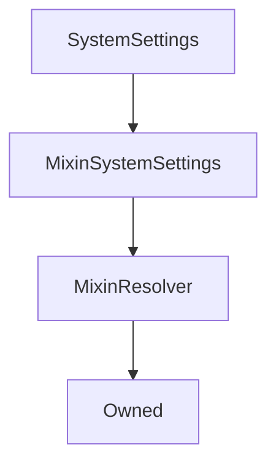

# SystemSettings

## Description

**Source:** [contracts/SystemSettings.sol](https://github.com/Synthetixio/synthetix/tree/v2.27.1-alpha/contracts/SystemSettings.sol)

## Architecture

### Libraries

- [SafeMath](/contracts/source/libraries/SafeMath) for `uint`
- [SafeDecimalMath](/contracts/source/libraries/SafeDecimalMath) for `uint`

### Inheritance Graph

## Constants

### `MAX_EXCHANGE_FEE_RATE`

[Source](https://github.com/Synthetixio/synthetix/tree/v2.27.1-alpha/contracts/SystemSettings.sol#L36)

**Type:** `uint256`

### `MAX_FEE_PERIOD_DURATION`

[Source](https://github.com/Synthetixio/synthetix/tree/v2.27.1-alpha/contracts/SystemSettings.sol#L22)

**Type:** `uint256`

### `MAX_ISSUANCE_RATIO`

[Source](https://github.com/Synthetixio/synthetix/tree/v2.27.1-alpha/contracts/SystemSettings.sol#L18)

**Type:** `uint256`

### `MAX_LIQUIDATION_DELAY`

[Source](https://github.com/Synthetixio/synthetix/tree/v2.27.1-alpha/contracts/SystemSettings.sol#L32)

**Type:** `uint256`

### `MAX_LIQUIDATION_PENALTY`

[Source](https://github.com/Synthetixio/synthetix/tree/v2.27.1-alpha/contracts/SystemSettings.sol#L28)

**Type:** `uint256`

### `MAX_LIQUIDATION_RATIO`

[Source](https://github.com/Synthetixio/synthetix/tree/v2.27.1-alpha/contracts/SystemSettings.sol#L26)

**Type:** `uint256`

### `MAX_MINIMUM_STAKE_TIME`

[Source](https://github.com/Synthetixio/synthetix/tree/v2.27.1-alpha/contracts/SystemSettings.sol#L39)

**Type:** `uint256`

### `MAX_TARGET_THRESHOLD`

[Source](https://github.com/Synthetixio/synthetix/tree/v2.27.1-alpha/contracts/SystemSettings.sol#L24)

**Type:** `uint256`

### `MIN_FEE_PERIOD_DURATION`

[Source](https://github.com/Synthetixio/synthetix/tree/v2.27.1-alpha/contracts/SystemSettings.sol#L21)

**Type:** `uint256`

### `MIN_LIQUIDATION_DELAY`

[Source](https://github.com/Synthetixio/synthetix/tree/v2.27.1-alpha/contracts/SystemSettings.sol#L33)

**Type:** `uint256`

### `RATIO_FROM_TARGET_BUFFER`

[Source](https://github.com/Synthetixio/synthetix/tree/v2.27.1-alpha/contracts/SystemSettings.sol#L30)

**Type:** `uint256`

## Constructor

### `constructor`

[Source](https://github.com/Synthetixio/synthetix/tree/v2.27.1-alpha/contracts/SystemSettings.sol#L43)

??? example "Details"

    **Signature**

    `(address _owner, address _resolver)`

    **Visibility**

    `public`

    **State Mutability**

    `nonpayable`

## Views

### `aggregatorWarningFlags`

[Source](https://github.com/Synthetixio/synthetix/tree/v2.27.1-alpha/contracts/SystemSettings.sol#L117)

??? example "Details"

    **Signature**

    `aggregatorWarningFlags() returns (address)`

    **Visibility**

    `external`

    **State Mutability**

    `view`

### `exchangeFeeRate`

[Source](https://github.com/Synthetixio/synthetix/tree/v2.27.1-alpha/contracts/SystemSettings.sol#L109)

??? example "Details"

    **Signature**

    `exchangeFeeRate(bytes32 currencyKey) returns (uint256)`

    **Visibility**

    `external`

    **State Mutability**

    `view`

### `feePeriodDuration`

[Source](https://github.com/Synthetixio/synthetix/tree/v2.27.1-alpha/contracts/SystemSettings.sol#L76)

??? example "Details"

    **Signature**

    `feePeriodDuration() returns (uint256)`

    **Visibility**

    `external`

    **State Mutability**

    `view`

### `issuanceRatio`

[Source](https://github.com/Synthetixio/synthetix/tree/v2.27.1-alpha/contracts/SystemSettings.sol#L68)

??? example "Details"

    **Signature**

    `issuanceRatio() returns (uint256)`

    **Visibility**

    `external`

    **State Mutability**

    `view`

### `liquidationDelay`

[Source](https://github.com/Synthetixio/synthetix/tree/v2.27.1-alpha/contracts/SystemSettings.sol#L87)

??? example "Details"

    **Signature**

    `liquidationDelay() returns (uint256)`

    **Visibility**

    `external`

    **State Mutability**

    `view`

### `liquidationPenalty`

[Source](https://github.com/Synthetixio/synthetix/tree/v2.27.1-alpha/contracts/SystemSettings.sol#L100)

??? example "Details"

    **Signature**

    `liquidationPenalty() returns (uint256)`

    **Visibility**

    `external`

    **State Mutability**

    `view`

### `liquidationRatio`

[Source](https://github.com/Synthetixio/synthetix/tree/v2.27.1-alpha/contracts/SystemSettings.sol#L94)

??? example "Details"

    **Signature**

    `liquidationRatio() returns (uint256)`

    **Visibility**

    `external`

    **State Mutability**

    `view`

### `minimumStakeTime`

[Source](https://github.com/Synthetixio/synthetix/tree/v2.27.1-alpha/contracts/SystemSettings.sol#L113)

??? example "Details"

    **Signature**

    `minimumStakeTime() returns (uint256)`

    **Visibility**

    `external`

    **State Mutability**

    `view`

### `priceDeviationThresholdFactor`

[Source](https://github.com/Synthetixio/synthetix/tree/v2.27.1-alpha/contracts/SystemSettings.sol#L62)

??? example "Details"

    **Signature**

    `priceDeviationThresholdFactor() returns (uint256)`

    **Visibility**

    `external`

    **State Mutability**

    `view`

### `rateStalePeriod`

[Source](https://github.com/Synthetixio/synthetix/tree/v2.27.1-alpha/contracts/SystemSettings.sol#L105)

??? example "Details"

    **Signature**

    `rateStalePeriod() returns (uint256)`

    **Visibility**

    `external`

    **State Mutability**

    `view`

### `targetThreshold`

[Source](https://github.com/Synthetixio/synthetix/tree/v2.27.1-alpha/contracts/SystemSettings.sol#L81)

??? example "Details"

    **Signature**

    `targetThreshold() returns (uint256)`

    **Visibility**

    `external`

    **State Mutability**

    `view`

### `tradingRewardsEnabled`

[Source](https://github.com/Synthetixio/synthetix/tree/v2.27.1-alpha/contracts/SystemSettings.sol#L123)

??? example "Details"

    **Signature**

    `tradingRewardsEnabled() returns (bool)`

    **Visibility**

    `external`

    **State Mutability**

    `view`

### `waitingPeriodSecs`

[Source](https://github.com/Synthetixio/synthetix/tree/v2.27.1-alpha/contracts/SystemSettings.sol#L55)

??? example "Details"

    **Signature**

    `waitingPeriodSecs() returns (uint256)`

    **Visibility**

    `external`

    **State Mutability**

    `view`

## Restricted Functions

### `setAggregatorWarningFlags`

[Source](https://github.com/Synthetixio/synthetix/tree/v2.27.1-alpha/contracts/SystemSettings.sol#L236)

??? example "Details"

    **Signature**

    `setAggregatorWarningFlags(address _flags)`

    **Visibility**

    `external`

    **State Mutability**

    `nonpayable`

    **Requires**

    * [require(..., Valid address must be given)](https://github.com/Synthetixio/synthetix/tree/v2.27.1-alpha/contracts/SystemSettings.sol#L237)

    **Modifiers**

    * [onlyOwner](#onlyowner)

    **Emits**

    * [AggregatorWarningFlagsUpdated](#aggregatorwarningflagsupdated)

### `setExchangeFeeRateForSynths`

[Source](https://github.com/Synthetixio/synthetix/tree/v2.27.1-alpha/contracts/SystemSettings.sol#L214)

??? example "Details"

    **Signature**

    `setExchangeFeeRateForSynths(bytes32[] synthKeys, uint256[] exchangeFeeRates)`

    **Visibility**

    `external`

    **State Mutability**

    `nonpayable`

    **Requires**

    * [require(..., Array lengths dont match)](https://github.com/Synthetixio/synthetix/tree/v2.27.1-alpha/contracts/SystemSettings.sol#L218)

    **Modifiers**

    * [onlyOwner](#onlyowner)

### `setFeePeriodDuration`

[Source](https://github.com/Synthetixio/synthetix/tree/v2.27.1-alpha/contracts/SystemSettings.sol#L154)

??? example "Details"

    **Signature**

    `setFeePeriodDuration(uint256 _feePeriodDuration)`

    **Visibility**

    `external`

    **State Mutability**

    `nonpayable`

    **Requires**

    * [require(..., value < MIN_FEE_PERIOD_DURATION)](https://github.com/Synthetixio/synthetix/tree/v2.27.1-alpha/contracts/SystemSettings.sol#L155)

    * [require(..., value > MAX_FEE_PERIOD_DURATION)](https://github.com/Synthetixio/synthetix/tree/v2.27.1-alpha/contracts/SystemSettings.sol#L156)

    **Modifiers**

    * [onlyOwner](#onlyowner)

    **Emits**

    * [FeePeriodDurationUpdated](#feeperioddurationupdated)

### `setIssuanceRatio`

[Source](https://github.com/Synthetixio/synthetix/tree/v2.27.1-alpha/contracts/SystemSettings.sol#L148)

??? example "Details"

    **Signature**

    `setIssuanceRatio(uint256 _issuanceRatio)`

    **Visibility**

    `external`

    **State Mutability**

    `nonpayable`

    **Requires**

    * [require(..., New issuance ratio cannot exceed MAX_ISSUANCE_RATIO)](https://github.com/Synthetixio/synthetix/tree/v2.27.1-alpha/contracts/SystemSettings.sol#L149)

    **Modifiers**

    * [onlyOwner](#onlyowner)

    **Emits**

    * [IssuanceRatioUpdated](#issuanceratioupdated)

### `setLiquidationDelay`

[Source](https://github.com/Synthetixio/synthetix/tree/v2.27.1-alpha/contracts/SystemSettings.sol#L173)

??? example "Details"

    **Signature**

    `setLiquidationDelay(uint256 time)`

    **Visibility**

    `external`

    **State Mutability**

    `nonpayable`

    **Requires**

    * [require(..., Must be less than 30 days)](https://github.com/Synthetixio/synthetix/tree/v2.27.1-alpha/contracts/SystemSettings.sol#L174)

    * [require(..., Must be greater than 1 day)](https://github.com/Synthetixio/synthetix/tree/v2.27.1-alpha/contracts/SystemSettings.sol#L175)

    **Modifiers**

    * [onlyOwner](#onlyowner)

    **Emits**

    * [LiquidationDelayUpdated](#liquidationdelayupdated)

### `setLiquidationPenalty`

[Source](https://github.com/Synthetixio/synthetix/tree/v2.27.1-alpha/contracts/SystemSettings.sol#L200)

??? example "Details"

    **Signature**

    `setLiquidationPenalty(uint256 penalty)`

    **Visibility**

    `external`

    **State Mutability**

    `nonpayable`

    **Requires**

    * [require(..., penalty > MAX_LIQUIDATION_PENALTY)](https://github.com/Synthetixio/synthetix/tree/v2.27.1-alpha/contracts/SystemSettings.sol#L201)

    **Modifiers**

    * [onlyOwner](#onlyowner)

    **Emits**

    * [LiquidationPenaltyUpdated](#liquidationpenaltyupdated)

### `setLiquidationRatio`

[Source](https://github.com/Synthetixio/synthetix/tree/v2.27.1-alpha/contracts/SystemSettings.sol#L184)

??? example "Details"

    **Signature**

    `setLiquidationRatio(uint256 _liquidationRatio)`

    **Visibility**

    `external`

    **State Mutability**

    `nonpayable`

    **Requires**

    * [require(..., liquidationRatio > MAX_LIQUIDATION_RATIO / (1 + penalty))](https://github.com/Synthetixio/synthetix/tree/v2.27.1-alpha/contracts/SystemSettings.sol#L185)

    * [require(..., liquidationRatio < MIN_LIQUIDATION_RATIO)](https://github.com/Synthetixio/synthetix/tree/v2.27.1-alpha/contracts/SystemSettings.sol#L193)

    **Modifiers**

    * [onlyOwner](#onlyowner)

    **Emits**

    * [LiquidationRatioUpdated](#liquidationratioupdated)

### `setMinimumStakeTime`

[Source](https://github.com/Synthetixio/synthetix/tree/v2.27.1-alpha/contracts/SystemSettings.sol#L230)

??? example "Details"

    **Signature**

    `setMinimumStakeTime(uint256 _seconds)`

    **Visibility**

    `external`

    **State Mutability**

    `nonpayable`

    **Requires**

    * [require(..., stake time exceed maximum 1 week)](https://github.com/Synthetixio/synthetix/tree/v2.27.1-alpha/contracts/SystemSettings.sol#L231)

    **Modifiers**

    * [onlyOwner](#onlyowner)

    **Emits**

    * [MinimumStakeTimeUpdated](#minimumstaketimeupdated)

### `setPriceDeviationThresholdFactor`

[Source](https://github.com/Synthetixio/synthetix/tree/v2.27.1-alpha/contracts/SystemSettings.sol#L139)

??? example "Details"

    **Signature**

    `setPriceDeviationThresholdFactor(uint256 _priceDeviationThresholdFactor)`

    **Visibility**

    `external`

    **State Mutability**

    `nonpayable`

    **Modifiers**

    * [onlyOwner](#onlyowner)

    **Emits**

    * [PriceDeviationThresholdUpdated](#pricedeviationthresholdupdated)

### `setRateStalePeriod`

[Source](https://github.com/Synthetixio/synthetix/tree/v2.27.1-alpha/contracts/SystemSettings.sol#L208)

??? example "Details"

    **Signature**

    `setRateStalePeriod(uint256 period)`

    **Visibility**

    `external`

    **State Mutability**

    `nonpayable`

    **Modifiers**

    * [onlyOwner](#onlyowner)

    **Emits**

    * [RateStalePeriodUpdated](#ratestaleperiodupdated)

### `setTargetThreshold`

[Source](https://github.com/Synthetixio/synthetix/tree/v2.27.1-alpha/contracts/SystemSettings.sol#L163)

??? example "Details"

    **Signature**

    `setTargetThreshold(uint256 _percent)`

    **Visibility**

    `external`

    **State Mutability**

    `nonpayable`

    **Requires**

    * [require(..., Threshold too high)](https://github.com/Synthetixio/synthetix/tree/v2.27.1-alpha/contracts/SystemSettings.sol#L164)

    **Modifiers**

    * [onlyOwner](#onlyowner)

    **Emits**

    * [TargetThresholdUpdated](#targetthresholdupdated)

### `setTradingRewardsEnabled`

[Source](https://github.com/Synthetixio/synthetix/tree/v2.27.1-alpha/contracts/SystemSettings.sol#L129)

??? example "Details"

    **Signature**

    `setTradingRewardsEnabled(bool _tradingRewardsEnabled)`

    **Visibility**

    `external`

    **State Mutability**

    `nonpayable`

    **Modifiers**

    * [onlyOwner](#onlyowner)

    **Emits**

    * [TradingRewardsEnabled](#tradingrewardsenabled)

### `setWaitingPeriodSecs`

[Source](https://github.com/Synthetixio/synthetix/tree/v2.27.1-alpha/contracts/SystemSettings.sol#L134)

??? example "Details"

    **Signature**

    `setWaitingPeriodSecs(uint256 _waitingPeriodSecs)`

    **Visibility**

    `external`

    **State Mutability**

    `nonpayable`

    **Modifiers**

    * [onlyOwner](#onlyowner)

    **Emits**

    * [WaitingPeriodSecsUpdated](#waitingperiodsecsupdated)

## Events

### `AggregatorWarningFlagsUpdated`

[Source](https://github.com/Synthetixio/synthetix/tree/v2.27.1-alpha/contracts/SystemSettings.sol#L255)

**Signature**: `AggregatorWarningFlagsUpdated(address flags)`

### `ExchangeFeeUpdated`

[Source](https://github.com/Synthetixio/synthetix/tree/v2.27.1-alpha/contracts/SystemSettings.sol#L253)

**Signature**: `ExchangeFeeUpdated(bytes32 synthKey, uint256 newExchangeFeeRate)`

### `FeePeriodDurationUpdated`

[Source](https://github.com/Synthetixio/synthetix/tree/v2.27.1-alpha/contracts/SystemSettings.sol#L247)

**Signature**: `FeePeriodDurationUpdated(uint256 newFeePeriodDuration)`

### `IssuanceRatioUpdated`

[Source](https://github.com/Synthetixio/synthetix/tree/v2.27.1-alpha/contracts/SystemSettings.sol#L246)

**Signature**: `IssuanceRatioUpdated(uint256 newRatio)`

### `LiquidationDelayUpdated`

[Source](https://github.com/Synthetixio/synthetix/tree/v2.27.1-alpha/contracts/SystemSettings.sol#L249)

**Signature**: `LiquidationDelayUpdated(uint256 newDelay)`

### `LiquidationPenaltyUpdated`

[Source](https://github.com/Synthetixio/synthetix/tree/v2.27.1-alpha/contracts/SystemSettings.sol#L251)

**Signature**: `LiquidationPenaltyUpdated(uint256 newPenalty)`

### `LiquidationRatioUpdated`

[Source](https://github.com/Synthetixio/synthetix/tree/v2.27.1-alpha/contracts/SystemSettings.sol#L250)

**Signature**: `LiquidationRatioUpdated(uint256 newRatio)`

### `MinimumStakeTimeUpdated`

[Source](https://github.com/Synthetixio/synthetix/tree/v2.27.1-alpha/contracts/SystemSettings.sol#L254)

**Signature**: `MinimumStakeTimeUpdated(uint256 minimumStakeTime)`

### `PriceDeviationThresholdUpdated`

[Source](https://github.com/Synthetixio/synthetix/tree/v2.27.1-alpha/contracts/SystemSettings.sol#L245)

**Signature**: `PriceDeviationThresholdUpdated(uint256 threshold)`

### `RateStalePeriodUpdated`

[Source](https://github.com/Synthetixio/synthetix/tree/v2.27.1-alpha/contracts/SystemSettings.sol#L252)

**Signature**: `RateStalePeriodUpdated(uint256 rateStalePeriod)`

### `TargetThresholdUpdated`

[Source](https://github.com/Synthetixio/synthetix/tree/v2.27.1-alpha/contracts/SystemSettings.sol#L248)

**Signature**: `TargetThresholdUpdated(uint256 newTargetThreshold)`

### `TradingRewardsEnabled`

[Source](https://github.com/Synthetixio/synthetix/tree/v2.27.1-alpha/contracts/SystemSettings.sol#L243)

**Signature**: `TradingRewardsEnabled(bool enabled)`

### `WaitingPeriodSecsUpdated`

[Source](https://github.com/Synthetixio/synthetix/tree/v2.27.1-alpha/contracts/SystemSettings.sol#L244)

**Signature**: `WaitingPeriodSecsUpdated(uint256 waitingPeriodSecs)`
